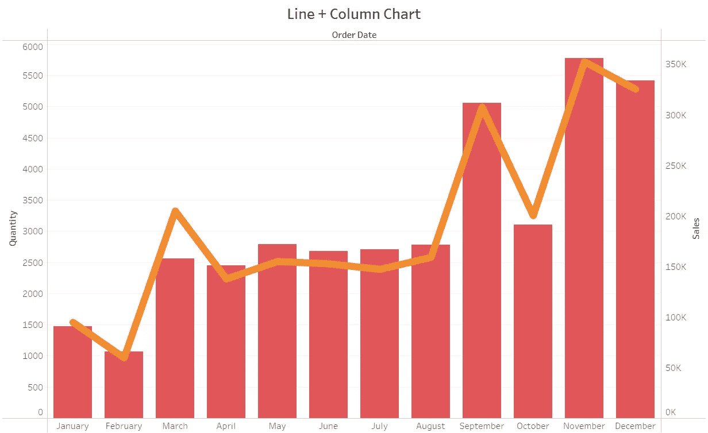
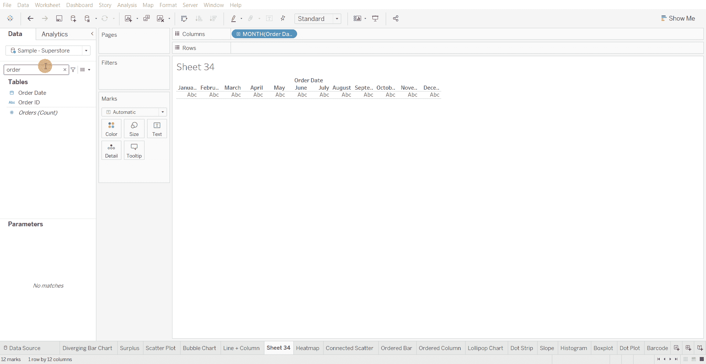
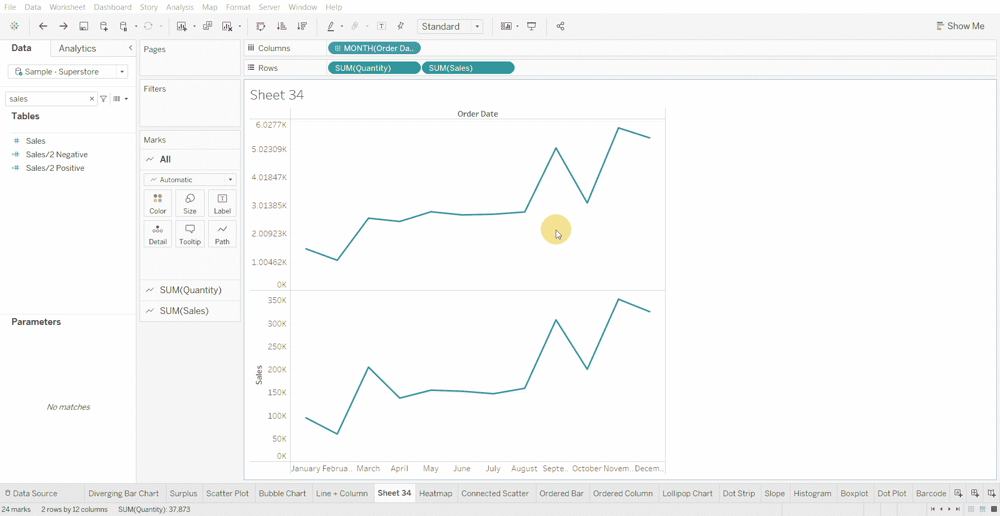
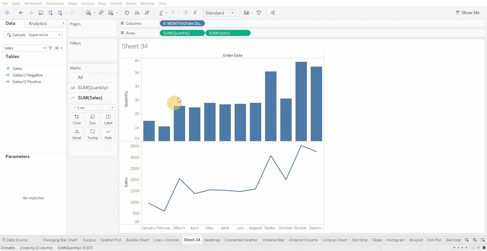
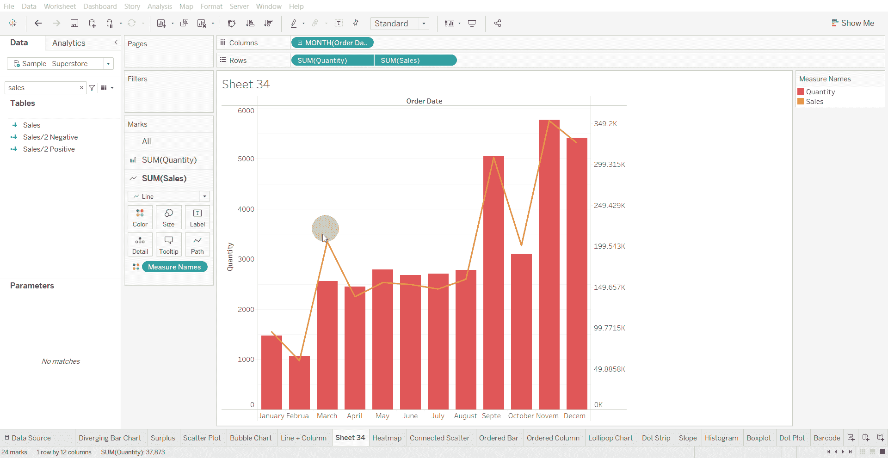

# Tableau 教程—如何创建折线图+柱形图

> 原文：<https://medium.com/mlearning-ai/tableau-tutorial-how-to-create-a-line-column-chart-d7bf267ce0ba?source=collection_archive---------10----------------------->

折线图+柱形图用于显示一段时间内两个变量之间的关系。

下面使用的数据集是在 [Tableau 社区](https://community.tableau.com/s/question/0D54T00000CWeX8SAL/sample-superstore-sales-excelxls)上提供的超级商店数据集。

创建折线图+柱形图的步骤—

*   在列架中引入一个日期变量，并进一步深入到月份

*   将两个数值变量带入行架

*   将第一个数字变量的图表类型更改为条形图，将第二个数字变量的图表类型更改为折线图

*   制作双轴图表

*   根据您的喜好改变颜色和尺寸

[1]:金融时报。(2021 年 3 月 7 日)。*管用的图表:FT 视觉词汇指南*[https://www . FT . com/content/c 7 bb 24 c 9-964d-479 f-ba24-03a 2 B2 df 6 e 85](https://www.ft.com/content/c7bb24c9-964d-479f-ba24-03a2b2df6e85)

 [## Mlearning.ai 提交建议

### 如何成为 Mlearning.ai 上的作家

medium.com](/mlearning-ai/mlearning-ai-submission-suggestions-b51e2b130bfb)