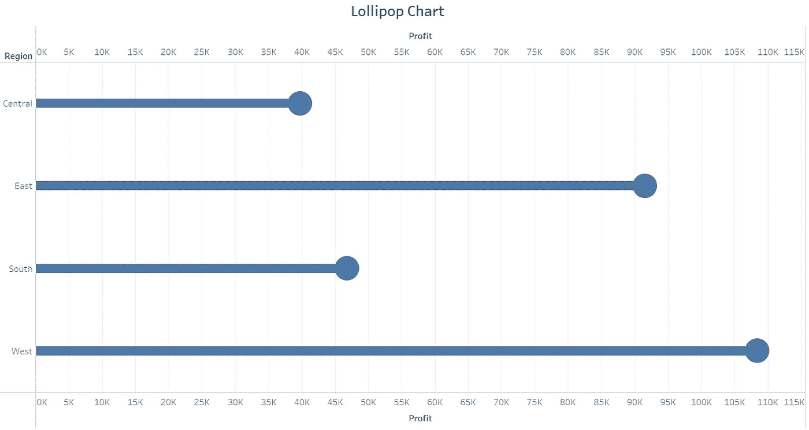
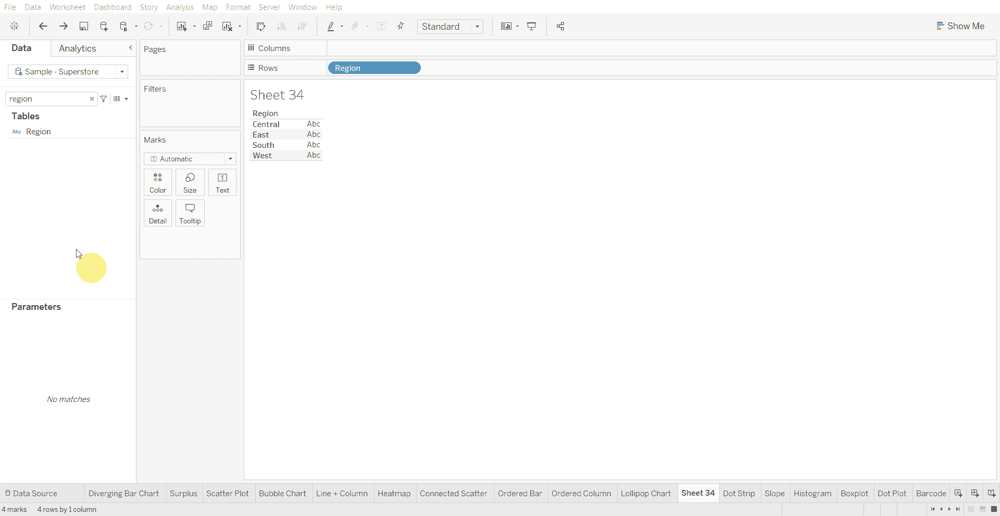
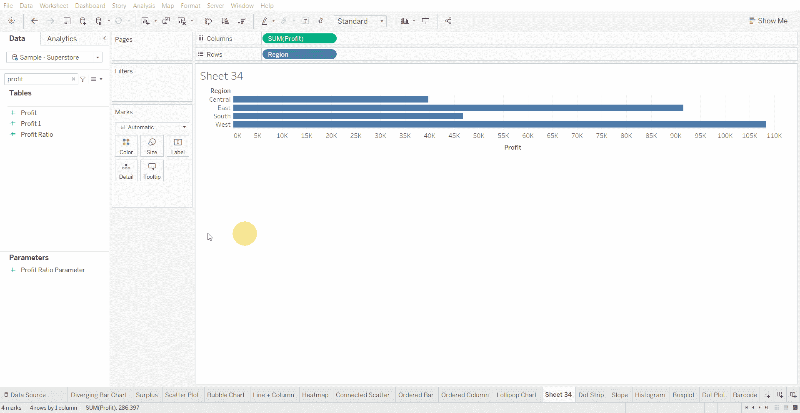
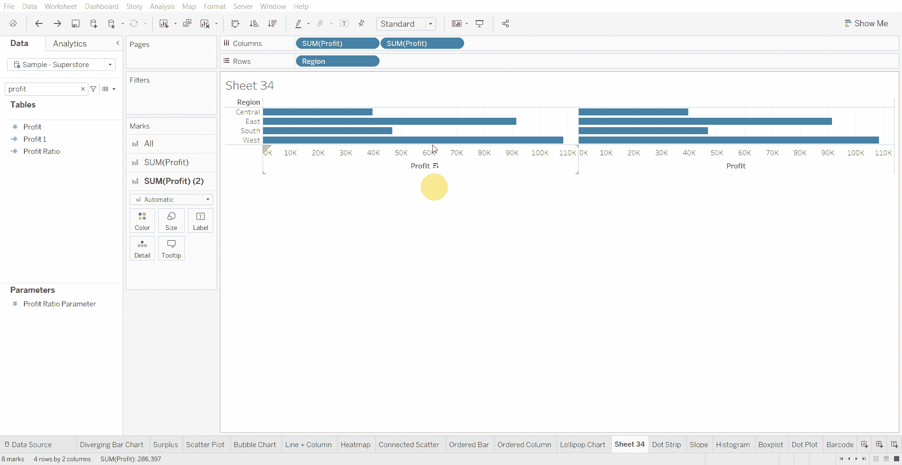
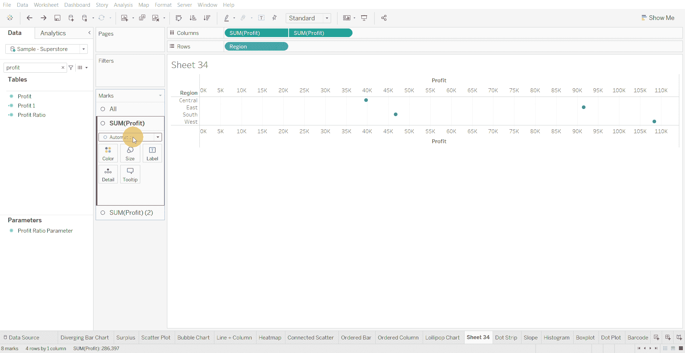
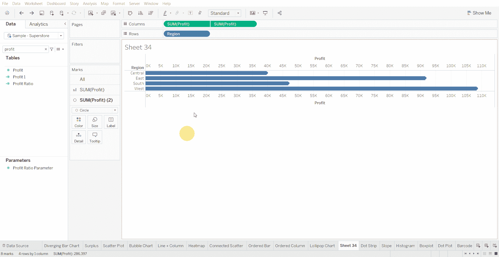

# Tableau 教程-如何创建棒棒糖图

> 原文：<https://medium.com/mlearning-ai/tableau-tutorial-how-to-create-a-lollipop-chart-77d3d0d47f3e?source=collection_archive---------4----------------------->

棒棒糖图比标准的条形图/柱形图更能引起人们对数据值的注意，也能有效地显示排名和数值。

下面使用的数据集是在 [Tableau 社区](https://community.tableau.com/s/question/0D54T00000CWeX8SAL/sample-superstore-sales-excelxls)上提供的超级商店数据集。

创建棒棒糖图的步骤—

*   将分类变量拖到行架上

*   将数值变量放入列架

*   复制数字变量以放入列架中

*   双轴和同步轴

*   将第一个数字变量的图表更改为圆形，将另一个更改为条形

*   调整两个图表的大小，使其看起来像棒棒糖图

[1]:金融时报。(2021 年 3 月 7 日)。*管用的图表:FT 视觉词汇指南*[https://www . FT . com/content/c 7 bb 24 c 9-964d-479 f-ba24-03a 2 B2 df 6 e 85](https://www.ft.com/content/c7bb24c9-964d-479f-ba24-03a2b2df6e85)

 [## Mlearning.ai 提交建议

### 如何成为 Mlearning.ai 上的作家

medium.com](/mlearning-ai/mlearning-ai-submission-suggestions-b51e2b130bfb)