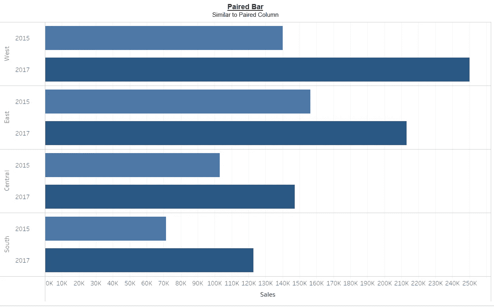
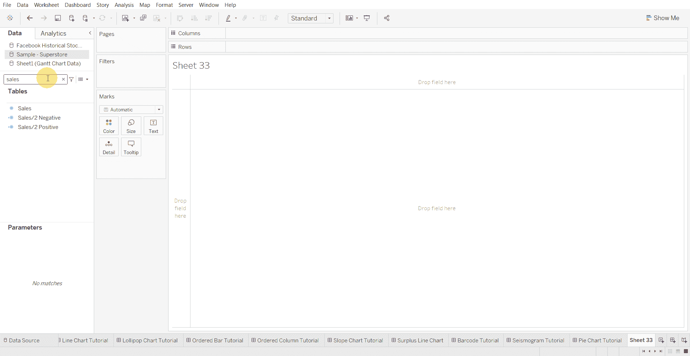
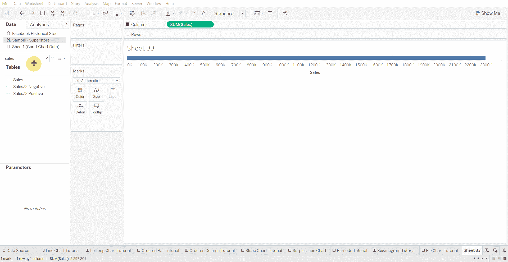
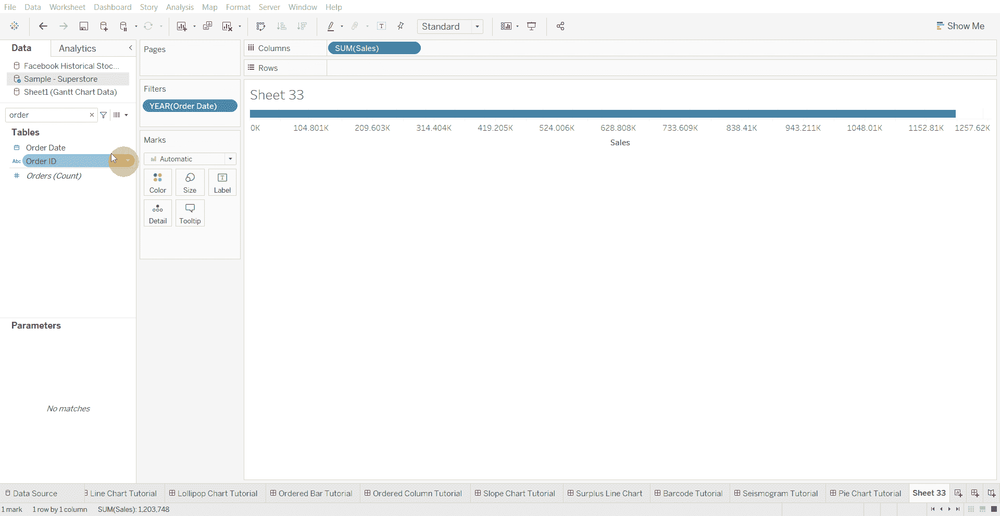
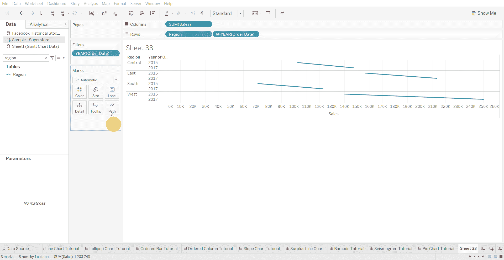
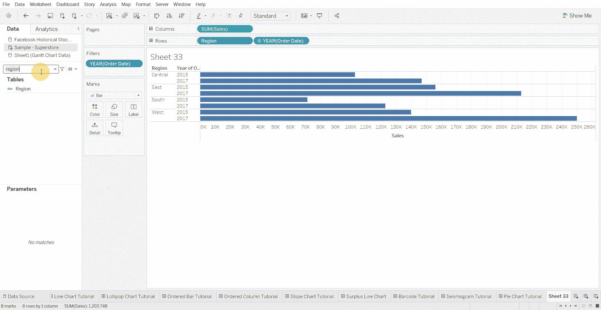

# Tableau 教程—如何创建成对条形图

> 原文：<https://medium.com/mlearning-ai/tableau-tutorial-how-to-create-a-paired-bar-chart-ac900102c20e?source=collection_archive---------5----------------------->

成对条形图类似于标准条形图，但允许多个系列。然而，如果超过 2 个系列，视觉效果会变得难以理解。

下面使用的数据集是在 [Tableau 社区](https://community.tableau.com/s/question/0D54T00000CWeX8SAL/sample-superstore-sales-excelxls)上提供的超级商店数据集。

创建成对条形图的步骤—

*   将数值变量移动到列架

*   向过滤器添加日期(年份)变量

*   将分类变量和日期变量移至行架

*   将视觉效果更改为条形

*   将年份变量移动到颜色标记处

[1]:金融时报。(2021 年 3 月 7 日)。*管用的图表:FT 视觉词汇指南*[https://www . FT . com/content/c 7 bb 24 c 9-964d-479 f-ba24-03a 2 B2 df 6 e 85](https://www.ft.com/content/c7bb24c9-964d-479f-ba24-03a2b2df6e85)

 [## Mlearning.ai 提交建议

### 如何成为 Mlearning.ai 上的作家

medium.com](/mlearning-ai/mlearning-ai-submission-suggestions-b51e2b130bfb)