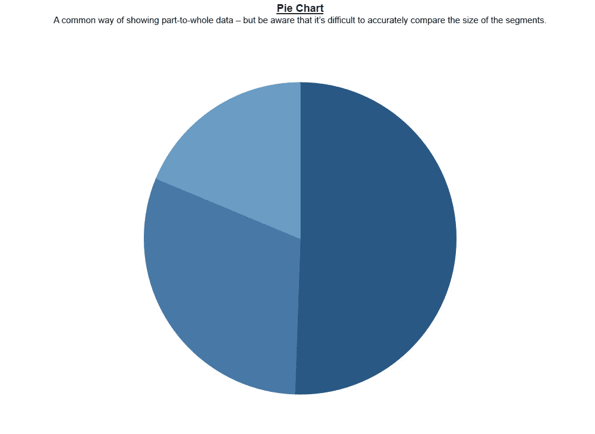
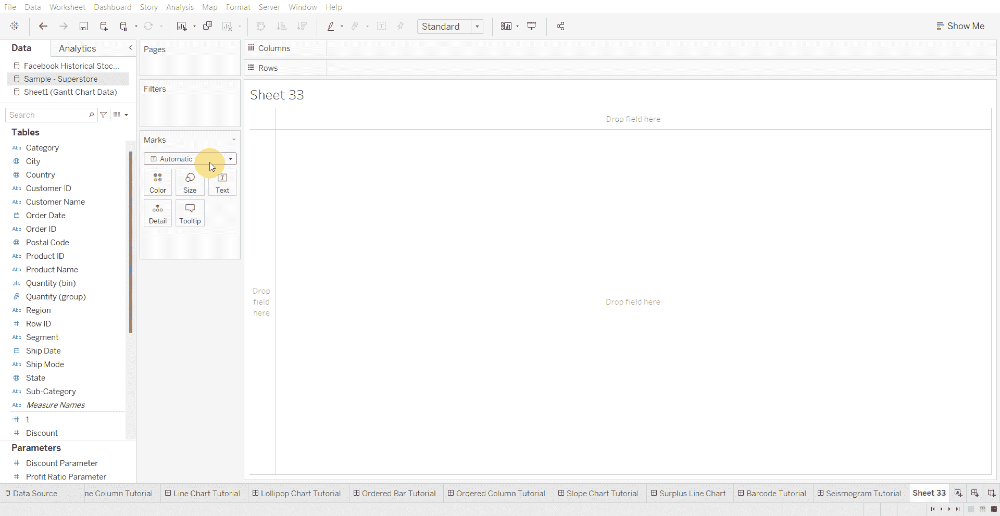
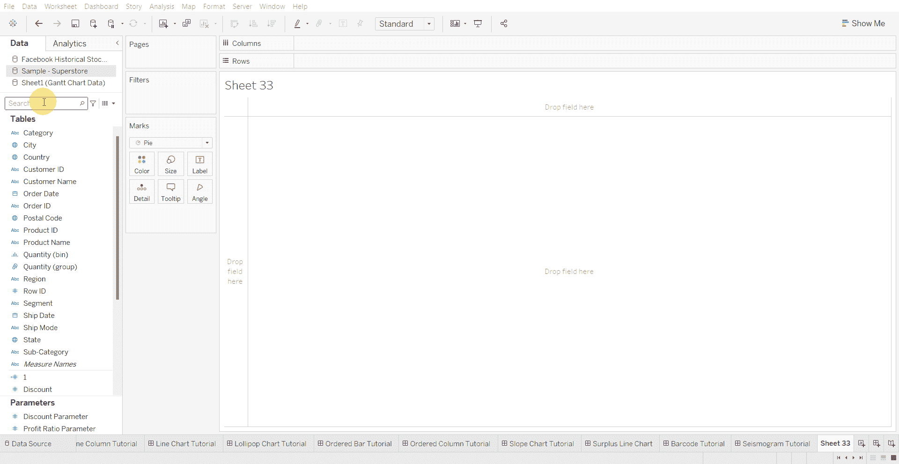
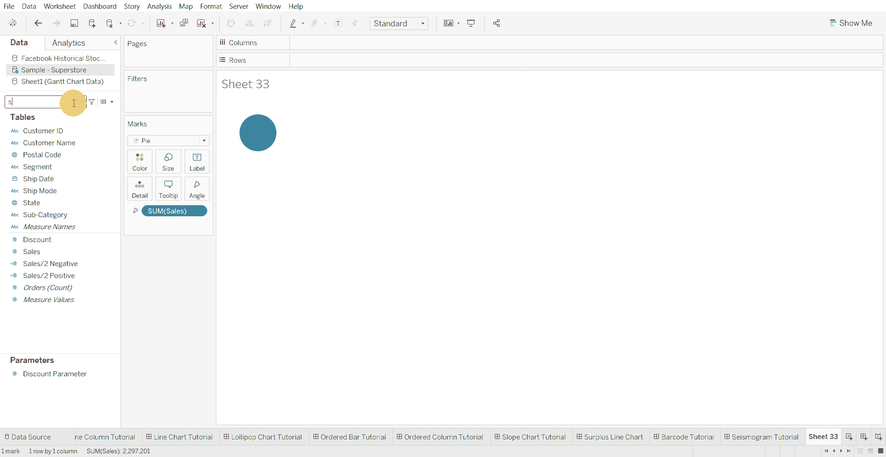

# Tableau 教程-如何创建饼图

> 原文：<https://medium.com/mlearning-ai/tableau-tutorial-how-to-create-a-pie-chart-43f6d528d4de?source=collection_archive---------8----------------------->

饼图是显示部分到整体数据的一种常见方式，但请注意，很难准确比较分段的大小。

下面使用的数据集是在 [Tableau 社区](https://community.tableau.com/s/question/0D54T00000CWeX8SAL/sample-superstore-sales-excelxls)上提供的超级商店数据集。

创建饼图的步骤—

*   选择饼形标记

*   将数值移动到角度

*   将分类变量或日期变量移至颜色架

[1]:金融时报。(2021 年 3 月 7 日)。*管用的图表:FT 视觉词汇指南*[https://www . FT . com/content/c 7 bb 24 c 9-964d-479 f-ba24-03a 2 B2 df 6 e 85](https://www.ft.com/content/c7bb24c9-964d-479f-ba24-03a2b2df6e85)

 [## Mlearning.ai 提交建议

### 如何成为 Mlearning.ai 上的作家

medium.com](/mlearning-ai/mlearning-ai-submission-suggestions-b51e2b130bfb)