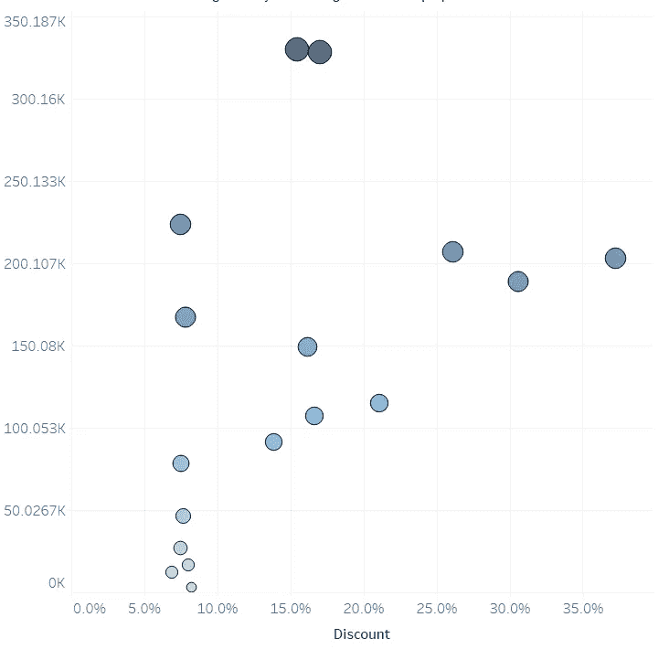
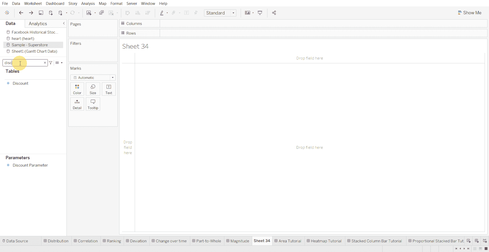
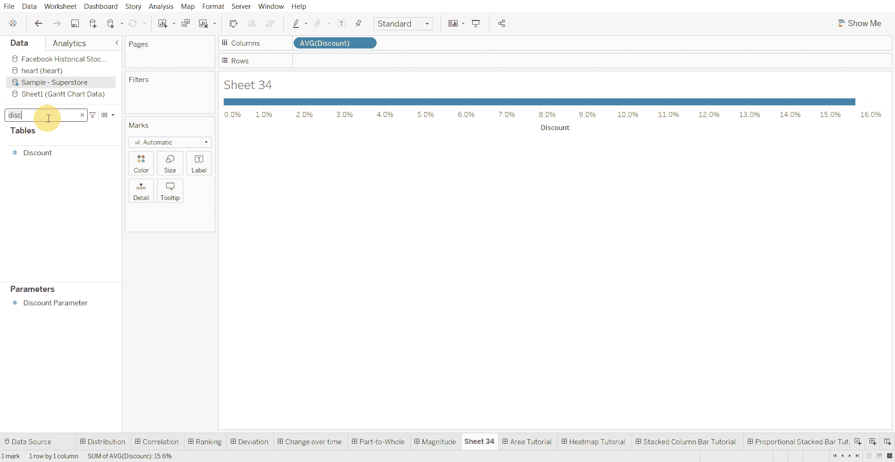
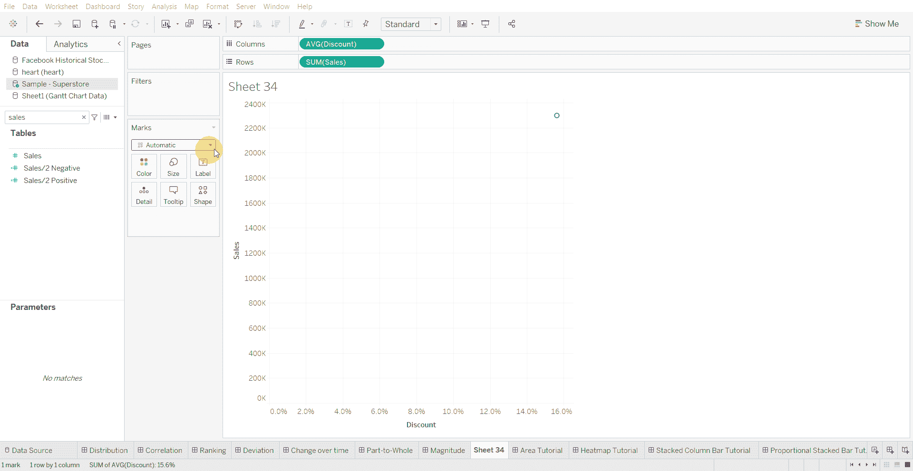
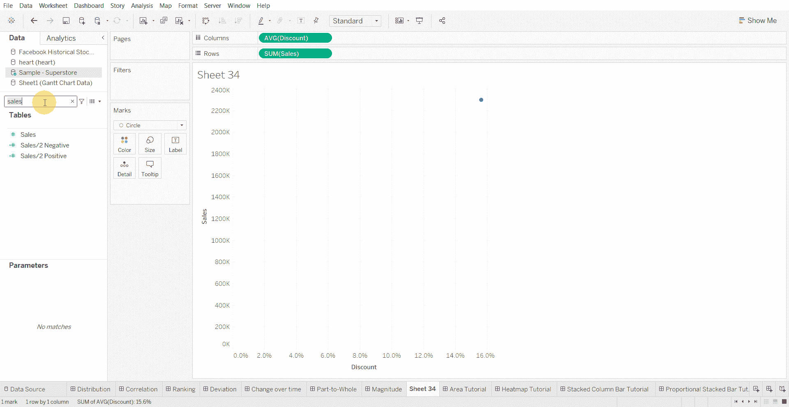
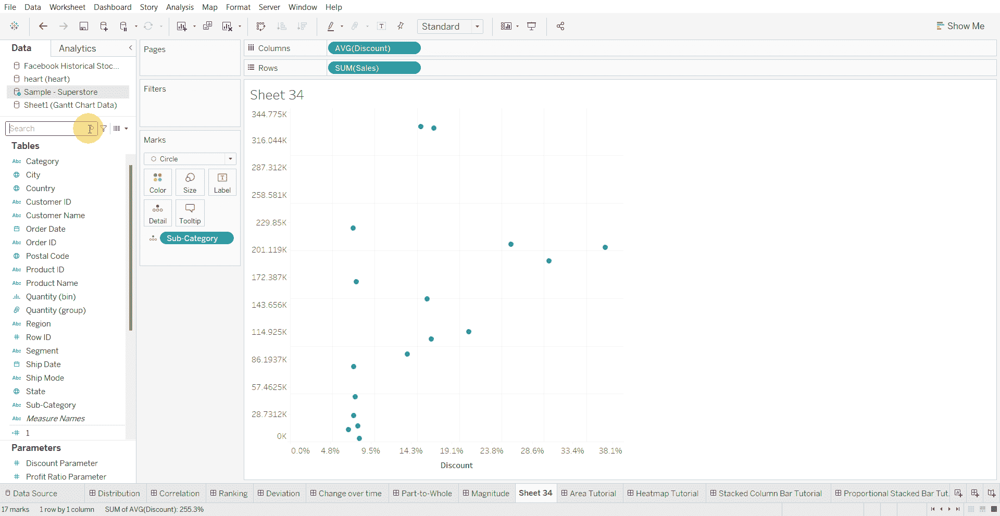
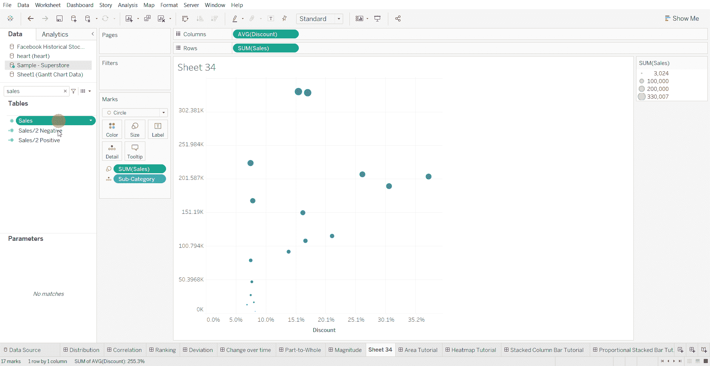

# Tableau 教程-如何创建比例符号图

> 原文：<https://medium.com/mlearning-ai/tableau-tutorial-how-to-create-a-proportional-symbol-chart-8f3f46101fb8?source=collection_archive---------7----------------------->

当数值之间存在较大差异时，如果发现数据之间的细微差异并不重要，则使用比例符号图。

下面使用的数据集是在 [Tableau 社区](https://community.tableau.com/s/question/0D54T00000CWeX8SAL/sample-superstore-sales-excelxls)上提供的超级商店数据集。

创建比例符号图的步骤—

*   将数值变量拖到列架上

*   将另一个数字变量拖到行架上

*   将标记类型更改为圆形

*   将分类变量移动到细节标记

*   将数值变量移动到尺寸标记处

*   将另一个数值变量移动到颜色标记上

[1]:金融时报。(2021 年 3 月 7 日)。*管用的图表:FT 视觉词汇指南*[https://www . FT . com/content/c 7 bb 24 c 9-964d-479 f-ba24-03a 2 B2 df 6 e 85](https://www.ft.com/content/c7bb24c9-964d-479f-ba24-03a2b2df6e85)

 [## Mlearning.ai 提交建议

### 如何成为 Mlearning.ai 上的作家

medium.com](/mlearning-ai/mlearning-ai-submission-suggestions-b51e2b130bfb)