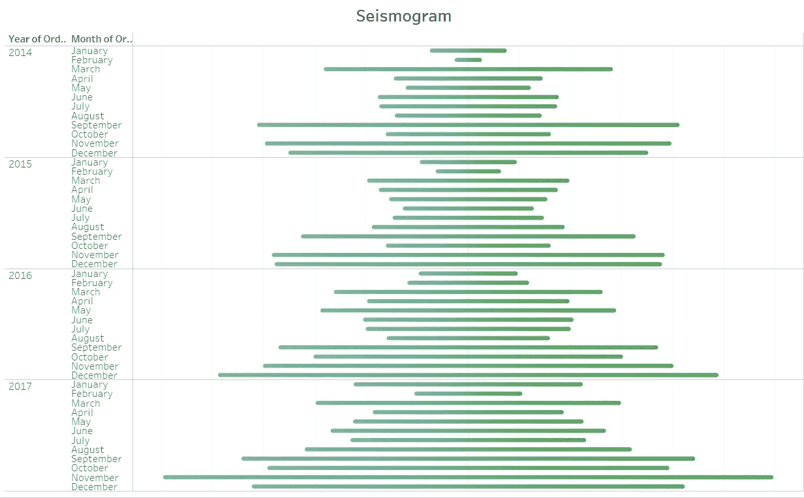
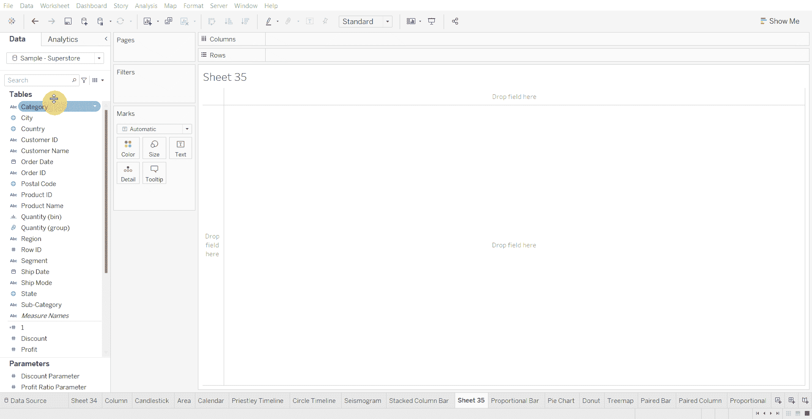
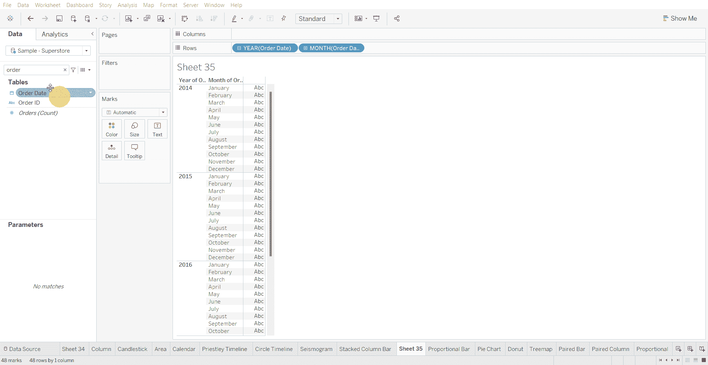
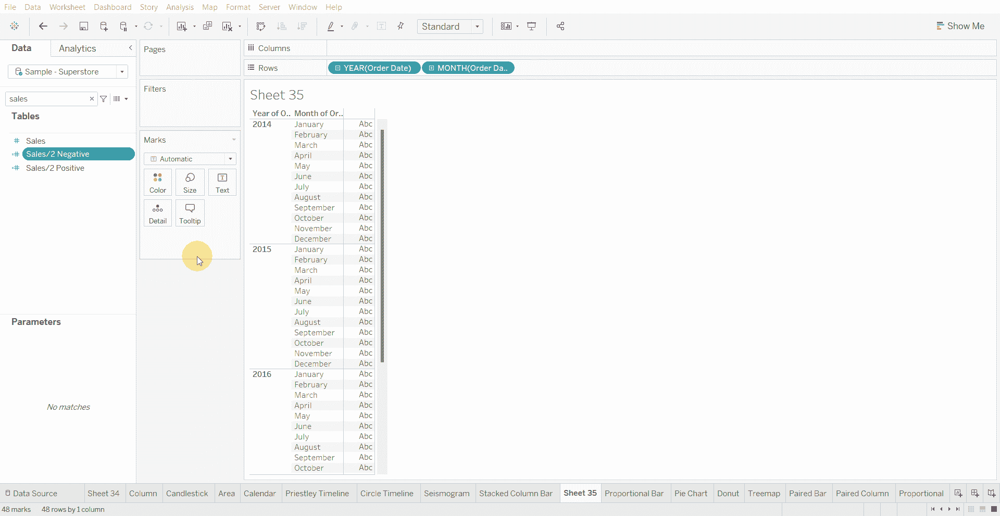
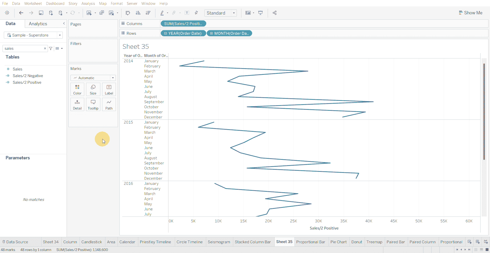
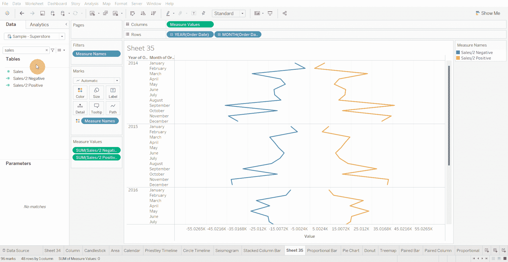
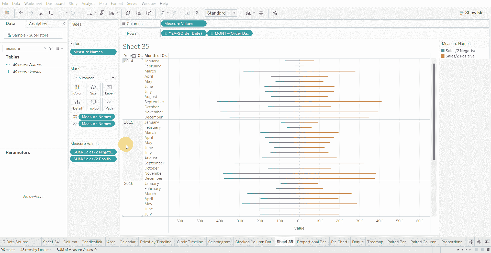
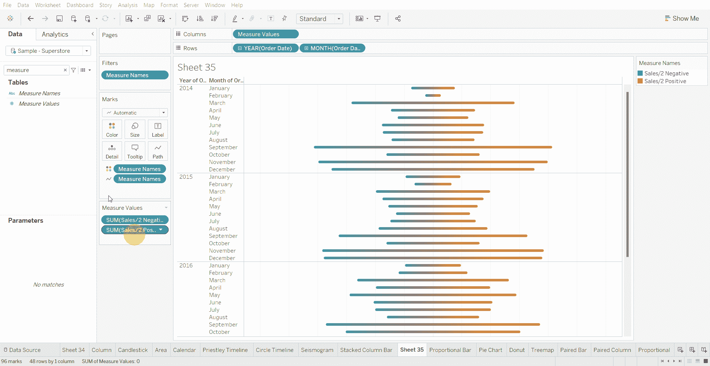

# Tableau 教程-如何创建地震图时间线

> 原文：<https://medium.com/mlearning-ai/tableau-tutorial-how-to-create-a-seismogram-timeline-d6b76676dba6?source=collection_archive---------10----------------------->

地震图时间线是圆形时间线的替代方法，用于显示数据变化较大的系列。

下面使用的数据集是在 [Tableau 社区](https://community.tableau.com/s/question/0D54T00000CWeX8SAL/sample-superstore-sales-excelxls)上提供的超级商店数据集。

创建地震图时间线图表的步骤—

*   将年和月日期变量添加到行架

*   创建两个计算得到的数值变量(一个为正，另一个为负)。将负和正计算字段的数值除以 2

*   将正计算字段拖到列架上

*   将负计算字段拖动到 X 轴

*   将度量名称拖到路径中

*   增加图表的大小，并删除 X 轴的标题

*   将数值拖到工具提示上，并从工具提示中移除正数值变量和负数值变量

[1]:金融时报。(2021 年 3 月 7 日)。*管用的图表:FT 视觉词汇指南*[https://www . FT . com/content/c 7 bb 24 c 9-964d-479 f-ba24-03a 2 B2 df 6 e 85](https://www.ft.com/content/c7bb24c9-964d-479f-ba24-03a2b2df6e85)

 [## Mlearning.ai 提交建议

### 如何成为 Mlearning.ai 上的作家

medium.com](/mlearning-ai/mlearning-ai-submission-suggestions-b51e2b130bfb)