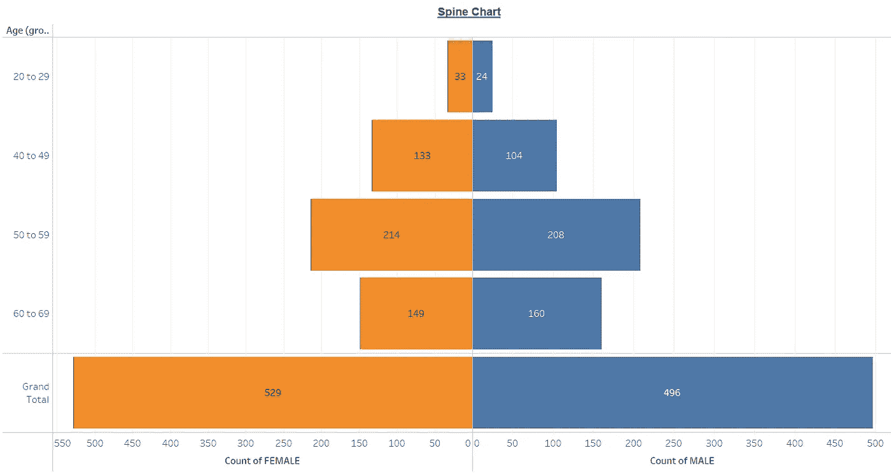
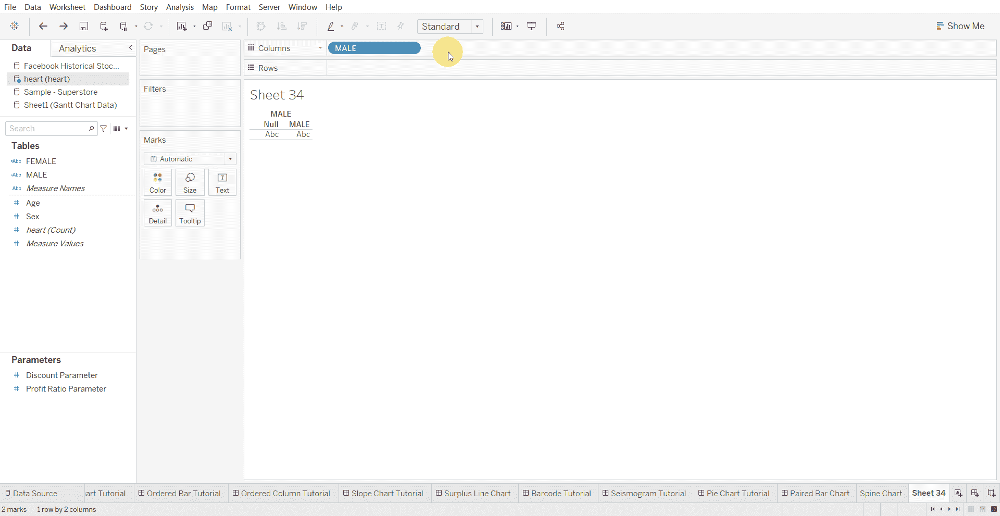
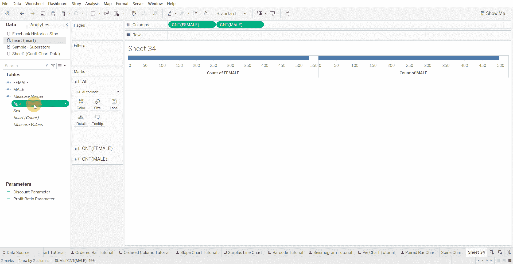
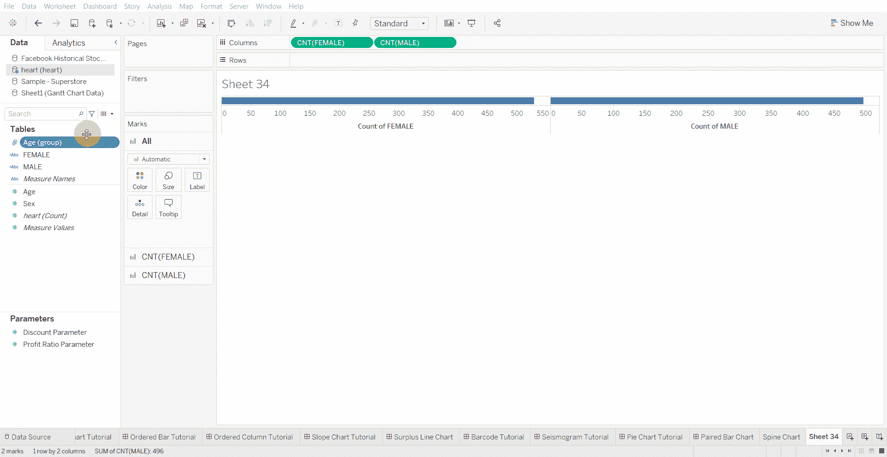
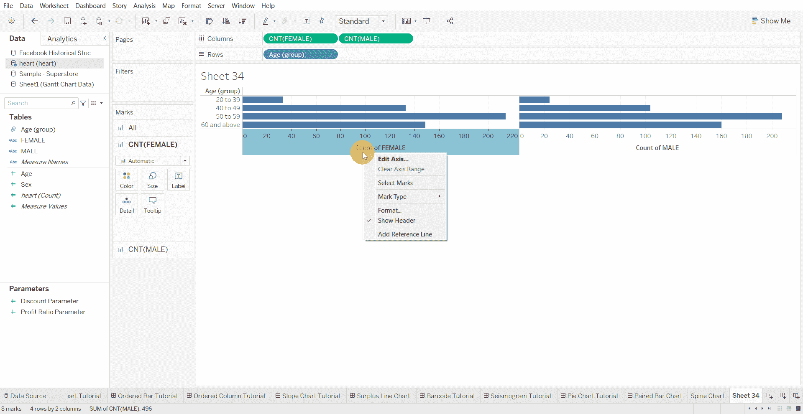
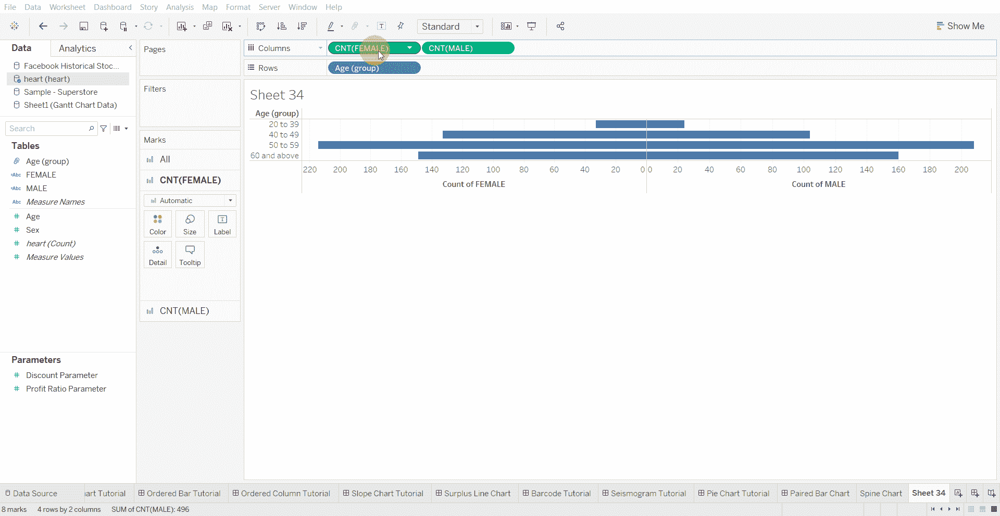
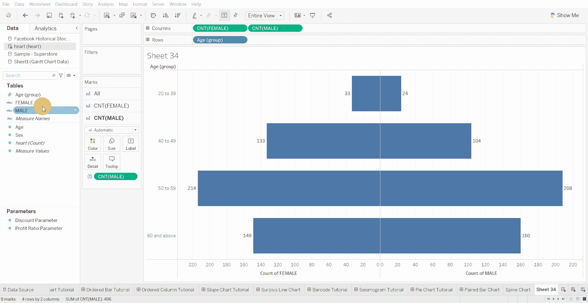
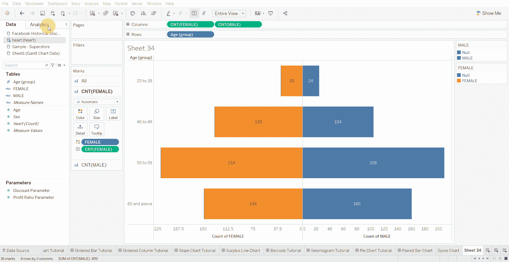

# Tableau 教程-如何创建脊柱图

> 原文：<https://medium.com/mlearning-ai/tableau-tutorial-how-to-create-a-spine-chart-200402f083b6?source=collection_archive---------8----------------------->

脊柱图是将一个值分成两个对比部分(如男性/女性)的视觉效果。

创建脊柱图的步骤—

*   将两个分类变量(最好是性别)拖到列架上，并将度量值更改为计数

*   为要包含在行架中的数值变量创建箱

*   将组拖到行架上

*   编辑左侧条形图的轴，并将刻度反转

*   向图表添加标签

*   更改条形图的颜色

*   转到“分析”窗格，添加总计—“总计列”

[1]:金融时报。(2021 年 3 月 7 日)。*管用的图表:FT 视觉词汇指南*[https://www . FT . com/content/c 7 bb 24 c 9-964d-479 f-ba24-03a 2 B2 df 6 e 85](https://www.ft.com/content/c7bb24c9-964d-479f-ba24-03a2b2df6e85)

 [## Mlearning.ai 提交建议

### 如何成为 Mlearning.ai 上的作家

medium.com](/mlearning-ai/mlearning-ai-submission-suggestions-b51e2b130bfb)