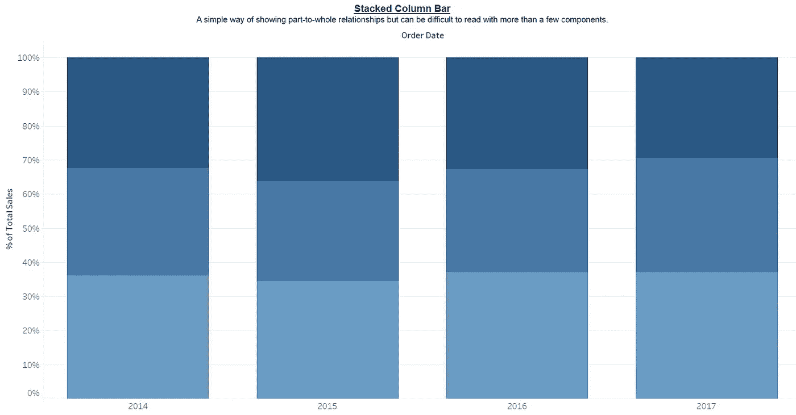
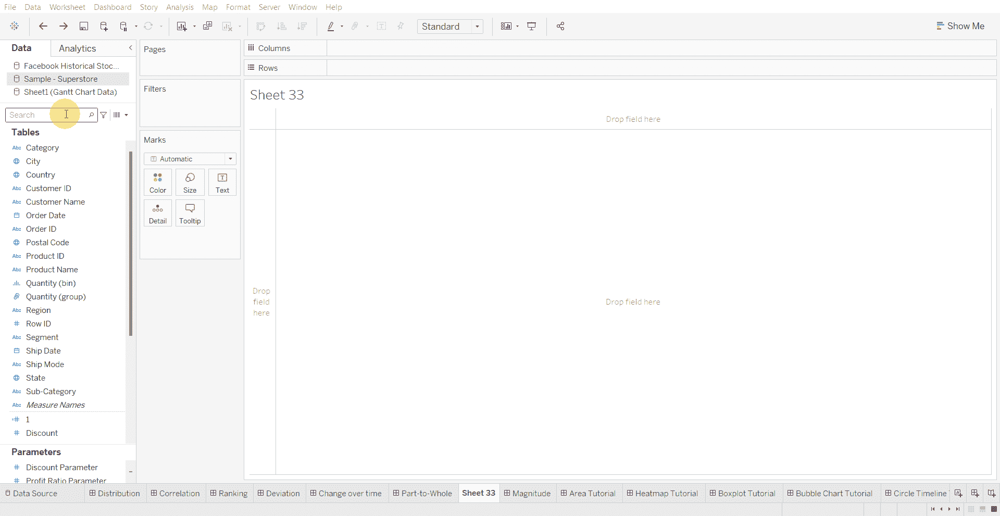
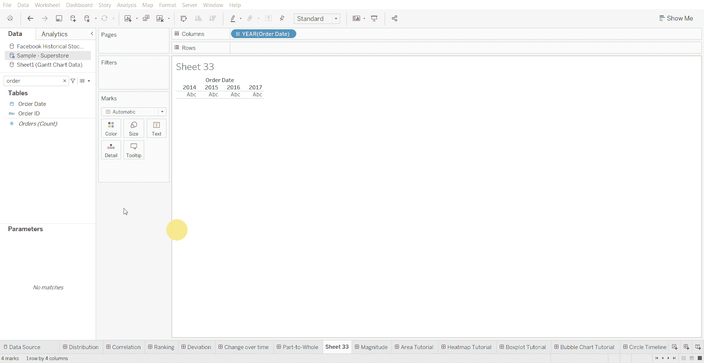
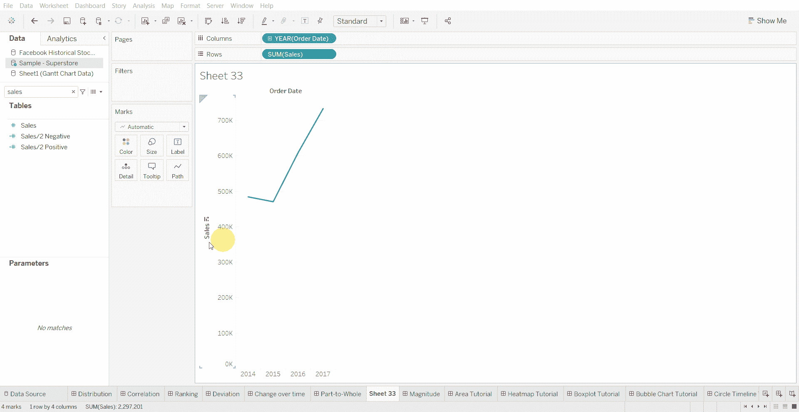
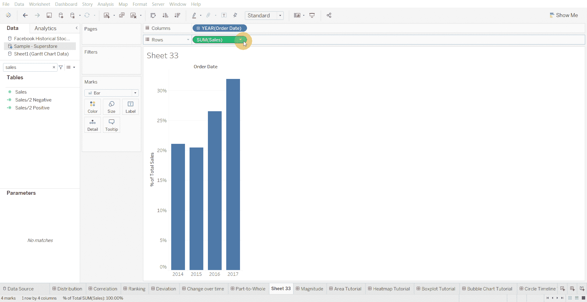
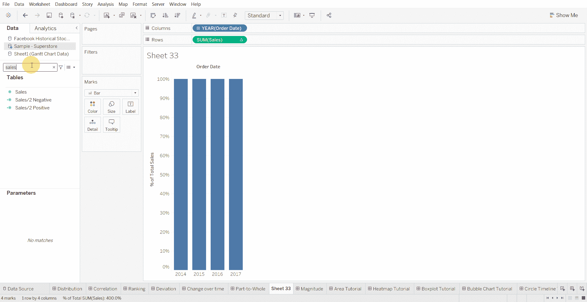

# Tableau 教程—如何创建堆积柱形图

> 原文：<https://medium.com/mlearning-ai/tableau-tutorial-how-to-create-a-stacked-column-bar-chart-3d8116d53c41?source=collection_archive---------5----------------------->

堆积柱形图是显示部分与整体关系的一种简单方法，但如果有多个组件，就很难读懂。

下面使用的数据集是在 [Tableau 社区](https://community.tableau.com/s/question/0D54T00000CWeX8SAL/sample-superstore-sales-excelxls)上提供的超级商店数据集。

创建堆积柱形图的步骤—

*   将日期变量移动到列架上

*   将数值变量移至行架

*   将图表类型更改为条形图

*   将表格计算更改为“占总数的百分比”

*   将计算用途更改为表格(向下)

*   向颜色标记添加分类变量

[1]:金融时报。(2021 年 3 月 7 日)。*管用的图表:FT 视觉词汇指南*[https://www . FT . com/content/c 7 bb 24 c 9-964d-479 f-ba24-03a 2 B2 df 6 e 85](https://www.ft.com/content/c7bb24c9-964d-479f-ba24-03a2b2df6e85)

 [## Mlearning.ai 提交建议

### 如何成为 Mlearning.ai 上的作家

medium.com](/mlearning-ai/mlearning-ai-submission-suggestions-b51e2b130bfb)