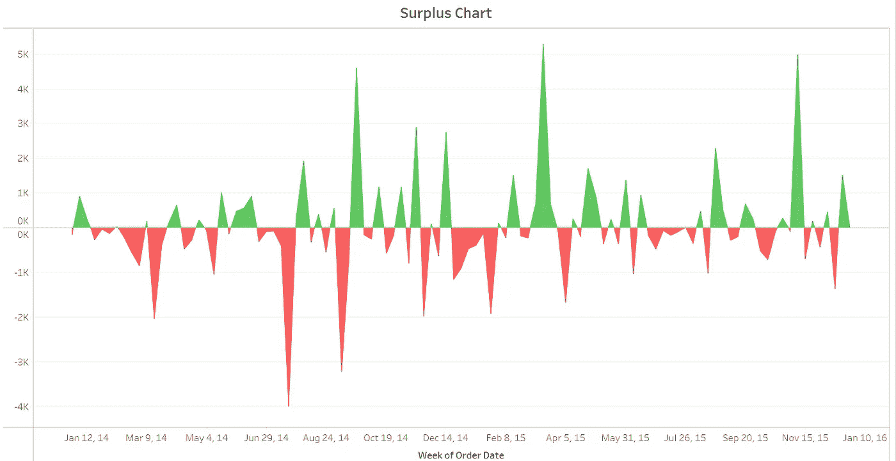
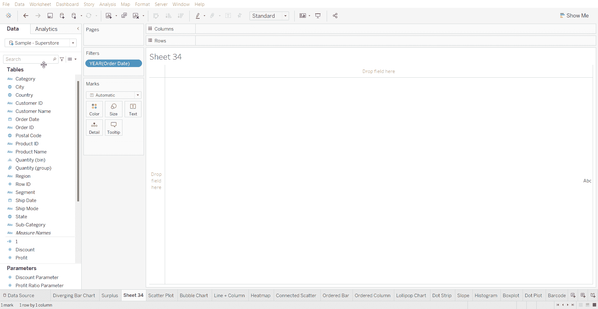
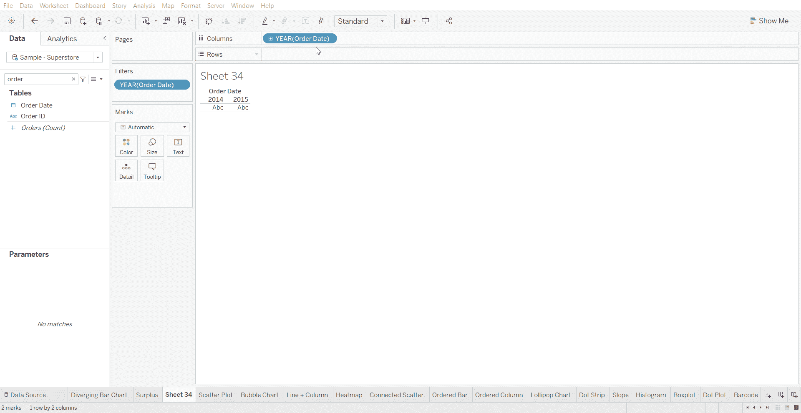
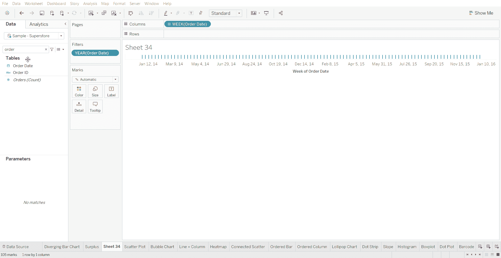
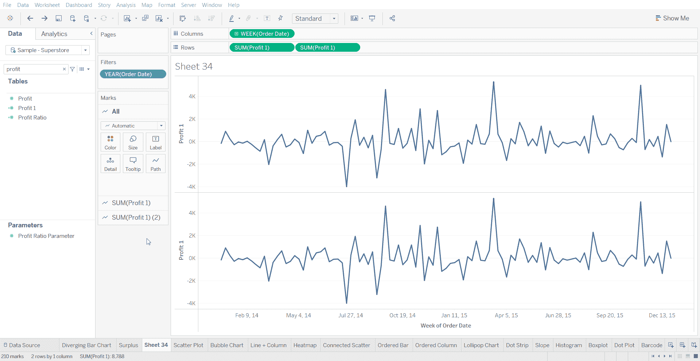
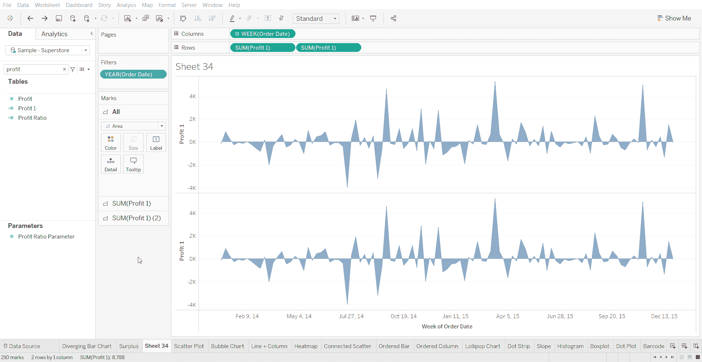
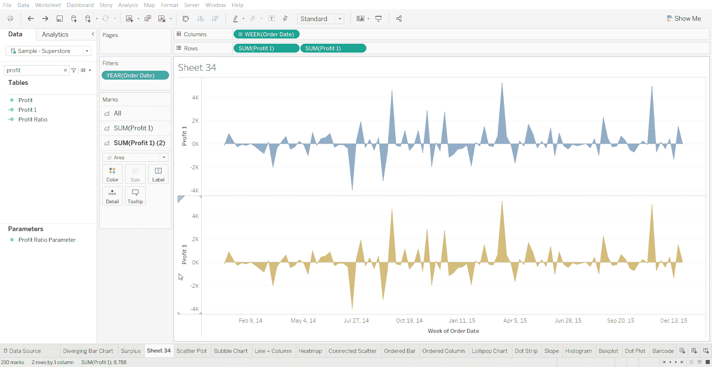
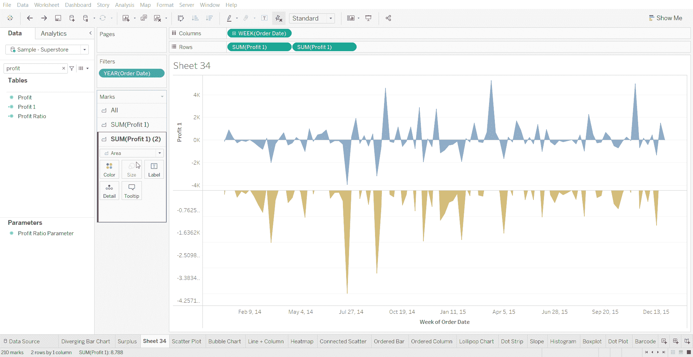

# Tableau 教程-如何创建盈余/赤字填充折线图

> 原文：<https://medium.com/mlearning-ai/tableau-tutorial-how-to-create-a-surplus-deficit-filled-line-chart-1009acf42aa5?source=collection_archive---------6----------------------->

盈余/赤字填充折线图是阴影区域允许显示平衡的视觉效果——相对于基线或在两个系列之间。

下面使用的数据集是在 [Tableau 社区](https://community.tableau.com/s/question/0D54T00000CWeX8SAL/sample-superstore-sales-excelxls)上提供的超级商店数据集。

创建盈余/赤字填充折线图的步骤-

*   将日期变量拖到列架上

*   将日期变量更改为 Continuous，然后进一步深入到 week

*   将一个数值变量拖到“行”工具架上，然后再次将同一数值变量拖到“行”工具架上

*   将标记类型更改为面积

*   更改第二个(底部)数值变量的颜色

*   编辑第二个(底部)数值变量的轴，并将范围更改为固定，在固定端设置 0

*   编辑第一个(顶部)数值变量的轴，并将范围更改为固定，将 0 设置为固定起点

[1]:金融时报。(2021 年 3 月 7 日)。*管用的图表:FT 视觉词汇指南*[https://www . FT . com/content/c 7 bb 24 c 9-964d-479 f-ba24-03a 2 B2 df 6 e 85](https://www.ft.com/content/c7bb24c9-964d-479f-ba24-03a2b2df6e85)

 [## Mlearning.ai 提交建议

### 如何成为 Mlearning.ai 上的作家

medium.com](/mlearning-ai/mlearning-ai-submission-suggestions-b51e2b130bfb)