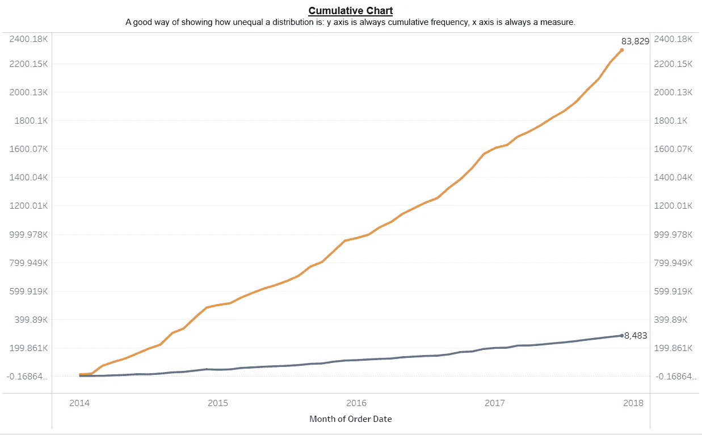
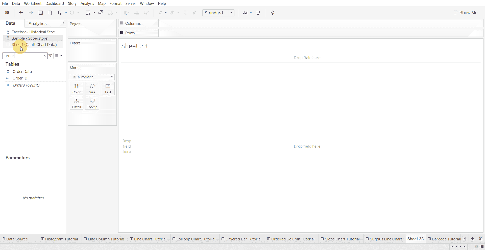
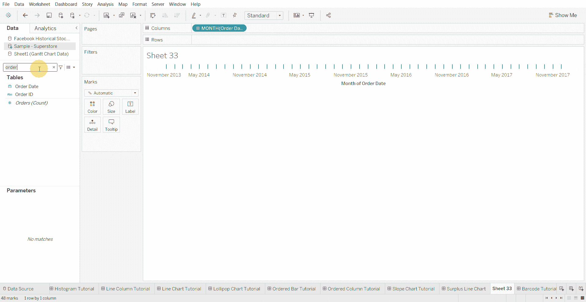
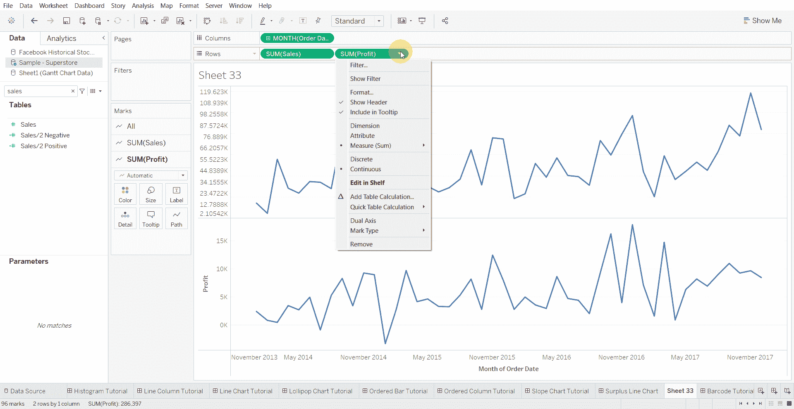
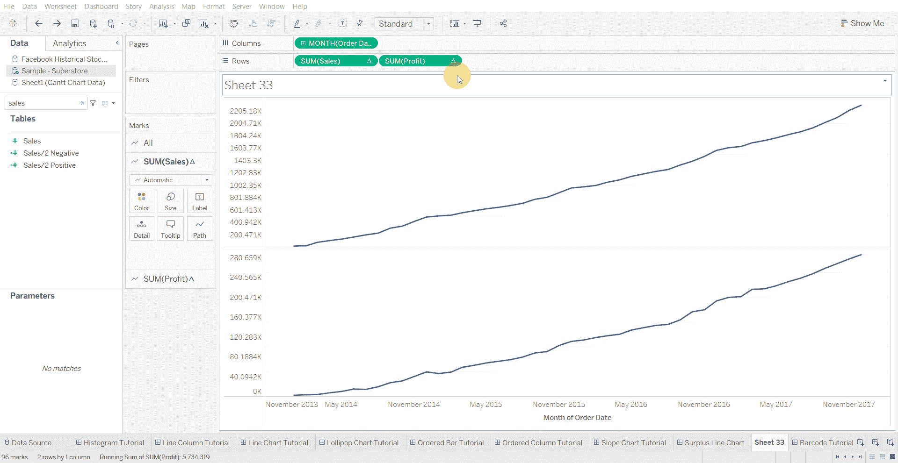
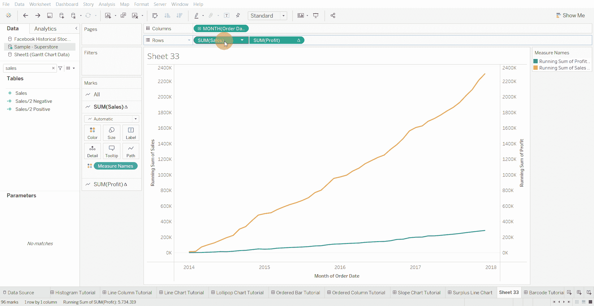

# Tableau 教程—如何创建累积曲线图

> 原文：<https://medium.com/mlearning-ai/tableau-tutorial-how-to-create-cumulative-chart-2322897d7b57?source=collection_archive---------3----------------------->

累积曲线图是显示分布有多不平等的好方法。

下面使用的数据集是在 [Tableau 社区](https://community.tableau.com/s/question/0D54T00000CWeX8SAL/sample-superstore-sales-excelxls)上提供的超级商店数据集。

创建累积曲线图的步骤—

*   将日期字段拖到列架上，然后选择月

*   将两个数值字段拖到行架上

*   将两个数值字段的快速表计算从 Sum 更改为 Running Total

*   选择双轴并同步轴

*   将标签添加到图表，并将“要标记的标记”添加到“最近的”

[1]:金融时报。(2021 年 3 月 7 日)。*管用的图表:FT 视觉词汇指南*[https://www . FT . com/content/c 7 bb 24 c 9-964d-479 f-ba24-03a 2 B2 df 6 e 85](https://www.ft.com/content/c7bb24c9-964d-479f-ba24-03a2b2df6e85)

 [## Mlearning.ai 提交建议

### 如何成为 Mlearning.ai 上的作家

medium.com](/mlearning-ai/mlearning-ai-submission-suggestions-b51e2b130bfb)