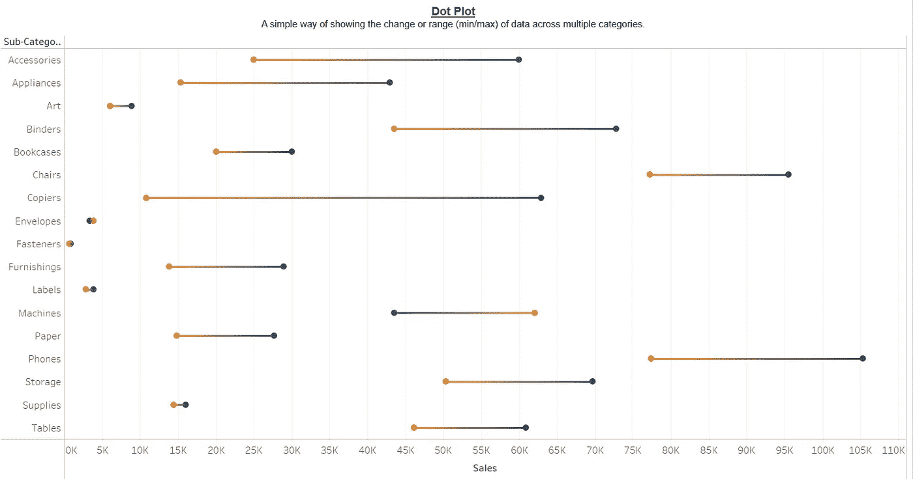
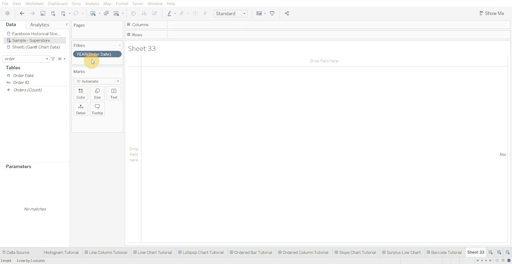
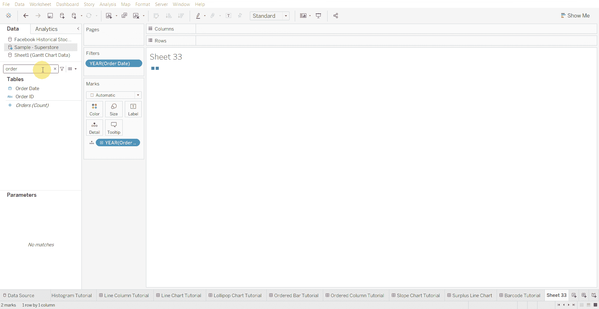
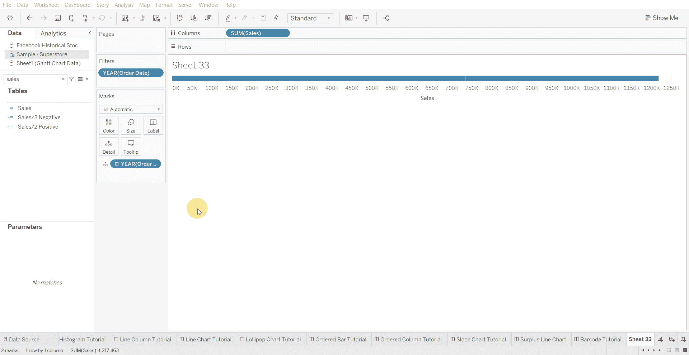
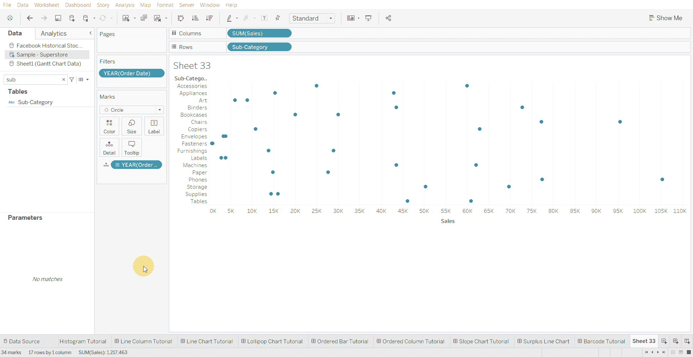
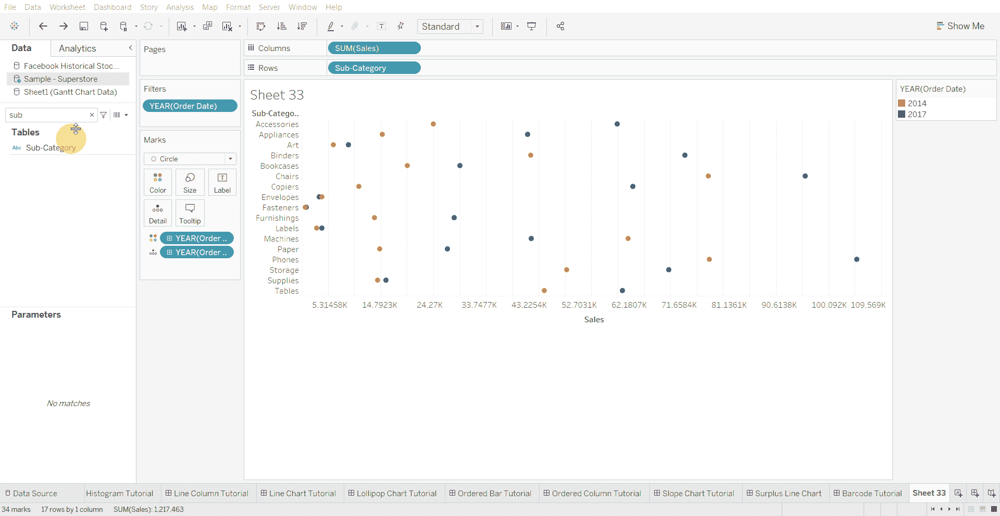
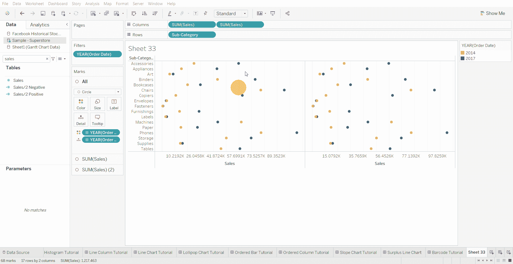

# Tableau 教程-如何创建点状图

> 原文：<https://medium.com/mlearning-ai/tableau-tutorial-how-to-create-dot-plot-chart-8684859da75b?source=collection_archive---------4----------------------->

点图是显示多个类别中数据变化或范围(最小值/最大值)的简单方法。

下面使用的数据集是在 [Tableau 社区](https://community.tableau.com/s/question/0D54T00000CWeX8SAL/sample-superstore-sales-excelxls)上提供的超级商店数据集。

创建点状图的步骤—

*   将日期变量过滤为两年或两个月等。…

*   将日期变量(年份)拖到详细信息中

*   在列架上拖动数值变量

*   将标记类型更改为圆形

*   拖动行架上的分类变量

*   拖动颜色上的日期变量

*   列架上有重复的数字变量

*   选择双轴来组合两个变量

*   将其中一个数值变量的标记类型更改为线条

*   将日期变量从详细信息拖动到路径

[1]:金融时报。(2021 年 3 月 7 日)。*管用的图表:FT 视觉词汇指南*[https://www . FT . com/content/c 7 bb 24 c 9-964d-479 f-ba24-03a 2 B2 df 6 e 85](https://www.ft.com/content/c7bb24c9-964d-479f-ba24-03a2b2df6e85)

 [## Mlearning.ai 提交建议

### 如何成为 Mlearning.ai 上的作家

medium.com](/mlearning-ai/mlearning-ai-submission-suggestions-b51e2b130bfb)