# 使用 DCGANs 解决医学领域的小数据集问题

> 原文：<https://medium.com/mlearning-ai/tackle-the-problem-of-small-datasets-in-the-medical-domain-using-dcgans-eef990f8a5f6?source=collection_archive---------3----------------------->

## 从现有数据中合成新的 CT 扫描、核磁共振成像和 x 光

医疗领域缺乏足够大的数据集是使用 ML 和深度学习模型处理医疗人工智能解决方案时面临的最常见问题之一。这是因为临床数据通常是私人的，医院很少向公众发布数据集。在临床试验过程中，患者经常被放弃，由此导致数据缺失或不完整，这是另一个主要障碍。

在研究脑瘤分类问题时，我遇到了类似的障碍。肿瘤的 MRI 扫描很容易获得，但非肿瘤扫描与肿瘤扫描相比要少得多。

这造成了数据集中的不平衡，所以为了克服这一点，我最初想到了图像放大和放大非肿瘤扫描。但这里的问题是，增强图像不是非常多样化，我的模型需要新的扫描来有效地训练。

这时，我偶然发现了 DCGANs 和亚历克·拉德福德和卢克·梅茨的“用深度卷积生成对抗网络实现无监督表示学习”的教程。

# 介绍

GANs 是一个框架，用于教导 DL 模型捕获训练数据的分布，以便我们可以从相同的分布中生成新数据。

DCGAN 是 GAN 的直接扩展，只是它在鉴别器和生成器中分别显式使用了卷积和卷积转置层。

DCGANs 由两个不同的模型组成，一个*发生器*和一个*鉴别器*。生成器本质上产生了看起来像训练图像的“假”图像。而鉴别器查看图像并给出来自发生器的输出是真实的训练图像还是虚假的图像。在训练过程中，生成器不断试图通过生成更好的假货来击败鉴别器，而鉴别器则在努力正确地对真假图像进行分类。

我利用论文中提到的技术，从现有的数据中合成了新的 MRI 扫描，结果看起来很有希望。由于这是基于现有数据的伪 MRI 扫描，因此在将这些扫描灌输给实际现实世界医疗人工智能解决方案的培训之前，让实际医生验证这些扫描是合适的。

# 导入必要的库

这里的输入是一个 3x64x64 的 RGB 图像，作为大脑 MRI 扫描。

Imports

# 定义输入和加载数据

在这里，我们定义了运行所需的一些输入，如 dataroot，它是数据集文件夹的根目录的路径、工人数量、批处理大小、图像大小等。

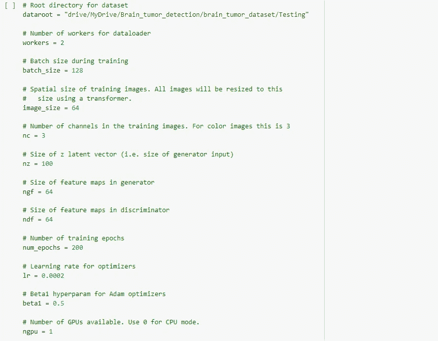

Defining Inputs

现在，我们使用 ImageFolder dataset 类加载数据集，这要求数据集的根文件夹中有子目录，因此要确保这一点。

我们可以创建数据集，创建数据加载器，设置要运行的设备，最后可视化一些训练数据，如下所示:

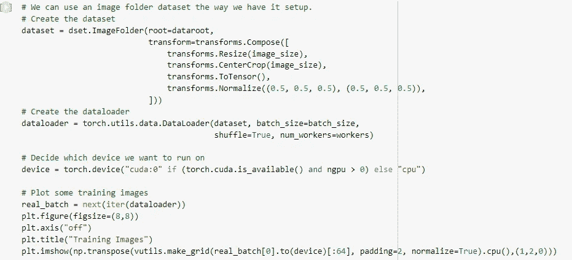

它的输出看起来像这样:

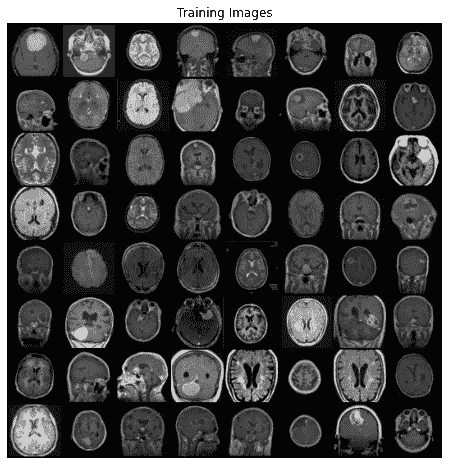

这些基本上是来自我们 DCGAN 训练数据的一组图像。

# 重量初始化

从上面提到的论文中，作者规定所有的模型权重应该从均值=0，标准偏差=0.02 的正态分布中随机初始化。`weights_init`函数将初始化的模型作为输入，并重新初始化我们将在训练中使用的所有卷积、卷积转置和批量归一化层，以满足该标准。该功能在初始化后立即应用于模型。

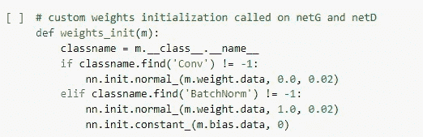

# 发电机

生成器 *G* 被设计成将潜在空间向量( *z* )映射到数据空间。由于我们的数据是图像，将 *z* 转换到数据空间意味着最终创建一个与训练图像大小相同的 RGB 图像(即 3x64x64)。

下面是描述上述论文中的生成器的图像:

source: pytorch.org

上述架构的代码在这里实现:

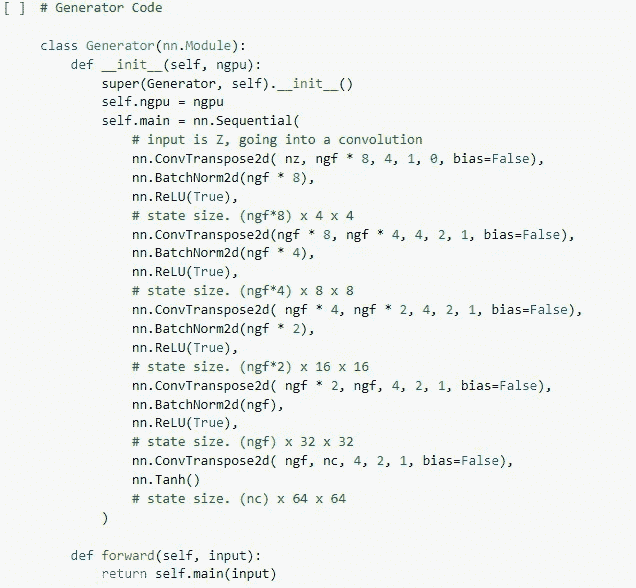

Generator G

请注意图像的大小是如何决定生成器(和鉴别器)的架构的，这里使用的是 3x64x64 图像，但是如果您希望使用其他大小，必须对生成器和鉴别器进行相应的更改。

现在，我们可以实例化生成器并应用`weights_init`函数。

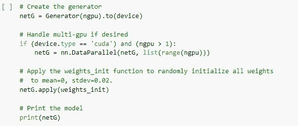

# 鉴别器

如前所述，鉴别器 D 是一个二进制分类网络，它将图像作为输入，并输出输入图像是真实图像(而不是伪造图像)的标量概率。这里，D 获取一个 3x64x64 的输入图像，通过一系列 Conv2d、BatchNorm2d 和 LeakyReLU 层对其进行处理，并通过一个 Sigmoid 激活函数输出最终概率。

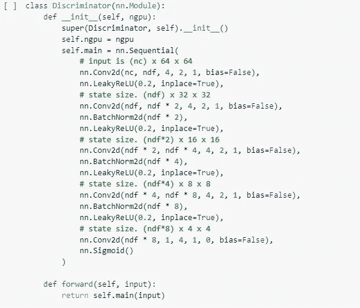

Discriminator D

实例化鉴别器，

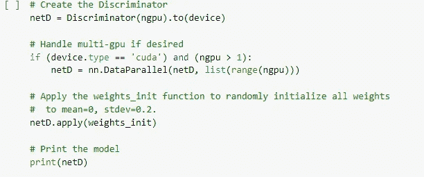

# 训练我们的 DCGAN

在我们开始训练之前，必须编写一小段代码来定义损失函数和优化器。本文中使用了相同的 BCELoss 函数。

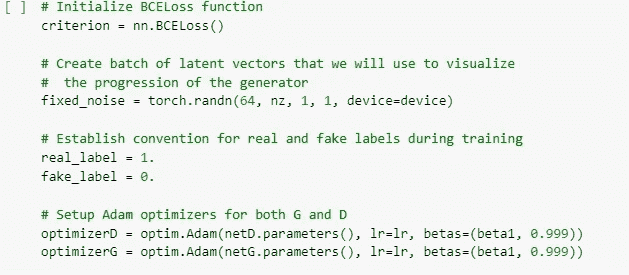

损失函数的公式为:

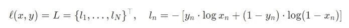

培训分为两个主要部分。第 1 部分更新鉴别器，第 2 部分更新生成器。

首先，来自我们的训练集的一批真实样本向前通过鉴别器 D，计算损失，然后计算向后通过的梯度。第二，用电流发生器产生一批假样本，并使这批样本正向通过 D，再次计算损耗，并且*用反向通过累积*梯度。现在，随着所有真实批次和所有虚假批次的梯度累积，我们称之为鉴别器优化器的一个步骤。

正如在原始论文中所述，我们理想地想要通过最小化*log*(1—*D*(*G*(*z*))来训练生成器 G，以努力生成更好的假货。这不能提供足够的梯度，尤其是在早期学习过程中。为了解决这个问题，我们转而关注最大化*log*(*D*(*G*(*z*))。

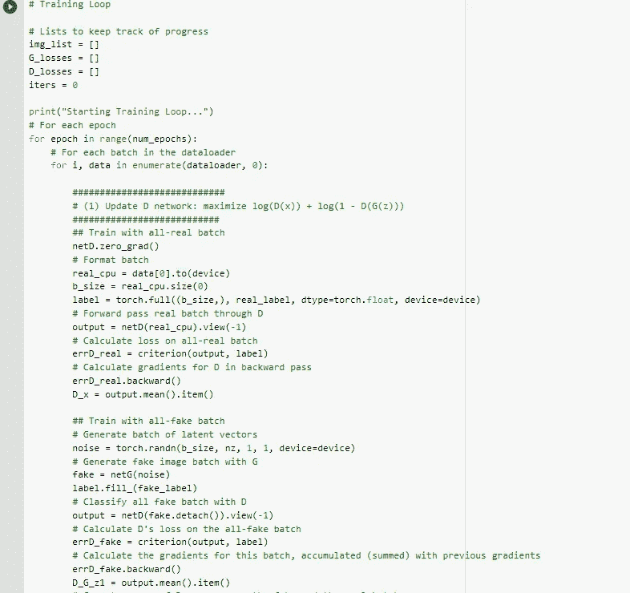

在训练循环中，我们将周期性地将这个固定噪声输入到 *G* 中，并且在迭代过程中，我们将看到来自噪声的图像。

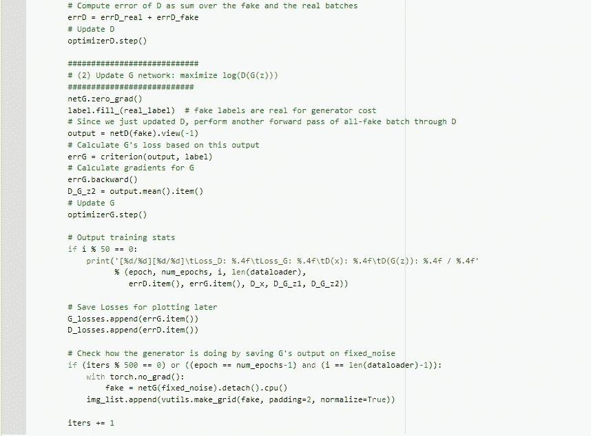

# 结果

正如我上面所说的，从一个正常人的角度来看，结果看起来足够有希望，但只有一个合适的医生才能为现实世界的医疗人工智能解决方案奠定基础。

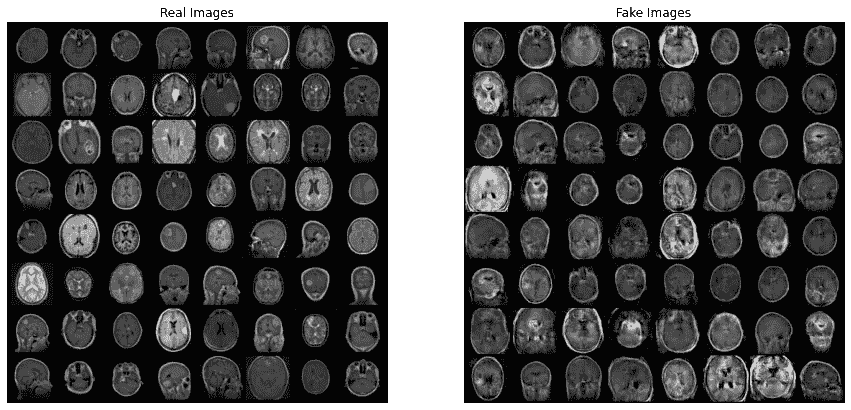

The output of our DCGAN

本文中的代码受到了 Nathan inka 的 DCGAN 教程的启发，Nathan inka 为上面提到的论文撰写了关于 pytorch.org 的教程。

 [## Mlearning.ai 提交建议

### 如何成为 Mlearning.ai 上的作家

medium.com](/mlearning-ai/mlearning-ai-submission-suggestions-b51e2b130bfb)