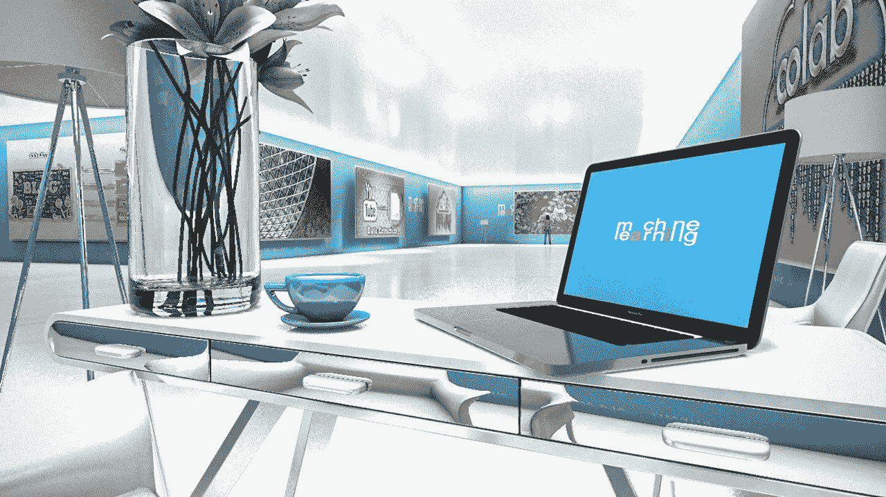

# 参加这些 ML 故事的虚拟现实之旅

> 原文：<https://medium.com/mlearning-ai/take-vr-tour-of-these-ml-stories-a7550340a6a2?source=collection_archive---------5----------------------->

## 使用虚拟现实的旅行

by [Dariusz Gross #DATAsculptor](https://medium.com/u/6d3244e0bdcd?source=post_page-----a7550340a6a2--------------------------------)

一个会见 MLearning.ai 顶级作家[Monica 博士](https://medium.com/u/5867528f1f26?source=post_page-----a7550340a6a2--------------------------------)的独特机会。艺术画廊是一个展示视觉**艺术**的空间，在我们的画廊中，我们以借助机器学习创建的图像形式展示故事。画廊里的所有艺术品都是用风格转移制作的。我在我的项目中使用了这种技术。神经风格…