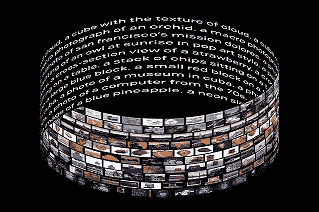
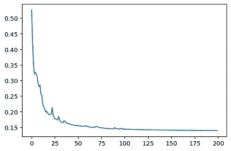

# 采用 DALL-E 型文本到图像模型进行旋转

> 原文：<https://medium.com/mlearning-ai/taking-a-dall-e-type-text-to-image-model-for-a-spin-b6fb92b7c458?source=collection_archive---------1----------------------->

深度学习领域最近的热潮是 DALL-E 论文和 2021 年 1 月初由 [OpenAI](https://openai.com/blog/dall-e/) 发表的结果。它可以将一个句子转换成一幅图像，目前是文本到图像建模的最新技术。由 [lucidrains](https://github.com/lucidrains/DALLE-pytorch) 在 Pytorch 中实现/复制了一个更小的 Dall-e 模型架构。Dall-E name 是皮克斯公司的 Wall-E 上的一个文字游戏，用“D”代替了著名画家萨尔瓦多·达利的“W”。我看了由[扬尼克·基尔彻](https://www.youtube.com/watch?v=j4xgkjWlfL4)制作的关于 Dall-E 模型技术细节的精彩视频。我决定试着在 [Pytorch](https://github.com/lucidrains/DALLE-pytorch) 版本的基础上训练一个小版本的 Dall-E 模型，在这里重新讲述我的经历。我一直觉得，当你修补 DL 模型的训练和推理部分时，你会学到很多东西。

还有一点——open ai 还没有开源发布完整的 DALL-E 模型，将来也可能不会。它最有可能通过付费的 API 调用来访问(就像今天的 GPT-3)。他们只开源了 VAE 模型，并明确表示“用于从文本生成图像的转换器不属于这个代码版本。”DALL-E 实际上是两个锁在一起的深度学习模型，我将简单介绍一下。我完全理解 OpenAI 的立场，因为过去的开源代码已经被大型技术公司大量利用，却没有相应地回馈开源社区。我们都记得 Elasticsearch 和 AWS 在这个问题上的争论。

在这里，我不会讨论 DALL-E 模型的技术细节。这更多的是我在 Pytorch 上玩 DALL-E type [模型的经历。Dall-E 有两个深度学习模型锁在一起。一种是将文本转换到潜像空间的变换器模型和将潜像空间转换到实际图像的变分编码器/解码器模型。离散 VAE 模型最初在数据集中的图像上被训练，以学习潜像向量空间。然后，预训练的离散 VAE 模型被用作变换器模型的一部分，以学习可以将文本转换成图像的变换器权重。这里需要注意的一点是，将文本翻译成图像的任务是不明确的:一个单独的标题通常对应于无数个看似合理的图像，因此图像不是唯一确定的。Dall-E 模型通过对潜像空间向量进行某种采样，实际上为同一字幕生成了许多图片。在他们的官方 DALL-E 博客中，该模型实际上为一个标题生成了 512 幅不同的图像，然后他们使用一个](https://github.com/lucidrains/DALLE-pytorch)[剪辑](https://openai.com/blog/clip/)模型为该标题挑选了前 25 幅图像，该模型为每幅图像分配文本匹配概率。OpenAI 发布的 [CLIP](https://openai.com/blog/clip/) 模型和 Dall-E 模型一样重要。令人惊讶的是，CLIP 可以在 ImageNet 数据上比 Resnet-50 模型做得更好，而无需实际在 ImageNet 数据上进行训练。

我使用了 [lucidrains](https://github.com/lucidrains/DALLE-pytorch) 中的[示例](https://github.com/lucidrains/DALLE-pytorch/blob/main/examples/rainbow_dalle.ipynb)笔记本来试用 Dall-E 型号。此示例基于简单的几何图形(如正方形、矩形、圆形、六边形等)生成 32x32 的图像和文本。这些图像有不同的填充、大小和颜色。一个示例文本可以像“大填充阴影橙色菱形旋转两次”。图像尺寸比 openAI 使用的 256 x 256 图像小得多。我首先使用我的 RTX-2080 GPU 训练 VQ-VAE 模型。训练大概花了 1 个小时。之后，我使用预先训练的 VQ-VAE 模型来训练 Dall-E 变压器模型，这也花了大约 1 小时。使用具有指数速率调度器的 1e-3 的学习速率。我不得不使用 64 批次大小，因为任何更多的东西都不适合我的 8GB GPU 内存。大约 100 个时期后，损失变平。下面也显示了实际图像与预测图像的对比——有些图像缺少颜色，但形状正确。

Dall-E Type Model Training loss vs Epoch

Top Row is Actual Image for the Test Text and Bottom Row is predicted Image

来自 Naver 的研究工程师 Kobiso 已经在 [CUB200](http://www.vision.caltech.edu/visipedia/CUB-200.html) 数据集上训练了 Dall-E 类型的模型。他已经发布了预训练模型，我决定使用预训练模型进行推理，看看效果如何。预训练模型使用[deep speed](https://www.deepspeed.ai/)——一个微软深度学习优化库，使分布式训练变得简单、高效和有效——*10 倍大的模型，10 倍快的训练，最少的代码更改。*最初的 Dall-E 模型有 120 亿个参数。任何超过 1.3 bil 参数的模型都无法安装在单个 GPU 上(即使是 32 GB 内存的 GPU)。因此，模型本身必须实现并行化——层内或层间——分成跨多个 GPU 的片段。这与数据并行化不同。DeepSpeed 必须有助于模型并行化。我不得不安装 deepspeed 来测试他预先训练好的模型。然后我遇到了多个错误——首先是 deepspeed 要求 Cuda 小于 11.0。这很容易处理。然后，第二个错误是“*由于硬件/软件问题导致不兼容，无法 JIT 加载 sparse _ attn op*’。然后我在 DeepSpeed 库中查找了这个问题，他们说'*稀疏注意力内核是用 Triton 编写的，目前只在 Tesla V100 上工作；我们将很快升级到处理安培。但是，它与 GeForce RTX 不兼容。不知道为什么他们不能支持 RTX 的图灵架构。*

由于 Dall-E 模型使用 CLIP 对图像进行排序，所以我决定尝试 CLIP 模型。我在这里找到了一个用于剪辑[的 docker 容器](https://github.com/svpino/clip-container)，它也与 Sagemaker 兼容。几个小时后，我明白了如何在 Sagemaker 端点上加载这个 docker 映像。CLIP 类型的模型需要 GPU 进行快速推理——保持 Sagemaker 端点运行用于演示目的是非常昂贵的(即使最少的单个 CPU 实例的运行费用也是 50 美元/月)。AWS Lambda 无服务器服务也不会有帮助，因为它无法处理 GPU 实例，并且受到 docker 图像大小的限制(10GB 大小限制)。随后我试用了这款 [Colab](https://colab.research.google.com/drive/1ZSDOa6W5NxNdIwT79zFCEE4UwQ3PZjoU?usp=sharing#scrollTo=00bHucsqrjsc) 笔记本进行剪辑测试。我可以看到使用 CPU 和 GPU 实例之间至少有 3 倍的时间差异。我将单独写更多关于剪辑的内容。