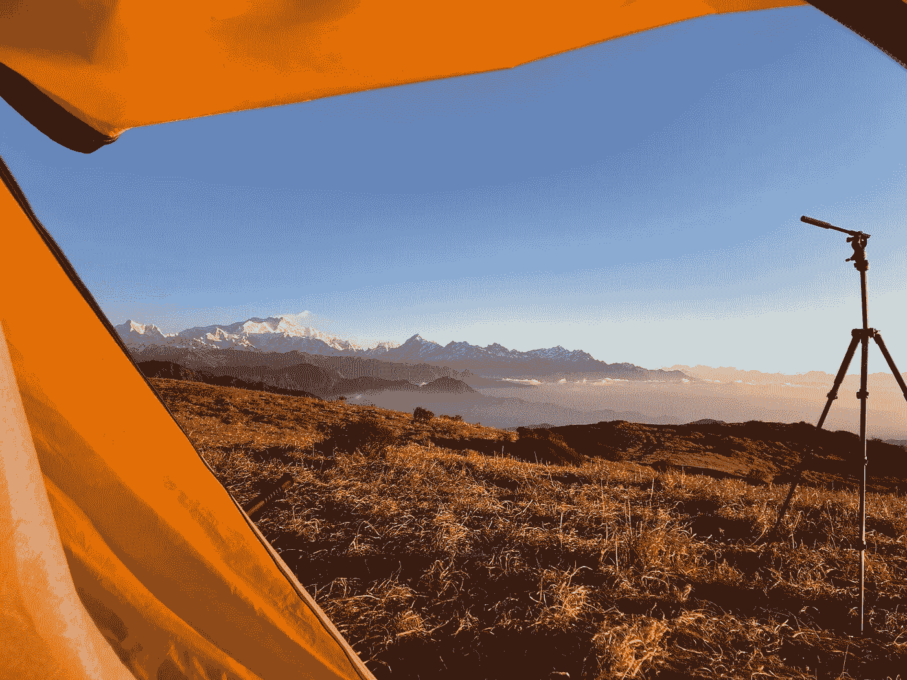
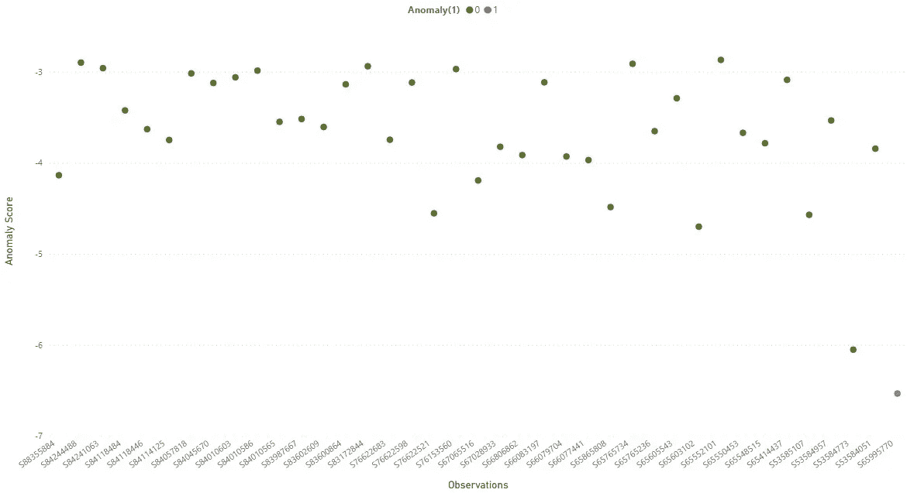
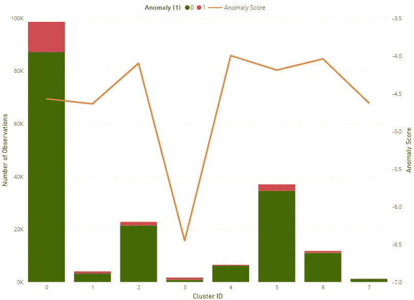

# 走向自然:自然保护中的机器学习

> 原文：<https://medium.com/mlearning-ai/taking-steps-towards-nature-machine-learning-in-conservation-51de1b5a1402?source=collection_archive---------4----------------------->

View of Sleeping Budda, Himalayas— Palaut trail West Bengal/Nepal (Personal Collection)

作为一名自然爱好者，我越来越关心我们人类的日常活动对自然界的影响。无论是使用化石燃料、塑料，还是过度使用森林/自然土地，根据人类的需求来转换它们。以及我们自己的个人行为/活动，这些行为/活动最终会间接导致这些影响。最重要的是，我与技术领域有关联，这是直接或间接对我们的自然生态系统造成相当大压力的主要因素之一，这是进一步冲突的种子。经常会弹出许多报告，例如:

> “根据国际能源署的数据，数据中心消耗大约 200 太瓦时(TWh)的电力，占全球电力需求的近 1%，占全球二氧化碳排放量的 0.3%。”——[福布斯报道](https://www.forbes.com/sites/forbestechcouncil/2021/05/03/renewable-energy-alone-cant-address-data-centers-adverse-environmental-impact/?sh=cfe42df5ddc9)作者[阿萨夫·以斯拉](https://www.forbes.com/sites/forbestechcouncil/people/asafezra/)
> 
> “最近的预测表明，到 2025 年，数据中心的能源消耗将占全球碳排放总量的 3.2%”[计算机世界](https://www.computerworld.com/article/3431148/why-data-centres-are-the-new-frontier-in-the-fight-against-climate-change.html)

每当我读到这些，总会有某种道德上的两难——我们该怎么办？我们是不是应该拔掉插头，忘记所有这些技术进步，开始回到基本生活中去？但是这种基本生活到底是什么呢？

我确信朝那个方向前进是不符合逻辑的，也是不可行的，而且从历史上看，人类并没有完全抛弃他们所学的东西，而是经常回到他们早期的生活中。在每一个人类新发现的时代，都会对自然产生不同程度的影响。与此同时，人类似乎已经学会利用这些新发现的技能，找出新的方法来解决由这些发现引起的问题(可能会引起新的问题:)，这一链条还在继续。即使发现了火，也会对人的身体、精神和周围环境产生许多不利影响。但是人类已经学会利用它来为自己和他周围的生态系统谋福利——数百万年来一直保持着这种微妙的平衡。

现在不要进入哲学层面，在当前数字技术、数据、机器学习等等的世界中，一个合乎逻辑或实际的进步，明智的做法是将自然保护的思想引入主流技术讨论，反之亦然。

今天的许多技术进步都是由市场和利润驱动的。与人类社会行为、消费者行为、医疗保健甚至各种机器、产品等相关的数据被收集、处理的数量之多令人难以想象，其中大部分都有商业角度。在高级分析、机器学习和人工智能的帮助下，大量的计算资源正在被部署来处理它们。

在这些数据和技术趋势的基础上，已经出现了许多利用信息技术来保护和丰富自然世界的倡议。其中一项努力是技术支持的公民科学倡议，其动机是根据需要收集和存储全球不同社区的集体知识。这些大规模的知识数据集与统计和数据科学技术一起，有助于科学界的各种研究。此外，通过应用机器学习/深度学习技术，也有更多的可能性将这些总体理解带回给普通公民。

当我开始更仔细地研究公民科学数据集时，我发现了机器学习的可能性及其挑战——这只是冰山一角。我发现有必要分享这些想法，并讨论我在技术人员中探索的几种可能性，以便在这个方向上播种更多的想法。

# 公民科学数据质量和机器学习/人工智能

简单介绍一下公民科学的背景——这是一个像你我这样的普通公民参与收集我们的观察结果的概念，通常是在我们周围的自然世界。由于其在时间和地点范围方面的广泛覆盖面(可能在更多维度上)的众包，它已被广泛应用于各种相关的研究领域。在自然科学领域，这种方法已经被非常有效地采用。

有许多平台和数据库，如 eBird、in natural ist、SeasonWatch，它们一直在收集大量数据[ *ebird 记录了 70 万名观鸟者和 10K 鸟类物种的 10 亿次观察，in natural ist 记录了 1 亿次超过 500 万次观察*。此数据正由使用

*   来自鸟类学、生态学、生物地理学、保护科学等不同研究领域的研究人员
*   政府、土地所有者了解生物多样性，以便做出各种决策
*   了解森林健康等的保护组织
*   公民获得他们感兴趣的物种的知识、分布和行为

由于不同程度的认识或曝光，以及在用户友好的应用程序的帮助下，越来越多的公民正在使用这些平台，并选择成为志愿者，记录他们不经意或认真的观察。

因此，随着大量数据的收集，这些数据库的用户和管理者面临着许多挑战。

尽管使用这些数据库有很多可能性，但在这些信息众包的场景中，志愿者很少或根本没有接受过记录观察结果的流程或技能培训，数据质量将始终是一个挑战。

数据管理者和相关的研究组织确实非常注意半自动和手动检查的结合。机器学习的一个主要应用是能够确定质量问题，或者从不同的角度帮助解决质量问题，从而增强人工质量流程。以下是一些有助于识别/管理数据质量的机器学习技术，反过来有助于减少公民科学质量管理中的人力投入。

## 异常检测

使用非监督(大多数情况下，没有将数据标记为好或异常)或监督异常检测(如果标记了历史异常)来识别异常观察数据。

这些概念在信用卡或网络欺诈检测的其他工业应用中已经众所周知。方法、算法非常相关，可以应用于这些公民科学数据中已经存在的多维生态变量。

Example shows set of identified anomalous and non-anomalous observations plotted against anomaly score arrived by the algorithms.

## 使聚集

使用清单的聚类(或分段),即根据数据中不同的变量/特征得出机器生成的聚类(或简单的分组)。一种用于数据挖掘的传统机器学习方法，有助于利用数据中描述的相似特征对数据进行切片，有助于更深入的理解和分析。这将有助于改进过程或测量质量参数。

Example shows clustering done on same dataset as above. Clustering here is used for understanding which Cluster has higher Anomaly Score. One could deep dive further to check the observations marked on those cluster having better understanding on what are common factors among them

## 观察者排名

对志愿者进行排名——这对质量有相当大的影响。随着志愿者花更多时间记录观察结果，大多数情况下观察质量会提高。

正如在其他各种商业系统中对消费者进行评级一样，供应商在业务流程的各个方面提供帮助。观察者评级对数据质量有相当大的影响。尽管考虑因素——影响评级的变量非常不同，但从概念上讲，它们可能看起来是相似的。

## 预言；预测；预告

预测再次成为商业用例中常见的机器学习技术。预测产品需求或医疗保健对资源(如床位/熟练工人等)的需求就是几个例子。

这项技术可以用来解决公民科学背景下的各种问题。具体来说，当涉及到数据质量时，这可以用来为志愿者甚至有时是审查者提供帮助。例如，在收集鸟类数据的情况下——在考虑所有其他维度的情况下预测特定区域的物种列表，或者在收集植物数据的情况下——预测季节行为，以帮助志愿者了解树木是处于开花季节还是结果季节等。这些预测将完全基于历史数据，没有任何人工干预。

## 人工智能辅助物种检测

*   深度学习、人工智能方法——这些方法可以用于根据叫声(鸟类、哺乳动物)或照片(植物、鸟类、哺乳动物或任何其他动物)进行识别
*   基于自然语言处理的聊天机器人辅助物种识别(基于所讨论物种所需的各种因素)

这只是几个例子，可用数据的数量和质量有很多可能性。此外，机器学习和深度学习在一些情况下会有不同的适用性，例如基于从历史数据中的学习对物种或其生命周期的阶段、行为等进行分类。

已经做了很多研究，但是让它们实时运行似乎还没有大规模地开展。考虑到数据的规模和多维复杂性、科学界和技术界的努力、存储数据所需的资源以及用机器学习管道的不同阶段处理这些算法等，在使这些算法可操作方面也存在各种挑战。

# 结论

正如到目前为止所讨论的那样，已经收集的数据有很多可能性——机器学习/深度学习真的会为数据质量增加很多价值，从公民科学数据开始，并进一步进入保护空间。随着一些计算资源的闲置，以及热情的技术专家和科学家愿意接受这些挑战，自然保护领域很有希望在未来的日子里稳步获得这些技术的全部好处..

 [## Mlearning.ai 提交建议

### 如何成为 Mlearning.ai 上的作家

medium.com](/mlearning-ai/mlearning-ai-submission-suggestions-b51e2b130bfb)