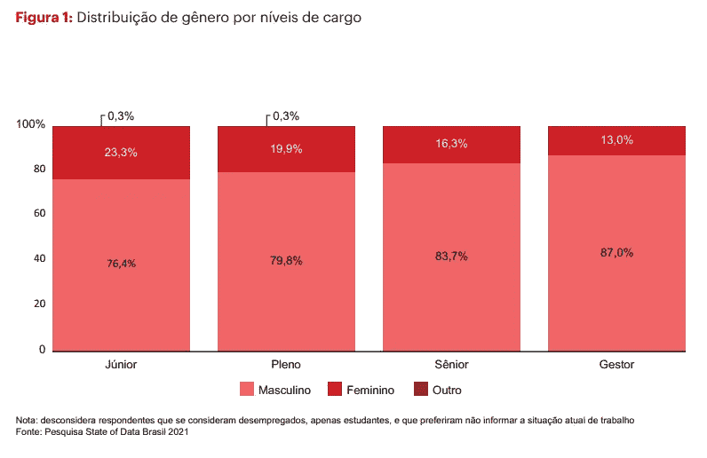

# 2021 年巴西妇女数据状况

> 原文：<https://medium.com/mlearning-ai/talking-about-the-differences-and-difficulties-that-women-face-in-the-job-market-and-in-many-other-e586064d2928?source=collection_archive---------6----------------------->

Source: Unplash

谈论女性在就业市场(以及许多其他领域)面临的差异和困难应该是每天的努力，而不仅仅是在 3 月 8 日。尽管如此，这仍然是一个庆祝妇女多年来取得的社会、政治和经济成就的日子，也是一个总结实现性别平等仍然需要走的漫长道路的日子。

在数据领域远未实现的公平，正如伟大的数据黑客报告[数据状态 2021](https://www.stateofdata.com.br/) 所示。

> 在这份报告中，我们看到了男女之间的工资差距是如何敏感:
> 从高级职位开始，女性的性别工资差距为负数(28.7%的女性每月收入超过 12 万雷亚尔，男性的这一数字为 41.4%)，这种差距也出现在管理职位和专业人员中(48.5%的女性每月收入超过 12 万雷亚尔，而男性专业人员的这一数字增加到 56.8%)。

这种差异发生在整个技术领域，即使采取了轰动的个人资料多样化举措，以女性专属训练营、网络团体、专门从事该主题的非政府组织等形式，其影响仍几乎不可见(2019 年 81 . 8%的受访者被确定为男性)。

Gender distribution by job level — state of data 2021

## 如何改善？

*“我们可以制作一个机器学习模型来优化……”*

女性在就业市场面临的最大挑战是来自几个方面的偏见:20 世纪 60 年代形成的反社会“书呆子”文化，针对男性观众的正式课程，像[书呆子的复仇](https://en.m.wikipedia.org/wiki/Revenge_of_the_Nerds_(film_series))这样的电影，以及通过将“男性”行为视为性别歧视语言的规范排斥女性的工作环境。

这些都是每天必须要说和否定的观点，这样像 Actvision Blizzard 这样的案例就会被公之于众，并逐渐削弱这些公司中存在的“兄弟会”文化。

为了解决技术市场中男女之间的差距，我们还需要扩大这一领域的培训和职业发展机会。像 [Programaria](https://www.programaria.org/) 这样的计划需要作为范例，这样这些机会才会真正出现。

数据市场很热，对工作、有竞争力的专业人士和希望押注于新专业人士的公司的需求很高。这是一个独特的时刻，让我们向世界展示女性在战场上和男性一样优秀。

## 参考

[https://www.programaria.org/especiais/mulheres-tecnologia/](https://www.programaria.org/especiais/mulheres-tecnologia/)

[https://canaltech.com.br/市场/主要-参与-妇女-在-技术-可以成为-现实-180589/](https://canaltech.com.br/mercado/maior-participacao-das-mulheres-na-tecnologia-pode-se-tornar-realidade-180589/)

[https://exame.com/technology/blizzard-巨人-游戏-对抗-丑闻-围攻-围攻-e-acende-辩论/](https://exame.com/tecnologia/blizzard-gigante-de-games-enfrenta-escandalo-por-assedio-e-acende-debate/)

[https://unsplash.com/photos/YK0HPwWDJ1I?utm_source=unsplash & utm_medium=referral & utm_content=creditShareLink](https://unsplash.com/photos/YK0HPwWDJ1I?utm_source=unsplash&utm_medium=referral&utm_content=creditShareLink)

## 在更多地方找到我!

我的链接树(T7)

 [## Mlearning.ai 提交建议

### 如何成为一名作家 on Mlearning.ai

Medium.com](/mlearning-ai/mlearning-ai-submission-suggestions-b51e2b130bfb)