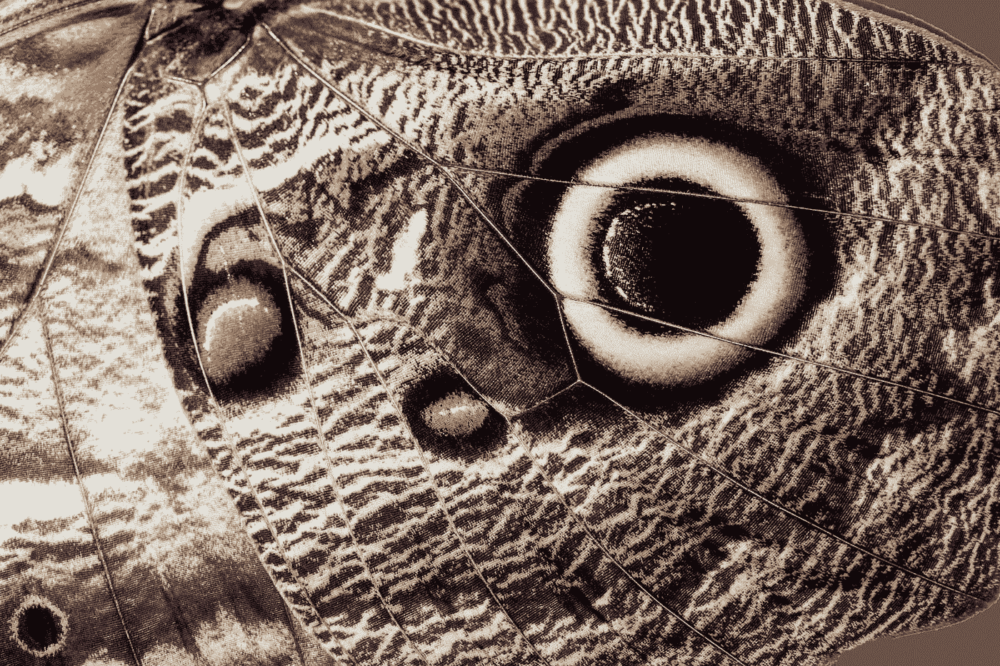

# 教人工智能撒谎

> 原文：<https://medium.com/mlearning-ai/teaching-ai-to-lie-b7f20497788b?source=collection_archive---------6----------------------->

Photo by [David Clode](https://unsplash.com/@davidclode?utm_source=medium&utm_medium=referral) on [Unsplash](https://unsplash.com?utm_source=medium&utm_medium=referral)

语言模型已经度过了童年时期大量吸收学习和未经过滤输出的时期。现在，在他们的青春期，他们被期望吸收和更好地控制他们的交流，以便作为社会的功能成员做出贡献。

AI 该长大了。

然而，在[编写一个程序来只过滤我们想从算法驱动的人工智能数据中听到的](https://www.researchhub.com/paper/1267680/training_language_models_to_follow_instructions_with_human_feedback)输出时…