# 使用 pandas 清理大型数据集的技术。

> 原文：<https://medium.com/mlearning-ai/techniques-in-cleaning-large-datasets-sing-pandas-1e0fb1cb8544?source=collection_archive---------3----------------------->

我们将在本出版物中使用的数据集是 Ames Housing 数据集。可以在这里找到:[https://www . ka ggle . com/c/house-prices-advanced-regression-techniques/data](https://www.kaggle.com/c/house-prices-advanced-regression-techniques/data)。

首先，我们使用这段代码将数据集读入 pandas

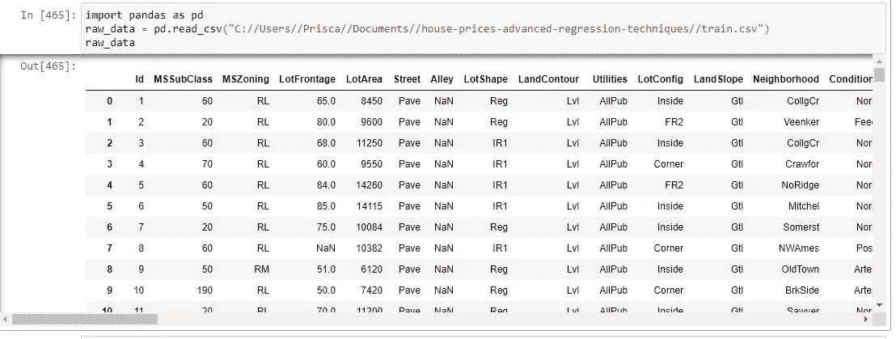

importing the dataset into pandas

为了获得行和列的完整视图，我们将运行代码

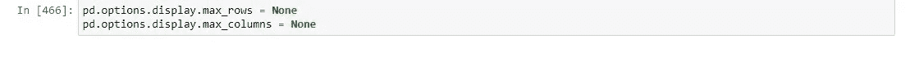

code to ensure the maximum display of the rows and columns

然后我们查看数据集，注意行数、列数及其属性。但是，在此之前，我们保存了 raw_data，以便在更改完成后需要时可以访问它。这将是我们的第一个检查站。

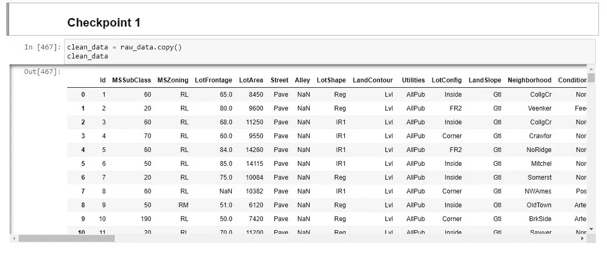

checkpoint 1

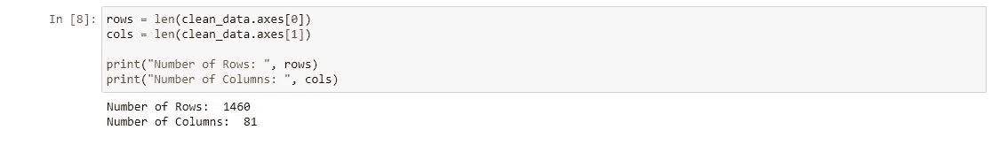

number of rows and columns in the data set

接下来，我们将查看数据集中缺失的数值变量

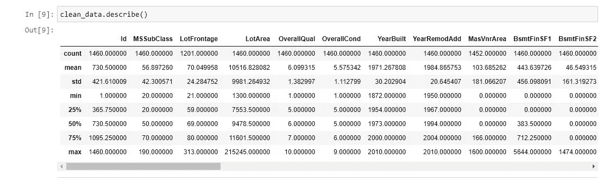

numerical variables and their description

只有两个数值变量具有缺失数据 LotFrontage(包含 1201 行)和 MasVnrArea(包含 8 个缺失行)。因为它们不多，即缺失值的百分比小于 20 %，所以我们将用平均值来代替它们。

请注意，这并不是一直都这样做的，对于数值型的分类变量也不起作用

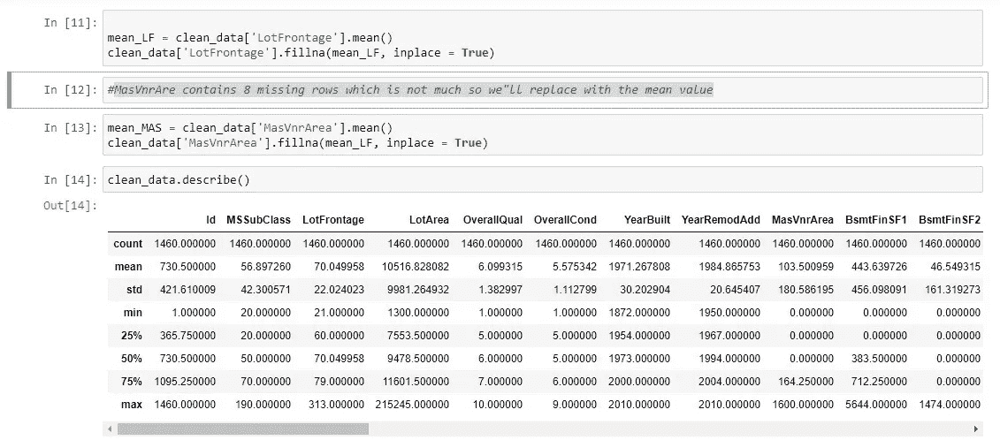

replacing missing values for numerical values

# 处理缺失的分类变量

我们使用。info()来查看缺少的值

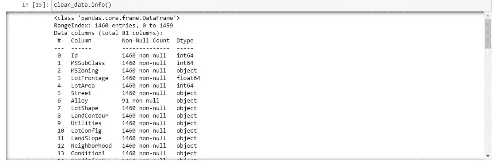

info on categorical variables

MasVnrType

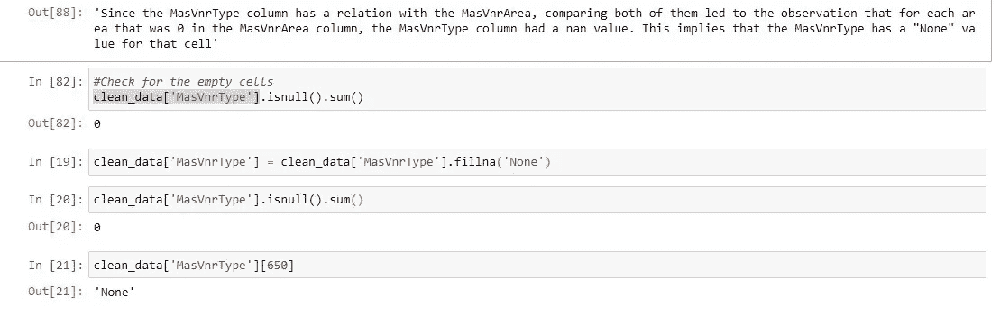

clean the MasVnrType

## 地下室

通过查看数据集，我们注意到 BsmtQual、BsmtCond、BsmtExposure、BsmtFinType1 和 BsmtFinType2 这四列包含缺失值。

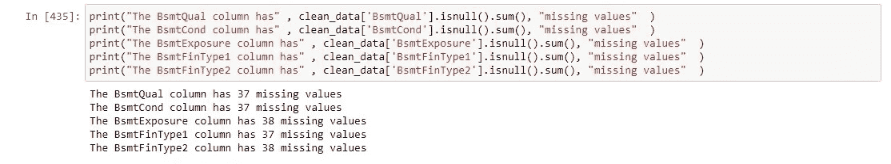

和都依赖于 BsmtQual，所以
对于没有 BsmtQual 的值，相应的 3 列也没有，所以
的 4 列有 37 个相同的缺失值。但是 BsmtExposure 和 BsmtFinType2 有 38 个缺失值，37 个与 BsmtQual 相同的缺失值和一个额外的缺失值，它们分别位于行 948 和 333 中。

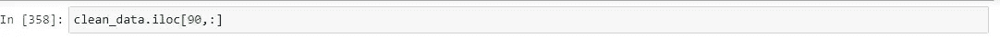

The five corresponding values are related to BsmtQual

所以我们首先填充 BsmtExposure 和 BsmtFinType2 这两列，它们有 38 个缺失值。从数据的描述来看，他们有

bsmt 暴露:指步行或花园水平墙

Gd 良好曝光度
Av 平均曝光度(错层或门厅通常得分为平均或以上)
Mn 最小曝光度
否无曝光度
NA 无地下室

BsmtFinType2:地下室完工面积的评级(如果有多种类型)

GLQ 良好生活区
ALQ 一般生活区
BLQ 低于一般生活区
Rec 一般娱乐室
LwQ 低质量
Unf 未装修
NA 无地下室

作为他们唯一的参赛作品。因此，我们将在 BsmtExpo 中重新填入“No ”,因为它没有风险，而在 BsmtFinType2 中填入“unf”

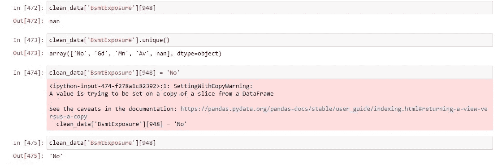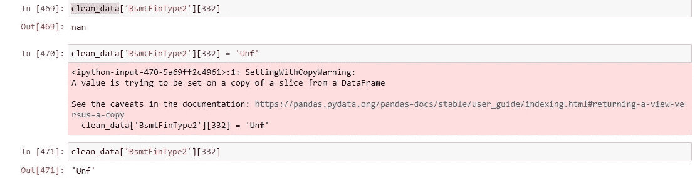

浏览数据集，可以看到基底变量的唯一值由下式给出

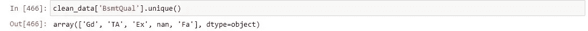

unique values of BsmtQual

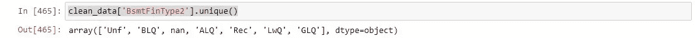

unique values of BsmtFintype2

而根据数据描述，BsmtQual 的唯一值由下式给出

Ex 优秀(100+英寸)
Gd 良好(90–99 英寸)
TA 典型(80–89 英寸)
Fa 一般(70–79 英寸)
Po 较差(< 70 英寸
NA 无地下室

所以这意味着没有地下室的房子被存储为所有五个相同变量的缺失值。我们将用 NA 替换五个相关基底细胞中所有 37 个相同的 nan 条目。

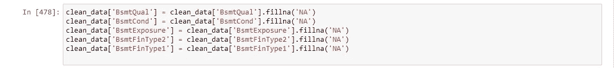

## 与电有关的

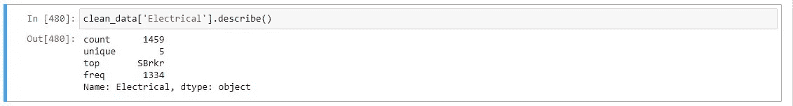

description of the entries in the Electrical column

可以看出，电气列只有一个缺失值，出现频率最高的是 SBrkr，我们将用它来填充缺失值。

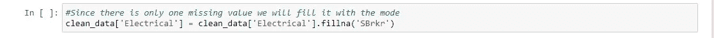

## 壁炉

具有空值的两列是 Fireplaces 和 FireplaceQu

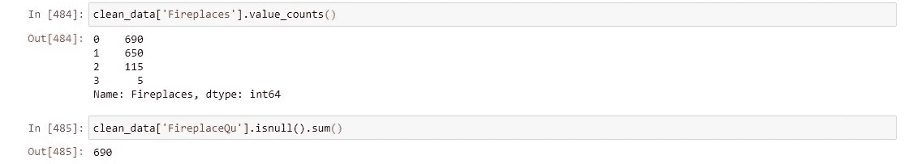

我们可以看到这两列是相关的，每个没有壁炉的条目都具有空壁炉质量。所以我们将用 NA 来填充缺失的值。

## 车库

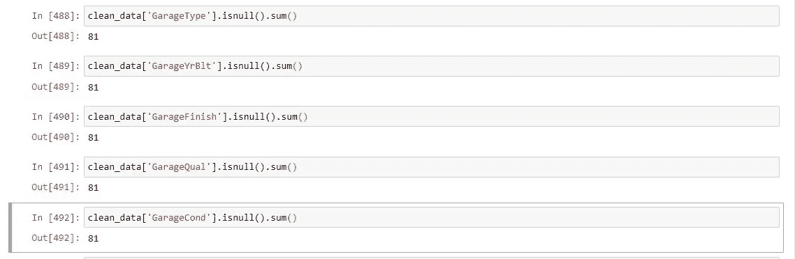

从上图可以看出，没有车库类型的列也有与之相关的四个变量。

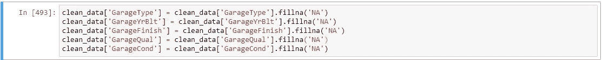

## 泳池

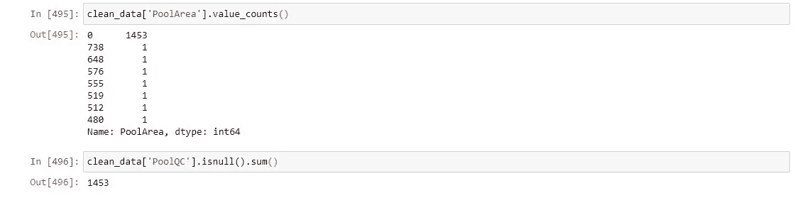

我们可以看到，没有公摊面积的房屋数量对应的是没有给出的 poolqc 的数量。

## 检查站 2

我们将在这里用代码创建第二个检查点

## 小巷，栅栏，恶作剧

剩下三列是空的数据通道、围栏和杂项特征。我们会删除它们，因为它们只包含占数据集不到 20%的值。

我将感谢您的回复和评论。有没有其他无缝且更快的技术？请回复。