# 电信客户流失分析和建模

> 原文：<https://medium.com/mlearning-ai/telco-churn-analysis-and-modeling-a3c5f408bd9b?source=collection_archive---------1----------------------->


Image source [here](https://www.ibm.com/blogs/business-partners/ibm-telco-network-cloud-ecosystem/)

**问题陈述**

在一家电信公司中，有一种促销费用叫做购买成本和保留成本。获取新消费者的成本被称为获取成本。同时，保留现有客户的费用被称为保留成本。

由于人的局限性，我们经常无法准确预测哪些客户会流失，哪些会留下来。因此，货币的分配可能不正确，导致发行的资金量更高。

此外，一些消息来源称，采购成本比保留成本高 5 倍。如果我们预测到一个客户会不正确地流失，但结果是我们预测到一个客户会留下来，我们将不得不花费更多。

## 目标

机器学习有一个目标，让成本分配尽可能精确。

确保您已经在命令行提示符或 anaconda 提示符下安装了 xgboost by- `pip install xgboost`。

```
*#Importing the libraries*
**import** pandas **as** pd 
**import** numpy **as** np 
**import** xgboost **as** xgb 
**from** sklearn.model_selection **import** train_test_split 
**from** sklearn.metrics **import** roc_auc_score, balanced_accuracy_score, make_scorer 
**from** sklearn.model_selection **import** GridSearchCV 
**from** sklearn.metrics **import** confusion_matrix, plot_confusion_matrix 
**import** matplotlib.pyplot **as** plt
**import** seaborn **as** sns 
pd**.**set_option('display.max_columns', 500) 
```

# 1.导入数据集

现在，我们将从[https://community . IBM . com/community/user/business analytics/blogs/Steven-macko/2019/07/11/telco-customer-churn-1113](https://community.ibm.com/community/user/businessanalytics/blogs/steven-macko/2019/07/11/telco-customer-churn-1113)导入数据集

```
*# load the dataset in df and lest look at the first 5 rows of df*
df**=** pd**.**read_excel('Telco_customer_churn.xlsx')
df**.**head()
```

我们导入数据并存储在测向数据帧中。

# 行动纲要

elco Co .提供了 7043 名客户的精选历史数据，包括每个客户是否都曾倒戈的指标。在分析和转换数据后，我们优化了几个分类模型。每个模型在 75%的历史数据上被训练，然后被要求在剩余的 25%的测试数据上预测流失分数。每个模型都与以前的最佳模型进行了比较，其中 XG Boost 模型表现最佳

```
*# Lets look at the shape of dataset*
df**.**shape*# Lets describe the dataset*
df**.**describe()
```

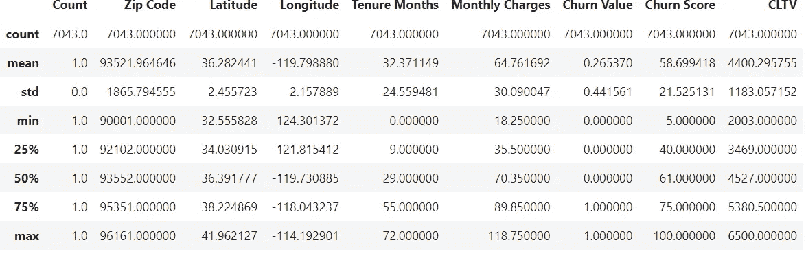

Data Summary

```
*# Lets look at the data type of each columns in dataset*
df**.**info()
```


Data information

因此，Df 数据集包含 7043 行，33 列

# 2.数据预处理

人们已经离开了电信公司，所以我们将从数据集中删除这些列。

```
*# Removing these columns so, we did axis=1, and inplace= True, means not making the copy of dataset*
df**.**drop(['Churn Reason','CLTV','Churn Score','Churn Label'], axis**=**1, inplace**=** **True**)
df**.**head()
```

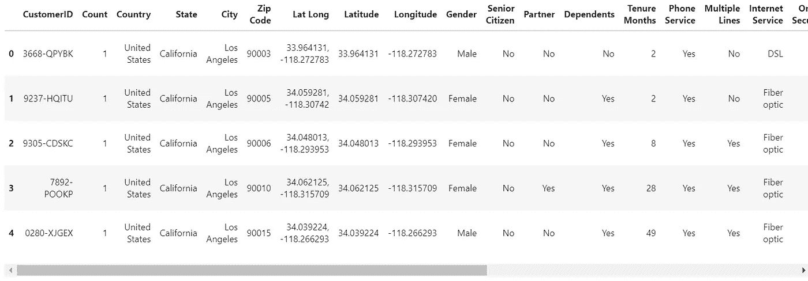

After Removing garbage columns

某些列仅包含单个值，从上面的数据框中可以看出，一些列有一个唯一值，即列[Count，Country，State]。此外，我不会使用 customerID 列，因为 CustomerID 不确定某人是否会流失的概率。

> 邮政编码，纬度，经度也将被删除。我不会用它来构建机器学习。

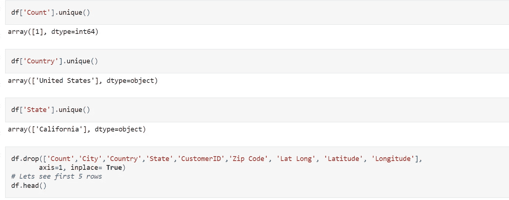

```
df**.**drop(['Count','City','Country','State','CustomerID','Zip Code', 'Lat Long', 'Latitude', 'Longitude'],
       axis**=**1, inplace**=** **True**)
*# Lets see first 5 rows* 
df**.**head()
```

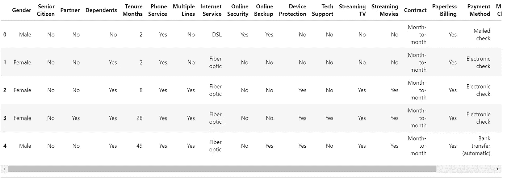

```
*# Replacing the space from column name* 
df**.**columns**=** df**.**columns**.**str**.**replace(' ','_') *#replacing space with undescore*
df**.**columns*# Now replacing white spaces with underscore*
df**.**replace(' ', '_', regex**=True**, inplace **=True**)
df**.**head()
```

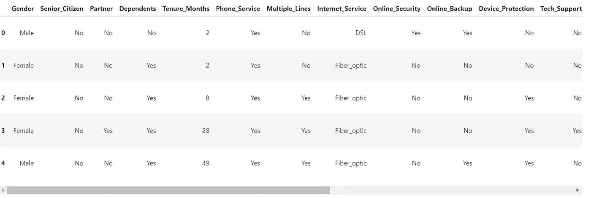

**检查缺失值**

```
*# checking missing values* 
df**.**isnull()**.**sum()
```

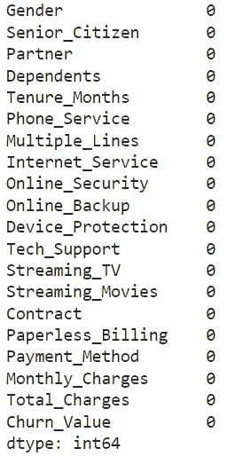

Missing values

我们没有发现任何丢失的值

**浏览数据帧中的列:**

```
*# Lets look at the column of df['Total_Charges']*
df[df['Total_Charges']**==**"_"]
```

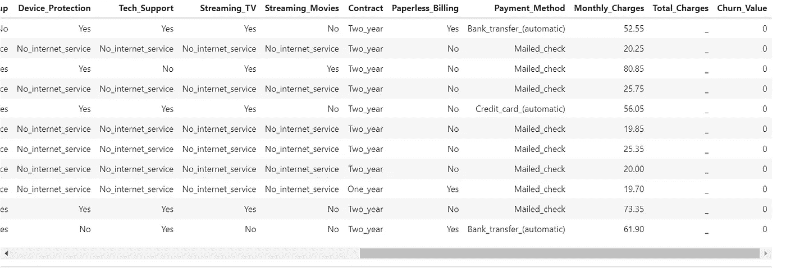

```
*# replacing the colum Total_Charges with zero*
df['Total_Charges']**=** np**.**where(df['Total_Charges']**==**"_",0,df['Total_Charges'])
```

**更改 Total_Charges 列的数据类型**

```
*# lets change the datatype of column Total_Charges to numeric*
df['Total_Charges']**=** pd**.**to_numeric(df['Total_Charges'])
df['Total_Charges']**.**dtype
```

# 3.电子设计自动化(Electronic Design Automation)

探索性数据分析是使用统计和可视化工具(EDA)对数据进行初步检查，以发现数据中测量值之间的联系，并深入了解数据集中包含的不同实体之间的趋势、模式和交互作用。

# 3.1 单变量分析:

因为 uni 表示一，variate 表示变量，所以在单变量分析中只有一个可靠变量。单变量分析的目标是导出数据，描述和总结数据，并检查可能存在的任何模式。它分别调查数据集中的每个变量。有两种类型的变量可以使用:分类变量和数字变量。

集中趋势(平均值、众数和中位数)、离差(范围、方差)、四分位数(四分位数间范围)和标准差是使用单变量分析可以容易发现的一些模式。

```
df['Churn_Value']**.**value_counts()
```

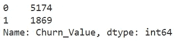

**让我们想象一下目标变量**

```
plt**.**figure(figsize**=**(10,5))
plt**.**pie(df['Churn_Value']**.**value_counts(), labels**=**df['Churn_Value']**.**unique(), autopct**=**'%.2f%%')
plt**.**show()
```

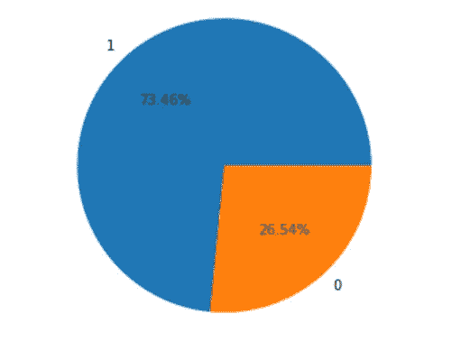

Pie chart: Target Variable

通过查看 df['Churn_Value']列，我们得出数据不平衡的结论，我们必须在建立机器学习模型之前处理不平衡的数据

```
plt**.**figure(figsize**=**(5,5))
sns**.**countplot(df**.**Gender)
plt**.**title('Male counts Vs female count ')
```

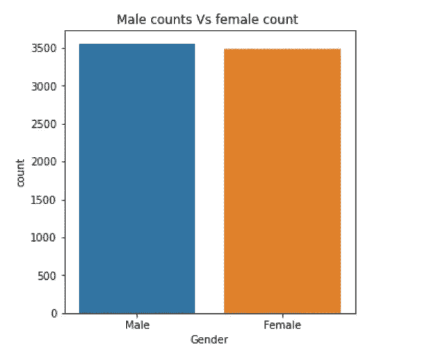

```
sns**.**histplot(df**.**Monthly_Charges)
plt**.**title('Histogram of Monthly_Charges')
```

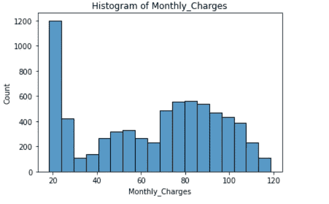

```
plt**.**figure(figsize**=**(5,5))
sns**.**countplot(df**.**Senior_Citizen)
plt**.**title('Bar plot of Senior_Citizen ')
```

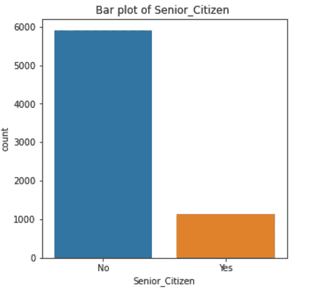

# 3.2 双变量分析

这里有两个变量，bi 表示两个，variate 表示变量。这项研究的重点是问题的根源以及这两个变量之间的关系。双变量分析分为三种类型。

*   **两个数值变量的二元分析**(数值-数值)我们做**散点图**，**相关。**
*   **一个数值和一个分类变量的双变量分析**(数值-分类)，我们做 **ANOVA**
*   **双变量分析两个分类变量**(分类-分类)，我们做 **Chi2 检验。**

```
*# column Senior_Citizen*
df['Senior_Citizen']**.**value_counts()
```

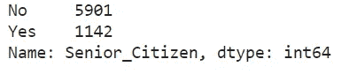

```
plt**.**figure(figsize**=**(8,6))
sns**.**catplot(x**=**'Gender', hue**=**'Churn_Value', col**=**'Senior_Citizen', kind**=**'count', data**=**df)
```

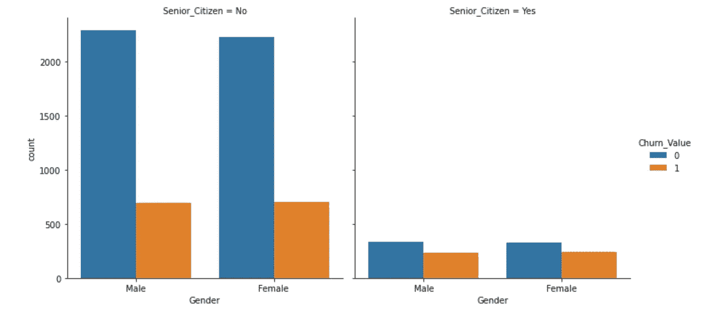

从上面的形象化数据中，我们可以看到，老年公民(男性和女性)的流失率和保留率几乎相同。同样，非老年人的流失率和保留率。但如果我们观察一下，与非老年人相比，老年人的流失率有所增加。

```
by_gender_senior **=** df**.**groupby(['Senior_Citizen', 'Gender'])['Churn_Value']**.**value_counts(normalize**=True**)**.**to_frame()**.**rename(columns**=**{'Churn_Value': 'Ratio'})**.**reset_index()**.**sort_values('Senior_Citizen')
by_gender_senior
```

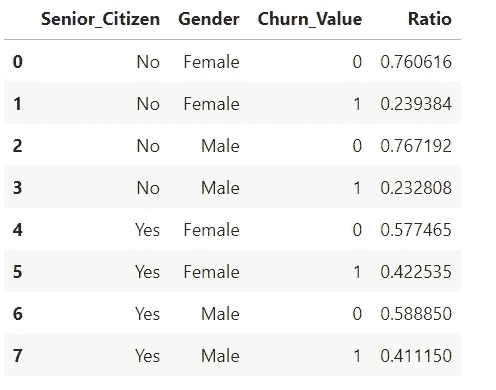

```
sns**.**catplot(x**=** 'Gender', hue**=** 'Churn_Value',col**=**'Partner', kind**=** 'count', data**=** df)
```

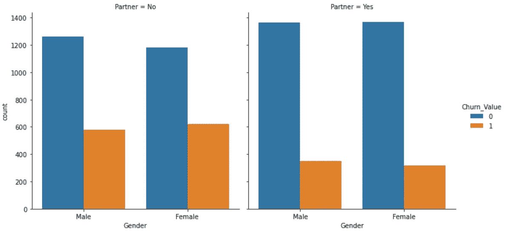

从上面的形象化来看，没有伴侣的男性和女性都更有可能流失。

```
sns**.**catplot(x**=**'Payment_Method', hue**=**'Churn_Value', kind**=**'count', data**=**df)
plt**.**xticks(rotation**=**45)
plt**.**show()
```

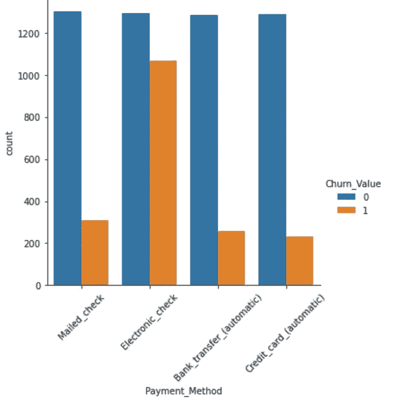

```
pd**.**crosstab(df['Payment_Method'], df['Churn_Value'], normalize**=**0)
```

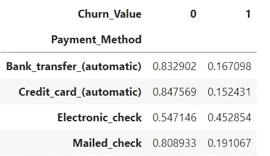

```
plt**.**figure(figsize**=**(16,5))
plt**.**subplot(1,2,1)
plt**.**title('Monthly Charge distribution')
sns**.**distplot(df[df['Churn_Value'] **==** 1]['Monthly_Charges'], label**=**'Churn')
plt**.**subplot(1,2,2)
plt**.**title('Monthly Charge distribution Split by Gender')
sns**.**distplot(df[(df['Churn_Value'] **==** 1) **&** (df['Gender'] **==** 'Male')]['Monthly_Charges'], label**=**'Male')
sns**.**distplot(df[(df['Churn_Value'] **==** 1) **&** (df['Gender'] **==** 'Female')]['Monthly_Charges'], label**=**'Female')
plt**.**legend()
plt**.**show()
```

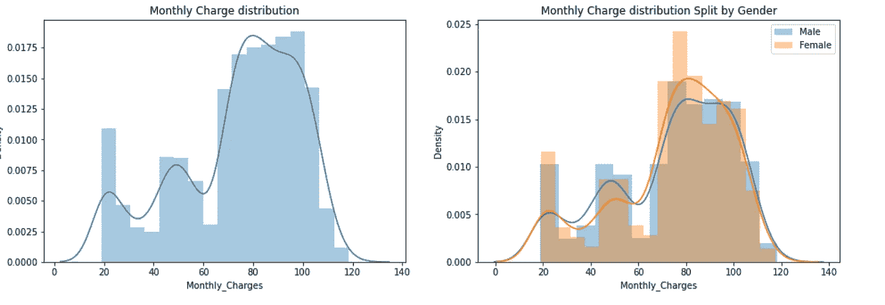

# **4。创建独立和相关数据集**

```
*# Creating independent and depedent variable* 
X**=** df**.**iloc[:,:**-**1] *#Independent variable* 
y**=** df['Churn_Value'] *## Dependent variable*
X**.**head()
```

# 5.特征工程

*   对于名义上的数据:我们不能对数据进行排序，例如邮政编码
*   我们对序数数据做:我们可以给出一个等级，比如年级，教育状况

我们在这里做 **One_hot_encoding** 因为机器学习算法只理解数字数据，我们有一些预测器是分类类型的数据，我们将使用`get_dummies()`

```
X_encoded**=** pd**.**get_dummies(X,columns**=**['Gender','Senior_Citizen','Partner','Dependents','Phone_Service',
                                    'Multiple_Lines','Internet_Service','Online_Security','Online_Backup',
                                    'Device_Protection','Tech_Support','Streaming_TV','Contract','Paperless_Billing',
                                    'Payment_Method','Streaming_Movies'])# Creating copy and stored in X variablesX**=**X_encoded**.**copy()
X**.**shape
```

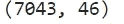

# 6.构建 XGBoost 模型

## XGBoost 的优势

我一直很喜欢这项技术提供的预测模型增强功能。当我观察它的性能和高精度背后的物理原理时，我发现了几个好处:

## 正规化:

*   标准 GBM 实现没有 XGBoost 那样的正则化，因此它也有助于减少过度拟合。
*   XGBoost 也被称为“正则化增强”技术。

我们将把数据分成训练集和测试集，但在分割之前，让我们看看有多少人离开了公司，我们只需将所有的 **y=1** 值相加，然后除以数据的总长度。

```
sum(y)**/**len(y)
```


***所以，看到只有 27%的人离开了公司，所以得出的结论是数据集非常不平衡***

```
*# Spliting the data*
X_train,X_test,y_train,y_test**=** train_test_split(X,y,random_state**=**42,stratify**=**y)
```

现在让我们验证一下`stratify`是否如预期的那样工作。

```
sum(y_train)**/**len(y_train)
```


```
sum(y_test)**/**len(y_test)
```


*验证* `*stratify*` *按预期工作，y_train 和 y_test 具有相同的百分比*

**构建 XGBoost 模型**

```
*# Lets build the Xgboost model without cross validation*
clf_xgb**=** xgb**.**XGBClassifier(objective**=**'binary:logistic',max_depth**=**5,learning_rate**=** 0.1,
                           colsample_bytree **=** 0.5,
                           subsample**=**0.90, reg_lambda**=** 10,use_label_encoder**=False**)
```

**拟合模型**

*   这里 early_stopping_rounds=10:表示如果在构建 10 棵以上的树之后预测没有改善
*   如果 10 个构建的树中没有一个不改进预测，那么它将停止。

```
clf_xgb**.**fit(X_train,y_train,early_stopping_rounds**=**10,eval_metric**=**'aucpr',eval_set**=**[(X_test,y_test)])
```

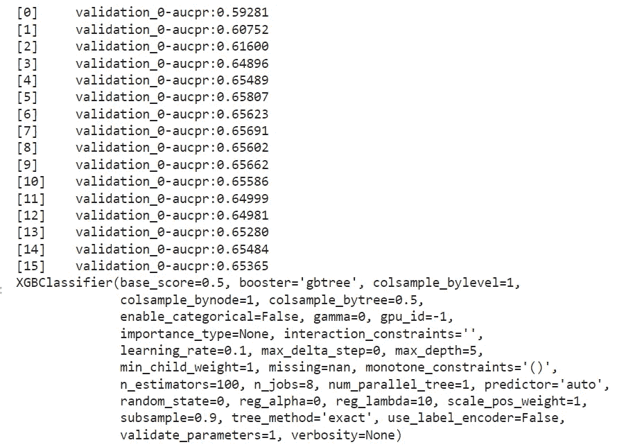

**预测模型:**

这里我们将在 X_test 数据上预测模型。

```
y_pred**=** clf_xgb**.**predict(X_test)
```

**混乱矩阵**

这是一个机器学习分类问题的性能指标，有两个或更多的类作为输出。此表中有四种预测值和实际值的不同组合。

它对测量召回率、精确度、特异性、准确性以及最重要的 AUC-ROC 曲线非常有用。

```
*# ploting the confusion matrics*
plot_confusion_matrix(clf_xgb,X_test,y_test,values_format**=**'d',display_labels**=**['did not left','left'])
```

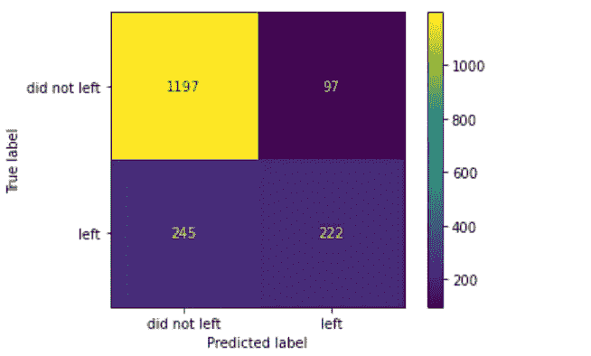

没有离开公司的人(91%)被正确分类。但不是模型在离开公司的人面前表现不好，只有 48%的人正确分类。XGBoost 有一个参数`scale_pos_weight`，可以帮助处理不平衡的数据。我们试图通过交叉验证来提高准确性。

现在我们将评估该模型，因为该数据集完全不平衡，所以我们将通过`roc_auc_score`获得准确性。

```
print('The accuracy of the model is:',roc_auc_score(y_test,y_pred))
**from** sklearn.metrics **import** classification_report
print(classification_report(y_test,y_pred))
```

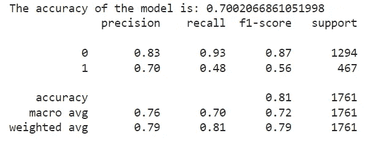

# 7.XGBoost 参数

**最大深度[默认值=6]**

*   树的最大深度，与 GBM 相同。
*   用于控制过度拟合，因为较高的深度将允许模型学习特定样本的特定关系。
*   应使用 CV 进行调整。
*   典型值:3–10

**最大叶节点数**

*   树中的最大终端节点或叶子数。
*   可以代替 max_depth 进行定义。由于二叉树被创建，深度“n”将产生最大的 2^n 叶。
*   如果这样定义，GBM 将忽略 max_depth。

## 伽玛[默认值=0]

*   只有当产生的分裂给出损失函数的正减少时，节点才被分裂。Gamma 指定进行分割所需的最小损失减少量。
*   使算法保守。这些值可能因损失函数而异，应该进行调整。

## max _ delta _ step[默认值=0]

*   在最大增量步骤中，我们允许每棵树的重量估计为。如果该值设置为 0，则表示没有约束。如果将其设置为正值，则有助于使更新步骤更加保守。
*   通常，这个参数是不需要的，但是当类极度不平衡时，它可能有助于逻辑回归。
*   这通常不被使用，但是如果你愿意，你可以进一步探索。

## 子样本[默认值=1]

*   同 GBM 子样本。表示每棵树的随机样本的观察分数。
*   较低的值使算法更加保守，并防止过度拟合，但太小的值可能会导致拟合不足。
*   典型值:0.5–1

## col sample _ bytree[默认值=1]

*   类似于 GBM 中的 max_features。表示作为每个树的随机样本的列的比例。
*   典型值:0.5–1

## col sample _ by level[默认值=1]

*   表示每个级别中每个拆分的列的子抽样比率。
*   我不经常使用它，因为 subsample 和 colsample_bytree 会为您完成这项工作。但是如果你觉得可以进一步探索。

## λ[默认值=1]

*   关于权重的 L2 正则化项(类似于岭回归)
*   这用于处理 XGBoost 的正则化部分。虽然许多数据科学家不经常使用它，但应该探索它以减少过度拟合。

## alpha[默认值=0]

*   权重上的 L1 正则化项(类似于套索回归)
*   可以在非常高的维数的情况下使用，使得算法在实现时运行得更快

## scale _ pos _ weight[默认值=1]

*   在高等级不平衡的情况下，应该使用大于 0 的值，因为它有助于更快地收敛。

# 7.1 网格搜索简历

网格搜索计算所有指定超参数及其值的每个组合的性能，然后为超参数选择最佳值。基于所涉及的超参数的数量，这使得处理耗时且成本高。

它需要四个参数:估计量、参数网格、cv 和得分。以下是参数列表:

1.  estimator–使用 Scikit-learn 构建的模型

2.参数网格-包含参数值列表和参数名称作为关键字的字典。

3.评分——评估绩效的标准。例如，对于回归模型，使用“r2”，而对于分类模型，使用“precision”。

4.cv-K-fold 交叉验证的折叠数是一个整数。

```
param_grid**=**{'max_depth':[3,4,5],
            'gamma':[0,0.25,1.0],
            'learning_rate':[0.1,0.5,1.0],
            'reg_lambda':[1,10,20],
            'scale_pos_weight':[1,3,5],

}
```

**寻找最佳参数**

```
optimal_param**=** GridSearchCV(estimator**=**xgb**.**XGBClassifier(objective**=**'binary:logistic',seed**=**42,
                                                        subsample**=**0.9,colsample_bytree**=**0.5,use_label_encoder**=False**),
                            param_grid**=**param_grid,
                            scoring**=**'roc_auc',
                            verbose**=**2, 
                            cv**=**3)
```

**拟合网格搜索**

*   找到最佳参数需要一些时间，对我来说，大约需要 10 分钟。

```
*# fitting the gridsearch*
optimal_param**.**fit(X_train,y_train,early_stopping_rounds**=**10,eval_metric**=**'auc',eval_set**=**[(X_test,y_test)],verbose**=False**)
```

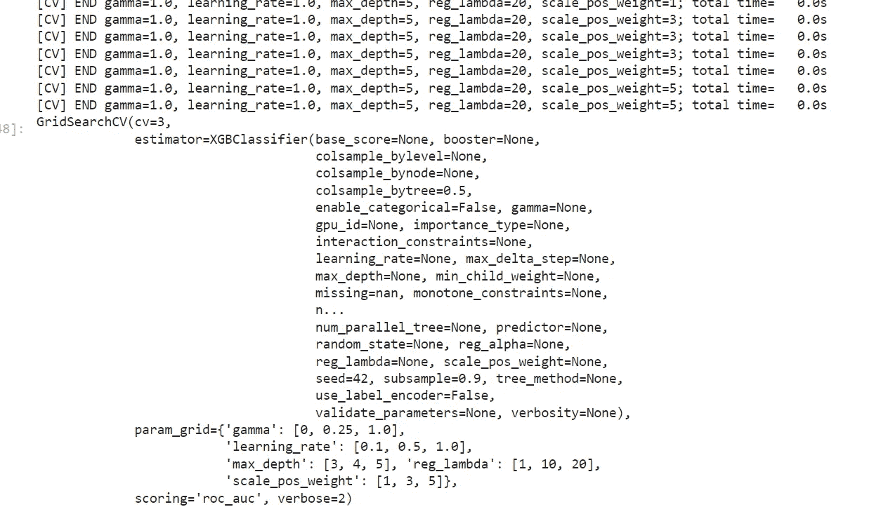

**寻找最佳参数**

```
*# Printing the best parameter*
print(optimal_param**.**best_params_)
```

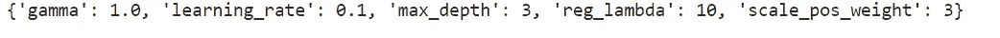

Best parameters

# 建立模型，评估模型

```
*# After getting the best parameter, now we will biuld the final classifier model*
clf_classifier**=** xgb**.**XGBClassifier(objective**=**'binary:logistic',
                                  gamma**=**1.0,
                                  learning_rate**=**0.1,
                                  max_depth**=**3,
                                  reg_lambda**=**10,
                                  scale_pos_weight**=**3,
                                  subsample**=**0.9, 
                                  colsample_bytree**=**0.50,
                                  use_label_encoder**=False**)
```

**拟合模型**

```
*# fitting the model*
clf_classifier**.**fit(X_train,y_train,early_stopping_rounds**=**10,eval_metric**=**'aucpr',eval_set**=**[(X_test,y_test)]
```

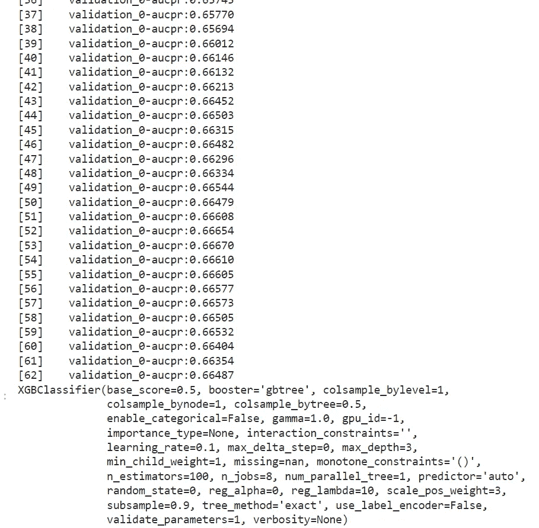

**预测最终模型**

```
*# Predicting the model*
y_pred**=** clf_classifier**.**predict(X_test)
```

**绘制最终模型的混淆度量**

```
*# Plotting the confusion matrics*
plot_confusion_matrix(clf_classifier,X_test,y_test,values_format**=**'d',display_labels**=**['did not leave','left'])
```

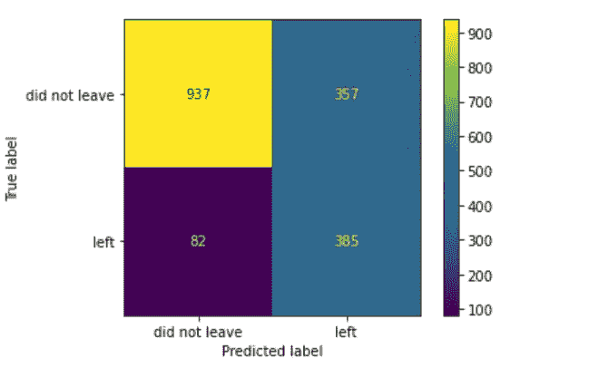

我们看到总人数 **1294** 和未离职人员 **937** (72%)被正确分类。出 **467** 和出 **385** (83%)正确分类。

**评估最终模型**

```
*# Priting the accuracy and the model and lassification report*
print('The accuracy of the model:',roc_auc_score(y_test,y_pred))
```

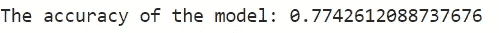

```
print(classification_report(y_test,y_pred))
```

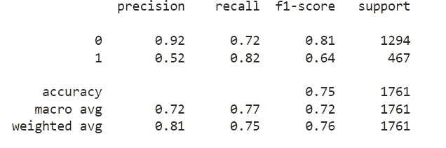

```
**from** sklearn.metrics **import** plot_precision_recall_curve
plot_precision_recall_curve(clf_classifier,X_test,y_test)
```

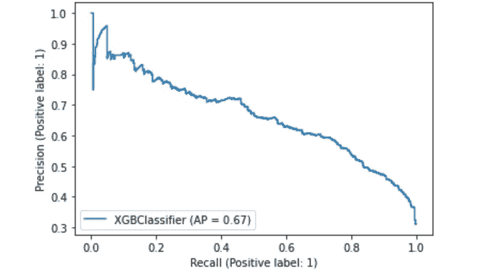

**我们提高了正确分类，离职率从 52 %提高到 82%**

# 8.模型解释

目标变量:流失值

*   合同期限(强):逐月合同的变动远远超过一年或两年的合同。
*   互联网服务(中等):互联网光纤或 DSL 服务比其他服务发展更快。
*   家属(适度):支持家属(孩子/老人)的顾客不太愿意购买。
*   (低)无纸计费:选择无纸计费的客户流失率更高。
*   (低)流:指示消费者是否正在利用互联网服务来传输电视或电影。
*   (低)自动支付:设置了自动支付的客户不太可能流失。
*   (低)合作伙伴:已婚客户的离职率较低。
*   顾客的月费是根据平均顾客指数计算的。

# 结论

*   该模型的 AUC 为 78 %,这意味着它在大约五分之四的客户场景中是正确的。
*   召回表明，该模型正确预测了 83%的客户流失案例。
*   该模型预测的假阳性率接近 1/2，准确率为 54%。

参考资料:

[](https://www.analyticsvidhya.com/blog/2016/03/complete-guide-parameter-tuning-xgboost-with-codes-python/) [## XGBoost 参数| XGBoost 参数调整

### XGBoost 是一个强大的机器学习算法，特别是在速度和准确性方面，我们需要考虑…

www.analyticsvidhya.com](https://www.analyticsvidhya.com/blog/2016/03/complete-guide-parameter-tuning-xgboost-with-codes-python/) 

在 LinkedIn 上关注我

[](https://www.linkedin.com/in/rahulsisodia06/) [## Rahul Sisodia -常春藤专业学校-新德里，德里，印度| LinkedIn

### 拉胡尔非常热衷于数据科学和机器学习，他喜欢他所做的事情，并且总是…

www.linkedin.com](https://www.linkedin.com/in/rahulsisodia06/) 

GitHub:

[](https://github.com/rahkum96) [## rahkum96 -概述

### AI 和 ML 认证数据科学家。rahkum96 有 34 个可用的存储库。在 GitHub 上关注他们的代码。

github.com](https://github.com/rahkum96) [](/mlearning-ai/mlearning-ai-submission-suggestions-b51e2b130bfb) [## Mlearning.ai 提交建议

### 如何成为 Mlearning.ai 上的作家

medium.com](/mlearning-ai/mlearning-ai-submission-suggestions-b51e2b130bfb)