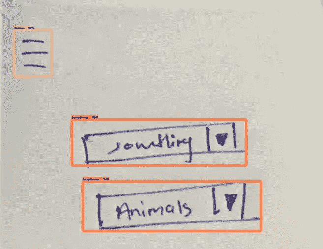
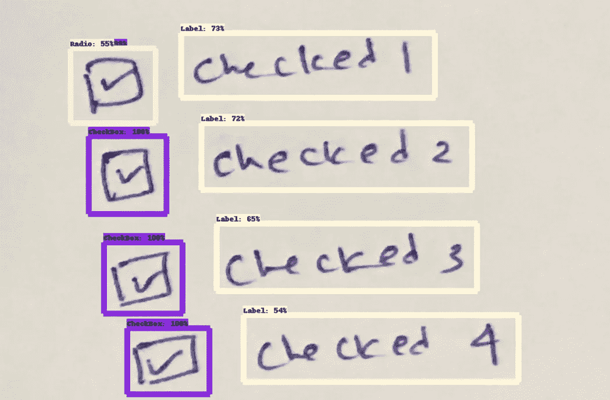
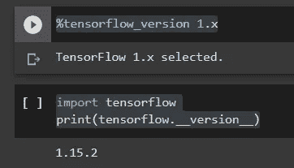
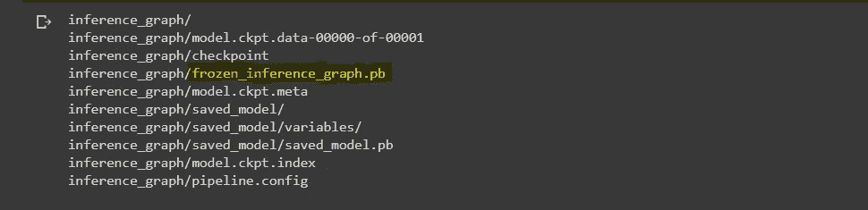
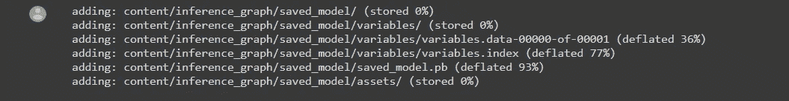

# 带 TF1 和 TF2 的 TensorFlow 对象检测 API

> 原文：<https://medium.com/mlearning-ai/tensoflow-object-detection-api-with-tf1-vs-tf2-9d716be1f5d9?source=collection_archive---------0----------------------->


Photo by [Kevin Ku](https://unsplash.com/@ikukevk?utm_source=medium&utm_medium=referral) on [Unsplash](https://unsplash.com?utm_source=medium&utm_medium=referral)

我使用 TensorFlow 对象检测 API 已经有一段时间了，在创建自定义对象检测器时，我在 TF1 和 TF2 版本中都发现了一些有趣的技术。如果你是一个新手，我强烈推荐你试试 TensorFlow 提供的这个笔记本，它为你提供了一个关于在 Google Colab 上构建和训练自定义对象检测器的全面指导。

这是我开发的自定义对象检测器的一些快照，用来识别手绘线框中的 UI 组件。



UI Component Detector



UI Component Detector

Tensorflow 对象检测 API 为 TF2 和 TF1 都提供了包，因此任何人都可以使用其中的任何一个进行实验。如果你已经完成了数据集，你可以使用 TensorFlow 提供的[笔记本](https://colab.research.google.com/drive/1MdzgmdYJk947sXyls45V7auMPttHelBZ?usp=sharing)直接开始构建模型。

现在，让我们比较一下为什么我们需要选择 TF1 或 TF2 来构建或训练我们的数据集。

1.  默认 Google Colab TensorFlow 版本

Google Colab 默认支持 TensorFlow 2，因此如果您想在 TF1 中构建和训练您的模型，您必须首先设置环境。

```
%tensorflow_version 1.ximport tensorflow
print(tensorflow.__version__)
```



Selecting TF1 in Colab

一旦选择了环境，请确保安装了与您的环境相关的正确软件包。

```
!git clone https://github.com/tensorflow/models.git%cd /content/models/research/
!protoc object_detection/protos/*.proto --python_out=.# Install TensorFlow Object Detection API for TF1.!cp object_detection/packages/**tf1**/setup.py .
!python -m pip install .
```

2.选择预训练模型

TensorFlow 从他们的模型动物园为 [TF1](https://github.com/tensorflow/models/blob/master/research/object_detection/g3doc/tf1_detection_zoo.md) 和 [TF2](https://github.com/tensorflow/models/blob/master/research/object_detection/g3doc/tf2_detection_zoo.md) 提供预训练的检测模型。他们在 [TF1 配置](https://github.com/tensorflow/models/tree/master/research/object_detection/samples/configs)和 [TF2 配置](https://github.com/tensorflow/models/tree/master/research/object_detection/configs/tf2)中为这些模型提供了配置文件，以便您可以从头开始训练模型。为两种环境制作的预训练模型的数量并不相同。你只能在不支持 TF1 的 TF2 找到一些更快的型号，如 [EfficientDet D0 512x512](http://download.tensorflow.org/models/object_detection/tf2/20200711/efficientdet_d0_coco17_tpu-32.tar.gz) 。因此，你必须从 TF2 建立模型来训练，并从特定的模型中获得预测。在特定环境中训练模型之前，对两组预训练模型进行比较，并根据需要选择最佳模型。

下载 TF1 预训练检测模型

```
%cd /content!wget [**http://download.tensorflow.org/models/object_detection/faster_rcnn_resnet101_coco_2018_01_28.tar.gz**](http://download.tensorflow.org/models/object_detection/faster_rcnn_resnet101_coco_2018_01_28.tar.gz)
!tar -xvf faster_rcnn_resnet101_coco_2018_01_28.tar.gz
!rm faster_rcnn_resnet101_coco_2018_01_28.tar.gz!wget [**https://raw.githubusercontent.com/tensorflow/models/master/research/object_detection/samples/configs/faster_rcnn_resnet101_coco.config**](https://raw.githubusercontent.com/tensorflow/models/master/research/object_detection/samples/configs/faster_rcnn_resnet101_coco.config)
!mv faster_rcnn_resnet101_coco.config faster_rcnn_resnet101.config
```

下载 TF2 预训练检测模型

```
%cd /content!wget [**http://download.tensorflow.org/models/object_detection/tf2/20200711/efficientdet_d0_coco17_tpu-32.tar.gz**](http://download.tensorflow.org/models/object_detection/tf2/20200711/efficientdet_d0_coco17_tpu-32.tar.gz)
!tar -xvf efficientdet_d0_coco17_tpu-32.tar.gz
!rm efficientdet_d0_coco17_tpu-32.tar.gz!wget [**https://raw.githubusercontent.com/tensorflow/models/master/research/object_detection/configs/tf2/ssd_efficientdet_d0_512x512_coco17_tpu-8.config**](https://raw.githubusercontent.com/tensorflow/models/master/research/object_detection/configs/tf2/ssd_efficientdet_d0_512x512_coco17_tpu-8.config)
!mv ssd_efficientdet_d0_512x512_coco17_tpu-8.config efficientdet_d0_coco17_tpu-32.config
```

微调配置文件后，您可以训练模型。确保为给定环境的培训 python 脚本提供正确的路径

培训路径 TF1

```
!python **/content/models/research/object_detection/model_main.py** --pipeline_config_path={pipeline_config_path} --model_dir=training --alsologtostderr
```

TF2 培训路径

```
!python **/content/models/research/object_detection/model_main_tf2.py** --pipeline_config_path={pipeline_config_path} --model_dir=training --alsologtostderr
```

3.导出推理图

这是您在为项目选择最佳环境时必须考虑的要点之一。当您将训练好的模型导出到推理图时，可以导出到保存的模型或冻结的推理图。冻结的模型不能再次用于训练。检查此[链接](https://stackoverflow.com/questions/52934795/what-is-difference-frozen-inference-graph-pb-and-saved-model-pb)以清楚了解冻结图形。问题是……在 TF2，不允许直接导出冻结的推理图。

在 TF1 中，您可以使用以下命令来导出冻结的图形

```
output_dir="inference_graph"!python /content/models/research/object_detection/export_inference_graph.py \
--input_type=image_tensor \
--pipeline_config_path={pipeline_config_path} \
--output_directory={output_dir} \
--trained_checkpoint_prefix={last_model_path}
```



Exported Frozen Graph

*export _ inference _ graph . py*脚本**只支持 TF1 中的包！**

在 TF2，您可以使用以下命令导出推理图

```
output_directory = 'inference_graph'!python /content/models/research/object_detection/exporter_main_v2.py \
--trained_checkpoint_dir {model_dir} \
--output_directory {output_directory} \
--pipeline_config_path {pipeline_config_path}
```



Export Inference Graph

因此，如果你想在训练结束时得到一个冻结的图表，最好选择 TF1 而不是 TF2。但是如果你选择了一个只支持 TF2 的预训练模型，并且如果你想要一个冻结的图形，你可能需要做一些工作。这里有一个在 TF2 导出冻结图形的好办法。

TensorFlow 对象检测 API 是构建自定义对象检测器的强大工具。然而，当根据不同的需求创建模型时，会有一些缺点。如果你被困在某个地方，希望这有所帮助…:)