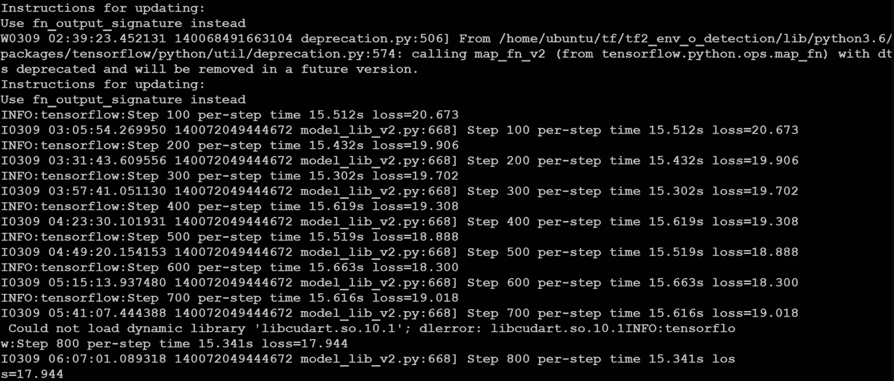
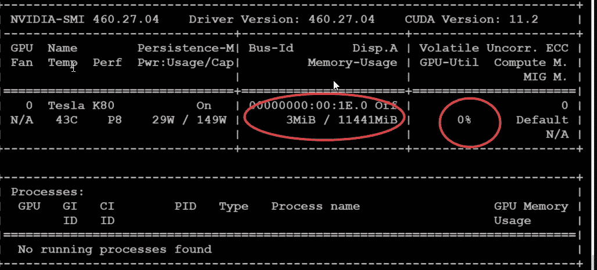
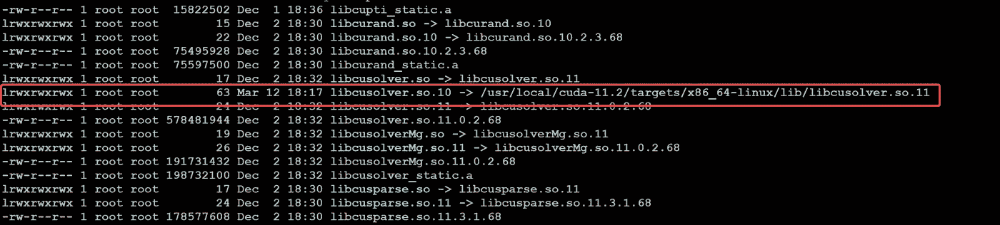
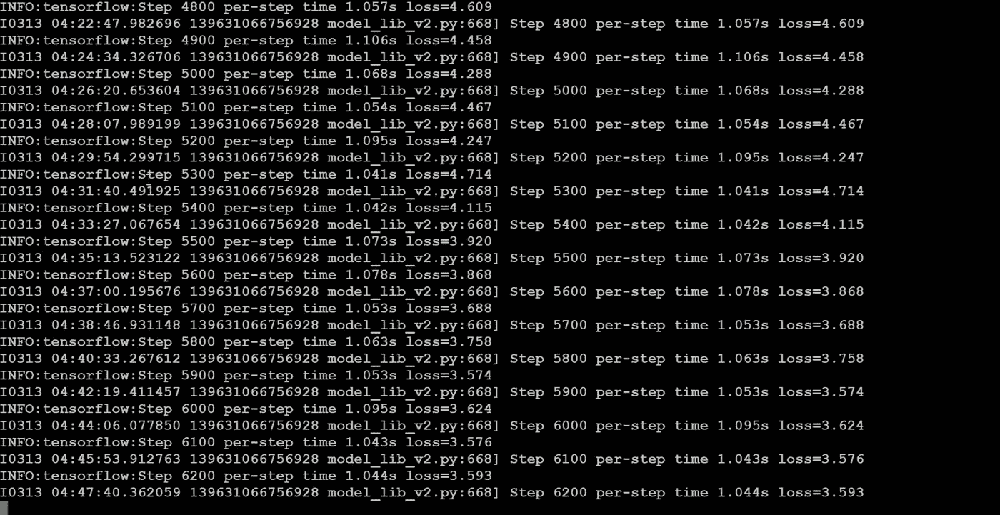
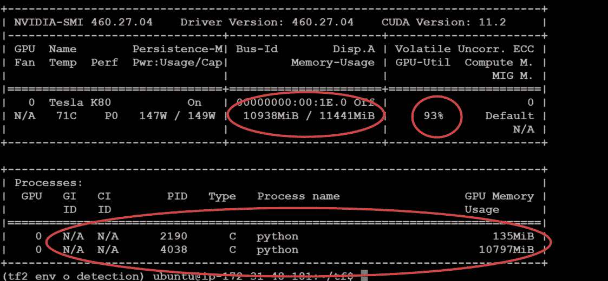

# 带 CUDA 11.2 的 tensor flow 2.4-GPU 培训修复

> 原文：<https://medium.com/mlearning-ai/tensorflow-2-4-with-cuda-11-2-gpu-training-fix-87f205215419?source=collection_archive---------0----------------------->

*Tensorflow 2.4.0 培训失败，出现错误“找不到 libcusolver.so.10 not】*

**简介:**在这篇文章中，我将分享我的经验，当我的培训从 TF 2.3.1 的 CPU 而不是 GPU 开始时，我通过快速故障排除节省了一些时间。那当然是不可取的:)。有一次升级到 2.4.0，在训练的时候崩溃了。


[source](https://github.com/tensorflow/docs)

系统信息:

*   操作系统 Linux Ubuntu 18.04 Ubuntu 20.04
*   TensorFlow 版本:2.4.0(原来是 2.3.1 后来升级到 2.4.0)
*   Python 版本:3.6.9
*   使用 virtualenv 安装
*   CUDA 11.2 / cuDNN 8.1
*   GPU K 80 驱动程序版本 460.27.04

当我开始我的训练时，它成功地开始了。但是没有使用 GPU，而是从 CPU 开始。我用的是 TensorFlow 2.3.1。



**第一步:查看 GPU 利用率**

这是确定 GPU 是否被利用的基本步骤。

```
>> nvidia-smi 
```

我可以清楚地看到我的 GPU 没有被利用，并且在底部有一个清晰的消息“没有找到正在运行的进程。”



这时候我升级到 2.4.0，然后再次尝试训练模型。现在不是训练，而是训练没有开始。

**第二步:查看日志**

我查看了训练日志的开始部分，当时网络已经初始化，TensorFlow 框架正在为训练做准备。

我发现了一个非常有趣的错误，如下

```
“Could not load dynamic library ‘libcusolver.so.10’; dlerror: libcusolver.so.10: cannot open shared object file: No such file or directory”
```

此时，我知道当 CUDA 试图初始化时，突出显示的链接库有问题。

**步骤 3:为缺失的-libcusolver . so . 11**创建一个符号链接

谷歌了一下，我发现了下面的修复:我用下面的命令创建了符号链接

```
>> sudo ln -s /usr/local/cuda-11.1/targets/x86_64-linux/lib/libcusolver.so.11 /usr/local/cuda-11.1/targets/x86_64-linux/lib/libcusolver.so.10
```

之后，您可以前往以下位置:

```
>> cd /usr/local/cuda-11.2/targets/x86_64-linux/lib>> ll
```



**第四步:针对 GPU 运行时利用率的 Tensorflow 验证。**

测试 Tensorflow 是否在 GPU 运行时加载以下代码和 GPU 可用于 TensorFlow。

```
import tensorflow as tftf.test.is_gpu_available(
    cuda_only=False, min_cuda_compute_capability=None
)
```

如果一切都很好，那么上述结果将为“真”，否则为“假”。我收到了下面的消息。

```
2021–03–13 04:40:11.366832: I tensorflow/core/common_runtime/gpu/gpu_device.cc:1406] Created TensorFlow device (/device:GPU:0 with 142 MB memory) -> physical GPU (device: 0, name: Tesla K80, pci bus id: 0000:00:1e.0, compute capability: 3.7)
True
```

二者择一地

```
import tensorflow as tfphysical_devices = tf.config.list_physical_devices('GPU') 
print("Num GPUs:", len(physical_devices))
```

如果一切正常，上述结果将为 0，否则为 1。

```
>>> print("Num GPUs:", len(physical_devices))
Num GPUs: 1
```

**第五步:开始训练**

一旦我完成了上面的修复和验证，我就开始了我的训练，到目前为止一切顺利。



**第六步:再次检查 GPU**

```
>> nvidia-smi
```

给你:



当然，它比 CPU 快得多，至少快 50 倍。

我希望它有帮助。