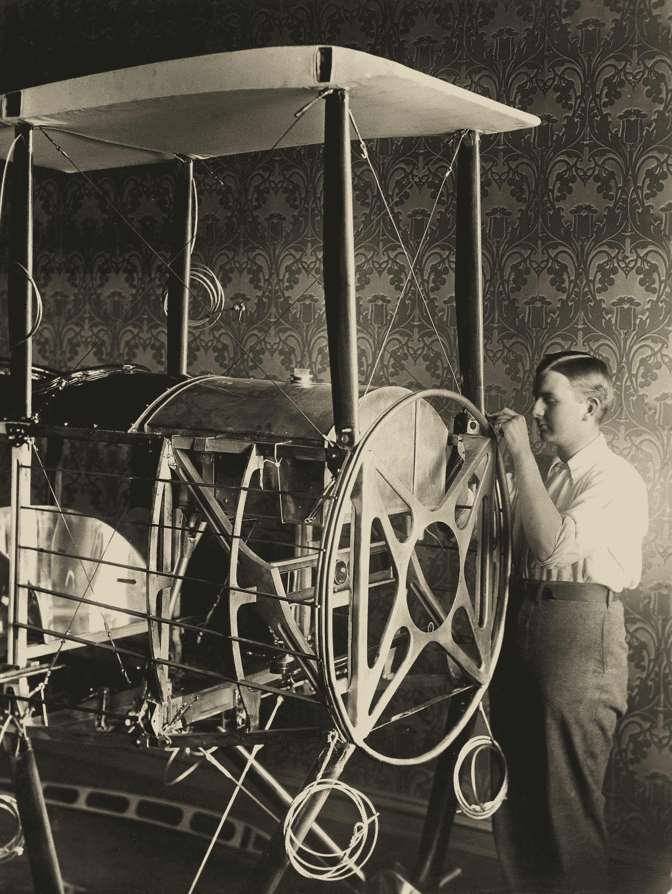

# Tensorflow:使用基本操作构建和训练模型

> 原文：<https://medium.com/mlearning-ai/tensorflow-building-and-training-a-model-with-basic-operations-d232bb6243e7?source=collection_archive---------5----------------------->

Photo by [Museums Victoria](https://unsplash.com/@museumsvictoria?utm_source=medium&utm_medium=referral) on [Unsplash](https://unsplash.com?utm_source=medium&utm_medium=referral)

在这篇文章中，我将向您展示如何从基本张量变量和操作在 **Tensorflow** 中构建深度学习模型，之后我们将创建一个带有自定义数据迭代器、梯度计算和优化的训练循环，所有这些都在**中完成，只需四个步骤**。

## 步骤 1:准备数据