# “TensorFlow:异构分布式系统上的大规模机器学习”摘要

> 原文：<https://medium.com/mlearning-ai/tensorflow-large-scale-machine-learning-on-heterogeneous-distributed-systems-1c16cd1efacb?source=collection_archive---------1----------------------->

# 介绍

**TensorFlow** ( **TF** )是一个**接口** 和 ***实现*** ，用于*表达*和*执行*机器学习( **ML** )算法。一个在 TensorFlow 内表达的计算，几乎没有变化或者没有变化，就可以在广泛的异构系统上执行(**具有不同处理器的系统**)。TensorFlow 可用于表达各种算法，包括深度学习(DL)模型的训练和推理。已经使用的领域:**语音识别**、**计算机视觉**、**机器人学**、**信息检索**、**自然语言处理** ( **NLP** )、**地理信息提取**、**计算药物发现**。本文总结了 TensorFlow [ **1** ]的第一份白皮书，描述了 TensorFlow 接口以及在 **Google** 上构建的该接口的实现。

**谷歌大脑**项目始于 **2011** 探索超大规模深度神经网络的用途(用于研究和谷歌的产品)。作为早期工作的一部分，难以置信接口(**第一代系统**)是为*可扩展的分布式训练和推理*而构建的。“不相信”很管用，它被这个团队、谷歌的其他团队、其他字母表公司(例如谷歌搜索、谷歌翻译等)使用。基于怀疑的经验和对 DNNs 的训练和推理的期望系统属性和要求的更完整理解，开发了 TensorFlow ( **第二代**)用于大规模机器学习模型的实现和部署。

TensorFlow 进行计算(使用**一个类似数据流的模型**进行描述， ***将它们映射到各种不同的硬件平台*** (在 Android 和 iOS 等移动设备平台上进行推理 **|** 使用包含一个或多个 GPU 卡的单台机器的中等规模的训练和推理系统 **|** 在数百台具有数千个 GPU 的专用机器上运行的大规模训练系统)。拥有一个跨越如此广泛平台的单一系统极大地简化了 ML 系统的实际应用，避免了维护负担和抽象漏洞。我们的目标是拥有一个灵活的系统，能够快速地在学术界进行实验，具有高性能，并且对于 ML 模型的生产培训和部署来说是健壮的。

# 编程模型和基本概念

一个**张量流计算**由**一个有向图**描述。该图表示数据流计算，具有扩展，用于允许某些类型的节点维护和更新持久状态，以及用于在图内分支和循环控制结构，如 Naiad [ **2** ]，这是用于执行数据并行和循环数据流程序的分布式系统
*。用户使用一种受支持的前端语言(如 C++或 Python)构建计算图。*

*下图显示了如何使用 Python 构建 TF 图的示例。*

*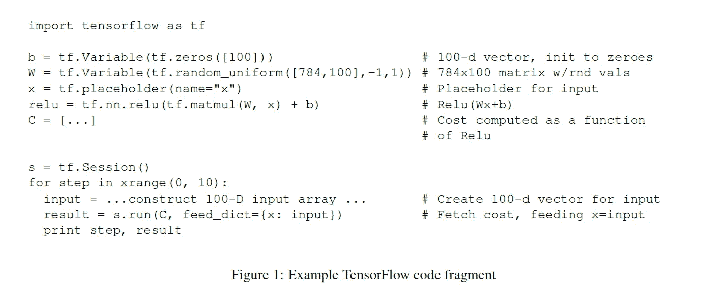*

*[**1**]*

*下图显示了生成的计算图形。*

*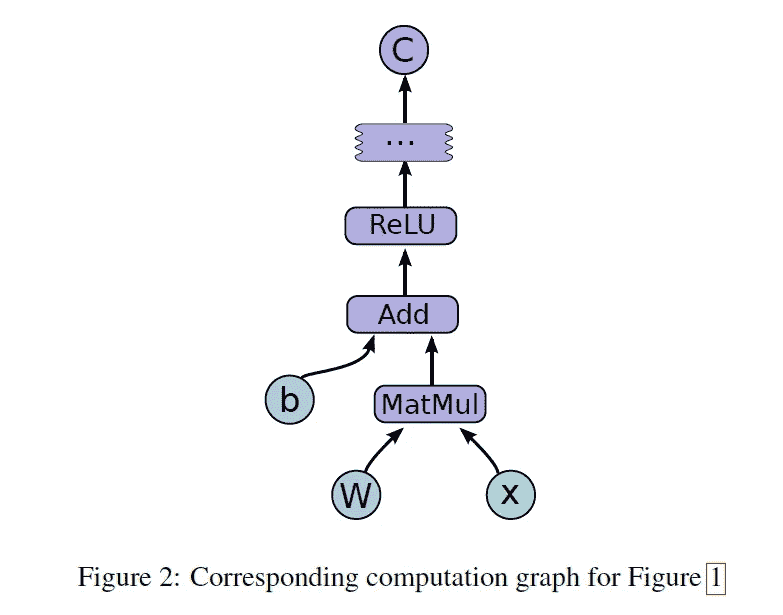*

*[**1**]*

*在 TensorFlow 计算图中，每个节点有零个(*如输入节点有零个输入*或更多个输入)和零个(*如输出节点或标签有零个输出*或更多个输出。每个节点 ***代表一个操作*** 的实例化。沿着正常边流动的值(从输入到输出)是**张量** ( **数组**)，其中底层元素类型(如整数、浮点)在图构造时被指定或推断。控制依赖边(沿着这样的边没有数据流)指示控制依赖的源节点必须在控制依赖的目的节点开始执行之前完成执行。TensorFlow 有时会插入控制依赖项，以实现控制峰值内存使用等目的。*

## *操作和内核*

*一个**操作**是一个**抽象计算**，像“矩阵乘法”或“加法”，带有一个名字和一些属性。所有属性都必须在构建图时提供或推断，以实例化要操作的节点。属性的一个常见用途是在不同的张量元素类型上进行多态操作(比如将两个浮点数和整数的张量相加)。*

*一个**内核**是一个特定类型设备操作的具体实现**，例如 CPU 或 GPU。张量流二进制定义了通过注册机制可用的操作和内核的集合，并且该集合可以通过链接附加的操作和/或内核定义/注册来扩展。下表显示了核心 TensorFlow 库中内置的一些操作。***

*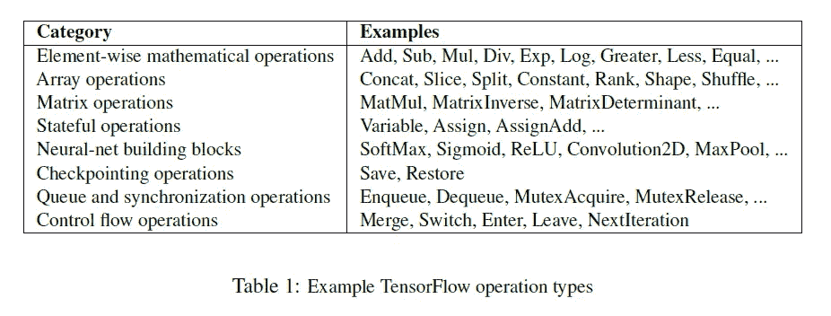*

*[**1**]*

## *会议*

*用户程序通过创建会话与 TensorFlow 系统进行交互。为了创建计算图，会话接口支持扩展方法，以使用附加节点和边来扩充由会话管理的当前图， ***注意，当会话被创建时，初始计算图是空的*** 。session 接口支持的另一个主要操作是 **Run** ，它接受一组需要计算的输出名称，以及一组可选的张量，以代替节点的某些输出。*

## *变量*

*在大多数计算中，一个图形被执行多次。大多数张量在图的单次执行后无法存活。然而，变量是一种特殊的操作，它返回一个持久可变张量的句柄，该张量在图的执行中继续存在。这些持久可变张量的句柄可以传递给一些特殊的操作，这些操作会改变所引用的张量。对于 TensorFlow 的 ML 应用，模型的参数通常存储在变量中的张量中，并作为模型的训练图的**运行**的一部分进行更新。*

# *履行*

*TensorFlow 系统中的主要组件是**客户端**、**主机**和**一个或多个工作进程**。客户端使用会话接口与主服务器通信。每个工作进程负责仲裁对一个或多个计算设备(如 CPU 内核或 GPU 卡)的访问，以便按照主进程的指示在这些设备上执行图节点。TensorFlow 有两种实现:**本地**和**分布式**。当客户机、主机和工作机都在单个操作系统进程的上下文中的单个机器上运行时，使用本地实现。另一方面，分布式实现扩展了本地实现，支持这样一种环境，在这种环境中，客户机、主机和工作机都可以在不同的机器上处于不同的进程中。在分布式环境中，不同的任务是由集群调度系统管理的作业的容器。下图显示了 TensorFlow 的本地和分布式实现版本。*

*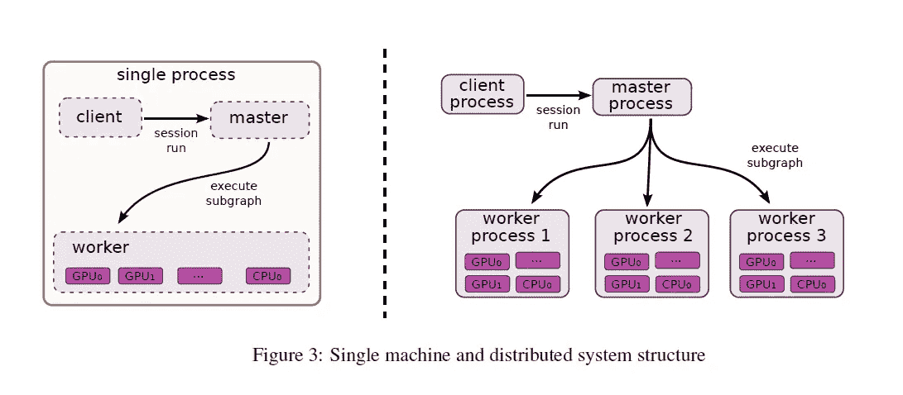*

*[**1**]*

## *设备*

*设备是 TensorFlow 的计算核心。每个工人负责一台或多台设备。每个设备都有类型和名称。设备名称由标识设备类型的部分和设备在 worker 中的索引组成。 ***在分布式设置中，工人的工作和任务的标识也被考虑*** 。CPU 和 GPU 有设备接口的实现，其他设备类型的新设备实现可以通过注册机制 提供 ***。每个设备对象负责管理设备内存的分配和取消分配，并负责安排 TensorFlow 实现中更高级别所请求的任何内核的执行。****

## *张量*

*张量是一个类型化的多维数组。TensorFlow 支持多种类型，包括从 8 位到 64 位的有符号、无符号整数、IEEE float 和 double 类型、复数类型和字符串类型。适当大小的后备存储器由特定于张量所在设备的 ***分配器*** 管理。张量后备存储缓冲区是引用计数的，当没有引用剩余时被释放。*

## *单设备执行*

*这是最简单的执行场景，其中单个工作进程在单个设备上工作。数据流图的节点以尊重节点间依赖性的顺序执行。当一个节点的依赖项计数变为零时，它就有资格执行，然后被添加到就绪队列中。*

## *多设备执行*

*在这种模式下，有两个复杂的问题:决定将图中每个节点的计算放在哪个设备上，然后管理这些放置决定所隐含的跨设备边界的数据通信。*

***节点放置**。放置算法的一个输入是成本模型，该成本模型包含对每个图的输入和输出张量的大小(以字节为单位)的估计，以及当呈现每个节点的输入张量时对每个节点所需的计算时间的估计。放置算法从计算图的源开始，并随着其进展模拟系统中每个设备上的活动。对于在计算数据流图的遍历中到达的每个节点，考虑可行设备的集合(当设备不提供实现特定操作的内核时，该设备是不可行的)。对于具有多个可行设备的节点，放置算法使用贪婪启发式算法，该算法检查将节点放置在每个可能的设备上对节点的完成时间的影响。试探法根据成本模型考虑在该类设备上操作的估计或测量的执行时间，并且还包括将输入从其他设备传输到所考虑的设备所引入的通信成本。选择节点操作将最快完成的设备，然后布局继续为图中准备好模拟执行的其他节点做出布局决策。*

***跨设备通信**。一旦计算出节点位置，该图就被分割成一组子图，每个器件一个子图。从 x 到 y 的任何跨设备边被移除，并被从 x 到 x 的子图中的新发送节点的边和从 y 的子图中的对应接收节点到 y 的边所替代。下图说明了这个想法。*

*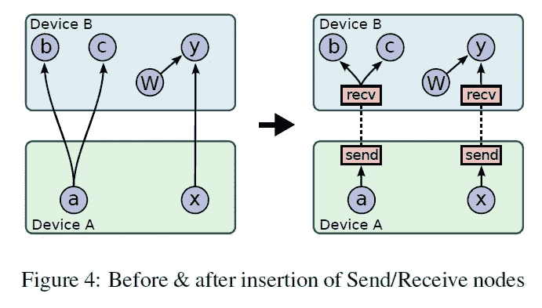*

*[**1**]*

*在运行时，发送和接收节点的实现相互协调，在设备间传输数据，隔离发送和接收实现中的所有通信，这简化了运行时的其余部分。发送/接收节点强制特定设备上特定张量的所有用户使用单个接收节点，而不是特定设备上每个下游用户一个接收节点。它确保所需张量的数据仅在源设备和目的设备之间传输一次，并且张量的存储器仅分配一次，而不是多次。*

*此外，这些发送/接收节点允许将不同设备上的图的各个节点的调度分散到工作器中:发送和接收节点在不同的工作器和设备之间传递必要的同步，并且主节点仅需要在每次图执行时向具有图的任何节点的每个工作器发出单个运行请求，而不是参与每个节点或每个跨设备通信的调度。这使得系统更具可扩展性，并且与调度由主节点强制完成相比，允许更细粒度的节点执行。*

## *分布式执行*

*它非常类似于多设备执行。在器件放置之后，为每个器件创建一个子图。跨工作进程通信的发送/接收节点对使用远程通信机制，如 **TCP** 或 **RDMA** 来跨机器边界移动数据。*

*对于容错，考虑发送和接收节点对之间的通信。此外，从主进程到每个工作进程的定期健康检查。当检测到故障时，整个图形执行被中止，并从头开始。*

# *扩展ˌ扩张*

## *梯度计算*

*由于梯度下降在许多优化算法中使用，并且是一种常见需求，TensorFlow 内置了对自动梯度计算的支持。有人提到，它使优化变得复杂，特别是对于内存使用。*

## *部分执行*

*可以根据用户的需求仅执行整个执行图的子图。为了支持它，一旦客户机在会话中建立了计算图，Run 方法允许它们执行整个图的任意子图，并沿着图中的任意边注入任意数据，以及检索沿着图中的任意边流动的数据。这是通过向将要执行的子图添加 feed 和 fetch 节点来完成的，如下图所示。*

*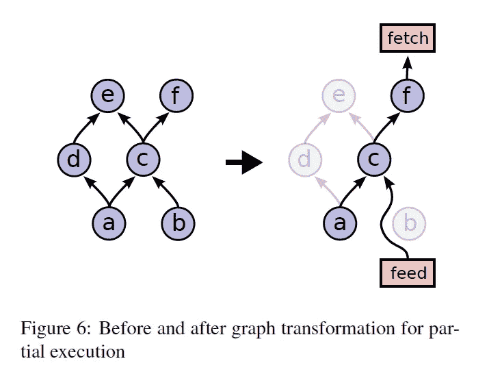*

*[**1**]*

## *设备限制*

*TensorFlow 客户端可以通过为节点提供关于它可以在哪些设备上执行的部分约束来控制节点在设备上的放置。例如，仅在 GPU 上，任何设备，与名为 variable13 的节点共存。在这些约束的范围内，放置算法负责选择节点到设备的分配，该分配提供快速执行并且还满足设备施加的各种约束，例如限制设备上执行其图节点子集所需的存储器总量。支持这样的约束要求改变放置算法。首先，计算每个节点的可行设备集，然后在并置约束图上使用 union-find 来计算必须放在一起的图组件。对于每个这样的组件，计算可行设备集的交集。计算出的每个节点的可行器件集很容易适合放置算法的模拟器。*

## *控制流*

*没有任何显式控制流的数据流图很有表现力。然而，作者[ **1** ]声称，在某些情况下，支持条件和循环可以导致 ML 算法的更简洁和有效的表示。TensorFlow 包括一小组原始的控制流操作符，它被推广用于处理循环数据流图。**开关**和**合并**操作允许基于布尔张量**的值跳过整个子图的执行。 **Enter** 、 **Leave** 和 **NextIteration** 运算符允许表达迭代。诸如 if-conditionals 和 while-loops 之类的高级编程语言结构可以用前面提到的控制流、操作符编译成数据流图。***

*TensorFlow 迭代实现了类似于 MIT 标记令牌机[ **3** ]的标记和帧的概念。循环的每一次迭代都是唯一标识的，其执行状态由一个帧表示。只要输入可用，它就可以进入迭代；因此，可以同时执行多次迭代。TensorFlow 使用分布式协调机制来执行带有控制流的图形。一般来说，一个环路可以包含分配给许多不同设备的节点。因此，管理循环的状态成为分布式终止检测的问题。TensorFlow 的解决方案是基于 [**图重写**。](https://en.wikipedia.org/wiki/Graph_rewriting)*

## *输入操作*

*除了通过 feed 节点向计算提供数据之外，另一种用于训练大规模机器学习模型的常见方法是在图中具有特殊的输入操作节点。它们配置有一组文件名，每次执行时都会产生一个张量，其中包含来自该组文件中存储的数据的一个或多个示例。这些输入操作的优点是将数据直接从底层存储系统读取到机器的内存中，该机器将对数据执行后续处理。在客户端进程与工作进程分离的配置中，如果数据被馈送，将需要额外的网络跳跃。额外的一跳，因为数据应该从存储系统到客户端，然后从客户端到工作机。但是，对于操作节点，当使用输入节点时，数据直接从存储系统传输到工作节点。*

## *行列*

*在 TF 中使用队列来实现图形不同部分的异步执行，并通过入队和出队操作移交数据。入队操作可以阻塞，直到队列中有空间可用，出队操作可以阻塞，直到队列中有所需最小数量的元素可用。*

*队列的一个用途是当 ML 模型的计算部分仍在处理前一批数据时，允许从磁盘预取输入数据。*

*除了正常的 FIFO 队列之外，TF 中还添加了洗牌队列，它在一个大的内存缓冲区中随机洗牌。这种混洗功能对于想要随机化处理示例的顺序的机器学习算法非常有用。*

## *容器*

*容器是一种用于管理长期可变状态的机制。变量的后备存储位于容器中。默认容器一直存在，直到进程终止。容器可以通过完全清除其内容来重置。通过使用容器，跨与不同会话相关联的不相交计算图共享状态是可行的。*

# *最佳化*

## *公共子表达式消除*

*在编译器理论中，CSE 是一种编译器优化技术，它搜索相同表达式的实例，这些实例都评估为相同的值，并分析是否值得用保存计算值的单个变量来替换它们[ [**ref**](https://en.wikipedia.org/wiki/Common_subexpression_elimination) ]。TensorFlow 采用了类似于 Click [ **4** ]的 CSE，因为计算图的构建通常由客户端代码中许多不同的抽象层完成，计算图很容易以相同计算的冗余副本结束。*

## *控制数据通信和内存使用*

*仔细调度 TensorFlow 操作可以提高数据传输和内存使用的性能。TensorFlow 对于读取远程值的**接收**节点的调度非常小心。如果不采取预防措施，接收节点将会比需要的时间更早地启动，当执行开始时，所有节点会同时启动。TensorFlow 通过执行尽可能早/尽可能晚( **ASAP/ALAP** )计算，分析图的关键路径，以估计何时开始接收节点。然后，插入控制边以延迟接收节点的开始，直到需要它们的结果之前。*

## *异步内核*

*TensorFlow 支持非阻塞内核(*记住:内核是特定设备(如 CPU 或 GPU* )操作的特定实现，接口略有不同。这种优化适用于拥有许多活动线程在内存使用或其他资源方面相对昂贵的环境，并允许避免在等待 I/O 或其他事件发生时无限期地占用执行线程。异步内核的例子包括接收内核、入队和出队内核，如果队列空间不可用或者没有数据可供读取，这两个内核可能分别需要阻塞。*

## *内核实现的优化库*

*TensorFlow 使用可用的高度优化的数值库来实现一些操作的内核，如 BLAS、用于执行高效矩阵乘法的 cuBLAS 以及用于卷积内核的 Cuda-convnet、cuDNN。许多 TensorFlow 内核实现都是上述优化库的包装器。值得一提的是 TensorFlow 广泛使用开源的特征线性代数库作为其内核实现(工作团队扩展了任意维度张量运算的特征)。*

## *有损压缩*

*由于训练神经网络可以容忍噪声和降低的算术精度，TensorFlow 在设备之间发送数据时使用更高精度的有损压缩。*

# *地位和经验*

*在这一小节中，作者提到了他们从怀疑(第一代)系统迁移到 TensorFlow(第二代)系统的经历。*

# *常见的编程习惯用法*

*本节讨论 TensorFlow 中用于加速神经网络训练的技术。假设使用随机梯度下降( **SGD** )和相对适度的小批量 **100** 到 **1000** 示例来训练模型。*

## *数据并行训练*

*该技术在小批量元件之间并行计算小批量的梯度。例如，如果小批量的大小是 1000，在 10 个设备上有模型的 10 个副本，每个副本处理 100 个元素，然后组合梯度并同步应用对参数的更新。由于并行化和更多的设备，总体执行时间减少了(由于并行化，性能更高)。在这种情况下，TensorFlow 图形有许多执行大量模型计算的图形部分的副本，一个客户端线程驱动这个大型图形的整个训练循环，如下图所示。*

*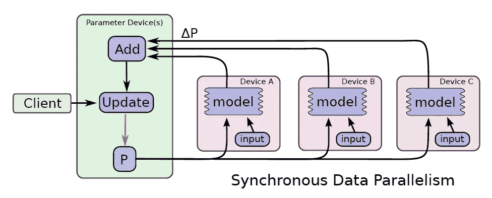*

*[**1**]*

*在异步类型的数据并行中，每个复制品异步地将参数更新应用于模型参数。在此配置中，每个图形副本都有一个客户端线程，如下图所示。*

*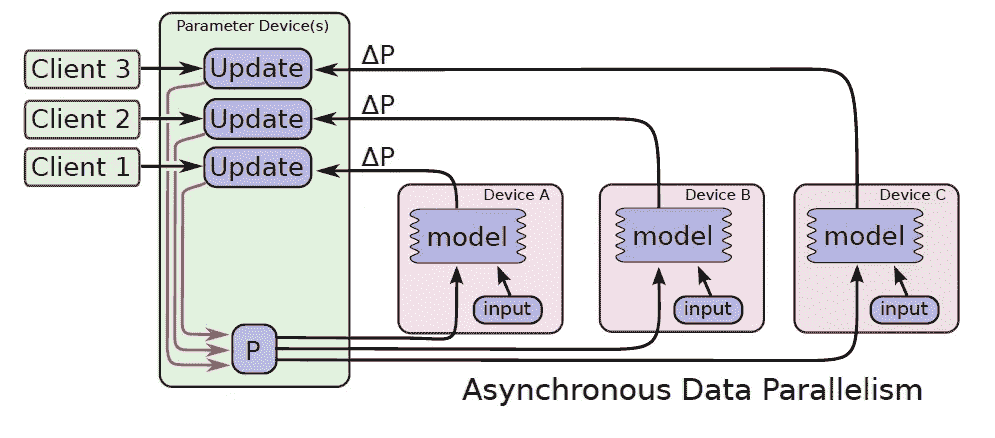*

*[**1**]*

## *模型并行训练*

*模型并行训练在 TensorFlow 框架内是可行的。下图显示了一个循环的深度 LSTM 模型的示例，该模型用于跨三个不同设备并行化的序列学习序列。*

*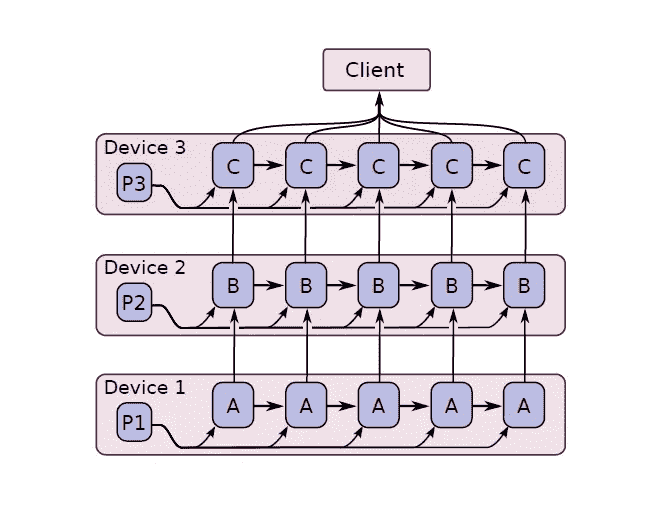*

*[**1**]*

## *模型计算流水线的并发步骤*

*通过运行少量并发步骤在设备内流水线化模型计算是 TensorFlow 中采用的另一种提高利用率的机制。它类似于异步数据并行，只是并行发生在单个设备中。下图说明了这个想法。*

*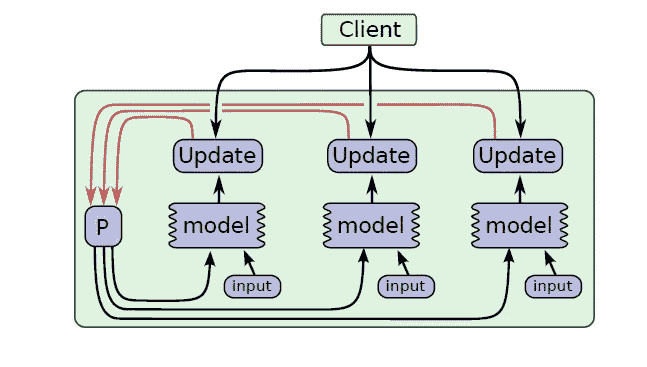*

*[**1**]*

# *与核心 TensorFlow 图形执行引擎一起开发的工具*

## *TensorBoard:图形结构和汇总统计的可视化*

*由于计算图中有大量的节点，使用简单的可视化技术经常会产生混乱不堪的图。为了帮助用户看到图形的底层组织，TensorBoard 中的算法将节点折叠成高级块，突出显示具有相同结构的组。整个可视化是交互式的，用户可以放大查看更多细节。下图显示了深度卷积图像模型图形的可视化效果。*

*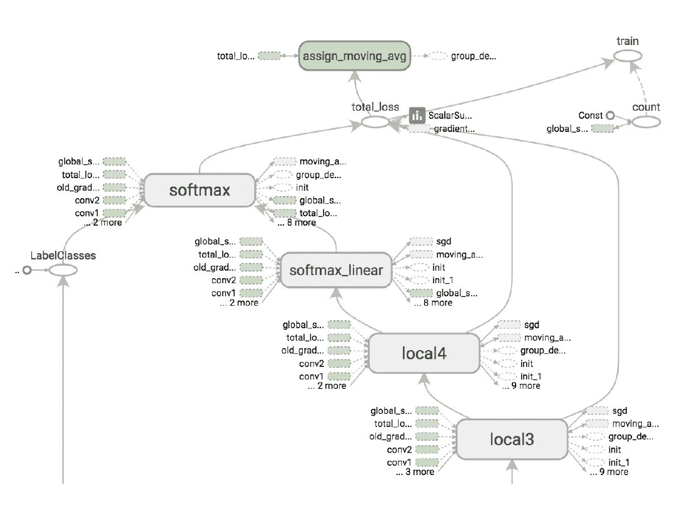*

*[**1**]*

*另外，TensorFlow 提供了汇总数据的可视化。下图显示了一个示例。*

*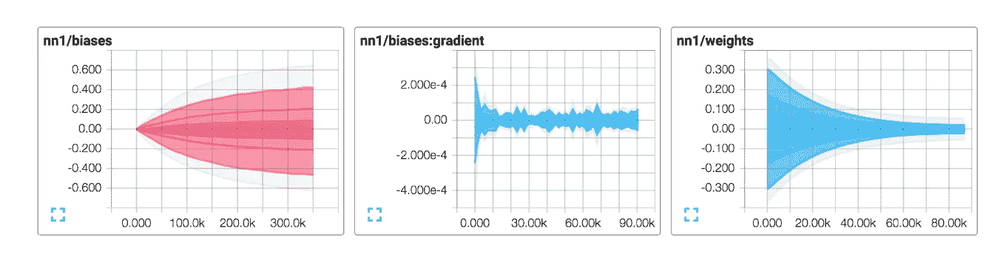*

*[**1**]*

## *性能跟踪*

*EGG tool(非开源)是一个内部工具，用于收集和可视化关于 TensorFlow 图执行的精确排序和性能特征的非常细粒度的信息。它可以用于单个和分布式场景，并提供有用的信息，以便更好地理解 TensorFlow 程序的计算和通信模式中的瓶颈。从机器上同时收集的轨迹在一个可视化服务器中进行组合，该服务器用于提取指定时间范围内的事件，并在适当的详细级别上进行总结，以解决用户界面问题。由于通信、同步或与 DMA 相关的停顿而导致的任何重大延迟都会被识别出来，并在可视化中使用箭头突出显示。放大显示给用户更多的信息。下图是这种 EEG 可视化工具的示例。*

*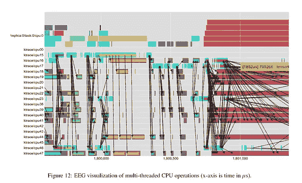**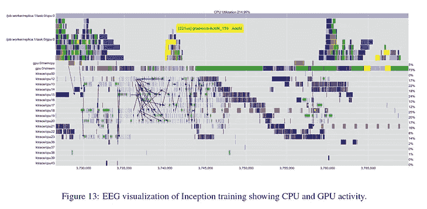**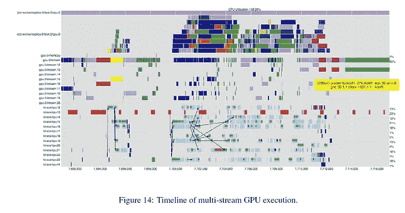*

*[1]*

***注**:为了更好地理解张量流的作用，必须阅读白皮书中引用的相关工作。得律阿德斯，烟雾，CIEL，Naiad，Spark 是作者声称 TensorFlow 从他们那里收集好东西的系统。*

# *下一次阅读*

*   *米（meter 的缩写））阿巴迪*等*，“ **TensorFlow:大规模机器学习的系统**”，载于第十二届***USENIX****操作系统设计与实现会议***美国佐治亚州萨凡纳 **2016** ，bll 265–283。***

# *参考*

*【**1**m . Abadi*等*， **TensorFlow:异构分布式系统上的大规模机器学习**。 **2015** 。*

*[ **2** ] D. G. Murray，F. McSherry，R. Isaacs，M. Isard，P. Barham，en M. Abadi， **Naiad:一个及时的数据流系统**，*第二十四届 ACM 操作系统原理研讨会会议录*，宾夕法尼亚州法明顿， **2013** ，bll 439–455。*

*[ **3** ] Arvind 和 R. S. Nikhil，**在麻省理工学院标记令牌数据流架构上执行程序，**， *IEEE 计算机汇刊*，第 39 卷，第 3 期，第 300-318 页，1990 年 3 月**，DOI: 10.1109/12.48862。***

***[**4**c . Click，“**全局代码运动/全局值编号**”，在*美国加州拉荷亚 ACM SIGPLAN 1995 编程语言设计和实现会议*上， **1995** ，bll 246–257。***

*** [## Mlearning.ai 提交建议

### 如何成为 Mlearning.ai 上的作家

medium.com](/mlearning-ai/mlearning-ai-submission-suggestions-b51e2b130bfb)***