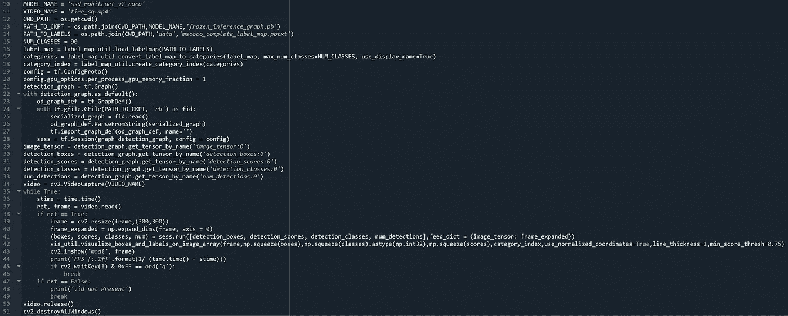

# 面向 Windows-10 的 TensorFlow 视频对象检测

> 原文：<https://medium.com/mlearning-ai/tensorflow-object-detection-for-videos-onwindows-10-1c1a9ffd6cac?source=collection_archive---------1----------------------->

前一篇文章:“[窗口中的 TensorFlow 对象检测(30 行以下)](/@deep12vish/tensorflow-object-detection-in-windows-under-30-lines-d6776586c4ab)”，涵盖了下面显示的大约 95%的相同代码，并对每一行进行了解释，我们将只期待对以前的代码进行的修改，现在它可以对视频而不是图像进行推理。



第 10–33 行

```
MODEL_NAME = ‘ssd_mobilenet_v2_coco’…
```