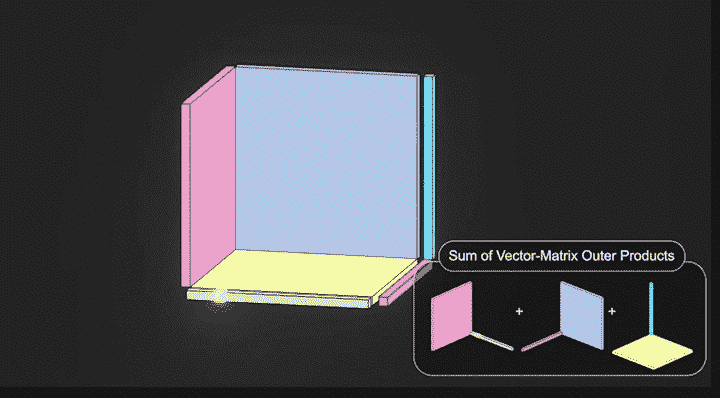

# 来自图像数据的 3D 场景

> 原文：<https://medium.com/mlearning-ai/tensorial-radiance-fields-f747c07832aa?source=collection_archive---------7----------------------->

## [机器学习艺术](https://mlearning.substack.com)

## 一种新的 4D 张量建模方法

[https://mlearning.substack.com](https://mlearning.substack.com)

**带 CP 分解的 TensoRF】以一种全新的方式解决了渲染真实图像的问题。他们不依赖 MLP，而是将场景构建为向量和矩阵张量，并将其分解为多个低秩张量。存储数据占用的空间更少，而且…**