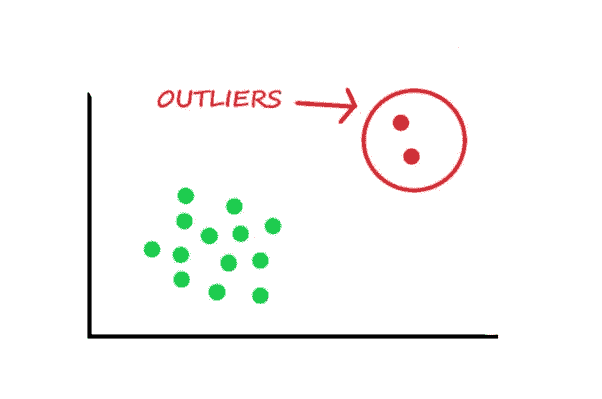

# 作为机器学习工程师需要了解的术语—第 2 部分

> 原文：<https://medium.com/mlearning-ai/terminologies-to-know-as-a-machine-learning-engineer-part-2-7c836f73a9bc?source=collection_archive---------8----------------------->

在上一篇博客中，我们讨论了术语 ***机器学习*** ，以及它的范例。在这里，我们将研究一些机器学习工程师或*数据科学专家*应该了解的基本术语。

Machine learning, image from [iStock](https://www.istockphoto.com/es/vector/logotipo-de-banner-de-aprendizaje-autom%C3%A1tico-para-tecnolog%C3%ADa-ai-big-data-algoritmo-gm1273072739-375131265?phrase=machine%20learning)

# 正常化

机器只能理解数字形式的数据。即使给定的数据是图像、音频或视频，数据在输入模型之前也会被转换成*数值*。但是各种范围的转换数值，即数量可以是任何范围，这可能导致复杂的过程和*等待时间的增加。*于是，执行 ***归一化*** 。

归一化是将较高的值转换为**【0，1】**之间的值的过程。这使得机器的计算变得简单。

# 一般化

泛化是一个术语，指的是模型对新的未知数据的适应性，并产生输出。据说，如果模型在*训练数据中训练过多，*那么它将对提供给模型的新数据做出不准确的预测，使模型无用。

# 模型拟合

模型拟合是对机器学习模型*推广到用于训练模型的类似数据*的程度的测量。

## 过度拟合

如果模型在给定一个新数据时做出*不准确的预测*，即使它能够对训练数据做出准确的预测，也称为过拟合。换句话说，该模型在训练数据中具有*良好的性能，但对其他数据具有*较差的泛化能力*。*

## 欠拟合

它可以被定义为模型的性能将*差于训练数据*以及*差于对其他数据的推广*。

# 极端值

在数据集中，会有一些点*与其余数据点*明显不同。这样的点称为异常值。离群值位于与作为一组的其他数据点分开的区域。

## 异常值的原因

*   异常值的出现是由于数据输入过程中的错误或测量数据过程中的任何错误
*   此外，这也可能是自然现象，例如初级员工的工资数据与高级员工相比会有很大差异

Outliers, image from [Data science foundation](https://datascience.foundation/img/pdf_images/knowing_all_about_outliers_in_machine_learning_sample_points_in_green_are_near_to_each_other.jpg)

# 向下采样

图像中的下采样基本上被认为是降低分辨率，同时保持相同的*二维(2D)* 分辨率。执行下采样是为了减少所需的存储。图像被转换成矢量，即具有*数值*的*矩阵*，然后根据已选择的帧尺寸对其进行下采样。

下采样是必要的，因为要创建不需要许多训练数据点来预测输出的小型机器学习模型。

# 反向传播

反向传播是模型从前向层返回到前一层以更新神经元权重的能力。权重被更新以提高模型的准确性，从而实现期望的输出。

# 准确(性)

机器学习模型的准确性描述了模型的*性能有多好。如果精度高，则模型具有良好的性能。准确度可以定义为正确预测与预测总数的*比率。**

# 精确

一个模型的精度就是定义预测的*质量*如何，意味着预测的清晰度或精确程度。

# 回忆

该模型能够在一个数据集中找到所有*相关案例*。这测量模型检测*阳性样本*的能力。

# f 分数

f 分数也用于确定模型的性能。F-score 是通过将精确度和召回率结合成一个单一的度量来计算的。一旦为分类问题计算了精度和召回率，则通过以下公式组合它们来计算 F 分数，

> F-Measure = (2 *精度*召回)/(精度+召回)

到目前为止，我们已经介绍了最常见的基本术语，以便开始学习机器。在接下来的博客中，我们将深入探讨机器学习的一些基本过程和模型。

*快乐学习！！*

 [## Mlearning.ai 提交建议

### 如何成为 Mlearning.ai 上的作家

medium.com](/mlearning-ai/mlearning-ai-submission-suggestions-b51e2b130bfb)