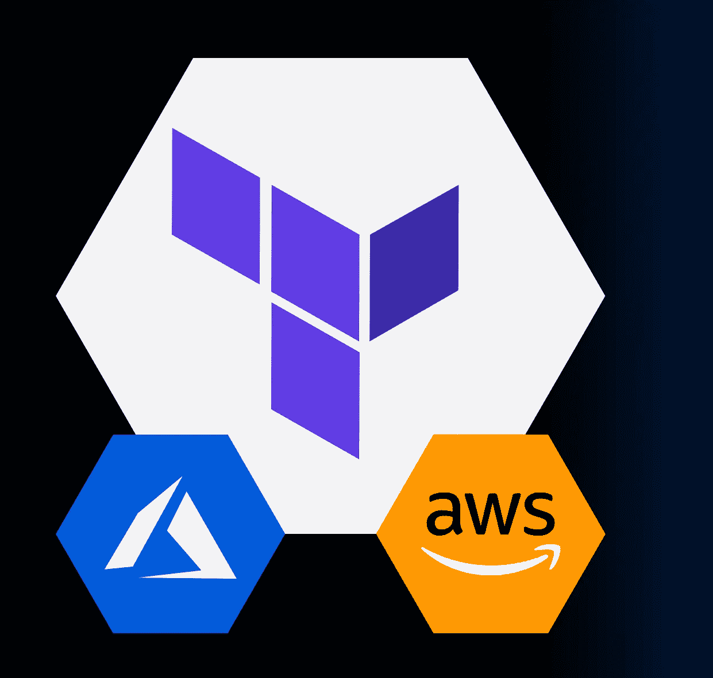

# Terraform 和 Azure DevOps 来调配 AWS 资源

> 原文：<https://medium.com/mlearning-ai/terraform-and-azure-devops-to-provision-aws-resource-ee03c032c6d6?source=collection_archive---------0----------------------->

**Terraform** 是由 **HashiCorp** 创建的开源基础设施代码(IaC)软件工具。它提供一致的 CLI 工作流来管理数百个云服务。Terraform 将云 API 编码成声明性的配置文件。它读取配置文件并提供变更的执行计划，可以对该计划进行安全性审查，然后根据需求进行应用和配置。