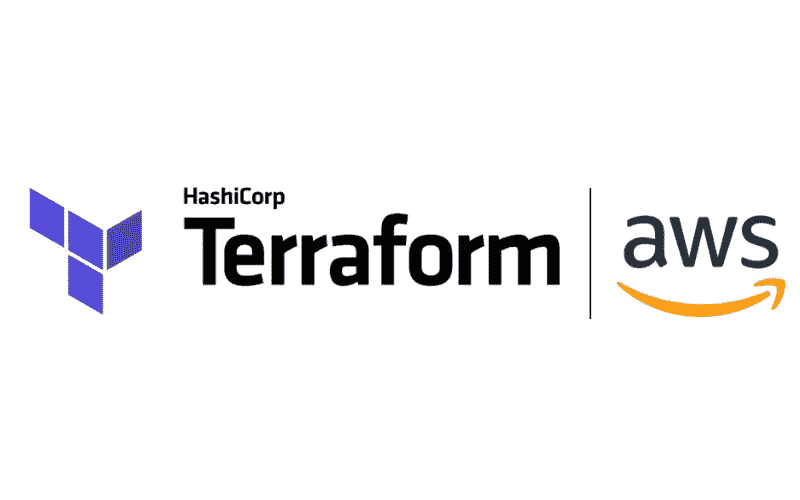

# 用于提供 AWS 资源的平台— S3 存储桶(初级)

> 原文：<https://medium.com/mlearning-ai/terraform-to-provision-aws-resource-s3-bucket-beginner-level-5dde3a8afdc4?source=collection_archive---------1----------------------->

T***erra form****是由****hashi corp****打造的开源基础设施 as code (IaC)软件工具。它提供一致的 CLI 工作流来管理数百个云服务。Terraform 将云 API 编码成声明性的配置文件。它读取配置文件并提供变更的执行计划，可以对该计划进行安全性审查，然后根据需求进行应用和配置。*

