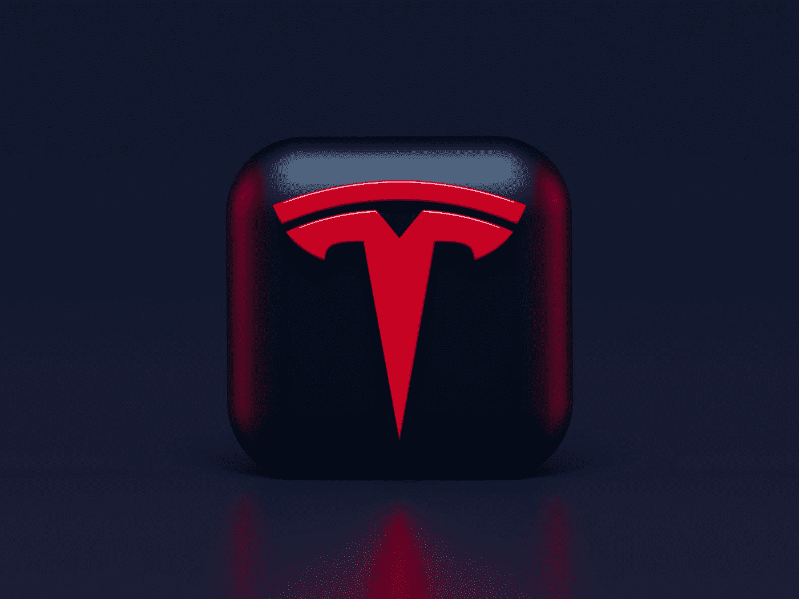

# 特斯拉 AI

> 原文：<https://medium.com/mlearning-ai/tesla-ai-54ce8e94d04d?source=collection_archive---------2----------------------->

Photo by [Alexander Shatov](https://unsplash.com/@alexbemore?utm_source=medium&utm_medium=referral) on [Unsplash](https://unsplash.com?utm_source=medium&utm_medium=referral)

埃隆·马斯克的愿景是将特斯拉从一家电动汽车公司转变为一家机器人公司，特斯拉人工智能日表明了他对这一愿景的承诺。

特斯拉是最大的汽车公司之一，由于他们在汽车(自动驾驶系统)中研究和实施人工智能，他们既是一家汽车公司，也是一家软件公司。特斯拉作为一家公司，在自动驾驶系统之外的硬件中深入参与了人工智能。

埃隆·马斯克希望特斯拉被视为“不仅仅是一家电动汽车公司”。在周四的特斯拉人工智能日，这位首席执行官将特斯拉描述为一家“在推理层面和训练层面上具有深度人工智能活动”的公司，可以用于自动驾驶汽车以外的应用，包括特斯拉显然正在建造的人形机器人。

# **为什么是特斯拉？**

听说特斯拉在做人形机器人，我首先想到的是，为什么所有公司的特斯拉都在做一个人形机器人，而他们是一家汽车公司。是的，他们的汽车由软件驱动，他们在汽车(自动驾驶汽车)中实现人工智能取得了巨大成功，所以我们可以说他们也是一家软件公司，但机器人中的人工智能与汽车中的人工智能非常不同。当然，当像波士顿动力公司这样的公司在这个领域有几十年的经验时，他们仍然很难让他们的机器人商业化。那么特斯拉为什么还要这么做呢？

在回答这个问题之前，让我们看看特斯拉在人工智能领域取得的进展，以了解更多关于他们为什么以及如何去做的信息，如果他们成功了的话。

# 神经网络

神经网络是深度学习和人工智能所基于的架构的基础。机器人或自动驾驶系统主要在它的一个分支上运行，那就是计算机视觉。

计算机视觉将数据作为 2D 图像，并从该图像中学习特征。如果我们有足够的数据，我们可以训练模型检测路标、物体、其他汽车和几乎任何我们喜欢的东西。

另一方面，特斯拉正在研究一种产生矢量空间而不是图像空间的模型。计算机视觉通常在 2D 图像的图像空间中操作，而现实是 3D 的。所以在三维世界的 2D 投影上做计算机视觉是没有意义的。这是一个非常明显的变化，可以也应该对模型进行更改，但由于各种因素，如模型的大小、训练模型的时间，甚至获取数据和构建数据等问题，这非常困难。

除此之外，他们还在探测前对相机数据进行融合。检测由神经网络的不同头部执行。目前，融合处于多尺度特征级别，在所有传感器上进行检测和机器学习，就像应该单独进行检测和机器学习一样，然后组合决策。同样，这是一个非常明显的变化，但却非常困难。

除此之外，我们可以使用视频上下文不仅对向量空间建模，还对时间建模，这也是自动驾驶系统中的主要问题之一，即如何让系统记住前方 100 米左右的路标。通过对时间和向量空间进行建模，在每一帧连接不同的数据将使模型更好地适应现实世界的问题。

# DOJO 超级计算机

特斯拉展示了他们完全在内部设计和制造的计算机芯片，该公司将使用该芯片运行其超级计算机 **DOJO。** Dojo 是由特斯拉设计的一台超级计算机，这是一台神经网络训练超级计算机，马斯克表示，它能够以比任何其他计算机快四倍的速度处理大量高分辨率相机成像数据。由于 Dojo 超级计算机的高速和先进架构，特斯拉的总体目标是推进其人工智能研究工作，为自动驾驶汽车和现在的人形机器人问题建立更好的解决方案。

除了 Dojo 超级计算机，特斯拉还推出了自己的内部构建芯片(他们称之为 **D1** )，其想法是制造一种专门为神经网络训练优化的芯片。目前，他们使用的是通用图形处理器，其速度不如为特定任务专门设计的芯片快。特斯拉声称，该芯片的速度将比 GPU 快近 4 倍。

他们特别设计了可扩展的超级计算机，以便他们可以根据需要添加任意多的内核，并实现低延迟。

# 特斯拉机器人

人形机器人一直是流行文化中令人着迷的东西。但在现实中，创造一个人形机器人并让它执行通用任务是一项非常困难的任务。由于人工智能在过去十年中的快速发展，许多几年前似乎不可能的任务现在可以以接近人类的精度执行，但通用机器人在这些标准背后似乎仍然遥不可及。

特斯拉刚刚推出了新的人形机器人，名为特斯拉机器人(代号: *Optimus* )，它运行在特斯拉自动驾驶汽车车队使用的相同人工智能上。该机器人的主要目的是消除危险、重复和无聊的任务。

特斯拉机器人(Tesla bot)是特斯拉在与人工智能和计算机视觉相结合的通用机器人领域推动人工智能的一部分。Elon Musk 提供了一个例子，表明机器人可以被告知去商店购买以下食品。

它的头部将配备特斯拉汽车用来感知环境的自动驾驶摄像头，并将包含一个显示信息的屏幕。

# 完全自动驾驶和超越

特斯拉是全自动驾驶系统领域全球领先的汽车制造商之一。他们拥有最复杂的自动驾驶汽车人工智能架构之一，现在凭借他们新的超级计算机 **Dojo** 和一个内部构建芯片(他们称之为 **D1** )，他们正试图超越竞争对手。但据特斯拉称，强大的超级计算机是在考虑多个方面的情况下构建的，而不仅仅局限于特斯拉汽车。

其中一个例子是解决计算机视觉任务，帮助汽车识别路标、其他车辆、行人以及周围的一切，但这项任务不仅限于汽车，它也可以应用于机器人，当然，特斯拉人形机器人也需要通过高分辨率图像数据扫描周围环境，未来可能还需要激光雷达和其他传感器。有了外部和内部环境数据，特斯拉正在努力实现重复性任务的完全自动化。

特斯拉试图通过其计算机视觉架构解决的一个主要问题是临时遮挡(比如繁忙十字路口的汽车挡住了自动驾驶仪对道路的视线，或者路标前面有物体，等等。)

为了解决这个问题，特斯拉正在尝试制作一个循环网络视频模块，其中不同的模块有助于跟踪数据的不同方面，形成基于空间甚至基于时间的数据，从而创建一个数据缓存，模型可以参考该数据缓存进行预测。

# 结束思考

特斯拉正在解决其领域中一些最困难的问题，但我们都知道特斯拉的历史上充满了大量的创新想法，这些想法在现实中大多不会成功，如果他们成功了，他们可能会永远改变整个行业。只有未来能告诉我们这种创新会落在哪一边。

感谢阅读。