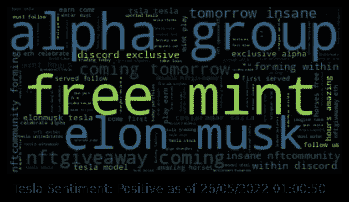
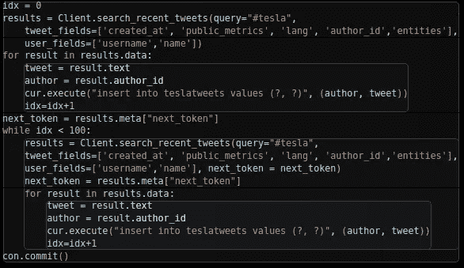
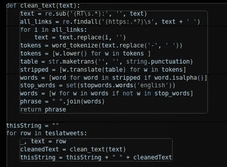
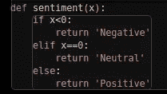

# 特斯拉心情机器人:回复特斯拉心情的电报机器人

> 原文：<https://medium.com/mlearning-ai/tesla-mood-bot-telegram-bot-that-returns-the-mood-about-tesla-591292b4286a?source=collection_archive---------9----------------------->

Sentiment result!!

特斯拉最近经常出现在新闻中，因为它的股票似乎一跌再跌。我决定创建一个小项目，去 Twitter 上看看谁在谈论特斯拉，以及他们要说的话的总体情绪是什么。方法是收集尽可能多的包含#tesla 的推文，并对所有文本进行情感分析。

Data being put into local database

我使用 Python 和标准 tweepy 模块来收集必要的数据。

A rudimentary cleaning of the data

为了准备用于情感分析的数据，需要移除大多数不相关的数据。

spacy 软件包用于获取整个文本的极性。然后，这被翻译成正常的人类可读的形容词，以表达文本的情感。

Translate polarity to sentiment

这个函数用于得出最终的情感。

将单词云与整体情绪相结合，以给出此刻特斯拉公司情绪的整体情绪。上图是电报机器人的一个例子。

 [## Mlearning.ai 提交建议

### 如何成为 Mlearning.ai 上的作家

medium.com](/mlearning-ai/mlearning-ai-submission-suggestions-b51e2b130bfb)