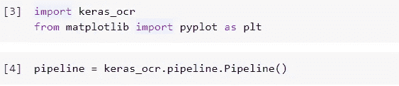
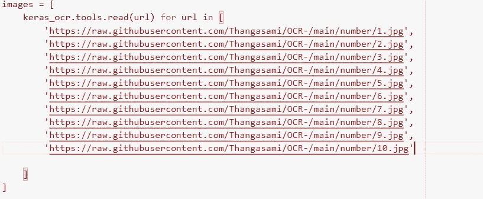
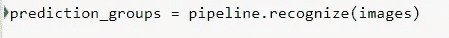
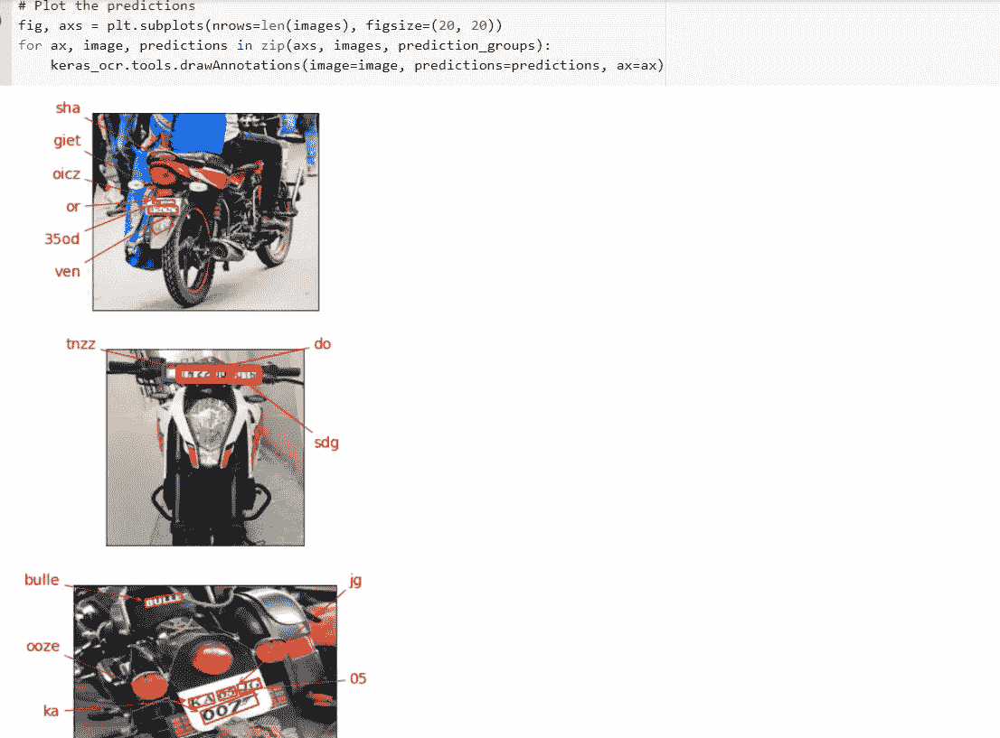
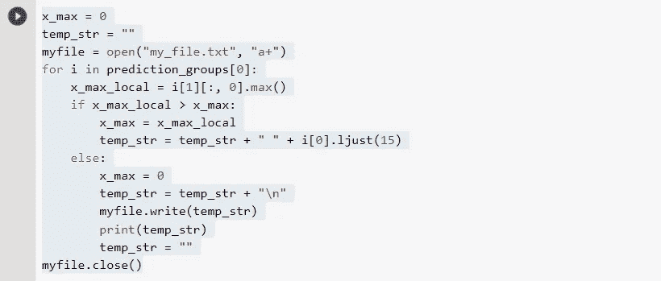
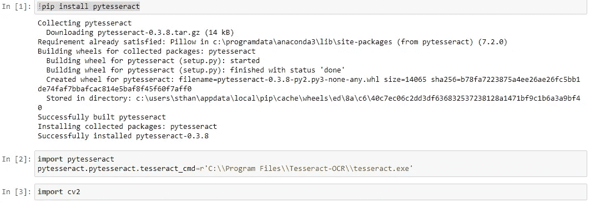
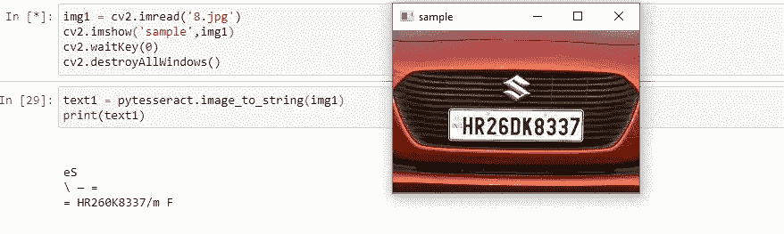
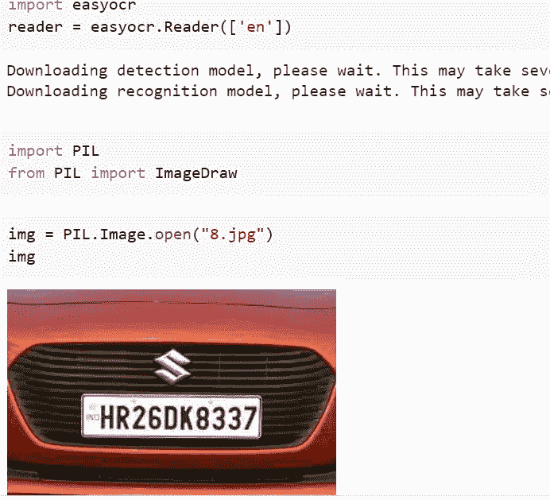
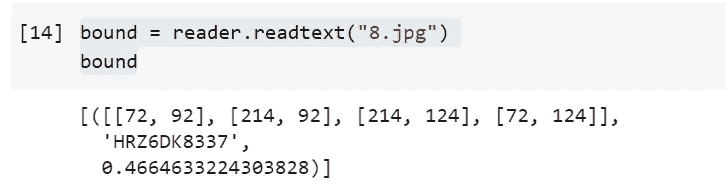
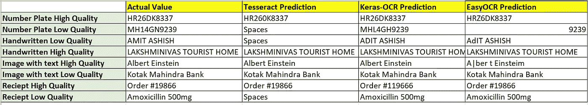

# “宇宙魔方”vs“Keras-OCR”vs“easy OCR”

> 原文：<https://medium.com/mlearning-ai/tesseract-vs-keras-ocr-vs-easyocr-ec8500b9455b?source=collection_archive---------0----------------------->

# 光学字符识别哪个最好？

光学字符识别是深度学习中的常见用例之一。例如:转换手写处方，车辆牌照识别，PDF 或图像到文本的转换，签名验证等。

在市场上，我们有一些非常好的 OCR 付费 API 服务，如 Amazon Textract、微软的认知服务、Google cloud vision 等。Sametime、Pytesseract、easyocr 和 Keras-OCR 都是很好的开源 API，可以免费获得。他们也给出了类似于其他付费 API 服务的好结果。在本文中，我们将了解如何设置、使用它们，以及它们在不同用例中的表现。

**Keras-Ocr 设置:**

如果尚未安装，需要先使用 pip 安装命令。

！pip 安装 keras-ocr

Keras 有一个内置管道。图像 URL 可以作为进一步处理的输入。

预言；预测；预告

默认情况下，它会将预测绘制为一个图像框，如下所示。

我们也可以使用下面的代码将输出提取为文本。

**宇宙魔方设置:**

对于 Tesseract，需要首先安装 tesseract-ocr exe 文件，并且相应的路径需要与 tesseract cmd 相关联，如下所示。

宇宙魔方预测将使用一行代码来完成。

**EASYOCR 设置:**

顾名思义，与其他库相比，easyocr 是一个简单的轻量级库。它支持多种语言。此外，通过调整各种超参数，它可以更好地执行特定的用例。

！pip 安装 easyocr

如下所示，一行命令足以进行模型预测。

【Tesseract 与 Keras-OCR 与 EasyOCR 的性能比较:

为了测试，我们比较了一组手写图像、车牌和图像中的文本，我们的观察结果如下。

**结论:**

OCR 预测不仅取决于模型，还取决于许多其他因素，如图像的清晰度、灰度、超参数、给定的权重等。

Tesseract 对于高分辨率图像表现良好。某些形态学操作(如膨胀、腐蚀、OTSU 二值化)有助于提高立方体的性能。

EasyOCR 是一个轻量级的模型，在接收和 PDF 转换方面有很好的表现。它通过有组织的文本(如 pdf 文件、收据、账单)提供更准确的结果。

Keras-OCR 是图像特定的 OCR 工具。如果文本在图像内部，并且它们的字体和颜色是无组织的，Keras-ocr 会给出很好的结果。

虽然没有硬性规定，但我们在选择 OCR 工具时可以考虑以上三点。

 [## Mlearning.ai 提交建议

### 如何成为 Mlearning.ai 上的作家

medium.com](/mlearning-ai/mlearning-ai-submission-suggestions-b51e2b130bfb) 

[成为 ML 写手](/mlearning-ai/mlearning-ai-submission-suggestions-b51e2b130bfb)