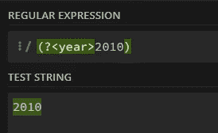
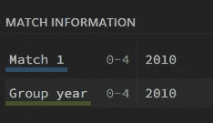
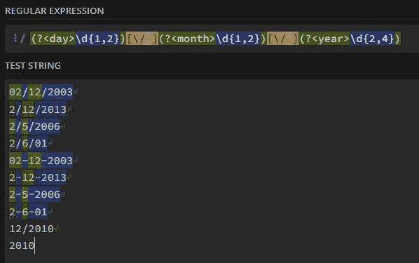
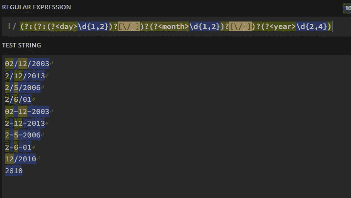
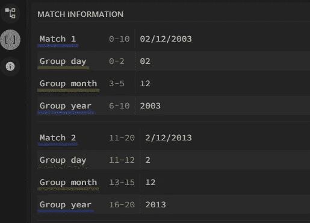

# 你精通正则表达式吗？如果没有，你可以试试这个

> 原文：<https://medium.com/mlearning-ai/test-your-regex-skills-c867dfd6538f?source=collection_archive---------8----------------------->

在本文中，我将带您了解一个问题，如果您不够熟练，在提供资源的同时，您必须使用 regex 来解决这个问题。在寻找解决方案之前，确保花大量时间尝试解决问题；否则，你什么也学不到。

Photo by [Crew](https://unsplash.com/@crew?utm_source=medium&utm_medium=referral) on [Unsplash](https://unsplash.com?utm_source=medium&utm_medium=referral)

这篇文章是我的一篇文章[regex 大师手把手](/@brice.vergnou/master-regex-hands-on-81a2ea964e80)的延续，在这篇文章中，我实际上是在教你 regex。如果你需要复习或者在练习过程中遇到困难，一定要检查一下。

 [## 熟练操作正则表达式

### 最后，通过自己的实验来掌握这项技能

medium.com](/@brice.vergnou/master-regex-hands-on-81a2ea964e80) 

提醒一下，你可以使用 [Regex101](https://regex101.com/) 作为练习 Regex 的沙箱，这就是我们将在这个项目中使用的。

# 项目演示

您正在处理一个非常大的数据集，其中列出了日期。但有一个问题:由于收集数据的人并不总是同一个人，所以人们使用的日期格式可能会因人而异。因此，您决定使用 Regex 来统一操作这些日期，而不管它们的格式如何。

您的目标是在 regex 中“编码”这些日期的模式，以便能够捕获它们。您将为每个组(日、月、年)指定一个名称，因此，如果您真的在做这个项目，您可以更容易地操作这些日期(要为一个捕获组指定一个名称，只需添加？<name>开头的括号)。示例:</name>

它在一个名为“year”的组中记录了 2010 年:

# 锻炼

不同的日期格式如下:

*   02/12/2003 ; 2/12/2013 ; 2/5/2006 ; 2/6/01
*   02-12-2003 ; 2-12-2013 ; 2-5-2006 ; 2-6-01
*   12/2010 ; 2010

测试字符串将是上面的日期。你可以从[这个剪贴板](https://pastebin.com/raw/vkS6pL8i)中复制它们

# 解决办法

首先，让我们处理用斜线分隔的完整日期。我们有数字(\d)，介于 1 和 2 之间的数字表示日和月(\d{1，2})，介于 2 和 4 之间的数字表示年(\d{2，4})。它会是这样的:

> \d{1，2}\/\d{1，2}\/\d{2，4}

(反斜杠只是为了转义斜杠，否则，会得到一个错误)

让我们只添加命名的捕获组(确保不要捕获分隔符，我们只需要数字) :

> (? <day>\d{1，2})\/(？ <month>\d{1，2})\/(？ <year>\d{2，4}</year></month></day>

It’s capturing correctly the first format

对于第二种格式，我们需要告诉 regex 这些数字用斜杠或破折号分隔。嗯，方括号允许我们向 regex 指示这个选择，因此更改为:

\/

收件人:

[\/-]

这给了我们:

> (? <day>\d{1，2})[\/-](？ <month>\d{1，2})[\/-](？ <year>\d{2，4})</year></month></day>

现在，我们需要解释日和/或月是可选的。换句话说，这些表达式只能出现一次或零次。那个？量词允许我们表达这个条件。通过改变

> (? <day>\d{1，2})[\/-]</day>

到

> (?:(? <day>\d{1，2})[\/-])？</day>

我们在当天和第一个分隔符周围创建了一个非捕获组，并告诉 Regex:“好吧，我们可能需要这个，但如果它不出现……那也没关系”。类似地，我们可以创建另一个条件来说明日期和月份都是可选的:

> (?:(?:(? <day>\d{1，2})？[\/-])?(? <month>\d{1，2})？[\/-])?(? <year>\d{2，4}</year></month></day>

太好了，它捕捉到了一切！如果你点击“比赛信息”标签，我们所有的日期都会被很好地格式化:

# 课外活动

如果你想了解更多关于正则表达式甚至文本挖掘的知识，你可以查看 Coursera 上的[应用文本挖掘的 Python 课程。](https://www.coursera.org/learn/python-text-mining)

 [## Python 中的应用文本挖掘

### 本课程将向学习者介绍文本挖掘和文本操作的基础知识。本课程以一个…

www.coursera.org](https://www.coursera.org/learn/python-text-mining) 

你可以免费参加这个课程，你只是不能获得证书或验证你的作业。

# 结论

如果你没有看答案就完成了练习，那么恭喜你！即使你没有这样做，你仍然可以通过实验和试图找出为什么你的代码不工作而学到很多东西。在这两种情况下，如果你认为文本挖掘对你的职业生涯很重要，你可以试试我在上面谈到的课程。

感谢阅读这篇文章，当我收到我帮助过的人的消息时，它激励我学习更多来制作内容。你可以在 [Twitter](https://twitter.com/Brice__fr) 或者 [Linkedin](https://www.linkedin.com/in/brice-vergnou/) 上和我联系。

 [## Mlearning.ai 提交建议

### 如何成为 Mlearning.ai 上的作家

medium.com](/mlearning-ai/mlearning-ai-submission-suggestions-b51e2b130bfb)