# 以前所未有的速度为 T&D 大规模测试人工智能

> 原文：<https://medium.com/mlearning-ai/testing-artificial-intelligence-at-scale-for-t-d-faster-than-ever-14a49e1d1ac4?source=collection_archive---------8----------------------->

2020 年 9 月 15 日

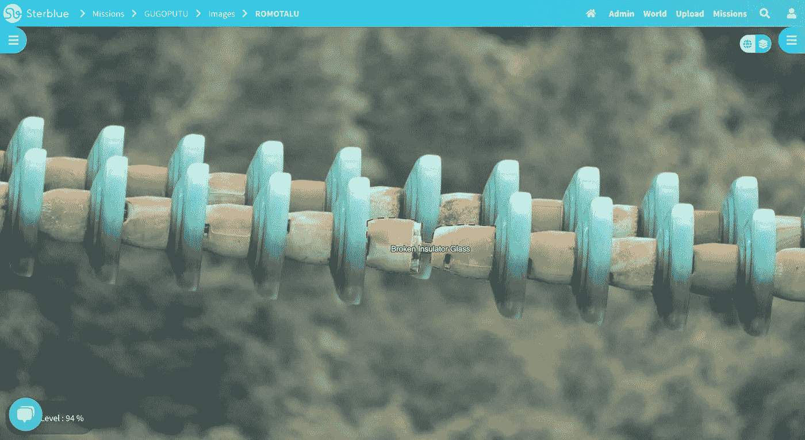

# 1.借助人工智能监控资产健康状况

[世界上最大的输电线路](https://www.power-technology.com/features/featurethe-worlds-longest-power-transmission-lines-4167964/)位于巴西的贝洛蒙特里奥，全长 2543 公里。鉴于[有史以来最高的输电塔](https://economictimes.indiatimes.com/industry/energy/power/worlds-2nd-tallest-power-transmission-towers-in-west-bengal/articleshow/45283238.cms?from=mdr)高达 370 米，可以在中国的大茂山一饱眼福。印象深刻吧。现在试着想象一下这些巨大的资产，分布在一望无际的公里中，被时间老化，暴露在极端的天气条件下，被生长的植物拥抱，被鹳鸟拜访，它们发现它们像市中心的公寓一样有吸引力。很可能会出现缺陷和缺失库存。(图 1)

Figure 1: Examples of defects on transmission towers — corrosion (left) and bird nest (right).

定期检查和监控资产健康是避免严重后果的关键，[像停电和野火。](https://www.sterblue.com/blog-post/automatic-drone-based-inspection-is-a-game-changer-to-prevent-wildfires)无论是使用直升机、智能手机还是无人机摄像机，传输系统运营商(tso)都会定期收集成千上万的信号塔图像，用于事后分析。这使得网络管理员能够比较多年来基础设施的状态，并做出有关预算和维护的决策。但事实是，管理如此大量的数据导致了行业中最大的痛点之一。

3000 公里的发射塔通常会产生约 100 万张照片。仅在法国，就有超过 10 万公里的高压线。你能想象手动存储、分类并逐个检查检查期间拍摄的数百万张照片，以发现只有几毫米宽的问题吗？这是一个极其耗费精力和时间的过程。

‍ [为了克服这一生产力瓶颈，人工智能(AI)是一项非常方便的技术，](https://www.sterblue.com/blog-post/a-real-world-application-of-deep-learning-at-industrial-scale)它有助于加快检测数据分析。该软件解决方案自动在检查图片上突出缺陷和设备，并使业务领域专家能够提供更快、更好的资产健康报告。(图 2)

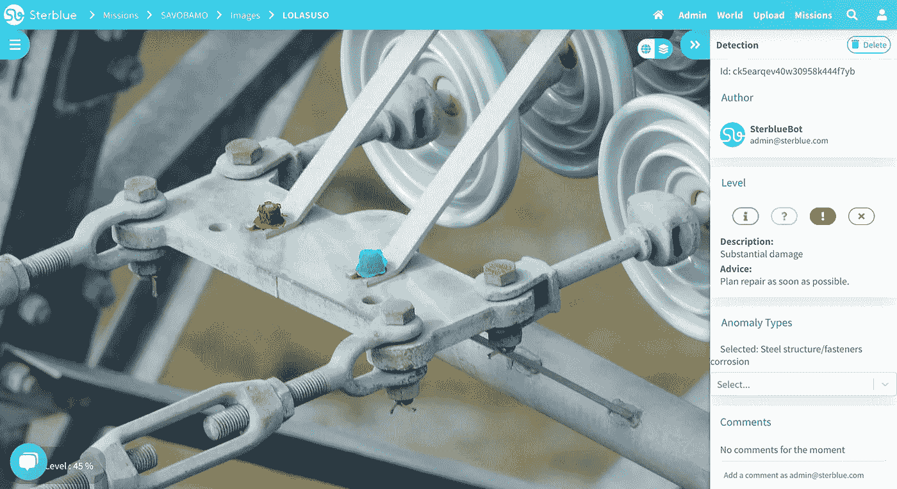

Figure 2: Fasteners corrosion automatically detected by our AI tool in Sterblue Cloud platform.

在接下来的几页中，你将了解人工智能如何超越行业异质性，并在复杂的企业工作流程中快速部署。更准确地说，我们将带您经历 [Sterblue](https://www.sterblue.com/) 的旅程，以解决北欧最大的 tso 之一提出的真实数据挑战。

# 2.接受挑战:仅用 4 天时间培训、测试和部署 Sterblue AI

为了促进人工智能在大公司内部的采用，需要清楚地展示这一工具的优势。能源和公用事业公司希望确保解决方案能够满足他们的需求，并确保投资有实际回报。这样做的一个好选择是启动一个人工智能概念验证(PoC)来评估潜在的业务合作伙伴。通过这种方式，公司可以通过向相关利益相关者展示真实的结果，在内部接受教育，测试和推广人工智能的价值。

2020 年 7 月，一名负责欧洲超过 4 万公里输电线路的 TSO 发起了一项数据挑战，以测试多家供应商的人工智能能力。不言而喻，Sterblue 立即渴望参与。这些是条件:

*   训练阶段将对输电塔的 1，234 张照片进行，其中必须检测 6 种缺陷。
*   之后，人工智能测试将在最长 24 小时内对 405 幅从未见过的图像的验证数据集进行运行。
*   总的来说，必须在不到两周的时间内完成流程并将结果提交给 TSO。

自 2016 年以来，Sterblue 一直在积累与全球多个客户的经验，并为不同类型的资产(包括电网)构建专用的人工智能工具。为了最大限度地发挥项目过程中的协同作用，我们在 Sterblue 云平台中执行了每个步骤。(图 3)

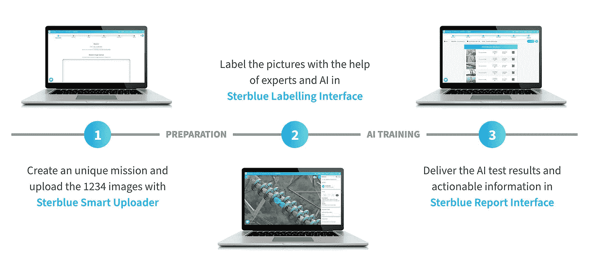

Figure 3: Sterblue process to answer the entire data challenge in Sterblue Cloud platform.

> *“3 年前，我们与能源公司合作的第一个人工智能试点项目通常需要 6 到 8 周才能交付。今天，我们能够做到完全一样的事情，但只需要 4 天，到 2020 年底甚至更短。这些时间节约不仅对 Sterblue 非常有价值，最重要的是，对我们的客户也非常有价值。这个项目是展示它的绝佳机会！”Sterblue 首席执行官杰弗里·万卡斯尔*

# 3.准备:查看数据集的异质性

捕捉好的数据在人工智能的预期结果中起着重要的作用。在过去的 4 年里，Sterblue 一直在推广一种愿景，即使用由自动导航软件驱动的现成无人机自动收集数据。尽管如此，转向这种标准化方法仍需要时间，因为传统的检测方法仍然植根于大公司。缺乏信息、投资重点和转换成本是部分原因。(图 4)

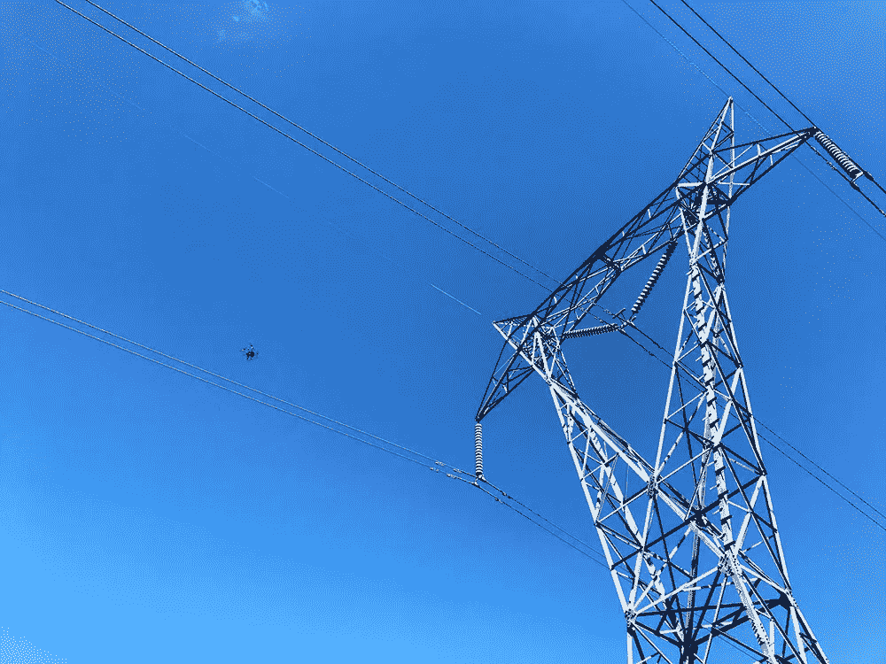

Figure 4: Transmission grid inspection performed with an off-the-shelf DJI drone powered with Sterblue automatic flight technology.

欧洲主要的 TSO 正在利用各种流程和图像来源(智能手机、直升机、无人机)进行检查。这种不一致导致了非常不同的数据集。一般来说，数据湖的质量是该项目的一个具有挑战性的方面，因为:

*   在提供的 1237 幅图像中，只有 44 幅(3.6%)符合 Sterblue 的质量标准(图 5)。
*   文件格式(。jpg，。png 等。)，图像的缩放百分比和大小非常不均匀。
*   照片中有许多不同的发射塔，周围环境各不相同。

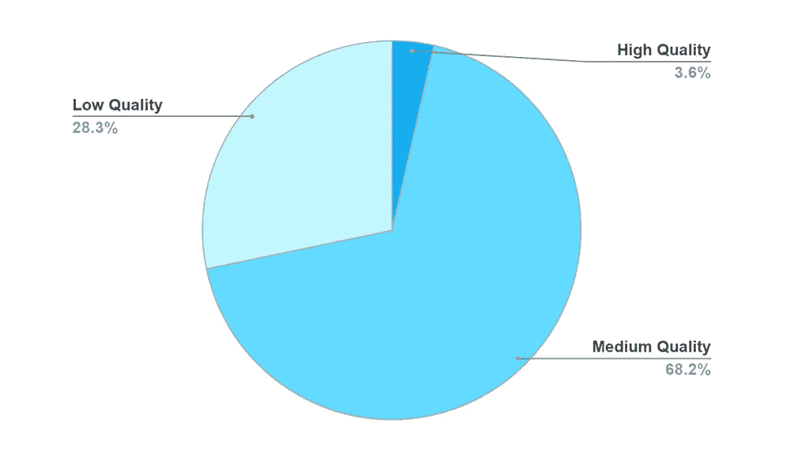

Figure 5: Distribution of the 1237 images according to the quality level.

# 4.标签:将精确的人类专业知识与人工智能相结合

不同的公司有不同的资产管理政策。这种可变性可能取决于许多因素，如国家、塔的类型、天气条件甚至内部规范，如用于对基础设施异常进行分类的术语(缺陷参考 *)* 。(图 6)

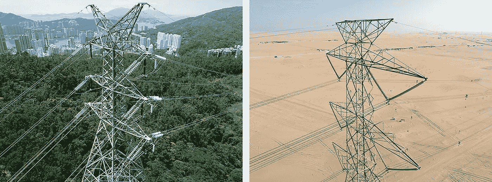

Figure 7: Transmission tower in Hong Kong (left) and in the Middle East (right) captured by Sterblue. Very different environments and, therefore, different problems to monitor.

对于这个挑战，需要 6 种标准类型的标签:生锈的绝缘子、破碎的绝缘子玻璃、污秽的绝缘子、闪络绝缘子、生锈的塔结构和弯曲的塔结构。

在提到的缺陷中，Sterblue 的输电塔专用人工智能工具已经经过训练，可以检测“生锈的绝缘体”和“生锈的塔结构”，因为这些是我们的客户最常问的一些问题。然而，它从来没有被用在大左宗棠的特定塔上，也没有为这次挑战提供 1237 张照片。

Figure 7: Example of a Rusted Tower Structure automatically detected by Sterblue. AI can play an important role to help monitor corrosion, one of the biggest challenges of TSOs.

从客户的角度来看，询问具体的参考信息听起来像是一个基本要求。但对于供应商来说，这提出了一个棘手的问题:我们如何扩展和利用现有的人工智能模型，而不必每次都从头开始？

数据集的差异、不同的塔类型和客户规格可能会使最复杂的算法相形见绌。一刀切的做法是行不通的。根据 Hanna Kerner 为《麻省理工技术评论》撰写的文章，“未能意识到这一点并期望工具“现成”可用的机器学习研究人员，往往最终会创建无效的模型。”

为了克服这个问题，Sterblue 在我们所谓的“通用异常参考”中模拟了每个客户的工业现实。通过这种方式，我们可以将检测结果与我们数据库中的任何可用数据对应起来，这样就没有必要与新客户从头开始，同时考虑不同的现实情况。

要考虑的最后一点是客户要求的标签策略。为了获得准确的结果，一个行业专家团队承担了手动标记整个数据集的重要任务，以便我们的模型能够学习如何在训练阶段自动识别 6 种类型的缺陷。(图 7)

在这种情况下，TSO 仅向我们提供了一份 excel 表格，说明哪些图像上存在哪些异常。或者，换句话说，根本没有标签策略。为了填补这一空白，Sterblue 决定为这 6 种缺陷类型中的每一种都制定最精确、最统一的标签。我们的目标是绘制分段注释，在受损部分周围有精确的边缘，确保在调整我们的算法时没有性能损失。(图 8)

Figure 8: Example of a precise label performed by our experts. In this case it is a broken insulator glass.

在 Sterblue 的专家开始标记 Sterblue 云平台中的 1234 张图片之前，我们让我们预先存在的输电网人工智能分析数据集，并寻找生锈的塔结构和生锈的绝缘体。虽然我们的模型从未见过这些图片或塔，但它仍然能够自动检测 866 个提到的缺陷。考虑到腐蚀点是最主要的检测点，这是一个重要的帮助。之后，我们的行业专家团队又进行了 2416 次人工注释。平均每幅图像增加 2.6 次检测。(图 9)

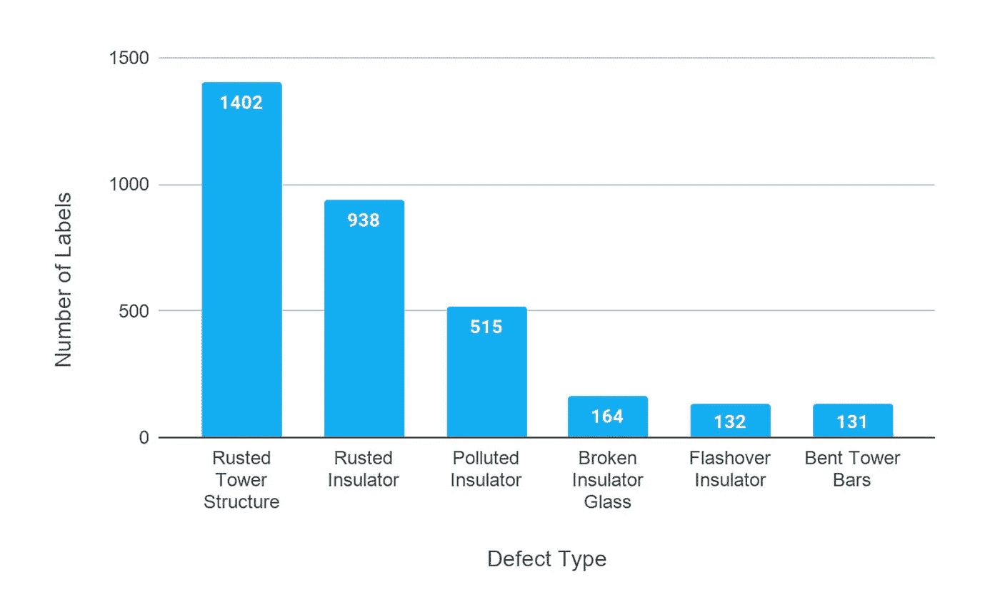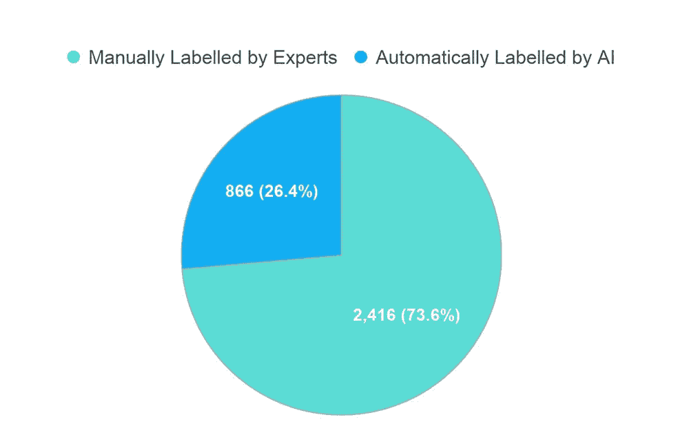

Figure 9: Number of labels added to the entire data set, distributed by defect type (up). Around 26,4% of these findings were automatically detected by the AI (down).

# 5.培训:根据客户的规格定制人工智能

接下来的自然步骤是在挑战数据集上训练 Sterblue 的专用神经网络。该模型需要多次迭代来学习如何解释每个图像的特征，并调整可能的决策路径，直到收敛到理想的路径。首先，Sterblue 对算法进行了一些微调和优化，最大限度地减少了偏离预测的可能性，即所谓的“损失函数”。然后，对 90%的图像(随机选择)进行训练，剩下的 10%用于验证目的。虽然这一决定可能会稍微限制训练潜力，但它也使 Sterblue 能够更好地监控和调整模型参数。

如前所述，回到 2016 年，当 Sterblue 成立时，为一个新客户培训我们的 AI 曾经是一个缓慢而漫长的过程。今天，我们可以在 4 天内完成这项挑战的标记和培训阶段。最后一个阶段是在 405 张图像的验证数据集上测试我们的人工智能能力，其中 Sterblue 花费了不到 1 个小时(超过 24 小时的期限)。这只能归功于我们最先进的训练系统和我们专用的人工智能工具所达到的成熟水平。(图 10)

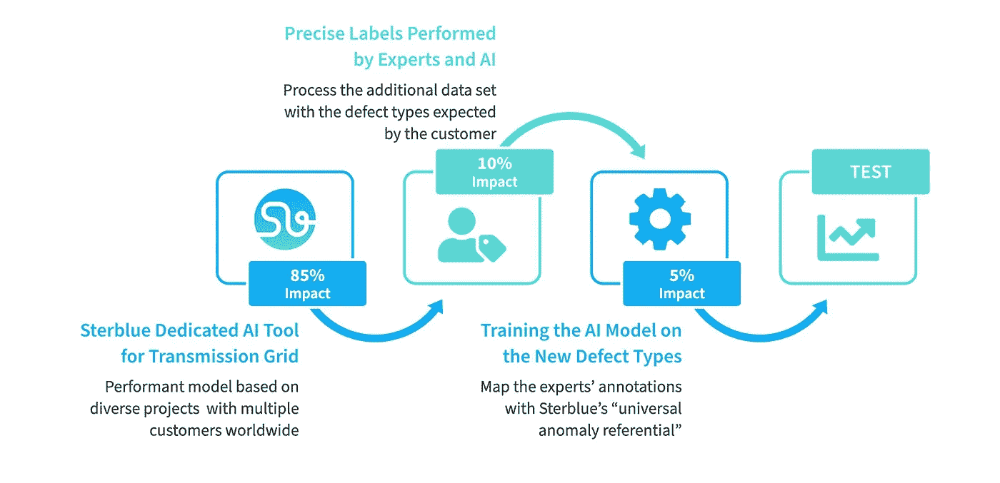

Figure 10: Leveraging on Sterblue’s dedicated AI tool to complete this project in only 4 days. The percentages refer to the impact of each stage on the final performance.

> *“ster blue 的专用 AI 工具越来越成熟！事实上，我们可以利用现有的模型来加速标签和训练过程，这是更快地部署人工智能的关键。很快，这种性质的项目只需几分钟就能完成:在 Sterblue 云平台中拖放图像的时间！”Sterblue 首席执行官杰弗里·万卡斯尔*

# 6.绩效:根据微调的 KPI 评估 AI

在评估人工智能时，有两个重要的关键绩效指标(KPI):*&*。召回给出了现实生活中被人工智能成功发现的缺陷的比率。例如，如果在一个传输塔上出现的 100 个异常中，AI 检测到 90 个(真阳性)和错过 10 个(假阴性)，召回将等于 90%。考虑到能源基础设施的重要性，召回是最重要的检索指标。未能识别和修复网络问题可能会导致严重后果。**

**另一方面，精确度指的是检测的相关性。换句话说，在 AI 指出的所有检测中，精度衡量哪些是实际缺陷(真阳性)，哪些不是(假阳性)。假设人工智能检测到 100 个事件。如果其中只有 70 个是真正的异常，那么精度将等于 70%。Sterblue 也做了很大的努力来优化这个指标，因为我们不想让我们的用户被错误的警报淹没。在最佳情况下，所有检测都是相关的(精度=100%)，并且 AI 不会遗漏任何检测(召回率=100%)。(图 11)**

**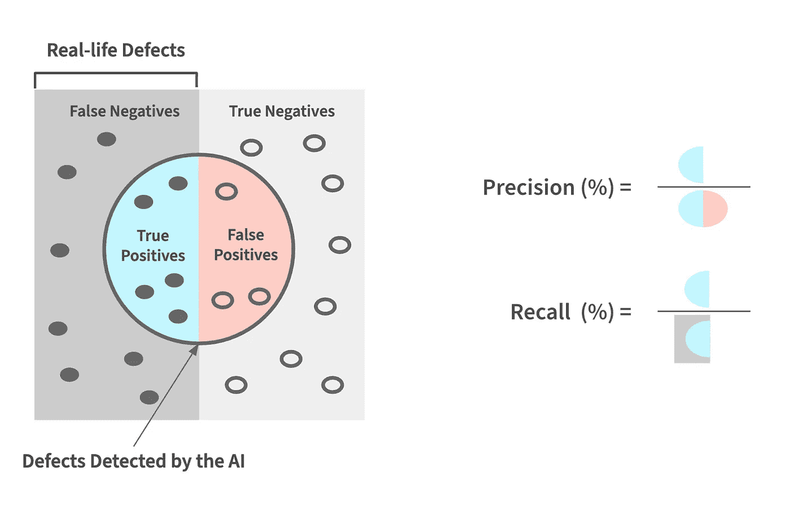**

**Figure 11: Chart explanation of Precision and Recall.**

**精确度和召回率被表示为另外两个指标的函数。并集上的交集(IOU)阈值考虑了检测和基础事实(真实缺陷)之间的重叠，以确定预测是否可以定义为真阳性。选择的 IOU 越高，精确度和召回率就越低。而置信分值阈值给出了一致的置信水平，从该置信水平开始检测被考虑用于评估。(图 12)**

****

**Figure 12: Chart explanation of Intersection Over Union (IOU) (left) and Precision and Recall as a function of this indicator (right).**

**保留 10%的训练数据集对于计算这些指标至关重要，因此可以在测试阶段调整模型以实现最佳性能。根据缺陷的类型，查全率和查准率分别在 44%和 83%以及 60%和 100%之间波动。(图 13)**

**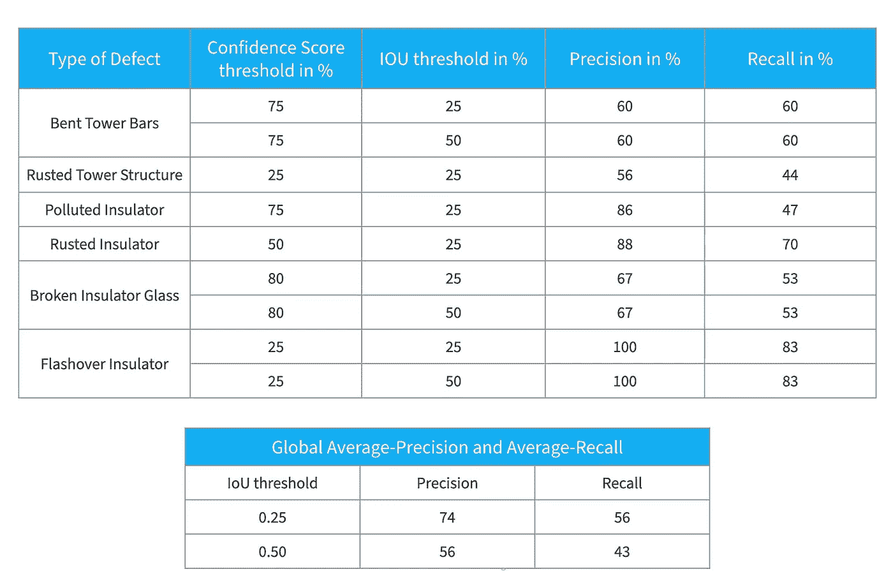**

**Figure 13: Values for Recall and Precision according to a given Confidence Score threshold and Intersection Over Union (IOU) per defect (up) and global-average (down).**

**在正常情况下，Sterblue 仅在两个 KPI 中达到至少 80%的生产异常时推出，除非客户要求不同的标准。然而，这项挑战的目标不是直接实施解决方案，而是展示人工智能在短期内的可扩展性，并为客户提供一些清晰的视角。考虑到小数据集、差的图像质量和缺乏标签说明，这些实际上是非常积极的结果。**

# **7.附加值:利用人工智能提高生产力和可靠性**

**为了评估人工智能的生产力收益，Sterblue 决定监控我们的专家在有和没有人工智能支持的情况下标记每张图片所花费的时间。这特别有趣，因为在这个项目中，1237 张图片的初始数据集在图像质量和标签说明方面与最终验证数据集非常相似。事实上，情况可能并不总是如此。**

*   **当标记训练数据集时，行业专家报告说，在人工智能没有检测到的图像上平均花费了接近 2 分钟。**
*   **然而，当验证人工智能对测试数据集的 405 张图片执行的自动注释时，专家平均每张图片花费 36 秒。(图 14)**

**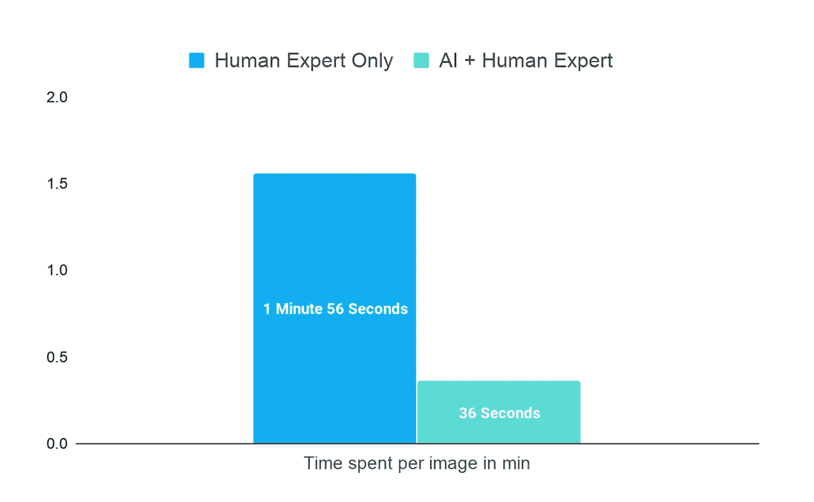**

**Figure 14: Comparison of the time spent labelling per image with and without the help of the AI. A time-saving of 68% is achieved with the AI.**

**这意味着当使用人工智能来支持分析时，可以节省 68%的时间。试着想象一下，一个人花几个小时检查和标记数千张图片。很自然，他/她的注意力水平开始下降，潜在的错误开始出现。当你把合格的工人和强大的工具结合起来时，真正的效率就产生了。从长远来看，专家将能够更快地迭代新到达的数据，从而以更高的频率进行检查。**

**将人工智能工具集成到检测工作流程中的优势远远超出了本白皮书中介绍的小样本。如果主要的 TSO 决定推进这项技术，其团队的生产力将会大大提高。最重要的是，该公司将能够更好地监控其基础设施网络，确保电力供应的持续可靠性和安全性。**

# **8.前景:将人工智能扩展和集成到检验工作流程中**

**一旦概念验证完成，Sterblue 总是对预期的性能演变进行建模，假设 AI 在未来将获得更多的检查数据(和更多的检测)。在这种情况下，摄取大约 3 个月的图像就足以达到理想的缺陷检测召回率和精确度水平。(图 15 和 16)**

**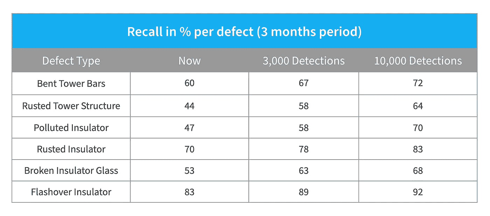******

**Figure 15: Recall (up) and Precision (down) values (in %) evolution over a period of 3 months per defect. Starting from the values calculated during this challenge (now) and computing then the values assuming 3 000 and 10 000 detections.**

**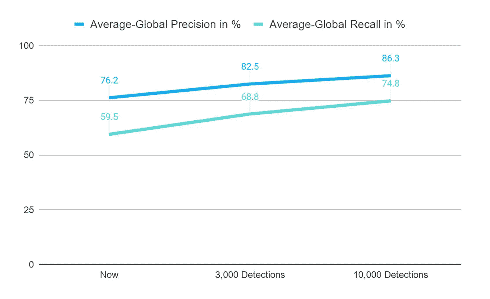**

**Figure 16: Average-Global Precision and Recall values (in %) evolution over a period of 3 months.**

**这实际上是取得更好结果的唯一途径:数据、数据和更多的数据！数据集的大小与模型的性能有着内在的联系，记住一致的图像质量和标记策略的重要性。出于这个原因，强烈建议采用标准化和可追踪的检查方法，比如让无人机沿着自动轨迹飞行。**

**最后，理解人工智能将如何融入组织的工作流程也同样必要。**

*   **公司是否使用内部平台进行图像分析？**
*   **人工智能的结果会反馈给另一个管理系统吗？**
*   **客户在寻找哪些使用案例？缺陷检测？库存管理？植被管理？**

**这些是 Sterblue 在与客户进行近距离评估时提出的问题示例。目标是确保资产管理工作流程的每一步都顺利运行，包括相关的输入和输出。在这里，多功能性再次成为关键。对于一些客户来说，Sterblue [为整个检测过程](https://www.sterblue.com/blog-post/sterblue-in-australia)提供了一个中央平台，而对于其他客户来说，我们只是提供价值链的一个单独步骤，比如我们的人工智能工具。(图 17)**

**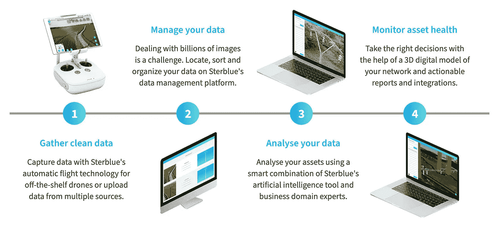**

**Figure 17: Inspection workflow recommended by Sterblue, as the central platform for infrastructure inspection and management.**

# **9.满足顾客需求的人工智能**

**在不到一周的时间内，Sterblue 能够准备、训练和测量超过 1，500 幅图像的数据集，同时为客户节省了超过 60%的时间。这要归功于[我们的一套可定制工具，这些工具适用于大范围的用例，并由我们的工程团队不断改进。](https://labs.sterblue.com/)到 2020 年底，我们预计只需几分钟就能取得更加宏伟的成果。**

**人工智能要达到生产水平的性能需要一个漫长、苛刻和高度结构化的旅程。大量的好数据、高质量的标签和行业专业知识，加上出色的算法和工程工作，是构建高性能模型的一些关键因素。但最终，如果您不能适应不同的客户现实和电气基础设施类型，该解决方案就没有可扩展的应用。**

**在不断增长和快速变化的能源市场中，销售一项革命性的技术已经不足以为之奋斗了。当您解决客户需求时，真正的价值就增加了。**

**这份白皮书是根据 Sterblue 团队的几位成员所做的出色工作编写的。也可以在 [Sterblue 的网站](https://www.sterblue.com/white-papers/artificial-intelligence-transmission-defect-detection-white-paper)上查看**