# 自然语言处理模型的文本数据预处理

> 原文：<https://medium.com/mlearning-ai/text-data-preprocessing-for-nlp-model-4c030a7ab476?source=collection_archive---------1----------------------->


Floor cleaning photo created by rawpixel.com — [www.freepik.com](http://www.freepik.com)

# ❓为什么文本数据预处理很重要？

T 自然语言处理(NLP)的目标是让计算机像人类一样理解文本和口语。

自然语言处理将统计、机器学习和深度学习模型应用于大量文本数据，以理解说话者或作者的意图和情感。

输入数据会极大地影响自然语言处理模型的性能。在将文本数据馈送到模型之前，从文本数据中去除噪声至关重要，以减少不必要的计算并提供干净的数据。

# 📖本文内容

*   删除重音字符
*   扩张收缩
*   删除 URL 和 HTML 链接
*   删除号码
*   删除停止词
*   删除提及
*   删除标签
*   删除标点符号
*   词干和引理化
*   更改为小写
*   删除剩余的空白

# 📥要求

*   安装 Python

**需求库**

请确保安装了这些库。
您可以通过命令行或 Anaconda 提示符，键入以下命令来安装库。

```
pip install <library_name>
```

*   熊猫
*   [unicode 数据](https://docs.python.org/3/library/unicodedata.html):用于删除重音字符的步骤
*   [re](https://docs.python.org/3/library/re.html) :移除提及和移除标签步骤的正则表达式
*   收缩:对于扩张收缩步骤
*   [nltk](https://www.nltk.org/) :著名的 NLP 库

# 💽资料组

本文中使用的数据来自

 [## 卡格尔:您的数据科学之家

### Kaggle 是世界上最大的数据科学社区，拥有强大的工具和资源来帮助您实现数据…

www.kaggle.com](https://www.kaggle.com/datasets/datatattle/covid-19-nlp-text-classification/download) 

这些数据是在疫情节期间从推特上收集的，将情绪分为非常积极、积极、中立、消极和非常消极。

此数据集包含 41157 行和 5 列。


data sample

您可以使用熊猫加载此数据。read_csv

```
import pandas as pdfile location = "C:/Corona_NLP_train.csv"
train =pd.read_csv(file_location, encoding = "ISO-8859-1")
```

在本文中，我将只关注“原始 weet”列，即文本数据。

```
train['text'] = train['OriginalTweet'].astype(str)
[print("*** "+x) for x in train['text'][:4]]
```

这是我们的文本数据中的 4 个样本(***用于分隔样本)。

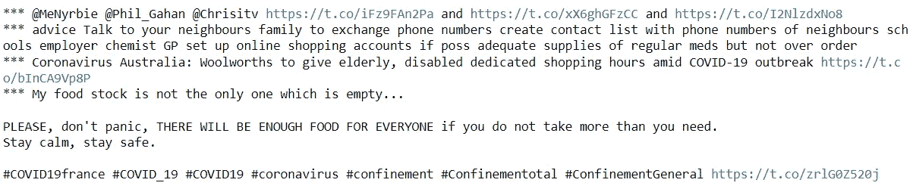

我们的数据很脏。让我们看看如何清洁它！

# 删除重音字符

> 将 **é** 转换为 **e**

发音符号，通常松散地称为“口音”，是各种各样的小点和曲线，在许多语言中，写在字母表的某些字母的上面、下面或上面，以表示它们的发音。

通常，重音符号对单词的意思没有影响。如果我们不删除这些发音符号，模型会将有或没有重音符号的单词视为不同的单词，而它是同一个单词。

我使用 unicodedata.normalize 来处理带有重音字符的文本数据。

```
import unicodedatadef remove_accent(text):
    try:
        text = unicode(text, 'utf-8')
    except NameError:
        pass
    text = unicodedata.normalize('NFD', text).encode('ascii', 'ignore').decode("utf-8")
    return str(text)train['text']=train['text'].apply(lambda x: remove_accent(x))
```

# 扩张收缩

> 将**非**转换为**非**

缩写是像 are not 或 don't 这样的单词的缩写形式。它会误导计算机的理解。该模型将把一个缩略词和一个扩展词视为两个独立的词。如果我们去掉标点符号，去掉撇号，情况会更糟。

在这一步，我使用了收缩库，它有一个收缩和展开的收缩字典。

这是缩略词典。

```
import contractionscontractions.contractions_dict
```

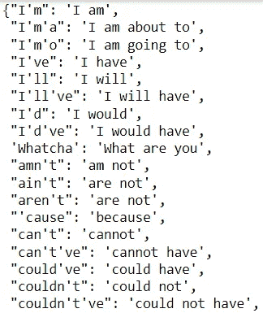

使用 contractions.fix 扩展收缩。

```
train['text']=train['text'].apply(lambda x: contractions.fix(x))contractions.contractions_dict
```

# 删除 URL 和 HTML 链接

URL 和 HTML 通常与句子的意思无关，所以被认为是噪音。

首先，我使用 re 库来执行一个正则表达式。

> 在处理正则表达式的时候，我会写 **2 个函数** : 1 个函数用来检查数据集中是否存在指定的模式，另一个函数用来执行一个动作。

在下面的代码中，check_urls 函数用于查找所有匹配模式的文本(以 http://或 www。).remove_urls 函数将删除所有匹配该模式的文本。

将显示 check_urls 和 remove_urls 函数的示例结果(***用于分隔 tweets)。

```
import redef check_urls(text):
    return re.findall(r'https?://\S+|www\.\S+',text)def remove_urls(text):
    url_remove = re.compile(r'https?://\S+|www\.\S+')
    return re.sub(r'https?://\S+|www\.\S+','',text)train['check']=train['text'].apply(lambda x:check_urls(x))
print("-----check-----")
[print(x) for x in train['check'][:4]]train['text']=train['text'].apply(lambda x:remove_urls(x))
print("\n-----result-----")
[print("*** "+x) for x in train['text'][:4]]
```

结果。

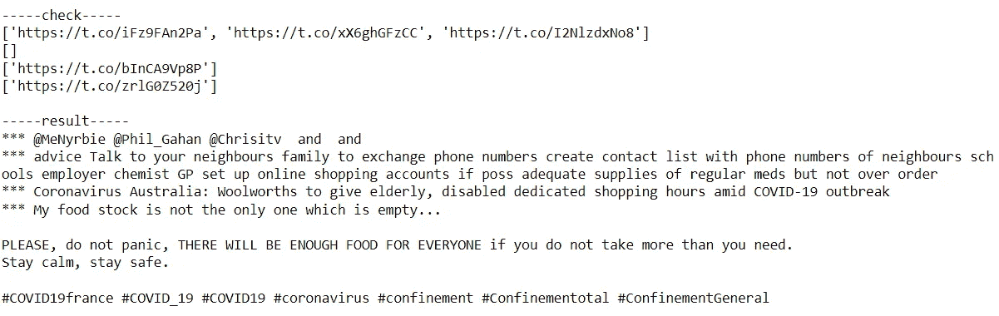

# 删除号码

如果你认为文本中的数字没有重要意义，你可以删除它们。

我用与上一步相同的步骤再次使用 re。

```
def check_num(text):
    return re.findall(r'\d+',text)def remove_num(text):
    return re.sub(r'\d+','',text)train['check']=train['text'].apply(lambda x:check_num(x))
print("-----check-----")
[print(x) for x in train['check'][:4]]train['text']=train['text'].apply(lambda x:remove_num(x))
print("\n-----result-----")
[print("*** "+x) for x in train['text'][:4]]
```

结果。

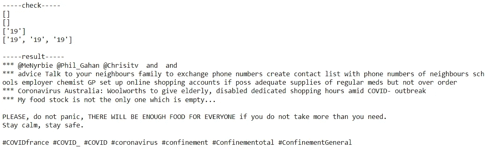

# 删除停用词

> 去掉常用词如 **a、**

停用词是任何语言中的一组常用词。停用词(不重要的词)被删除，以使模型能够专注于重要的词。

幸运的是，我们在 nltk 库中已经有了一个停用词列表。

停用词列表如下所示。

```
from nltk.corpus import stopwords", ".join(stopwords.words('english'))
STOPWORDS = set(stopwords.words('english'))
STOPWORDS
```

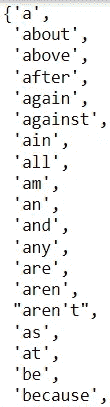

Stopword samples

remove_stopwords 函数将返回文本数据中不在非索引词列表中的单词列表。

```
def remove_stopwords(text):
    """custom function to remove the stopwords"""
    return " ".join([word for word in str(text).split() if word not in STOPWORDS])train['text']=train['text'].apply(lambda x:remove_stopwords(x))
print("\n-----result-----")
[print("*** "+x) for x in train['text'][:4]]
```

结果。

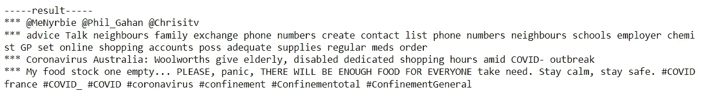

# 删除提及

> 删除社交媒体文本中的提及( **@** )。

来自 Twitter 或脸书等社交媒体的文本数据可能包含对其他账户的提及。大部分提及与文本意义无关，我们可以去掉。

我使用 re 查找以@开头的单词，并使用与删除 URL 和 HTML 链接步骤相同的过程。

```
def check_mention(x):
    return re.findall(r'@\w+',x)def remove_mention(x):
    return re.sub(r'@\w+','',x)train['check']=train['text'].apply(lambda x:check_mention(x))
print("-----check-----")
[print(x) for x in train['check'][:4]]train['text']=train['text'].apply(lambda x:remove_mention(x))
print("\n-----result-----")
[print("*** "+x) for x in train['text'][:4]]
```

结果。

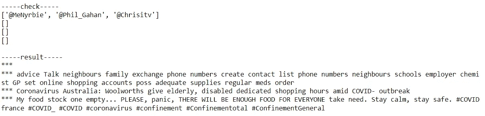

# 移除标签

> 删除社交媒体文本中的标签( **#** )。

来自 Twitter 或脸书等社交媒体的文本数据可能包含标签，以表明他们正在谈论的话题。大多数标签与文本意义无关，所以我们可以删除它们。

我使用 re 查找以#开头的单词，并使用与删除 URL 和 HTML 链接步骤相同的过程。

```
def check_hash(text):
    return re.findall(r'#\w+',text)def remove_hash(text):
    return re.sub(r'#\w+','',text)train['check']=train['text'].apply(lambda x:check_hash(x))
print("-----check-----")
[print(x) for x in train['check'][:4]]train['text']=train['text'].apply(lambda x:remove_hash(x))
print("\n-----result-----")
[print("*** "+x) for x in train['text'][:4]]
```

结果。

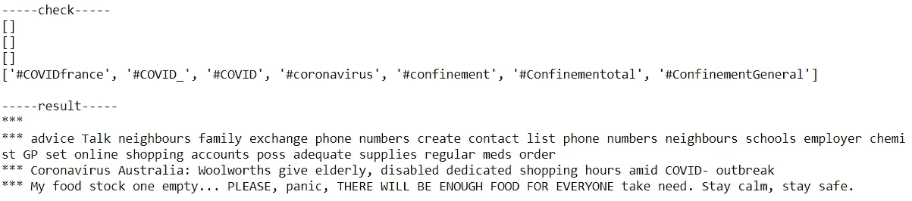

# 删除标点符号

> 拆下**。；**
> 
> T 该步骤必须在展开缩写、移除提及和移除标签步骤之后执行。

标点符号是书写中用来分隔句子及其成分并阐明意思的符号，如句号、逗号和括号。

标点符号对于人类理解内容可能是至关重要的，但是对于机器来说，当标点符号存在时，很难对文本数据进行统计。

我使用 re 来查找标点符号，并使用与删除 URL 和 HTML 链接步骤相同的过程。

```
def check_punct(text):
    return re.findall(r'[^\w\s\d]',text)def remove_punct(text):
    return re.sub(r"[^\w\s\d]","", text)train['check']=train['text'].apply(lambda x:check_punct(x))
print("-----check-----")
[print(x) for x in train['check'][:4]]train['text']=train['text'].apply(lambda x:remove_punct(x))
print("\n-----result-----")
[print("*** "+x) for x in train['text'][:4]]
```

结果呢

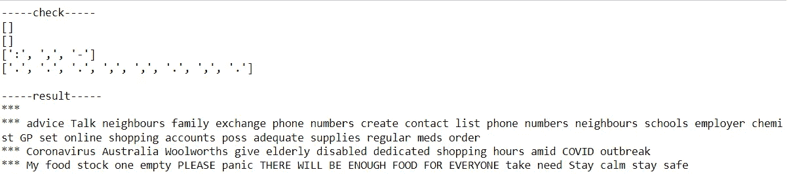

# 词干化和词汇化

> 将**运行**改为**运行。**

词干化和词汇化的目的是一样的，都是将单词简化为它的词根，例如 run，run 是从与 run 相同的单词派生出来的。

这两者的区别在于，
**词干**只是移除或阻止一个单词的最后几个字符**，经常导致不正确的意思和拼写。
**引理化**考虑**上下文**并将单词转换为其有意义的基本形式，这称为引理。**

**词汇化的计算代价很高，所以如果你有一个很大的数据集，并且性能是一个问题，那么就使用词干。**

**由于我的数据集并不大，我就实现了引理化。**

**nltk 库提供了一个单词分类器。我会把一个句子拆分成单词，每个单词在再次连接到句子之前都会被词条化。(您可以调整这段代码来实现词干。)**

```
from nltk.stem import WordNetLemmatizer# nltk.download('wordnet')
wordnet_lemmatizer = WordNetLemmatizer()
def lemmatizer(text):
    lemm_text = ' '.join([wordnet_lemmatizer.lemmatize(word) for word in text.split()])
    return lemm_texttrain['temp'] = train['text'].apply(lambda x:lemmatizer(x))
[print("*** "+x) for x in train['text'][:4]]
```

**引理化后的结果。**

**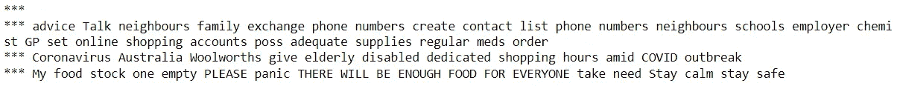**

# **改为小写**

> **将 A 更改为 A**

**使用 lower 函数更改为小写。**

```
train['text']=train['text'].apply(lambda x: x.lower())
[print("*** "+x) for x in train['text'][:4]]
```

**结果。**

**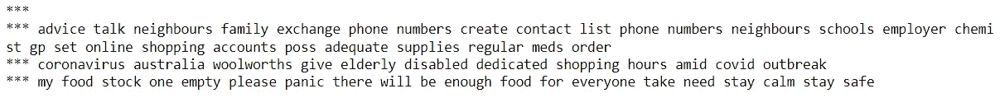**

# **删除多余的空白**

**在我们执行前面的数据准备步骤后，单词之间可能会留下空白。**

**我用 re 来解决这个问题。**

```
def remove_space(text):
    return re.sub(r"\s+"," ",text).strip()train['text']=train['text'].apply(lambda x:remove_space(x))
print("\n-----result-----")
[print("*** "+x) for x in train['text'][:4]]
```

**结果呢**

****

**请注意，没有必要完成所有步骤。每个预处理步骤都可能导致信息丢失。例如，标签可以告诉演讲者/作者的情绪，或者大写的单词可以是兴奋的标志。因此，了解您的问题和背景以找到最佳的数据预处理方法非常重要。**

# **结论**

**数据预处理对于自然语言处理模型的训练非常重要。在本文中，您将学习基本的文本数据预处理，包括扩展缩写、删除重音字符/数字/停用词/URL 和 HTML 链接/提及/标签/标点/额外空格、词干和词汇化、更改为小写**

**数据清理完成后，在数据为模型训练做好准备之前，下一步是标记化。我将在下一篇文章中讨论这个问题。**

**如果您觉得这篇文章有帮助，请关注我以获得更多关于数据科学的文章。**

**[](/mlearning-ai/mlearning-ai-submission-suggestions-b51e2b130bfb) [## Mlearning.ai 提交建议

### 如何成为 Mlearning.ai 上的作家

medium.com](/mlearning-ai/mlearning-ai-submission-suggestions-b51e2b130bfb)**