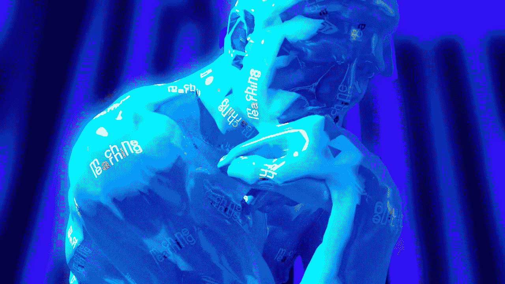

# 文本到 3D 的生成

> 原文：<https://medium.com/mlearning-ai/text-to-3d-generation-cb8ce2c7f0f7?source=collection_archive---------0----------------------->

## [机器学习艺术](https://mlearning.substack.com)

## [人工智能能创造 3D 模型吗？](https://mlearning.substack.com/p/can-ai-generate-3d-models?r=z7zu8&s=w&utm_campaign=post&utm_medium=web)

[Dalle2’s competitive, quick and free alternative](https://mlearning.substack.com/p/dalle2s-competitive-quick-and-free?r=z7zu8&s=w&utm_campaign=post&utm_medium=web)

## [文本到三维建模有前途吗？](https://mlearning.substack.com/p/can-ai-generate-3d-models?r=z7zu8&s=w&utm_campaign=post&utm_medium=web)

未来对于 3D 模型**来说是一个令人兴奋的地方，公众和专业人士将能够与它们互动并创造它们。虽然已经有一些优秀的文本给 [3D 建模](https://mlearning.substack.com/p/seeing-things-that-arent-in-the-cameras?sd=pf)工具使用，但是…**