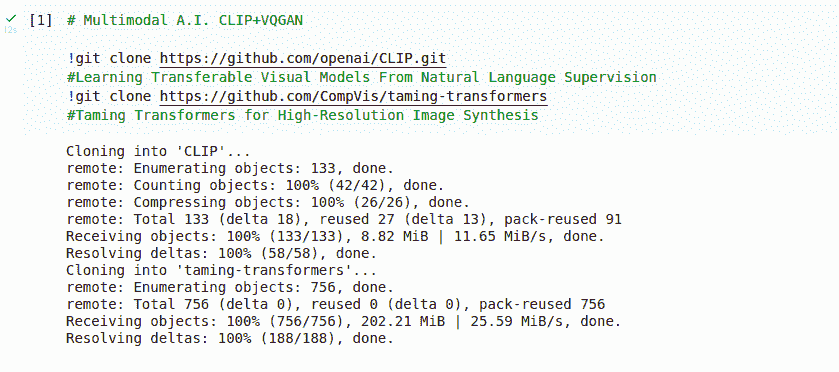
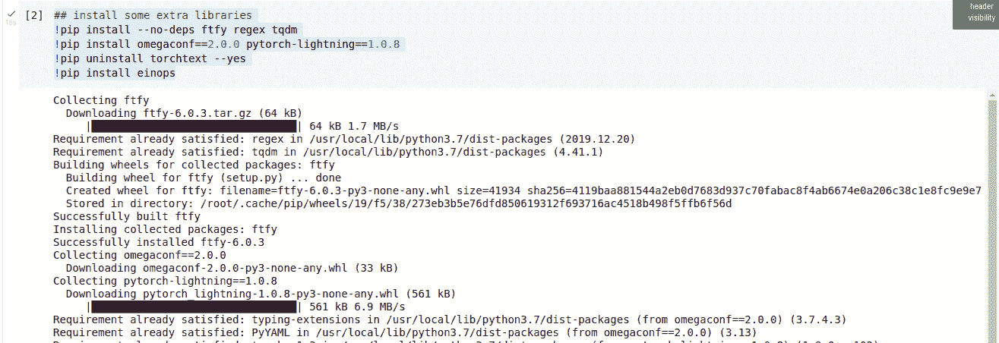
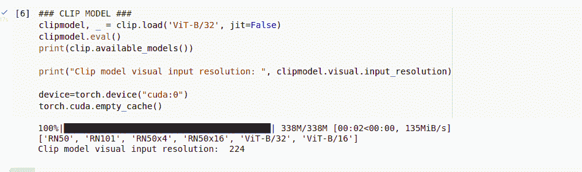
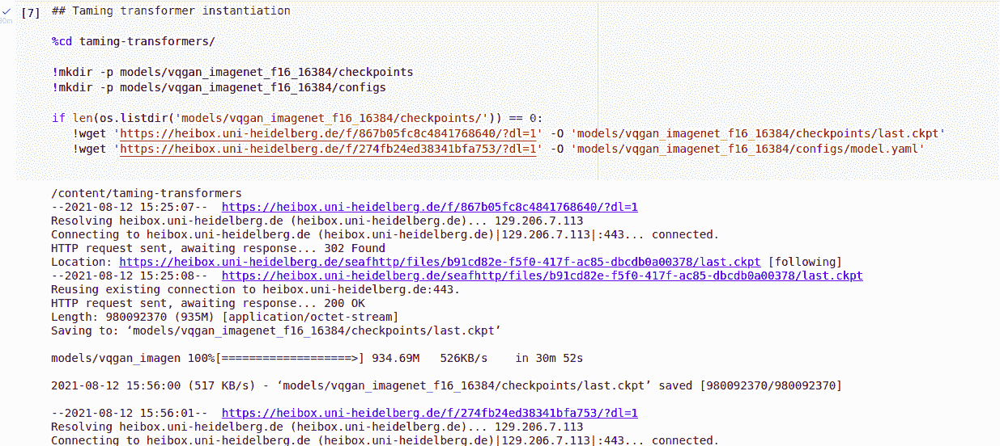
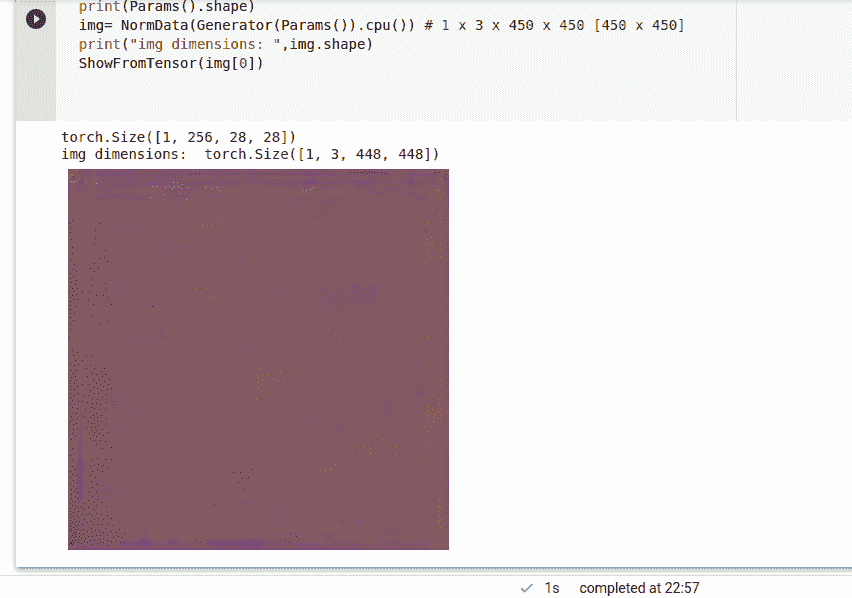
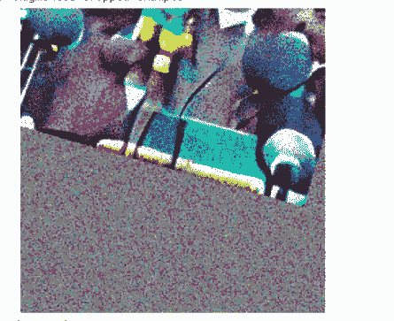
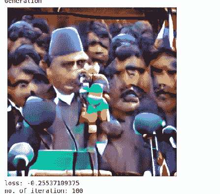
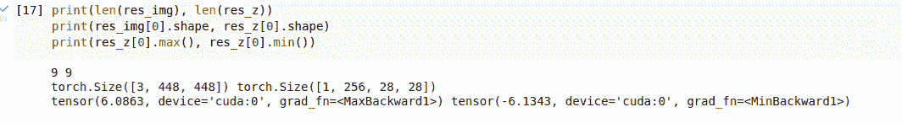
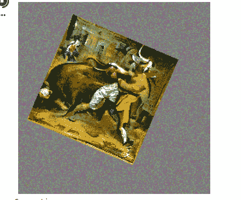
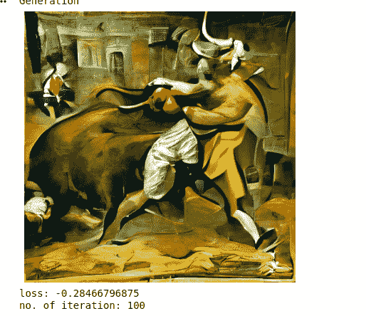

# 使用多模态(VQGAN + CLIP)架构的文本到图像合成

> 原文：<https://medium.com/mlearning-ai/text-to-image-synthesis-using-multimodal-vqgan-clip-architectures-fab2d243f9dd?source=collection_archive---------2----------------------->


After synthesis of text input “A man fighting with a bull”

怎么了，伙计们！！

这是我在媒体上的第一个故事。

今天，我将使用一个名为 **clip** 的多模态深度学习架构来做一个 GAN 项目，该项目将文本与视觉元素相链接。我将把它与一个生成模型结合起来，一个转换类型的架构，这样我就可以接受文本提示并生成视觉和图像，甚至可以根据文本提示制作视频序列。

你可以和我一起做。让我们开始吧:

我将与两个尖端的生成架构合作，它们将允许我们进行多模态生成。连接不同模态的能力，在这种情况下，是文本和图像。文本和视觉元素结合了两种架构: **CLIP** 架构(OpenAI)和驯服变形金刚

# **夹**架构:

从自然语言监督和**剪辑**中学习可转移的视觉模型意味着**C**ontrastive**L**language**I**mage**P**再训练。

经训练的模型预测哪种文本编码以及哪种文本编码对应于哪种视觉编码的哪种编码。

【*来源:* [*回形针 GitHub、*](https://github.com/openai/CLIP) [*回形针*](https://arxiv.org/abs/2103.00020) *、* [*博客*](https://openai.com/blog/clip/)

# **驯服变形金刚:**

一种生成式架构，可以创建和发明文本，以便在文本提示后显示越来越多的文本。这是一种不同类型的变压器，使用一种称为 VQGAN 的架构。它将卷积架构的元素与 GAN 类型的元素相结合。它使用密码本，处理补丁。

创建文本元素序列并不十分困难，但是图像具有非常大的像素数量，这导致在变形金刚中创建长序列。

但是我们可以通过使用补丁来解决这个问题。16×16 像素片，这样我们就降低了问题的维度。

Codebook 训练网络来学习矩阵，而不是直接处理像素。它学习存储在码本中的图像部分的各种表示，然后当它通过解码器生成时，它通过获取码本的部分来工作。(它有不同的部分，卷积，解码器等。)

# **优化过程:**

获取**文本短语**并通过 CLIP 架构对其进行编码。并获得 512 个数字的编码(架构的编码，对该文本的剪辑架构的理解)。对图像做同样的事情，但不是按原样发送图像，而是放大、旋转、移动或创建裁剪图像(20，30，40，50，…)。).在这种情况下，我将创建 30 种不同的作物。这样做是为了通过给它多个版本来帮助架构更好地理解图像。因此，我将发送 30 组图像剪辑(带有特定的旋转、平移)并对这些剪辑的理解进行编码。30 组编码或 512 个值。

现在，我将使用函数**余弦相似度**来比较这些编码，这是一个数学函数，用于计算数学向量的相似度。这将有助于计算损耗值，网络的性能。

如果我设法使文本的编码尽可能与图像的裁剪编码相似，这将意味着图像的内容与文本的内容相匹配。

**包含提示:**

我们想要的结果:

*   珠穆朗玛峰上的一只猴子
*   20 个人在天空中滑翔伞
*   两个人在踢足球

**排除提示:**

我们不希望的结果是:

*   不希望图像中有蓝色。
*   不希望图像中有令人困惑的东西。

**额外提示:**

我们希望应用于所有**的内容包括**提示:

例如。

包括提示:

*   一个穿着粉红色夹克的小伙子。
*   下棋的男孩
*   一只绿腿的大象

额外提示:

*   水彩纸纹理

然后水彩纸纹理将适用于所有的包括提示。

将它们发送到 clip 进行编码，并最终在优化过程中计算损失。对包含文本的编码给予一定的权重，并排除那些要惩罚的文本，使得应该被排除的文本应该增加价值，而应该被包含的文本应该减少损失价值。

此外，可以从特定的图像/图片而不是噪声输入开始生成，并在文本提示指定的方向上修改、编辑该图像。

现在，在生成新的图像之后，我将向你们展示在由该过程生成的潜在参数之间创建插值的能力，然后制作一个视频，显示从一个创作到其他创作的插值，然后在屏幕上显示该视频。

# **编码和执行:**

```
!git clone [https://github.com/openai/CLIP.git](https://github.com/openai/CLIP.git)
!git clone [https://github.com/CompVis/taming-transformers](https://github.com/CompVis/taming-transformers)
```

输出:



**安装一些库:**

```
!pip install — no-deps ftfy regex tqdm
!pip install omegaconf==2.0.0 pytorch-lightning==1.0.8 
!pip uninstall torchtext — yes
!pip install einops
```

输出:



**导入库:**

```
# import libraries
import numpy as np
import torch, os, imageio, pdb, math
import torchvision
import torchvision.transforms as T
import torchvision.transforms.functional as TF import PIL
import matplotlib.pyplot as pltimport yaml 
from omegaconf import OmegaConffrom CLIP import clip#import warnings
#warnings.filterwarnings(‘ignore’)
```

**助手功能:**

```
def ShowFromTensor(tensor):
  img = tensor.clone()
  img = img.mul(255).byte()
  img = img.cpu().numpy().transpose((1,2,0))plt.figure(figsize=(10,7))
  plt.axis('off')
  plt.imshow(img)
  plt.show()def NormData(data):
  return (data.clip(-1,1)+1)/2 ### range between 0 and 1 in the result### Parameters 
learning_rate = .5
batch_size = 1
wd = .1 ## weight decay is regularization parameter, help to limit the size of weight and improve generalization capabilities of the architecture
noise_factor = .22 ## .1, .14 ...total_iter=100 ## use more no. of iterations for more polished result 
im_shape = [450, 450, 3] # height, width, channel
size1, size2, channels = im_shape
```

**现在创建一个剪辑模型:**

```
# Create CLIP model
clipmodel, _ = clip.load('ViT-B/32', jit=False)
clipmodel.eval()
print(clip.available_models())print("Clip model visual input resolution: ", clipmodel.visual.input_resolution)device=torch.device("cuda:0")
torch.cuda.empty_cache()
```

输出:



剪辑下载一个预先训练好的模型，所以我们不需要训练剪辑，我们可以继续使用它在推理，eval 模式直接编码文本和图像。

*['RN50 '，' RN101 '，' RN50x4 '，' RN50x16 '，' ViT-B/32 '，' ViT-B/16']* 是 CLIP 可以在内部使用的架构类型。(例如，RN50—50 层 resNet 架构，ViT-B/32 —可视化变压器)

和剪辑模型视觉输入分辨率 224 像素。这意味着，当我们在 CLIP 中编码图像时，我们需要将它们设置为 224 像素。

# **驯服变压器型号:**

```
%cd taming-transformers/!mkdir -p models/vqgan_imagenet_f16_16384/checkpoints
!mkdir -p models/vqgan_imagenet_f16_16384/configsif len(os.listdir('models/vqgan_imagenet_f16_16384/checkpoints/')) == 0:
   !wget '[https://heibox.uni-heidelberg.de/f/867b05fc8c481768640/?dl=1'](https://heibox.uni-heidelberg.de/f/867b05fc8c4841768640/?dl=1') -O 'models/vqgan_imagenet_f16_16384/checkpoints/last.ckpt' 
   !wget '[https://heibox.uni-heidelberg.de/f/274fb24ed3831bfa753/?dl=1'](https://heibox.uni-heidelberg.de/f/274fb24ed38341bfa753/?dl=1') -O 'models/vqgan_imagenet_f16_16384/configs/model.yaml'
```

这里， *vqgan_imagenet_f16_16384* 意味着 vqgan 图像网是用来自图像元数据集 f-16 的图像来训练的，因为该文件是使用每个图像的下采样因子 f16 来命名的。16384 是码本维数。

现在创建两个检查点和配置文件夹(如果它们还不存在)。

这两条链路到目前为止都在尼泊尔工作，但是如果它们在将来不能工作，应该会有一些替代方案。

通过运行这个，它下载海德堡的预训练 VQGAN 模型、最后的检查点和配置信息，这些信息将在 *model.yaml* 文件中。

输出:



现在下载检查点后，让我们实例化驯服变压器 VQGAN 架构。

```
from taming.models.vqgan import VQModeldef LoadConfig(config_path, display=False):
   config_data = OmegaConf.load(config_path)
   if display:
     print(yaml.dump(OmegaConf.to_container(config_data)))
   return config_datadef LoadVQGAN(config, chk_path=None):
  model = VQModel(**config.model.params)
  if chk_path is not None:
    state_dict = torch.load(chk_path, map_location="cpu")["state_dict"]
    missing, unexpected = model.load_state_dict(state_dict, strict=False)
  return model.eval()def Generator(x):
  x = taming_model.post_quant_conv(x)
  x = taming_model.decoder(x)
  return xtaming_config=LoadConfig("./models/vqgan_imagenet_f16_16384/configs/model.yaml", display=True)
taming_model=LoadVQGAN(taming_config,chk_path="./models/vqgan_imagenet_f16_16384/checkpoints/last.ckpt").to(device)
```

首先，使用库 OmegaConf 创建一个用于加载配置的函数，并转储到 YAML 文件以查看配置。

其次，创建另一个函数来加载 VQGAN 模型。将先前导入的模型与配置文件一起使用。包含模型所有参数的 Load state_dict 字典。并使用路径加载检查点，将位置映射到“CPU”。现在将字典加载到模型中。

这里，我们将直接使用一个模型，无需训练，因此将其置于评估或 eval()模式。

第三个也是最后一个函数是生成器。接受输入并从中生成图像。为此，输入通过驯服模型传递，输出传递给解码器。

然后在模型上加载配置。

( ***模型*** 文件夹和我们之前做的一样在 ***驯服-变形金刚*** 文件夹内，所以路径相对于那个文件夹的内容)

输出:


声明我们要优化的值(潜在空间、参数):

```
class Parameters(torch.nn.Module):
  def __init__(self):
    super(Parameters, self).__init__()
    self.data = .5*torch.randn(batch_size, 256, size1//16, size2//16).cuda() # 1x256x28.125x28.125 (450/16, 450/16)
    self.data = torch.nn.Parameter(torch.sin(self.data))def forward(self):
    return self.datadef init_params():
  params=Parameters().cuda()
  optimizer = torch.optim.AdamW([{'params':[params.data], 'lr':learning_rate}], weight_decay=wd)
  return params, optimizer
```

用来自正态分布的随机数初始化数据，参数为批次大小、通道和大小，其中大小根据需要除以 16(16 x 16 个补丁)。对于随机值为 1 的张量，它将是 1x 256 x 28.125 x 28.125 .(450/16 = 28.125，450/16 = 28.125)

这里，乘以 0.5 是因为个人实验发现，在从正态分布获取数据之前，乘以 0.5 是好的。

然后，在递归神经网络中，它们有基于架构本身的元素定位的明确指示，但在转换架构中，你只需一次推送所有数据。这意味着使用周期性数学函数将定位信息嵌入数据中。我们用的是数学正弦。

创建一个转发函数，返回刚刚调用的数据。

最后，创建一个助手函数。在这个调用中，函数(参数)，随叫随到刷新和重置那些参数，然后声明优化器。(Adam optimizer 用于此。)

剪辑架构中文本提示的编码:

```
# Let’s Encode prompts
normalize = torchvision.transforms.Normalize((0.48145466, 0.4578275, 0.40821073), (0.26862954, 0.26130258, 0.27577711))def encodeText(text):
  t=clip.tokenize(text).cuda()
  t=clipmodel.encode_text(t).detach().clone()
  return tdef createEncodings(include, exclude, extras):
  include_enc=[]
  for text in include:
    include_enc.append(encodeText(text))
  exclude_enc=encodeText(exclude) if exclude != '' else 0
  extras_enc=encodeText(extras) if extras !='' else 0return include_enc, exclude_enc, extras_encaugTransform = torch.nn.Sequential(
    torchvision.transforms.RandomHorizontalFlip(),
    torchvision.transforms.RandomAffine(30, (.2, .2), fill=0)  
).cuda()Params, optimizer = init_params()with torch.no_grad():
  print(Params().shape)
  img= NormData(Generator(Params()).cpu()) # 1 x 3 x 450 x 450 [450 x 450]
  print("img dimensions: ",img.shape)
  ShowFromTensor(img[0])
```

这里，在这个架构中需要标准化，因此定义一个变量，并使用已经为我们准备好的平均值、方差值。

创建一个接收文本的函数，然后调用剪辑模型来标记文本。通过模型的编码函数传递结果，并从梯度计算中分离结果，并将克隆结果，以便我们可以在变量上使用自己的内存空间。

现在定义一个通用函数，它将应用于排除、包含和附加的提示。

当发送图像进行编码时，我们不会发送任何图像。我们还发送了一组农作物的图像。声明一个用于图像增强变换的变量。在做了一些随机旋转之后，然后一些平移和剩余的用零填充。

[ **注:** *增强首先应用于生成器生成的单个图像，然后从该输出创建不同的作物。* ]

初始化参数和优化器，并做一个简单的测试，以生成一个图像通过一个变压器发电机与随机的初始参数。调用生成器函数，传递我们之前声明的参数，并将结果返回给 CPU。它将在第一维返回 1，然后是三个通道，448，448。 **( *1 x 3 x 448 x 448 [450，450]但是由于四舍五入，我们得到 448。* )**

输出:



创建作物:

```
def createCrops(img, num_crops=32): 
  p=size1//2
  img = torch.nn.functional.pad(img, (p,p,p,p), mode='constant', value=0) # 1 x 3 x 672 x 672 (adding 112*2 on all sides to 448x448) img = augTransform(img) #RandomHorizontalFlip and RandomAffine crop_set = []
    for ch in range(num_crops):
      gap1= int(torch.normal(1.2, .3, ()).clip(.43, 1.9) * size1)
      offsetx = torch.randint(0, int(size1*2-gap1),())
      offsety = torch.randint(0, int(size1*2-gap1),()) crop=img[:,:,offsetx:offsetx+gap1, offsety:offsety+gap1] crop = torch.nn.functional.interpolate(crop,(224,224), mode='bilinear', align_corners=True)
      crop_set.append(crop) img_crops=torch.cat(crop_set,0) ## 30 x 3 x 224 x 224 randnormal = torch.randn_like(img_crops, requires_grad=False)
  num_rands=0
  randstotal=torch.rand((img_crops.shape[0],1,1,1)).cuda() #32

  for ns in range(num_rands):
    randstotal*=torch.rand((img_crops.shape[0],1,1,1)).cuda() img_crops = img_crops + noise_factor*randstotal*randnormal return img_crops
```

创建一个名为 **createCrops** 的函数。让我们为作物数量值设置默认值 32。在图像周围添加一些填充，以便我们可以旋转，平移和保存图像信息。

让我们将填充设置为高度除以 2 或 3。然后将各边的填充设置为(p，p，p，p)。所以维数会是 1 x 3 x(448+112+112)x(448+112+112)= 1 x 3 x 672 x 672。

现在应用先前声明的增强转换(augTransforms)。设置最初为空的作物。定义一对变量或像素数或数字，用于偏移和裁剪量，这里定义了间隙 1 和间隙 2。

裁剪图像，保持前两个尺寸不变，更改后两个尺寸，用间隙 1 扩展。

将裁剪尺寸调整为 224x224，并累积到我们之前定义的裁剪字典中。分辨率将为 30 x 3 x 224 x 224。

最后，给作物添加一些噪声。具有噪声因子和来自相同维度的正态分布的一些随机值。

**达芬奇 Sfumato** 纹理:-

上面代码中的行实际上是为了 sfumato 效果。(最后你就知道了。)

rand normal = torch . randn _ like(img _ crops，requires _ grad = False)
num _ rands = 0
randstotal = torch . rand((img _ crops . shape[0]，1，1，1))。cuda()*# 32*

for ns in range(num _ rands):
randstotal * = torch . rand((img _ crops . shape[0]，1，1，1))。cuda()
img _ crops = img _ crops+noise _ factor * randstotal * rand normal

【 ***注:*** *达芬奇* [*Sfumato*](https://en.wikipedia.org/wiki/Sfumato#:~:text=Sfumato%20(Italian%3A%20%5Bsfu%CB%88ma%CB%90to%5D,out%2Dof%2Dfocus%20plane.) 】

让我们创建一个函数来查看任何状态下生成的图像:

```
def showMe(Params, show_crop):
  with torch.no_grad():
    generated = Generator(Params()) if (show_crop):
      print(“Augmented cropped example”)
      aug_gen = generated.float() # 1 x 3 x 224 x 400 
      aug_gen = createCrops(aug_gen, num_crops=1)
      aug_gen_norm = NormData(aug_gen[0])
      ShowFromTensor(aug_gen_norm) print(“Generation”)
    latest_gen=NormData(generated.cpu()) # 1 x 3 x 224 x 400
    ShowFromTensor(latest_gen[0]) return (latest_gen[0])
```

这里先不涉及梯度。传递我们用于优化生成器的参数，以在参数的当前状态下生成示例图像。(1 x 3 x 450 x 450)

现在调用 createCrops 函数来创建作物，但只能创建一种作物。将结果标准化并显示。

然后对于生成，最新的生成将正常化我们已经生成的内容。最后，展示图像。

通过调整参数优化模式:

```
# Optimization processdef optimizeResult(Params, prompt):
  alpha=1 ## the importance of the include encodings
  beta=.5 ## the importance of the exclude encodings## image encoding
  out = Generator(Params())
  out = NormData(out)
  out = createCrops(out)
  out = normalize(out) # 32 x 3 x 448 x 448
  image_enc=clipmodel.encode_image(out) ## 32 x 512## text encoding  w1 and w2
  final_enc = w1*prompt+w1*extras_enc # prompt and extras_enc:1x512
  final_text_include_enc = final_enc / final_enc.norm(dim=-1, keepdim=True) #1x512
  final_text_exclude_enc = exclude_enc## calculate the loss
  main_loss = torch.cosine_similarity(final_text_include_enc, image_enc, -1) # 32
  penalize_loss = torch.cosine_similarity(final_text_exclude_enc, image_enc, -1) # 32 final_loss = -alpha*main_loss + beta*penalize_loss return final_lossdef Optimize(Params, optimizer, prompt):
  loss = optimizeResult(Params, prompt).mean()
  optimizer.zero_grad()
  loss.backward()
  optimizer.step()
  return loss
```

让我们创建一个名为 **Optimize** 的函数，它将接收参数、优化器和文本提示的当前状态。计算当前的损失调用函数 **optimzeResult** ，我们要声明。之后，计算每种作物的平均损失，并计算其平均值。将优化器设置为梯度值零，进行反向传播，并使用参数值调整-更新步骤。这是一个优化函数。

现在，定义 **optimizeResult** 函数，该函数将找到驱动 **optimize** 函数的丢失值和最小值。它将接收参数，并提示。分别用值 1 和 0.5 声明一对变量 alpha 和 beta。它们将分别代表包含和排除编码的意义或重要性。(这里，由于 alpha > beta，在编码过程中，include 比 exclude 更重要)

之后，根据参数生成新的图像，并对结果进行归一化。

**【*注:*** *为了计算损失，文本提示的编码* ***和*** *应该比较从潜在空间参数的当前状态生成的图像裁剪的编码。因此，我们需要通过生成器传递参数来生成新的图像，以便对其进行编码。*

**和创建裁剪，用额外的标准化来标准化它们(使图像与裁剪结构相匹配)。然后通过调用剪辑模型来创建图像编码。(32 个作物由 500 个 so 组成，编码维数为 512x512)**

**W1、W2 是包含和附加文本编码的权重。将编码值除以它们的归一化值，使它们处于正确的范围内。**

**现在使用余弦相似性数学函数计算损失。主要损失(包括)，惩罚损失(不包括)。(32 种作物中的每一种将分别与包含文本和排除文本的单一编码进行比较)**

**那么总损失将是两个损失的总和:**

**主要损失乘以 alpha(包括因子)，惩罚损失乘以 beta(不包括因子)。**

**现在是训练循环编码的时候了:**

```
### training loop
def training_loop(Params, optimizer, show_crop=False):
  res_img=[]
  res_z=[]for prompt in include_enc:
    iteration=0
    Params, optimizer = init_params() # 1 x 256 x 14 x 25 (225/16, 400/16)for it in range(total_iter):
      loss = Optimize(Params, optimizer, prompt)if iteration>=80 and iteration%show_step == 0:
        new_img = showMe(Params, show_crop)
        res_img.append(new_img)
        res_z.append(Params()) # 1 x 256 x 14 x 25
        print("loss:", loss.item(), "\nno. of iteration:",iteration)iteration+=1
    torch.cuda.empty_cache()
  return res_img, res_z
```

**创建一个带参数的函数，优化器。初始化每个编码，迭代设置为零。每次调用时初始化参数。**

**计算损失调用先前定义的优化函数。并显示您想要的图像。这里，我将在最终迭代之前显示图像 1 迭代。所以，调用 showMe 函数并声明提示，增加迭代次数。最后可以删除 GPU 的缓存。**

**表演时间到了:**

```
torch.cuda.empty_cache()
include=[‘A primeminister giving a speech in public’]
exclude=’watermark, cropped, confusing, blurry’
extras = “watercolor paper”
w1=1
w2=1
noise_factor= .28
total_iter=1000
show_step=100 # set this to see the result every 100 iterations
include_enc, exclude_enc, extras_enc = createEncodings(include, exclude, extras) 
res_img, res_z=training_loop(Params, optimizer, show_crop=True)
```

**输出:**

**100 次迭代后，裁剪和非裁剪图像结果:**

********

**诸如此类…**

**如果从开始刷新并重新运行，它将在同一步骤中显示不同的图像。这是因为我们使用的是随机过程，而不是确定性过程。**

**检查生成的图像尺寸:**

```
print(len(res_img), len(res_z))
print(res_img[0].shape, res_z[0].shape)
print(res_z[0].max(), res_z[0].min())
```

**输出:**

****

**让我们看另一个例子:**

****包括:**《与公牛搏斗的人》**

****排除:**“水印、模糊、裁剪、混淆、剪切、不连贯”**

****号外:****

********

**太棒了。！**

****【最好的一代不一定是最后一代……也可能是上一代】****

**最后，出现多个提示和结果:**

****包括:** [《与公牛搏斗的人》、《睡在公园里的狗》、《在路上打人的人》]**

****排除:**“水印、模糊、裁剪、混淆、剪切、不连贯”**

****号外:**" "**

**谢谢大家！**