# 使用图像字幕数据集的文本到图像转换

> 原文：<https://medium.com/mlearning-ai/text-to-image-using-an-image-captioning-dataset-282e1c1d8cfd?source=collection_archive---------2----------------------->

在过去的几周里，我一直试图理解如何从图片说明中预测图片，就像你如何在谷歌上搜索图片一样。

在学习扩散和自动编码器技术之前，我想尝试用我所知道的基本技能来解决这个问题。我最初是用解决句子分类或句子生成问题的思维来解决这个问题的。使得图像的名称是标签，并且字幕可以被标记成序列；然后训练序列来预测相应的标签。我首先尝试了一个直接序列来标记组织，但是，当然，对于可用的序列有太多的类别，因此无法构建一个可靠的模型。

接下来，我尝试使用 n 元语法复制句子的一部分，并创建许多相似的句子序列。然后，我使用 K-means 将相应的图像映射到 n-gram 序列，于是我能够编译/拟合一个模型，该模型获取文本，然后显示相应的图像。尽情享受吧！

# 子功能

# 加载数据

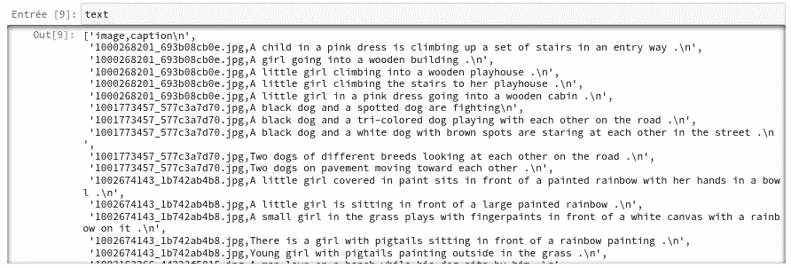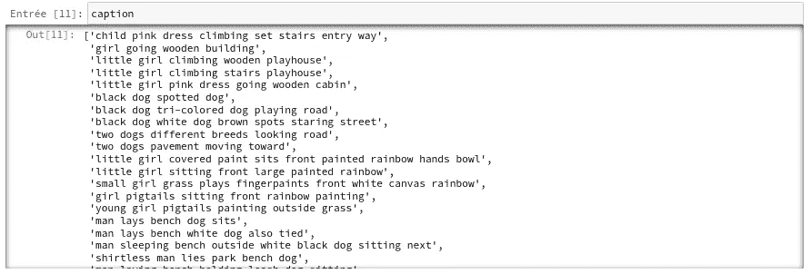

# 方式一:用图像标签匹配 n-gram 句子序列

## 将同一图像的所有标题组合在一起

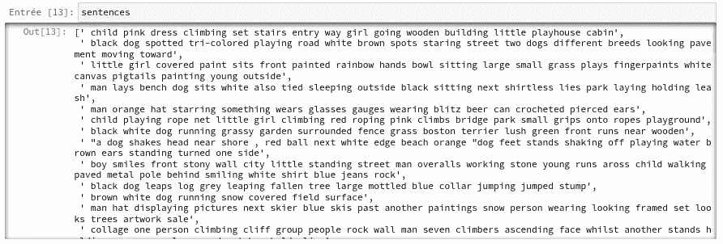

我把句子的数量限制在 200 个以内，只是为了证明这个想法。

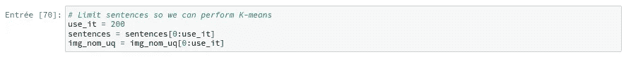

## 给单词赋值:Tokenize

接下来，我们使用 K-means 将标签重新分配给 n-gram 序列。

现在，我们对每个序列都有了一个标签，我们需要将原始图像名称映射到标签。

我们有每个标签的连接 n-gram 句子，我们称之为 sens。我们也有原始句子标题，称之为句子。接下来，我们尝试将每个“感觉”文本与一个“句子”文本进行匹配，这样我们就有了一个与特定单词相关联的图像。

***一个缺陷:我没有验证“sens”和“sentences”的每个文本条目是否都是唯一的，这导致了错误预测的问题，我们将在后面看到。

## 难的部分:最大限度地对带有原始标题的 n 元句子进行排序

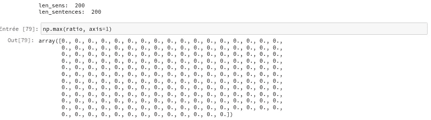

注意比率矩阵的条目是零。如果我们在找到匹配后将每个条目设置为零，我们假设每个文本条目都是唯一的，并且同一个图像不应该被分配给两个或更多的文本条目。

另一个注意事项是，对文本条目进行最大程度的排序允许 n-gram 序列与原始序列进行更精确的匹配。但是，这限制了许多不同照片的使用，因为文本条目有多余的单词；换句话说，同样的词可以用来描述两个完全不同的图像，但我们的算法只是选择一张照片，而不是各种照片。如果我们以非最大化的方式对文本条目进行排序，我们会得到更多种类的照片，但匹配不太精确。我们的目标是获得文本和图像的匹配，所以我们将坚持最大排序。

## 测试排序

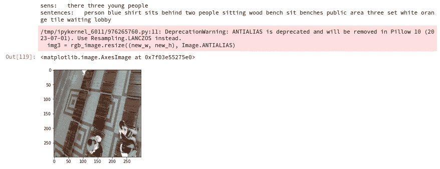

上面是成功的，但下面是对齐文本条目的失败。

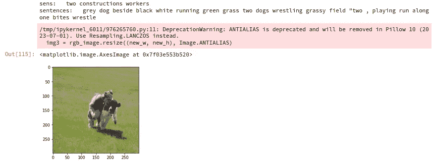

我们可以看到两个文本条目“sens”和“senses”是相似的。这不是一场精确的比赛，但这是一个有趣的开始！

接下来，我们将图像映射到使用 K-means 找到的 n-gram 维度标签。

## 制作模型

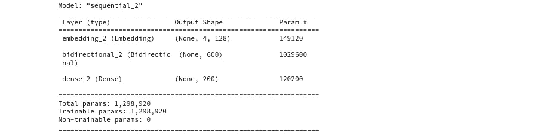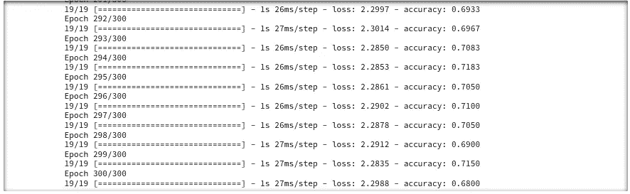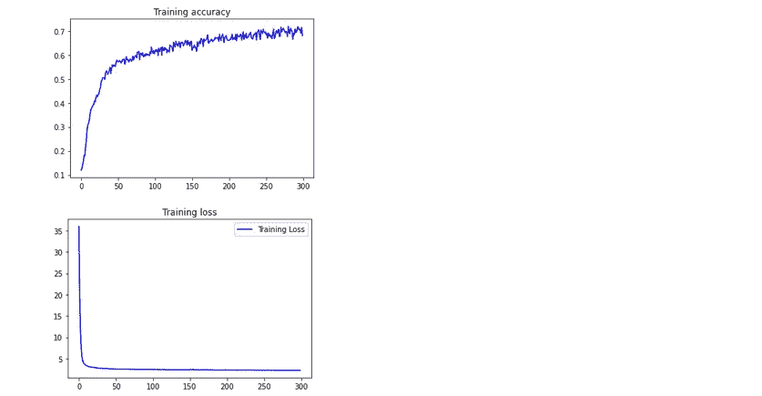

使用标准的嵌入和 LSTM 层，该模型可以训练到相当不错的 0.7 的准确度分数。

## 测试模型

使用 **seed_text = '狗跑'**和 **seed_text = '小孩玩水两个男孩跑橘子球'**，用下面的代码单元格我们同样的一个狗跑的图像。

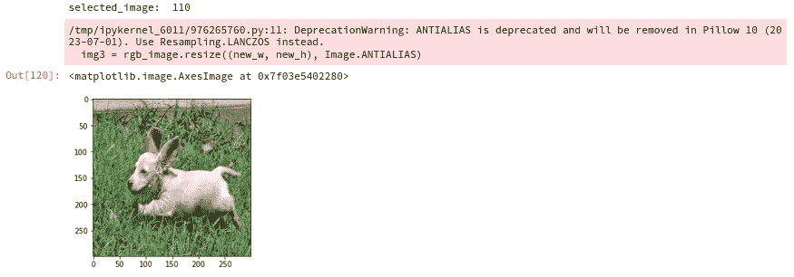

尝试更多的查询:

部分成功:seed_text = '男子棕色衬衫深色短裤玩沙滩'

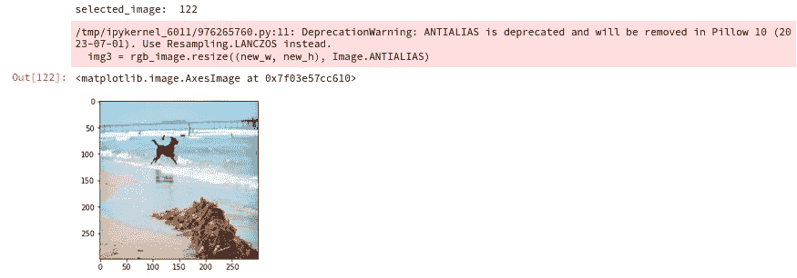

失败:seed_text = '盖伊站在沙地滑雪板上'

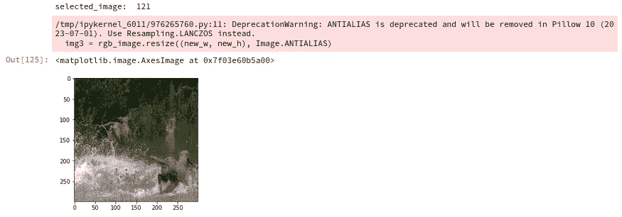

使用这些简单的方法，文本到图像似乎是可能的，但是它受到单词数量的限制，因为 K-means 只能找到大约 1000 个句子的标签。此外，如果在多个文本条目中发现相似的单词，会有很多不准确性。

希望你喜欢这个分析。练习愉快！👋

 [## Mlearning.ai 提交建议

### 如何成为 Mlearning.ai 上的作家

medium.com](/mlearning-ai/mlearning-ai-submission-suggestions-b51e2b130bfb)