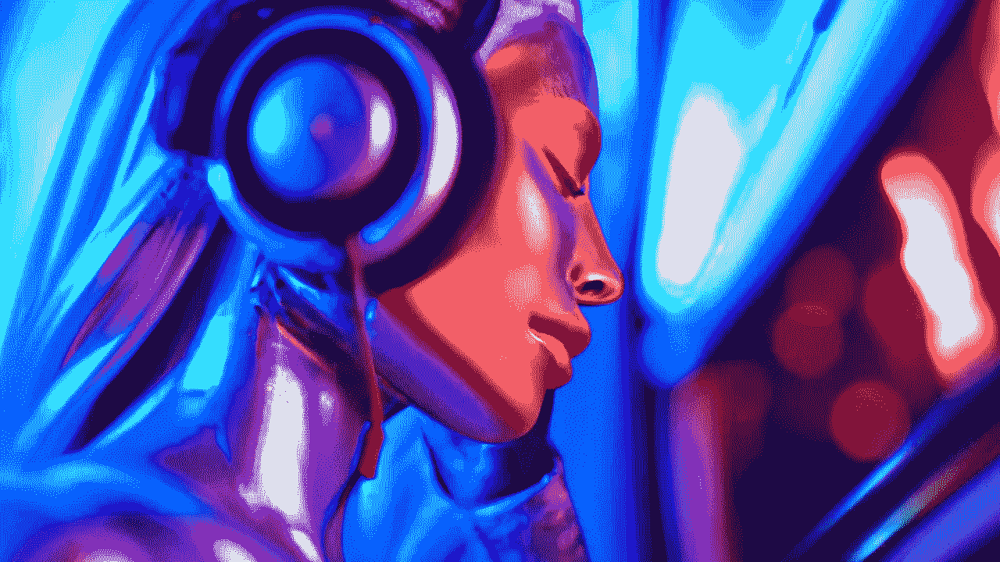

# 文本到想象

> 原文：<https://medium.com/mlearning-ai/text-to-imagination-ae191ae3e20f?source=collection_archive---------3----------------------->

## [机器学习艺术](https://mlearning.substack.com)

[图片](https://open.substack.com/pub/evartology/p/all-of-the-greatest-ai-powered-art?r=9hp4d&utm_campaign=post&utm_medium=web) | [视频](https://open.substack.com/pub/evartology/p/hq-video-generated-from-text?r=9hp4d&utm_campaign=post&utm_medium=web) | [3D](https://open.substack.com/pub/mlearning/p/generate-realistic-3d-models-from?r=z7zu8&utm_campaign=post&utm_medium=web) | [音乐](https://open.substack.com/pub/mlearning/p/melody-generated-from-text?r=z7zu8&utm_campaign=post&utm_medium=web) | [文字](#ff7d) | [美术](https://open.substack.com/pub/evartology/p/all-of-the-greatest-ai-powered-art?r=9hp4d&utm_campaign=post&utm_medium=web) | [商业](https://open.substack.com/pub/mlearning/p/8-verified-ai-tools-for-creative?r=z7zu8&utm_campaign=post&utm_medium=web) | [扩散模式](https://open.substack.com/pub/mlearning/p/how-does-a-diffusion-model-work?r=z7zu8&utm_campaign=post&utm_medium=web)

[Revolutionary TEXT-TO- Models Redefine Creativity](https://open.substack.com/pub/mlearning/p/melody-generated-from-text?r=z7zu8&utm_campaign=post&utm_medium=web)

它就像你想象中的玩具店。
今天，人类[提词人](https://open.substack.com/pub/evartology/p/reverse-prompting?r=9hp4d&utm_campaign=post&utm_medium=web)可以创作出令人难以置信的[插图](#ff7d)、[视频](#ff7d)、 [3D 模型](#ff7d)、[音乐](#ff7d)、[配乐](#ff7d)、[故事](#ff7d)。[扩散模型](https://open.substack.com/pub/mlearning/p/how-does-a-diffusion-model-work?r=z7zu8&utm_campaign=post&utm_medium=web)和公司改变了过去几个月的整个[创意经济](/data-driven-fiction/what-is-meant-by-ai-creative-economy-4b24c67fe439)。