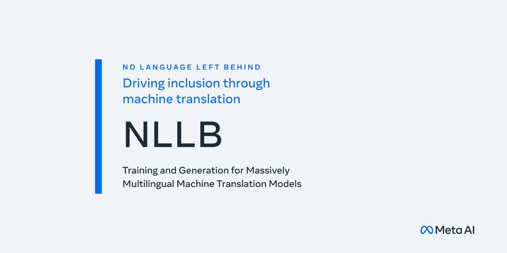

# 使用 NLLB 和 HuggingFace 进行文本翻译—教程

> 原文：<https://medium.com/mlearning-ai/text-translation-using-nllb-and-huggingface-tutorial-7e789e0f7816?source=collection_archive---------1----------------------->

## 200 种语言之间的高质量翻译



此前在 7 月，脸书人工智能研究院(FAIR)发布了他们在语言生成领域，特别是语言翻译领域的最新模型，名为“不让一种语言掉队”(NLLB)。一个能够在 200 种语言之间翻译的 AI 突破性开源项目，包括低资源语言，使人们更容易相互联系。

在他们的官方博客上，他们展示了一些翻译的故事作为演示，这些故事从印度尼西亚语、索马里语和缅甸语翻译成英语和其他语言。该模型还可以通过维基媒体基金会的内容翻译工具翻译维基百科页面，这使得志愿工作更加容易和丰富。

而且 FAIR 发布了另一个语言识别模型，叫做 LID218 模型，可以从句子中检测语言。它为预测的语言生成一个 BCP-47 标签，允许用作 NLLB 的输入源。

在今天的帖子中，我们将使用 LID 和 NLLB 开发一个语言识别和翻译管道，在 200 种不同的语言之间进行翻译。

# 装置

在本教程中，我们将使用 Google Colab 来运行代码，这使得事情变得更容易。

应该安装一些包来运行项目:

## 快速文本

这是一个开源、免费、轻量级的库，允许用户学习文本表示和文本分类器，由脸书在 2015 年制作，一直稳定使用到今天。

fasttext 的应用之一是使用预先训练的模型进行语言识别。fasttext 有两个预测 ISO-639 代码的[模型](https://fasttext.cc/docs/en/language-identification.html)，以及一个预测我们今天将使用的 BCP-47 的新模型。

## 变形金刚(电影名)

Transformers 为自然语言理解(NLU)和自然语言生成(NLG)提供最先进的通用架构，拥有 100 多种语言中超过 32 种预训练模型。

## 句子片断

SentencePiece 是一个无监督的文本标记器和去标记器，主要用于基于神经网络的文本生成。

我们将从语言识别模型开始，并将模型预测作为 NLLB 的输入。

# 语言识别

为了启动并运行项目的第一部分，我们需要下载语言模型预训练文件[lid218e.bin]并安装 fasttext 包。

在 Colab 上，运行下面一行来下载语言模型文件

```
!wget [https://dl.fbaipublicfiles.com/nllb/lid/lid218e.bin](https://dl.fbaipublicfiles.com/nllb/lid/lid218e.bin)
```

并使用安装 fasttext

```
!pip install fasttext
```

接下来，在文本样本上运行该模型，它将预测预测的语言代码。

```
import fasttext
pretrained_lang_model = "/content/lid218e.bin" # Path of model filemodel = fasttext.load_model(pretrained_lang_model)text = "صباح الخير، الجو جميل اليوم والسماء صافية."predictions = model.predict(text, k=1)
print(predictions) #(('__label__arb_Arab'), array([0.99960977]))
```

默认情况下，predict 只返回一个标签:概率最高的标签。还可以通过指定参数 k 来预测多个标签。

正如我们所看到的，`predictions`是一个包含每个标签和相应概率的元组，我们将获取第一个标签名称并对其进行清理，以便它可以进入翻译管道。

```
input_lang = predictions[0][0].replace('__label__', '')
```

现在，既然我们已经有了正确的标签“阿拉伯语”99%的百分比，让我们继续下一部分，翻译。

# 文本翻译

为了使用 NLLB 电力，我们需要通过安装一些软件包来设置环境，所以我们将安装变压器和句子。

```
!pip install -U pip transformers!pip install sentencepiece
```

由于 NLLB 可以处理 218 种语言，它带有许多具有不同参数和不同大小的检查点。我们可以根据精度和可用资源选择适合我们应用的方法。

```
checkpoint = ‘facebook/nllb-200-distilled-600M’
# checkpoint = ‘facebook/nllb-200–1.3B’
# checkpoint = ‘facebook/nllb-200–3.3B’
# checkpoint = ‘facebook/nllb-200-distilled-1.3B’
```

选择模型后，让我们使用变形金刚包中的`from_pretrained`函数加载它。

```
from transformers import AutoTokenizer, AutoModelForSeq2SeqLM, pipeline
model = AutoModelForSeq2SeqLM.from_pretrained(checkpoint)
tokenizer = AutoTokenizer.from_pretrained(checkpoint)
```

为了运行模型，我们需要为文本数据指定一个预训练的模型文件和一个标记器。

*在这里* *了解更多分词器* [*。*](https://huggingface.co/docs/tokenizers/index)

现在，假设我们想将阿拉伯语翻译成西班牙语，我们已经指定了模型、分词器和源语言，我们只需要西班牙语的语言代码，即`spa_Latn`。

```
target_lang = ‘spa_Latn’
```

*您可以在这里查看所有* [*语言代码*](https://github.com/facebookresearch/flores/blob/main/flores200/README.md#languages-in-flores-200)

*选择语言后，我们将配置翻译管道*

```
*translator = pipeline(‘translation’, model=model, tokenizer=tokenizer, src_lang=source_lang, tgt_lang=target_lang, max_length = 400)*
```

*此处的最大长度指定了输出的最大长度，为安全起见，最好在此处输入长度为<= 360.*

*Finally, call the translator pipeline given the text as input to get the output you wish*

```
*output = translator(text)
translated_text = output[0][‘translation_text’]
print(translated_text) #Buenos días, el clima es hermoso y el cielo está limpio.*
```

*That's all, you can use those tools to make a system that identifies text language and translate it to whatever language you wish!*

*Check the fully working notebook [的文本](https://colab.research.google.com/drive/1fsbzykS5ANEMVcn7gtp8Wl7gkmRzbwOW?usp=sharing)。*

**参考文献**

*[*Fasttext 语言识别*](https://fasttext.cc/docs/en/language-identification.html)[*无语言掉队*](https://www.louisbouchard.ai/no-language-left-behind/)[*NLLB Meta 的 AI 视频*](https://www.youtube.com/watch?v=uCxSPPiwrNE)[*无语言掉队— Meta AI 研究专题*](https://ai.facebook.com/research/no-language-left-behind/)[*无文档说明如何使用 nllb*](https://lightrun.com/answers/facebookresearch-fairseq-no-documentation-on-how-use-nllb)*

*[](/mlearning-ai/mlearning-ai-submission-suggestions-b51e2b130bfb) [## Mlearning.ai 提交建议

### 如何成为 Mlearning.ai 上的作家

medium.com](/mlearning-ai/mlearning-ai-submission-suggestions-b51e2b130bfb)*