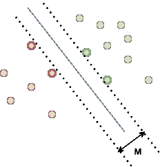
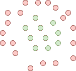
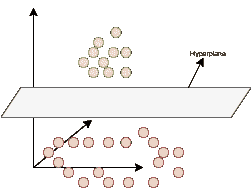

# 基于支持向量机的文本情感分析第 1 部分:情感分析和支持向量机

> 原文：<https://medium.com/mlearning-ai/textual-sentiment-analysis-with-support-vector-machines-part-1-sentiment-analysis-and-svms-3756edb47196?source=collection_archive---------1----------------------->

Image generated by [Stable Diffusion](https://stability.ai/blog/stable-diffusion-public-release)

# 情感分析

作为“情感分析”,我们定义了提取情感的过程，即以某种方式表达的观点或意见。例如，我们可以对面部表情进行情感分析，以确定一个人可能的感受。脸上的微笑可以表示喜悦和幸福，而眼中的泪水则表示悲伤或绝望。分析情感绝不是无足轻重的，因为在有些情况下，完全相同的表达，继续前面的例子，不仅可以暗示不同的感受，而且可以暗示矛盾的感受。除了悲伤，哭泣的脸也可能是快乐情绪的结果。我猜你已经听过“喜极而泣”这个表达了。

在这个系列中，我们将接触文本情感分析，我们将尝试提取书面文本的情感，更具体地说是 tweet 帖子的情感。对于数据，我选择了 Kaggle 的“[文本情感检测](https://www.kaggle.com/datasets/pashupatigupta/emotion-detection-from-text)”数据集，其中包含 40，000 条带有 13 种不同情感的推文。这是一项自然语言处理(NLP)任务，我们必须分析书面英语并提取情感。由于我们有 13 种不同的情绪作为类别，我们知道我们正在处理一个分类问题，其中给定一条推文，我们需要预测它在 13 种情绪中最有可能表达的情绪。

这是一个由三部分组成的系列，您目前正在阅读第一部分。您可以在下面找到课程:

1.  第 1 部分—向读者介绍情感分析和支持向量机的概念
2.  [第 2 部分](/@geokam/textual-sentiment-analysis-with-support-vector-machines-part-2-data-pre-processing-and-ee45f18083e4) —解释训练分类器之前所需的数据预处理管道。
3.  [第 3 部分](/mlearning-ai/textual-sentiment-analysis-with-support-vector-machines-part-3-implementation-ab10b4a7847d) —描述实施步骤，并展示实际结果。

# 技术发展水平

情感分析领域的当前 SOTA 可以用三个词来充分描述:人工神经网络。几乎所有前沿的 NLP 应用都以这样或那样的方式利用神经网络，从基本的全连接架构和递归神经网络，到长短期记忆网络和变压器。如果所有这些对你来说都是胡言乱语，不要害怕。在这个系列中，我们不会用到这些。这是为什么呢？如果神经网络是我们语言相关问题的答案，为什么不利用它呢？人们不能利用这些网络的力量有许多原因。

## 缺乏数据

数据不足是第一个原因。为了训练神经网络并实现低偏差和低方差，我们需要大量的数据。最强大的 SOTA 解决方案之一，GPT-3 模型，是在 45TB 的数据上训练的。为了更好地理解大小，请记住，我们的 40，000 tweets 集甚至不到 4MB！当然，与 GPT-3 相比，我们的目标非常具体，那就是它的泛化能力。然而，即使更小的模型也需要大量的数据，而这些数据在很多情况下是不存在的。

## 计算资源

即使我们有所需的数据，我们仍然需要训练网络。训练时间与数据数量和网络架构、层数、神经元、连接和优化器等直接相关。更多的数据导致训练时间增加。更复杂的网络意味着更多的可训练权重，这反过来也增加了训练时间。同样，GPT-3 模型有大约 1750 亿个参数，需要在单个 NVIDIA Tesla V100 GPU 上的 45TB 数据集上训练 355 年！如果我们采用并行和分布式技术，使用大约 1.024 个 NVIDIA A100 GPUs，我们可以在*只用* 34 天训练模型。为了强调这是多么昂贵，在编写本文时，一个 100 GPU 的成本约为 15.000€。

明确一下，我们的情感分析问题也可以通过神经网络来解决，这些神经网络可以在更低端的硬件上进行训练。我想指出的是，对于大范围的任务，神经网络在复杂性和资源方面可能是一种过度杀伤的方法。换句话说，使用神经网络会无缘无故地增加训练次数、实施复杂性和所需预算。机器学习工程师必须能够知道什么时候最好使用这样的模型，什么时候不适合。

# 支持向量机

现在应该很清楚，构建神经网络并不总是正确的做事方式。但是，我们还能做什么来解决我们的问题呢？这就是支持向量机发挥作用的地方。支持向量机是机器学习中强大的模型，能够处理复杂的任务，而不需要大量数据。在其基本形式中，该模型试图解决二元分类问题，其中每个样本属于两个可用类别中的一个。它通过使用一条边界来分隔两个类，从而最大化每个类的最近样本之间的距离。因为这可能很难理解，所以请看下图:

Linearly separable data with SVM

我们有属于特定类别的样本:红色或绿色。SVM 将尝试找到使边距 M 最大化的最佳线(用蓝色标记),边距 M 是每类最接近的样本(即具有粗体边框的样本)之间的距离。最接近的样本被称为“支持向量”。换句话说，该模型不仅将这两个类分开，而且将通过最大化它们之间的距离来做到这一点。

在前面提到的例子中，这个问题用一行就解决了，因为它本质上是一个线性问题。像下面这样的非线性呢？

Non-linear binary classification example

我们无法划清界限，成功地区分这两个阶层。在这些情况下，我们可以使用所谓的“核技巧”，通过使用一个特定的函数，称为核，可以将数据的维度增加到一个新的空间，其中两个类确实是线性可分的。在前面的示例中，如果我们将数据的维度从 2D 增加到 3D，我们最终会得到这样的结果:

Linear separable after applying the kernel trick

请注意，数据现在可以用灰色超平面分开。

好吧，那么支持向量机可以很好地处理非线性，但是它们能解决多类分类问题吗？记住，在我们的任务中，我们需要考虑 13 种不同的情绪。多类支持向量机通过在一个类和其余的类之间创建多个二元分类器来解决这个问题，称为“一对一”，或者在每对可用的类之间创建多个二元分类器，称为“一对一”。在“一对一”的情况下，得分最高的分类器指定类别，而在“一对一”的情况下，我们为每个分类器投票选出获胜的类别，最后投票最多的类别决定结果。

这就是支持向量机在很高层次上的工作方式。好的，但是我们如何用它来进行情感分析呢？嗯，那是另一个故事了。我们将在本系列的下一部分中讨论它，在那里我们将看一看文本预处理。在那之前，敬请期待！

 [## Mlearning.ai 提交建议

### 如何成为 Mlearning.ai 上的作家

medium.com](/mlearning-ai/mlearning-ai-submission-suggestions-b51e2b130bfb)