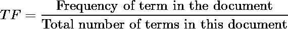
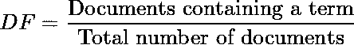
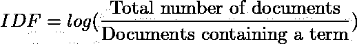
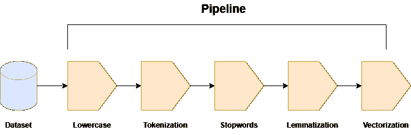
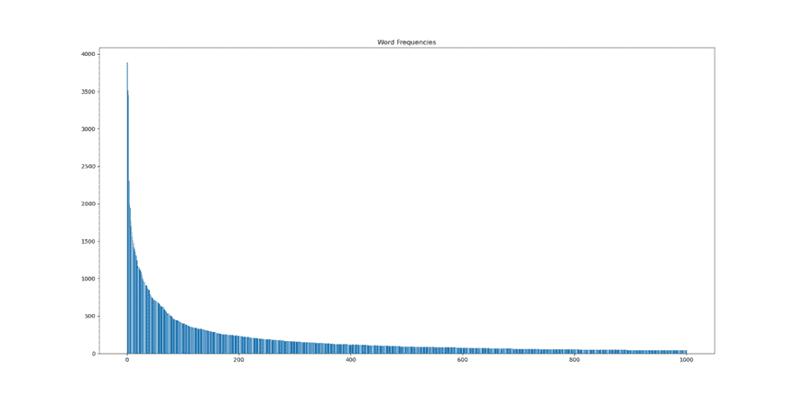

# 基于支持向量机的文本情感分析第二部分:数据预处理和矢量化

> 原文：<https://medium.com/mlearning-ai/textual-sentiment-analysis-with-support-vector-machines-part-2-data-pre-processing-and-ee45f18083e4?source=collection_archive---------7----------------------->

Image generated by [Stable Diffusion](https://stability.ai/blog/stable-diffusion-public-release)

欢迎回到本系列的第二部分，我们试图建立一个能够提取推文情感的机器学习模型。在前一部分，我们解释了什么是情感分析，它通常是如何做的，以及什么时候不使用神经网络是明智的。在本文中，我们将深入研究需要对数据进行的预处理，以便能够正确地使用它们。

这是一个由三部分组成的系列，您目前正在阅读第一部分。您可以在下面找到课程:

1.  第 1 部分 —向读者介绍情感分析和支持向量机的概念
2.  第 2 部分—解释在训练分类器之前所需的数据预处理管道。
3.  [第 3 部分](/mlearning-ai/textual-sentiment-analysis-with-support-vector-machines-part-3-implementation-ab10b4a7847d) —描述实施步骤，并展示实际结果。

# 预处理

预处理是数据科学流程中最基本的部分之一。收集完数据后，我们必须清理它们。清理数据集可能是整个流程中最耗时的任务，因为它需要细致的操作，将数据从原始格式转换为我们可以正确利用的格式。如果这一步做得很差，意味着数据没有得到适当的预处理，或者没有考虑到极端情况和异常值，那么没有模型可以拯救我们。如果我们的基础，即我们的数据是垃圾，我们的最终结果也将是垃圾。正如人们常说的，垃圾进，垃圾出。

## 文本

预处理步骤并不简单，它与数据收集的质量和数据格式密切相关。例如，与清理文本数据相比，清理数字数据是完全不同的事情。每个机器学习模型都基于某种数学运算，用来产生最终结果。对于文本数据，我们没有数字，只有文本。因此，第一步是将这些数据转换成可以输入模型的实际数字。这个动作被称为“向量化”，其中单词被转换成数字。

## 一袋单词

但是，这是怎么做到的呢？这样做有许多不同的方法。其中最基本的一种叫做“词汇袋”。在这个场景中，我们创建了一个字典，用来存储数据集中出现的唯一单词。这些单词中的每一个都被映射到一维向量中的特定索引，该向量的长度等于字典中的单词数。这用一个简单的例子就很容易理解了。考虑我们的数据集由以下两个句子组成:

> 我喜欢陀螺
> 
> 我真的喜欢藜麦

如果我们计算唯一的单词，我们可以构建下一个列表:

> 【“我”、“爱”、“真的”、“喜欢”、“陀螺”、“藜麦”】

所以“I”被映射到第一个元素(索引 0)，单词“love”对应于第二个元素(索引 1)，等等。在此基础上，我们可以将句子转换成数字列表，方法是将 1 放在索引中，表示句子中有这些特定的单词，而将 0 放在索引中，表示正好相反的单词。考虑到这一点，这些句子可以转换成:

> [1, 1, 0, 0, 1, 0]
> 
> [1, 0, 1, 1, 0, 1]

甚至这种从文本到数字的简单方法在许多 NLP 任务中也非常有用。然而，还有更健壮、更强大的技术。

## 术语频率—逆文档频率

术语频率—逆文档频率，简称 TF-IDF，是将文本编码为数字的另一种方法。它依赖于两个独立指标的计算。第一个是术语频率，它衡量一个术语在单个文档的上下文中的频率。

Term frequency formula

例如，让我们考虑下面的句子:

> "我去了商店，看到一些新鲜水果，就买了下来."

如果我们为单词“store”计算“TF ”,我们有 1/15，因为句子中的总项数等于 15。单词“I”的 TF 为 3/15，意味着它的出现频率是单词“store”的三倍。更大的 TF 意味着更有价值的信息。然而，对于“我”这个字来说，是这样吗？

第二个指标是逆文档频率。为了更好地理解这一点，让我们快速看一下什么是文档频率。

Document frequency formula

本质上，它表示包含给定单词的文档的比例。所以，反过来就是:

Inverse document frequency formula

通过反过来，我们试图强调如果一个单词出现在许多文档中，那么它可能并不那么重要。例如，仅举几个例子，像“我”、“and”和“介词”这样的词在文本数据集中出现得非常频繁，但在情感方面没有提供太多信息。这些术语对我们的模型来说价值不大。在某种程度上，“以色列国防军”试图弥补“TF”一词的错误。最后，TF-IDF 公式为:

TF-IDF formula

这个过程可以被认为是一种特征提取机制，我们试图提取关于每个术语的有用见解。TF-IDF 还采用了一些额外的配置，这些配置应该进行适当的调整以获得最大的效能。其中一个参数称为“最大特征”，它只考虑整个数据集中按术语频率排序的前“n”个特征。我们一会儿会看看这个。

## 管道

我们现在知道了一些编码文本的方法。应该清楚的是，TF-IDF 工作于“术语”,即“文字”。在我们应用它之前，我们需要拆分我们的句子，并获得那些“单词”。在 NLP 领域，我们称这些为“记号”,这个过程被称为“记号化”。记号化本身就是一门艺术，所以除了它只是把句子分解成记号之外，我们不会对它进行更多的讨论。此外，我们通常将文本转换成小写格式，以避免重复。基本上，这些是我们将使用的预处理管道的前 2 个步骤。对于术语“管道”,我们描述了包含离散步骤的预定义流程，其中每个步骤都接收前一个步骤的输出作为输入。

我们的管道首先将文本转换成小写，然后将输出提供给记号赋予器。完成标记化后，下一步是删除“停用词”。停用词是没有意义的词，因此被过滤掉以降低问题的复杂性。最流行的是像“一个”、“这个”、“是”和“是”这样的词。

第四步旨在通过只保留每个单词的“词条”来进一步精简我们的词典。单词“eating”是基本单词“eat”的变形形式。“吃”和“吃”也是一样，都换成了“吃”字。最终，我们的管道看起来像这样:

Pipeline illustration

TF-IDF 使用最终输出来创建矢量化数据。如果我们在矢量化之前仔细查看数据集的输出，并绘制每个单词的频率，我们会得到如下结果:

Word frequency

我们的字典有 40813 个单词，这意味着如果我们使用 TF-IDF，每个单词将有 40813 个特征。就记忆而言，这非常难以处理。绕过这一点的一种方法是使用前面提到的“max_features”参数来限制功能的数量。在我们的例子中，我们可以发现只有 3034 个单词出现了至少 10 次。通过将“max_features”设置为 3，034，我们可以在内存和计算方面获得更可行的编码。

对于停用词、标记化和词条化，我们使用了 [nltk](https://www.nltk.org/) 库，而对于 TF-IDF，我们使用了 [scikit-learn](https://scikit-learn.org/stable/) 。Python 中的管道展示如下:

Pipeline in Python

# 摘要

这就结束了在进入模型构建之前需要完成的预处理。管道的输出是我们数据集的矢量化版本，可以由支持向量机模型使用。但这正是我们将在本系列的下一篇也是最后一篇文章中讨论的内容。在那之前，敬请期待！

 [## Mlearning.ai 提交建议

### 如何成为 Mlearning.ai 上的作家

medium.com](/mlearning-ai/mlearning-ai-submission-suggestions-b51e2b130bfb)