# 基于支持向量机的文本情感分析第 3 部分:实现

> 原文：<https://medium.com/mlearning-ai/textual-sentiment-analysis-with-support-vector-machines-part-3-implementation-ab10b4a7847d?source=collection_archive---------2----------------------->

Image generated by [Stable Diffusion](https://stability.ai/blog/stable-diffusion-public-release)

这是本系列的第三篇也是最后一篇文章，我们试图建立一个能够对推文进行情感分析的机器学习模型。在前两部分中，我们解释了情感分析，支持向量机如何解决问题，什么是预处理管道，最后，如何在我们的场景中使用它。在这一部分，我们将做一些基本的“探索性数据分析”和“建模”步骤，通过定义需要评估的必要实验。

这是一个由三部分组成的系列，您目前正在阅读第一部分。您可以在下面找到课程:

1.  第 1 部分 —向读者介绍情感分析和支持向量机的概念
2.  [第 2 部分](/mlearning-ai/textual-sentiment-analysis-with-support-vector-machines-part-2-data-pre-processing-and-ee45f18083e4) —解释训练分类器之前所需的数据预处理管道。
3.  第 3 部分—描述实施步骤，并展示实际结果。

# 基本探索性数据分析

探索性数据分析是数据科学流程中的一个非常基础的步骤，我们通过尝试找到模式、异常或收集一些关于数据结构方式的有用见解来彻底调查手头的数据。在我们的例子中，我们有来自文本的“[情绪检测”数据集，该数据集包含 40.000 条推文以及以下 13 种不同情绪中的一种:](https://www.kaggle.com/datasets/pashupatigupta/emotion-detection-from-text)

*   愤怒
*   “无聊”
*   '空'
*   “热情”
*   “有趣”
*   快乐
*   “仇恨”
*   “爱”
*   “中立”
*   “救济”
*   悲伤
*   “惊喜”
*   “担心”

我们需要知道的一个重要信息是不同的类在我们的数据集中是如何分布的。这可以通过下面的饼图获得:

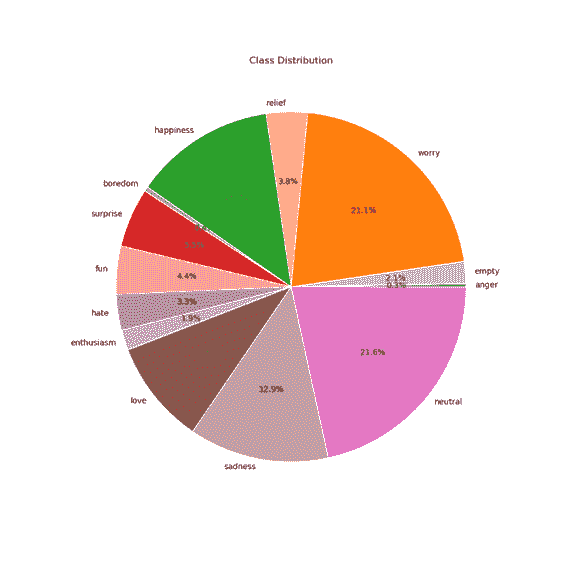

Class distribution in pie chart

马上，我们可以看到，阶级分布相当不平等。例如，只有 0.4%的推文中有“无聊”一类，而“中性”和“焦虑”一类的比例最大。绘制同样的绝对值分布图可以更加突出这个问题:

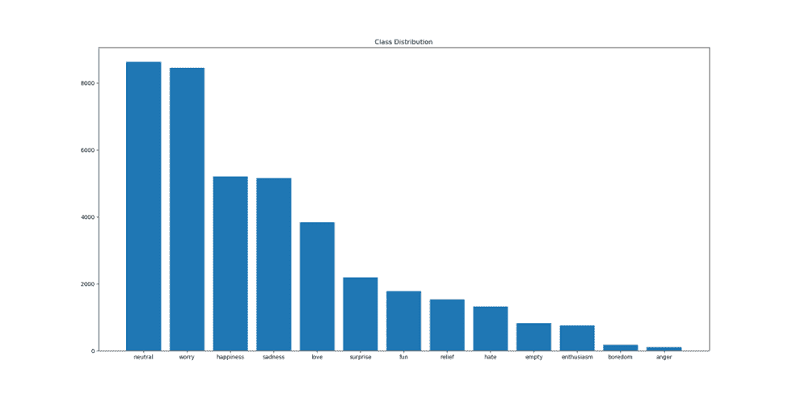

Absolute class distribution in bar chart

这个问题被称为“阶级不平衡”，一些阶级很少出现，而其他人更频繁。为什么这是一个问题？让我们考虑一个更简单的二进制分类问题，我们需要区分猫的图像。我们的数据集包含 100 张图片，其中 99 张是猫，1 张不是。如果我们在这个集合上训练一个模型，它注定会失败，因为它看到的“不是猫”实例的数量远远少于对面的类。在这类问题中，一些广泛使用的度量标准可以欺骗我们相信我们的模型完美地工作，而事实上它悲惨地失败了。例如，如果我们在示例集上训练一个模型，它可能会对它收到的每个输入预测“cat”。在这个模型中，如果我们在训练集上计算“准确性”度量，我们将获得 99%的准确性！然而，如果我们对 50-50 的集合计算相同的分数，我们将得到 50%的准确度。很明显，不平衡的集合会“扰乱”我们的一些度量标准，并导致无效的结论。

如何才能克服这个问题？首先，最好使用一些其他指标来识别问题。可以使用平衡准确度度量来计算每个类别的平均准确度，而不是将它们或 F1 分数相加。在这一步之后，我们需要找到处理这种异常的方法。有很多方法可以做到这一点，因为我们不想偏离主题，我们将只说我们将使用“SMOTE”方法。SMOTE 代表“合成少数过采样技术”,其目标是为少数类创建合成样本，因此最终所有类都是平均分布的。

# 韵律学

在选择了模型的类型之后，在我们的例子中，我们还必须选择评估的度量。请记住，我们正在处理一个多类问题，所以我们需要确保我们的度量标准能够很好地工作。首先，我们将使用典型的指标，即准确度、平衡准确度、精确度、F1 分数和召回率。对于平均步骤，使用“宏”方法(更多详情，请查看[和](https://towardsdatascience.com/micro-macro-weighted-averages-of-f1-score-clearly-explained-b603420b292f#989c))。

此外，我们还包括了两个在多类问题中广泛使用的度量标准。第一个是“科恩的卡帕系数”，它通过考虑偶然符合的概率来衡量预测结果和实际结果之间的一致性。其值的范围从-1 到 1，其中[0.6，0.8]的范围表示充分一致，当值大于 0.8 时，表示几乎完全一致。第二个是“马太相关系数”,它衡量预测值和实际值之间的相关性。同样，其值的范围是从-1 到 1，其中 0 表示随机，1 表示完全相关，而-1 表示逆相关。

# 实验

为了定义实验，我们应该知道需要调整什么。SVM 的主要超参数有三个:内核方法、C 和伽马参数。第一篇文章中提到了内核方法。C 参数表示我们希望在多大程度上避免样本的错误分类。C 的高值会导致对训练集的过度拟合。gamma 参数指示单个训练样本的影响程度。对于小值，影响是微不足道的，而对于大值，影响是巨大的。在这两种情况下，结果都被认为是差的。关于超参数的更多细节可以在[这里](https://scikit-learn.org/stable/auto_examples/svm/plot_rbf_parameters.html)找到。

基于这些参数，我们选择了以下实验:

1.  不打，默认 SVM
2.  击杀，默认 SVM
3.  Smote，GridSearch με线性核(C = [0.001，0.01，0.1，1，10，100])
4.  Smote，GridSearch με Poly 内核(C = [0.001，0.01，0.1，1，10，100，1000，10000]，degree = [2，3，4])
5.  Smote，GridSearch με RBF 核(C = [0.001，0.01，0.1，1，10，100，1000]，Gamma = [0.0001，0.001，0.01，0.1，1，10，100，1000])
6.  Smote，GridSearch με RBF 核，窄搜索(C = [8，9，10，20，30，40]，Gamma = [8，9，9.5，10，10.5，11，50])
7.  Smote，GridSearch με RBF 核，更窄的搜索(C = [7，8]，Gamma = [7.2，7.5，7.7，7.9，8])

第一个实验只是为了指出阶级不平衡的问题。从第三次实验开始，我们使用 GridSearch 寻找最佳配置。本质上，GridSearch 在给定的超参数范围内进行搜索，以找到度量方面的最佳解决方案。

在继续实验之前，我们必须提供 SVM 处理的类和索引值之间的映射。

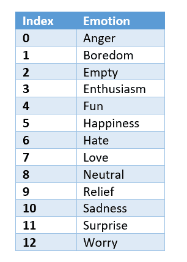

Class to index mapping

## 实验 1

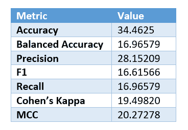

Metrics of 1st experiment

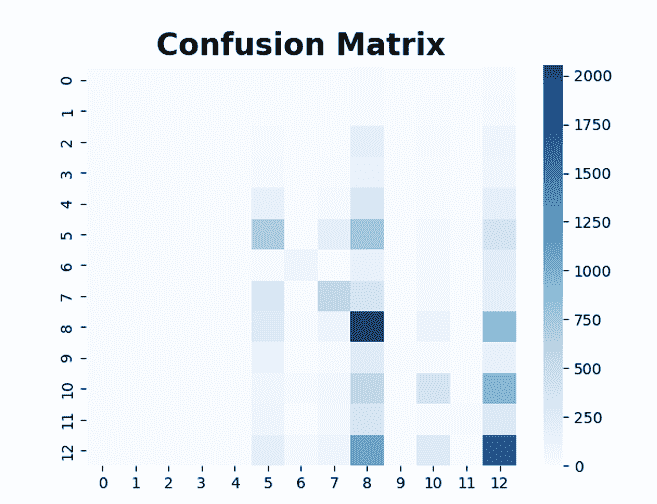

Confusion matrix of 1st experiment

正如我们所假设的，该模型主要预测索引为 8 和 12 的类别，这是最常见的类别(分别为“中性”和“担心”)，而指标则非常低。

## 实验二

Metrics of 2nd experiment

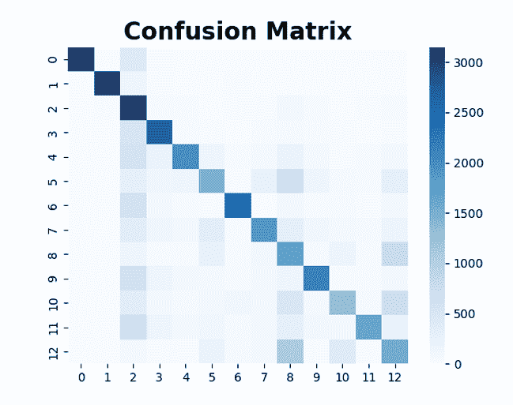

Confusion matrix of 2nd experiment

通过使用 SMOTE 和默认的 SVM 配置，结果已经更好，也更有意义。预测更均匀地分布在各个类别中，并且指标开始显示出一些潜力。

## 实验三

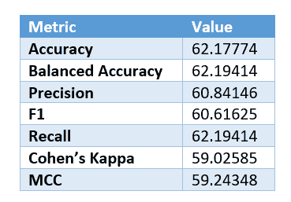

Metrics of 3rd experiment

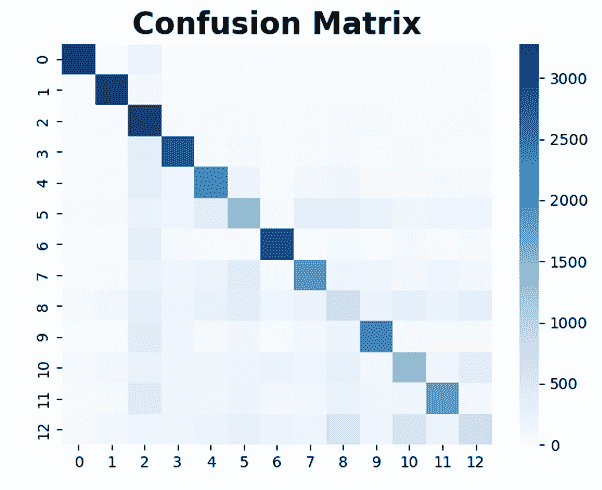

Confusion matrix of 3rd experiment

最佳模型是 C=100 的模型。尽管如混淆矩阵所示，分类误差分布更加均匀，但与之前的实验相比，线性核表现不佳。

## 实验 4

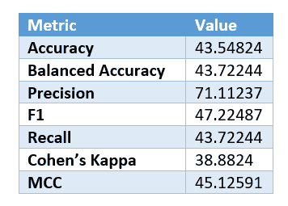

Metrics of 4th experiment

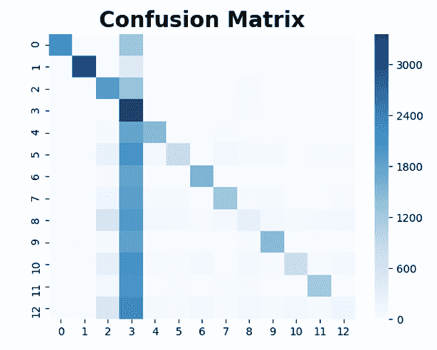

Confusion matrix of 4th experiment

最佳模型是 C=1 和度=4 的模型。与前两个实验相比，结果相差甚远，因为该模型过于频繁地预测“热情”类别(指数 3)。

## 实验 5

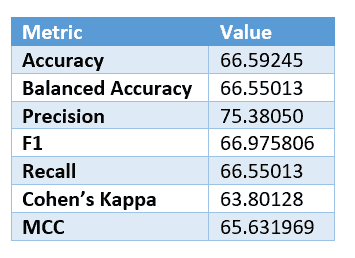

Metrics of 5th experiment

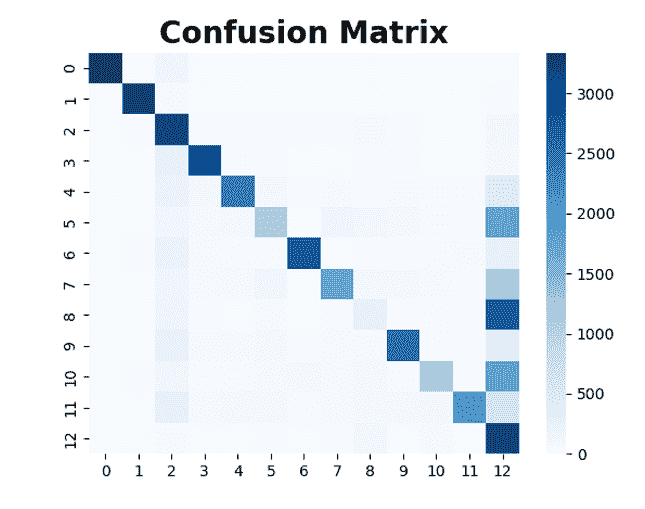

Confusion matrix of 5th experiment

最佳模型是 C=10 和γ= 10 的模型。与“poly”内核相反，这个内核似乎错误分类了索引 12，这是初始数据集中最常见的索引之一。但是，它从其他模型中获得了更好的性能，因此，我们决定缩小 GridSearch 的范围，以实现更好的调优。

## 实验 6

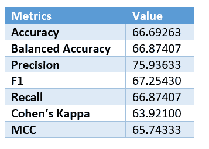

Metrics of 6th experiment

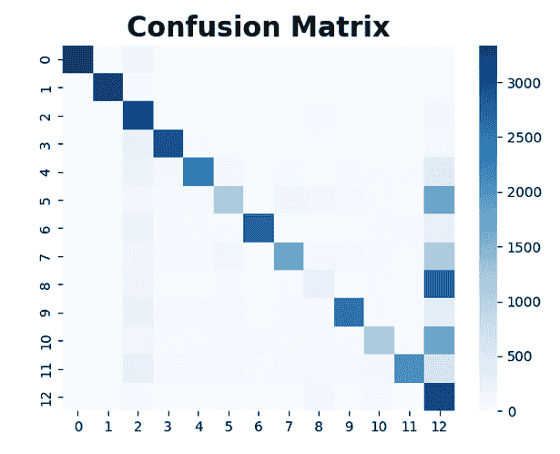

Confusion matrix of 6th experiment

最佳模型是 C=8 和γ= 9 的模型。尽管结果相当好，但该模型仍然错误地将推文标记为令人担忧。

## 实验 7

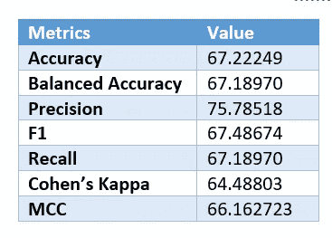

Metrics of 7th experiment

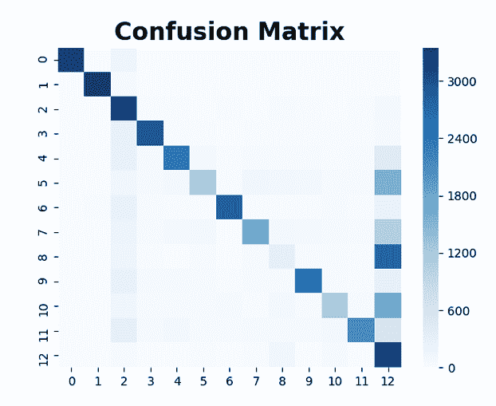

Confusion matrix of 7th experiment

最佳模型是 C=7.2 和γ= 7.7 的模型。同样，结果似乎有所改善，但主要问题依然存在。进一步调整模型似乎无法解决这个问题。

# 后续步骤

在这些情况下，你应该尝试改变整个过程的其他部分。一个这样的例子是不同类别的数量。在预处理阶段，我们可以将表达或多或少相同情感的类分组在一起。例如，类“乐趣”和“快乐”，或者类“惊喜”和“热情”可以捆绑在一起。此外，我们可以尝试另一种编码文本的方法。我们使用了 TF-IDF 方法，但是还有更强大的方法，比如“word2vec”。如果能尝试其中的一些，看看指标是否有任何提升，那就太好了，因为肯定还有改进的空间。整个代码库可以在这里找到[。](https://github.com/gkamtzir/svm-sentiment-analysis)

# 结论

本系列的第三篇也是最后一篇文章到此结束。当你完成这个系列的时候，你会知道什么是情感分析，为什么有人会尝试使用支持向量机，我们如何预处理文本，以及如何从头实现这样一个模型。如果你们中的一些人尝试了我建议的任何后续步骤，或者甚至是其他改变，请随意在这里发表你们的想法，或者在提供的存储库中创建拉请求。直到下一次，继续学习！

 [## Mlearning.ai 提交建议

### 如何成为 Mlearning.ai 上的作家

medium.com](/mlearning-ai/mlearning-ai-submission-suggestions-b51e2b130bfb)