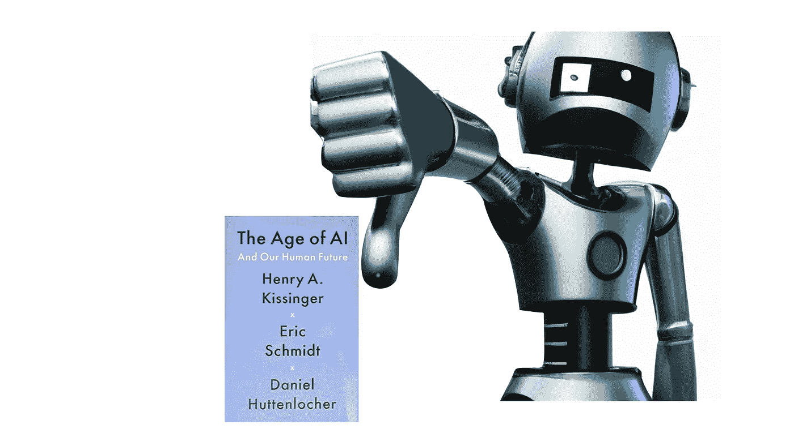

# 人工智能时代

> 原文：<https://medium.com/mlearning-ai/the-age-of-ai-ism-f2986748dafe?source=collection_archive---------5----------------------->

亨利·基辛格、埃里克·施密特和丹尼尔·赫顿洛彻所著的《人工智能时代:和我们人类的未来》一书将其描述为“通向我们现在和未来的必不可少的路线图”我们需要更多关于人工智能的以商业和政策为中心的书籍，而不是炒作和幻想。尽管有很高的期望和一批思想高尚的作者，*人工智能时代*用可疑的哲学解释提出了一些令人不安的问题。

[The Age of AI: And Our Human Future by Kissinger, Schmidt, and Huttenlocher.](https://www.amazon.com/Age-I-Our-Human-Future/dp/0316273805/ref=asc_df_0316273805/?tag=hyprod-20&linkCode=df0&hvadid=266396064900&hvpos=&hvnetw=g&hvrand=5294664403851757593&hvpone=&hvptwo=&hvqmt=&hvdev=c&hvdvcmdl=&hvlocint=&hvlocphy=9008188&hvtargid=pla-1211219407868&psc=1)

我知道你一定在想什么。哲学解释听起来很无聊，通常也是如此。这种分析是必要的，因为作者拼命试图说服读者，人工智能将人类身份置于危险之中。(第 147 页)他们问，“如果人工智能思考，或近似思考，我们是谁？”(第 20 页)然而，要考虑这种说法，我们必须假设人工智能能够思考，并且“近似思考”意味着有意义的东西，而不是如此普遍以至于无用的东西。人们还必须接受人类的身份与思维相同，并忽略人类与动物共存并使用工具已有数千年。这样一个稻草人的论点可能会满足作者的精神需求，并为他们提供一个拯救我们的目的。然而，在如此模糊的支持下谈论人类的生存风险是不公平的。

我们可以就此打住，但作者代表了社会的重要领域(硅谷、政府和学术界)，他们的主张值得进一步研究。当我们看到世界各国政府向新成立的组织和职位投入资源和授权时，我们必须问自己，这些领域、组织和领导人是否反映了我们共同的目标和价值观。这是对民主社会的一个重大调查；作者决定追求证明这一点。他们宣称，全球各地的社会需要将技术与他们的价值观、结构和社会契约相协调(第 21 页)，并补充说，“尽管有能力创造人工智能的个人数量正在增加，但考虑这项技术对人类的影响——社会、法律、哲学、精神和道德——的人仍然少得可怜”(第 26 页)。虽然这是真的，但这本书弊大于利。我们来探究一下原因。

来回答这个问题“如果 AI 认为…我们是谁？”这本书用 AlphaZero 战胜 Stockfish 来描述我们的处境。作者补充道，“没有人能打败它(AlphaZero)。”(第 11 页)。虽然这一成就令人印象深刻，但任何声称人工智能在任意任务上表现优于人类的说法都是荒谬的，因为人类不是(在这种情况下)下棋程序。这是荒谬的简化。此外，用人类的术语描述机器并不是机器思考的证据。路德维希·维特斯坦根在《蓝皮书和褐皮书》中写道，用人类术语描述机器会造成混乱。他著名地指出，询问“机器是否会思考似乎有些荒谬。这就好像我们曾经问过，“数字 3 有颜色吗？”"

出于另一个原因，AlphaZero 战胜 Stockfish 是一个可疑的起点。它没有告诉我们人工智能不能做什么。我们必须记住，2017 年 AI 不是开始也不是结束。如果这个领域教会了我们什么，解决问题就是故事的结尾。例如，《新闻周刊》在 1997 年的一篇文章中思考了深蓝下一步会做什么。虽然参与该项目的研究人员和计算机会做很多工作，但深蓝接下来什么也不会做。推进它的研究人员是深蓝背后的驱动力，而不是像代理或意向性这样的人类特征。同样，AlphaZero 是一个故事的结尾，该领域仍有许多工作要做。

作者小心翼翼地避免回答“我们在哪里”来回答我们是谁。根据作者的说法，我们是理性思维。(第 20 页)人类是理性思维的想法可以追溯到柏拉图。柏拉图雄心勃勃的观点是知识分子必须让情感服从理性。同样，像勒内·笛卡尔这样的哲学家认为真理只能通过理性获得。虽然推理很重要(尤其是对知识分子而言)，但它不会激励一个人去行动。正如 G.K .切斯特顿所指出的，只有理性的人不会结婚，只有理性的士兵不会打仗。

推动一个人行动的力量——无论是爱、同情、愤怒、骄傲、嫉妒、恐惧还是欲望——是激情。正如大卫·休谟的名言，“理性是激情的奴隶。”关键是我们不仅仅是理性思维。我们有目标、激情和身体。人工智能永远不会取代人类特有的情感挑衅，这些情感挑衅激励我们解决问题、寻求正义、获取知识——包括创造人工智能的愿望——以及与他人联系。况且机器根本不会推理。机器学习发现数据中的模式。它几乎完全是归纳性的。

作者声称，“人工智能时代需要自己的笛卡尔”来解释“正在创造的东西以及它对人类的意义。”作者通过向读者提供勒内·笛卡尔的哲学著作来传达这种隐喻性的陈述。(第 177-178 页)然而，笛卡尔在将近 400 年前就去世了。他不会告诉我们任何关于人工智能对人类意味着什么或者正在创造什么的事情。人们会有一种不祥的感觉，觉得这种文学手段设计得很差，作者想填补空白。

毫不奇怪，权威人士会召唤笛卡尔。毕竟，人工智能领域实际上是一个笛卡尔研究项目。然而，熟悉 17 世纪自动机和机械玩具的笛卡尔不会认为 AI 具有思维能力。笛卡尔的 Cogito 论证(我思故我在)中的“我”要求思维有一个主语，把人类的思维视为非机械的、非计算的。换句话说，笛卡尔是一个奇怪的同床者，因为他不太可能是人工智能的倡导者，而人工智能只是与他的死亡有部分关系。

笛卡尔是生活在启蒙运动时期的理性主义者。他相信理性而不是经验是知识的基础，并坚持认为我们每个人都有责任怀疑像我们的身体这样的世俗事实，并从头开始重建我们的理解。笛卡尔的格言，“我思故我在”，意在通过宣称他的思想更真实而他的身体更不真实来证明他的存在。然而，事物或多或少是不存在的。托马斯·霍布斯著名的异议问道:“现实承认更多和更少吗？”关键是，通过忽视我们所能看到和经历的来推理我们所能知道的是唯我论的。纯粹理性倾向于忽视观察、经验主义和现象学，而倾向于过度智能化的、[超然的理论论证](https://www.linkedin.com/feed/update/urn:li:activity:6942239947378544641?commentUrn=urn%3Ali%3Acomment%3A%28activity%3A6942239947378544641%2C6942856419377389569%29)。

笛卡尔把他的思维扩展到了上帝。他认为更完美的不可能来自不完美的，他的信仰是由比他更完美的人:上帝赋予的。这种沾沾自喜的论点被称为可构想性论点，它告诉我们更多的是关于构想的人，而不是现实。仅仅因为笛卡尔可以推理出比他自己更完美的东西，并不能使那个东西真实或完美。*人工智能时代*通过修改可构想性论证陷入了同样的唯我论陷阱。像许多人工智能的正统学说一样，作者假设一个比人类智能更完美的智能解决方案必须存在，因为它可以被认为是存在的。

奇怪的是，在《人工智能时代》中讨论的唯一“价值观”是那些被作者明确拒绝的。例如，作者声称笛卡尔的意思是通过“破坏已建立的信息垄断来破坏宗教，这种垄断主要掌握在教会手中。”(第 20 页)这是真的；笛卡尔继续了文艺复兴时期开始的一场运动，朝着以人为本的世界观而不是由神主宰的世界观前进。然而，笛卡尔也意味着支持上帝的存在。他是一个虔诚的基督徒，相信理性和信仰可以共存。如果作者想净化宗教，我们需要找其他人来做。弗里德里希·尼采是人工智能的完美之地。毕竟，他期待着一种新的人。一个超乎人类的人。

尼采没有含糊其辞。他认为所有善恶的概念，甚至是世俗的，都是犹太-基督教思想的改编。根据尼采，超越上帝就是超越善与恶，像上帝一样重建社会。据我所知，这本书是尼采虚无主义的当代版本，因为它不喜欢任何价值超过任何其他价值，只提倡理性地问自我夸大的问题，“我们是谁？”虽然推理是文明社会所必需的，但它不是一种价值观。推理是一个过程。作为一个过程，作者无意中展示了它如何产生不一致的值和没有值。

这种分析不应该被误认为是支持上帝存在的形而上学论点。相反，它旨在指出，尽管渴望发现“社会价值观”，但作者们用研究过的圣经和明确的道德戒律来净化一切，包括宗教，以获得未指明的圣经和不透明的道德戒律。不出所料，一些人将 [AI 视为一种世俗宗教](https://www.businessinsider.com/artificial-intelligence-has-become-religion-2016-3)；作者甚至不相信人工智能，称那些拒绝人工智能的人为“像阿米什人和门诺派教徒”(第 154 页)哎哟。

具有讽刺意味的是，尽管十九次提到启蒙运动，作者们还是构建了一个反启蒙的论点:一个远离人性的论点。*人工智能时代*始于对人工智能作为思维的虚伪描述。它将人类存在的狭隘故事构建为仅仅是思考。最后，作者认为所有人类的潜力都是惰性的，并且受到人工智能的威胁；它问，“我们是谁？，“否认人类是例外。通过将我们重新定位于机器，这本书接受了它所反对的东西，因为文艺复兴和启蒙运动提供了一种以人类为中心的世界观。我们需要接受人类是独一无二的这一事实，而不是减少人类或将所有的独特性和潜力转移给人工智能。

"如果人工智能思考，或者近似思考，我们是谁？"是一个我们不应该认真对待的问题。这个问题支持了一个错误的前提，即人工智能是一种技术，而不是一个模糊的目标。人是技术变革的真正关键，他们的努力被夸大的宣传所忽视。如今，人工智能拥有人类基本素质的信念如此普遍，以至于它不再被视为一个需要怀疑的假设。我们用[感知](https://towardsdatascience.com/openais-chief-scientist-claimed-ai-may-be-conscious-and-kicked-off-a-furious-debate-7338b95194e)和[意识](https://www.dazeddigital.com/science-tech/article/56458/1/blake-lemoine-on-the-ethical-implications-of-google-sentient-ai-lamda)来描述软件，同时创造出类似“大脑就像一台计算机”的隐喻发明人类不是计算机，计算机也不是人类。我们必须避免以电脑永远不会得到的方式对待电脑，以人类永远不应得到的方式对待人类。这个问题最重要的问题是，一个想象中的威胁以这种方式构成时，任何行动都是正当的。对人类来说，最大的危害不是“人工智能”，而是我们赋予其他人回答“我们是谁”这个问题的能力

理查德·海曼(Richard Heimann)是 [Cybraics](https://www.cybraics.com/) 的首席人工智能官，也是《做人工智能:以商业为中心的人工智能文化、目标和价值观研究的作者，该书现在随处可见。[点击此处了解详情。](https://doingartificialintelligence.com/)

 [## Mlearning.ai 提交建议

### 如何成为 Mlearning.ai 上的作家

medium.com](/mlearning-ai/mlearning-ai-submission-suggestions-b51e2b130bfb)