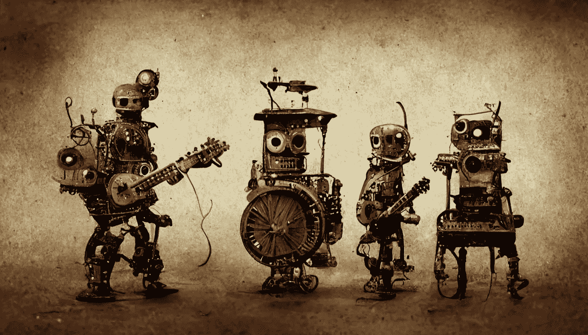

# 人工智能提示是新的搜索

> 原文：<https://medium.com/mlearning-ai/the-ai-prompt-is-the-new-search-f596aff27639?source=collection_archive---------3----------------------->

**prompt:** robot band that includes a guitar player, bass player, vibraphone player and drummer, in the style of steampunk, no background, grunge, stylistic — ar 16:9 :: made on Midjourney

从 [DALL-E 2](https://openai.com/dall-e-2/) 和 [Stable Diffusion](https://stability.ai/) 这样的 AI 生成艺术，到 [Jasper](https://www.jasper.ai/) 和 [Playground](https://beta.openai.com/playground) 这样的 GPT-3 写作工具，再到 [Jukebox](https://openai.com/blog/jukebox/) 这样的音乐生成器， ***合成引擎*** 的新时代已经到来。

这些生成器中的每一个都以自然语言提示开始，人工智能的魔力转换、解释并返回结果。