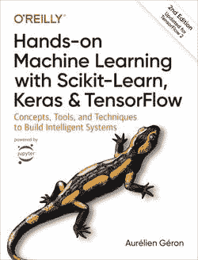
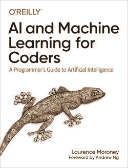
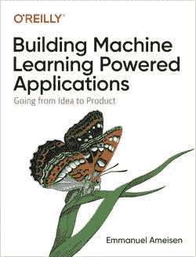
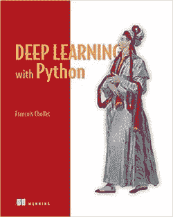
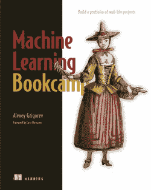
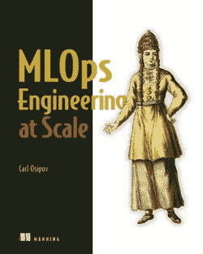
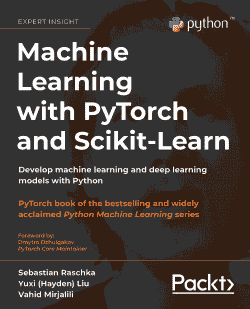
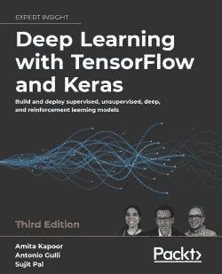
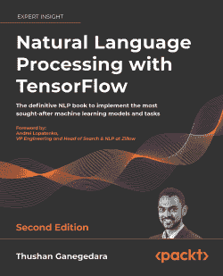

# 数据科学最佳的 3 家图书出版商—增强您的学习

> 原文：<https://medium.com/mlearning-ai/the-best-3-book-publishers-for-data-science-enhance-your-learning-cadcb4ecd3a8?source=collection_archive---------7----------------------->

本文旨在提出数据科学、机器学习、MLOps 等主题的 3 家最佳图书出版商

Photo by [Syd Wachs](https://unsplash.com/@videmusart?utm_source=medium&utm_medium=referral) on [Unsplash](https://unsplash.com?utm_source=medium&utm_medium=referral)

毫无疑问，书籍是一种宝贵的学习资源。书籍已经存在了几个世纪，这是有道理的——它们是获取知识的最佳途径。它们可以提供任何可以想象到的主题的信息，它们可以帮助我们理解复杂的概念和想法。此外，书籍可以向我们介绍新的世界和文化，它们可以帮助我们发展自己的写作和阅读技能。

> *阅读是获取知识、开阔视野的好方法，从一本好书中你可以学到无限的东西。*

书籍最大的好处之一是它们可以有多种不同的用途。例如，我们可以为了娱乐而读书，也可以为了研究而读书。我们也可以利用书籍来提高我们在某个特定领域的技能，比如数学或科学。阅读也是放松和逃离日常生活压力的好方法。

书籍是我们教育的一个重要部分，它们可以帮助我们学习新东西，探索新思想。我们应该确保利用书籍提供的资源，我们应该总是愿意学习新的东西。

## 看书学习数据科学和机器学习？

这是一个很好的问题，因为在这样的领域，学习也是关于实践，应用概念，尤其是编程。但是，阅读和学习数据科学书籍并不违背这一点，因为这是一个概念和例子的过程。通过这种方式，您理解了概念和想法，然后用书中的一些代码示例来测试它。这是一种很好的学习方式，并且已经被专注于计算机科学和技术的图书出版商大众化。

从这个意义上来说，我想强调机器学习和数据科学主题方面最知名的图书出版商。它是基于我自己的研究和我到目前为止读过或看过的书。

# 奥赖利媒体

 [## 奥莱利媒体-技术和商业培训

### 获得技术和商业知识，并通过奥莱利创建和策划的学习资源磨练您的技能…

www.oreilly.com](https://www.oreilly.com/) 

**O'Reilly Media** 是最知名的数据科学图书出版商。它是由蒂姆·奥赖利于 1978 年创造的。使他们的书容易被认出来的是封面上的动物图片。

他们出版物的主题并不局限于数据科学，而是涉及编程和一般的计算机科学。

关于 O'Reilly 的一个有趣的方面是，他们非常注重教学，并从他们所有的内容中提供知识。您可以在此找到学习部分[,其中包含在线培训/书籍/会议讲座等功能…](https://www.oreilly.com/online-learning/)

这里有一些他们的书，我可以推荐一下:

*   [用 Scikit-Learn、Keras & Tensorflow](https://www.oreilly.com/library/view/hands-on-machine-learning/9781098125967/) 实践机器学习，作者 Aurélien Géron

*   [人工智能和程序员的机器学习](https://www.oreilly.com/library/view/ai-and-machine/9781492078180/)作者劳伦斯·莫罗尼

*   Emmanuel Ameisen】构建机器学习驱动的应用

# 曼宁出版公司

 [## 曼宁出版公司

### Manning 是计算机书籍、视频和课程的独立出版商。

www.manning.com](https://www.manning.com/) 

**曼宁出版公司**是由**李·菲茨帕特里克**和**马然·贝斯**于 **1990 年**创办的出版商。像 O'Reilly 一样，它专注于计算机技术/编程，他们的书的封面都是以他们所谓的“曼宁人”的方式设计的。如果你对更多的细节感兴趣，你可以在这里查看他们的解释。

曼宁有一些不同于其他人的东西，MEAP(曼宁早期访问计划)，这是一个早期访问书籍和相关内容(视频……)。

最后，Manning 的伟大之处在于他们的[实时项目](https://liveproject.manning.com/)提供了具体的真实世界项目，例如部署机器学习模型或创建 CI/CD 管道。这些项目有书籍章节和视频支持，但其理念是成为建设者，而不仅仅是复制别人的作品。

这里有一些他们的书，我可以推荐一下:

*   [用 Python 进行深度学习](https://www.manning.com/books/deep-learning-with-python-second-edition)弗朗索瓦·乔莱

*   阿列克谢·格里戈里耶夫的机器学习图书营

*   卡尔·奥西波夫的大型多用途工程

# 包装出版

 [## Packt |面向开发人员的编程书籍、电子书和视频

### Packt 是面向专业开发人员的在线图书馆和学习平台。学习 Python，JavaScript，Angular 和…

www.packtpub.com](https://www.packtpub.com/) 

与前两者相比，Packt Publishing 是出版商游戏中的新人。它始于 2003 年**由**大卫·麦克莱恩**和**瑞秋·麦克莱恩**创办，其想法是出版一些其他人不太出版的主题书籍。**

在他们的网站上，你可以找到关于 Web 开发、编程、数据科学等领域的书籍和视频。像 O'Reilly 和 Manning 一样，Packt 希望提供学习内容，而不仅仅是可供阅读的书籍。他们的想法是专注于想学习的客户，因此该公司提供订阅，以访问所有的 Packt 图书馆(书籍和视频)。

这里有一些他们的书，我可以推荐一下:

*   [使用 PyTorch 和 Scikit 进行机器学习](https://www.packtpub.com/product/machine-learning-with-pytorch-and-scikit-learn/9781801819312)Sebastian rasch ka、Yuxi (Hayden) Liu、Vahid Mirjalili

*   [深度学习与 TensorFlow 和 Keras](https://www.packtpub.com/product/deep-learning-with-tensorflow-and-keras/9781803232911) 作者:前岛亚美·卡普尔、安东尼奥·古利、苏吉特·帕尔

*   [使用 TensorFlow 进行自然语言处理](https://www.packtpub.com/product/natural-language-processing-with-tensorflow/9781838641351)thu shan Ganegedara

# 结论

读书意味着有机会接触任何学科的大量知识。这是一个强大的方法来学习和加强你越来越想知道的东西。

关于数据科学和机器学习的书籍已经由多个出版商开发了很长时间。阅读这样的主题可能初看起来很复杂，因为实践意味着编程。然而，像 **O'Reilly、Manning Publication** 或 **Packt Publishing** 这样的出版商确实理解它，并与作者/作家一起，正确地提供关于这些领域的知识(代码块、情节……)。

无论如何，如果你想改善你的生活，开始阅读吧！书籍可以为你提供知识、娱乐和充实，每个人都有适合自己的东西。

感谢你阅读这篇文章，我希望你喜欢它，并找到了一些书籍来潜水！如果你对数据科学和机器学习感兴趣，可以在这里查看我的其他文章。

 [## Mlearning.ai 提交建议

### 如何成为 Mlearning.ai 上的作家

medium.com](/mlearning-ai/mlearning-ai-submission-suggestions-b51e2b130bfb)