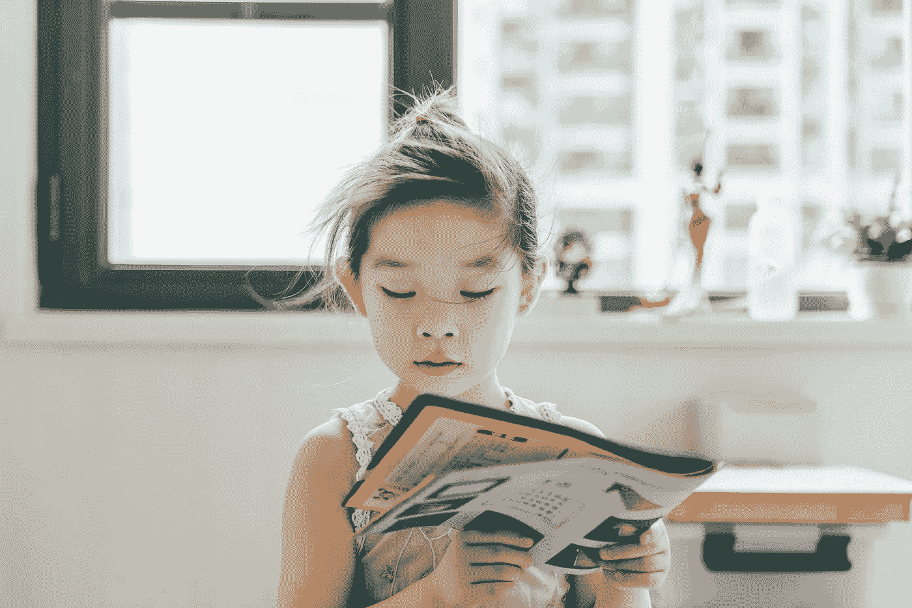

# 面向数据科学家的自我发展书籍

> 原文：<https://medium.com/mlearning-ai/the-best-books-you-can-buy-as-a-data-scientist-ac5d88444cc4?source=collection_archive---------2----------------------->

*数据科学家必备书籍的综合列表，无论他们的职业水平和抱负如何*

Photo by [Jerry Wang](https://unsplash.com/@jerry_318?utm_source=unsplash&utm_medium=referral&utm_content=creditCopyText) on [Unsplash](https://unsplash.com/s/photos/reading?utm_source=unsplash&utm_medium=referral&utm_content=creditCopyText)

我将在本文中列出的书籍改变了我作为数据科学家的职业生涯。**他们塑造了我的思维方式、工作质量和数据沟通能力**。