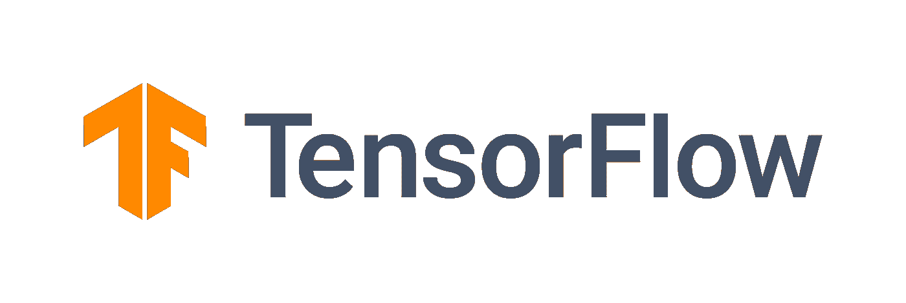
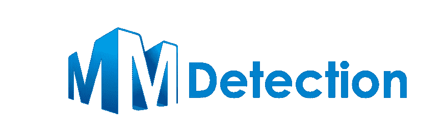
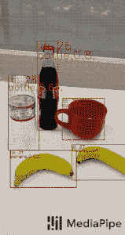

# 我用过的最好的对象检测库

> 原文：<https://medium.com/mlearning-ai/the-best-object-detection-libraries-that-i-work-with-835428a1e01e?source=collection_archive---------2----------------------->

大家好，

物体检测已经成为现代最常用的人工智能应用之一。从**建筑工程、化工机械、汽车**到**体育科技、人力资源、**等各种行业的物体检测范围很广。

对象检测是一种计算机视觉技术，用于定位图像或视频中的对象实例。对象检测算法通常利用**机器学习**或**深度学习**来产生有意义的结果。
当人类观看图像或视频时，我们可以在瞬间识别并定位感兴趣的对象。物体检测的目标是使用计算机复制这种智能。

[link to the image](https://miro.medium.com/max/739/1*IrptRDRG8IL9o-55BKjbLA.png)

有很多方法可以实现物体检测。可以使用 **java、python、JavaScript 等实现对象检测。**也可以使用 MATLAB 进行物体检测。有许多用于对象检测的库或 API。有几个开源库和专有服务可用于对象检测。这里是开源库的列表。

1.  **张量流**

Tensorflow logo

TensorFlow 是一个机器学习的端到端开源平台。它有一个全面、灵活的工具、库和社区资源生态系统，让研究人员推动 ML 的最新发展，开发人员轻松构建和部署 ML 驱动的应用程序。TensorFlow 受欢迎和人们使用它的原因。TensorFlow 由谷歌和 Brain 团队共同开发。

*   *高效 tf。数据管道*
*   *极速 GPU 非最大抑制。*
*   *全面的培训和评估渠道。*

**2。MMDetection**

MM Detection

***MMDetection*** 是基于 ***PyTorch 的 ***开源对象检测工具箱*** 。*** 它是 ***OpenMMLab 项目*** 的一部分。你也可以用它来进行*推理，测试，以及用 ***定制数据集*** 训练预定义模型*。 ***训练*** 为 ***定制数据集*** 描述如下三个步骤:

1.  ***准备定制数据集***
2.  ***准备一个配置***
3.  ***在定制数据集上训练、测试、推理模型。***

> 如果你喜欢它的内容，请点击博客。
> 
> 如果你想看更多我的博客，请关注我，因为这对我意义重大。
> 
> 如果你觉得你的朋友喜欢，请与他们分享，谢谢。

**3。媒体管道**

Mediapipe logo

MediaPipe 为直播和流媒体提供跨平台、可定制的 ML 解决方案。以下是 Mediapipe 的优点。

***端到端加速*** : *内置快速 ML 推理和处理甚至在普通硬件上加速*

***一次构建，随处部署*** : *统一解决方案适用于 Android、iOS、桌面/云、web 和物联网*

***即用型解决方案*** : *展示框架全部功能的尖端 ML 解决方案*

***免费开源*** : *框架和解决方案均在 Apache 2.0 下，完全可扩展和定制*

Object Detection Using Medipipe

以下是 Mediapipe 中的一些 ML 应用

1.  人脸检测
2.  面网格
3.  彩虹女神
4.  手
5.  姿态
6.  整体的
7.  头发分割
8.  目标检测
9.  盒子跟踪
10.  即时运动跟踪
11.  Objectron
12.  小刀

 [## Mlearning.ai 提交建议

### 如何成为 Mlearning.ai 上的作家

medium.com](/mlearning-ai/mlearning-ai-submission-suggestions-b51e2b130bfb)