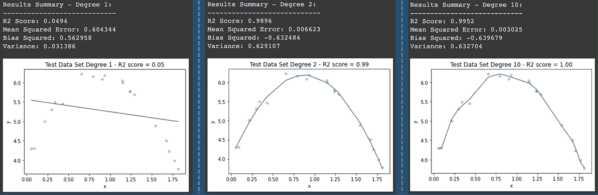
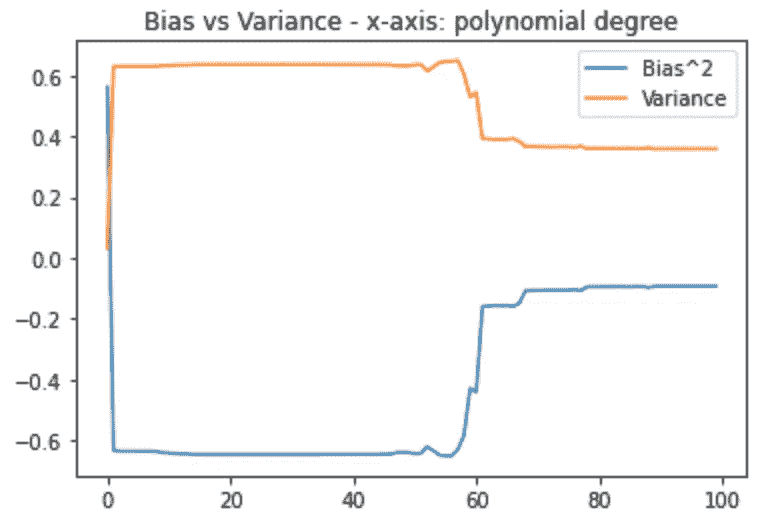

# 机器学习中的偏差/方差权衡

> 原文：<https://medium.com/mlearning-ai/the-bias-variance-trade-off-in-machine-learning-8cf225ad455e?source=collection_archive---------8----------------------->


Photo by [Fabio](https://unsplash.com/photos/oyXis2kALVg) ([unsplash.com](http://unsplash.com))

# 概观

2 个月前，我开始对数据科学感兴趣。我知道学习这个领域最复杂的算法和方法是一个非常漫长的旅程，但从某个点开始是一个好主意:)

我开始学习线性回归，这是许多领域中最常见的学习监督算法之一，今天在 Sklearn 等流行库的基础上构建它们要快得多。

然而，在评估模型的性能时，理解两个重要的概念很重要，即**偏差**和**方差**。在这篇文章中，我将解释它们。

# 什么是偏差和方差？

首先… **为什么知道这些概念如此重要？**

当我们实现一个模型时，我们处理两件事:不可约误差和可约误差。首先，它的名字定义了数据的自然可变性这一概念。可约误差是我们希望最小化的误差类型，我们由偏差和方差来支持。让我们来定义它们(用一种非常简单的方式)。

**偏差:**是指从模型获得的预测值与实际/预期值之间的差异的一种误差。

**方差:**帮助我们得到预测值的离差。换句话说，它是预测值与数据集中预测值的平均值之间的距离。

**偏差**和**方差**之和成为**均方误差**。

顺便说一下，`E[]`是平均值的意思。

为了查看基于这些值的性能，我将展示一些可能的场景:

a.**低偏差/低方差**:如果你有这个，你就成功了！尽管这并不总是可能的，但这确定了一个好的 ML 模型。

b.**高偏置/低方差**:这叫做**欠拟合**。也许你的模型给出了一致的结果，但是基于你的期望值并不准确。

c.**低偏差/高方差**:这叫做**过拟合**。这与 b 相反:你有不一致的结果，但很准确。

d.**高偏倚/高方差**:我认为这个很容易知道(结果不一致，不准确)，我很确定你不希望这样。

因此，正如您可能猜到的，**偏差和方差权衡**是我们选择一个模型的时刻，我们在这两个概念之间取得了正确的平衡，不会陷入数据欠拟合/过拟合。

让我们看一个如何使用 Numpy 和 Sklearn 的例子

# 通过 Numpy 和 Sklearn 使用 Python 解释概念

对了，你可以在我的 [GitHub](https://github.com/luismirandad27/ds-bias-variance-tradeoff-explanation) 上找到完整的代码。

1-让我们创建一个样本数据，这是一个基于您可以设置的多项式公式创建数据集的好方法。

Source: Own Elaboration (based on this [article](https://datascienceomar.wordpress.com/2016/07/03/bias-and-variance-with-scikit-learn-2/) by DataScienceOmar.com)

2-创建线性回归后，我们计算方差和偏差。

```
irreducible_error = 0.01# Mean Squared Error
mse = np.mean(( y - y_pred ) ** 2)# Sum of Squared Error
sse = np.mean((np.mean(y_pred) - y)**2 )# Variance
var = np.mean(y_pred ** 2) - np.mean(y_pred) ** 2# Bias
bias_2 = mse - var - irreducible_error
```

例如，如果我们绘制 3 个模型(1 度、2 度和 10 度),我们得到以下结果:



Source: Own elaboration

4-让我们运行 100 次，每次循环意味着一个新的多项式次数，我们捕获偏差和方差:

5-让我们画出每度的所有偏差和方差值

```
plt.plot(exps,np.array(bias_2_array),label="Bias^2")
plt.plot(exps,np.array(vars_array),label="Variance")
plt.title("Bias vs Variance - x-axis: polynomial degree")
plt.legend(loc="upper right")
plt.show()
```



Source: Own elaboration

我们在第一个模型(度数= 1)中看到，我们有高偏差和低方差(过拟合)，在第二个模型中，我们有低偏差，但方差开始增加，我们可以假设这是最佳偏差/方差平衡点。之后，方差保持在高水平，偏差保持在低水平。

**如果我们添加更多的样本(和代表性)数据，它可以帮助我们设置一个更好的偏差/方差权衡点。**

# 结论

您会看到什么是偏差和方差的权衡，这是数据科学的一个重要方面，有助于我们开发和实施高性能模型..

在过去的几个月里，我明白了知道并记住最重要的 DS 库的所有组件并不太重要。首先，我们需要内化理论:)

**快乐学习！**

关注我:[LinkedIn](https://www.linkedin.com/in/lmirandad27/)|[GitHub](https://github.com/luismirandad27)|[个人网站](https://luismiguelmiranda.com)

[](/mlearning-ai/mlearning-ai-submission-suggestions-b51e2b130bfb) [## Mlearning.ai 提交建议

### 如何成为 Mlearning.ai 上的作家

medium.com](/mlearning-ai/mlearning-ai-submission-suggestions-b51e2b130bfb)