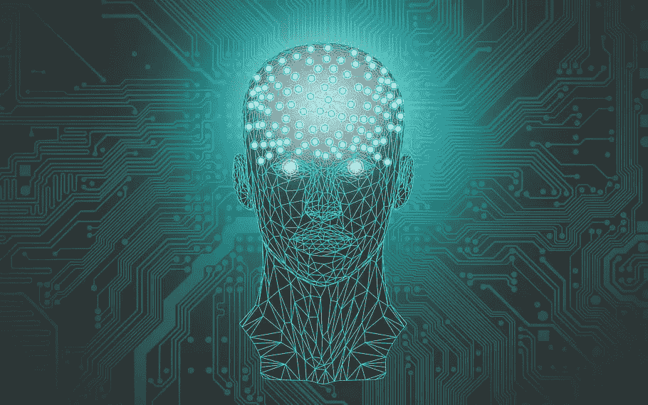
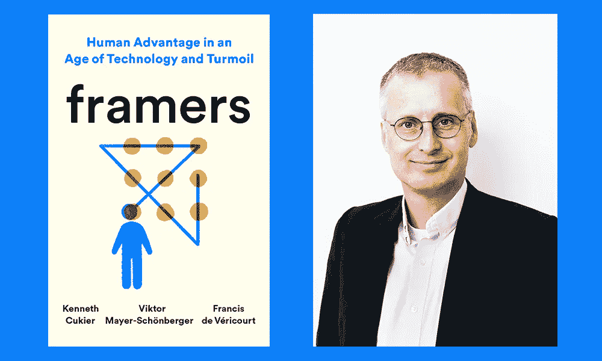

# “人工智能和机器学习”的热潮

> 原文：<https://medium.com/mlearning-ai/the-buzz-of-artificial-intelligence-and-machine-learning-94a0e290227e?source=collection_archive---------14----------------------->

picture by : [Source](https://images.app.goo.gl/8YteQMPnj5QoosNr6)

迄今为止，人工智能最大的危险是人们过早地断定他们理解它。—埃利泽·尤科夫斯基

由于 AI 和 AI 相关领域在聚光灯下，有很多人梦想进入这个领域。人工智能的深度由于许多漂亮和简单的库而降低，但同时它在技术上取得了广泛和快速的进步。在进入这个充满机会的海洋之前，你应该考虑一下他/她在这个领域的可持续性。

让我们考虑一个简单的例子。像 **sklearn、Tensorflow、Pytorch** 这样的库是如此强大，以至于你不想从头开始写任何代码。如果你想使用任何算法，那么你只需要从已经处于最佳状态的模块中导入它。如果我们从编码的角度在基础层面考虑，那么随机森林、支持向量机或任何其他 ML 算法都很难从头开始编写。许多人不会学习机器学习，如果他们想通过学习所有的统计学，线性代数，向量微积分，实分析，微积分从头开始写这些东西，但是现在我们可以使用的所有东西只有一个进口，他们中的许多人甚至懒得理解这些概念。

由于低代码/无代码时代发展非常快，如果我们考虑未来 5 年，那么这种“自动 ML”应用程序将如此强大，以至于许多刚刚转向核心 ML 建模的人将被淘汰。对于只使用内置库和理论机器学习/深度学习的人来说，这将非常困难。那么，我们如何应对这一浪潮呢？如果我们想成为优秀的数据科学家/CV 工程师，什么事情才是真正重要的？

# 建模视角:

机器比你更了解你的用例。因为它有很多你没有数据。但是当这些模型不知道如何处理这些庞大的数据时，它们就会滞后。如果我们以适当的方式设计我们的问题，我们也可以从较少的数据中推断出最好的输出。以适当的方式构建问题以及从噪声中分离出适当的数据是非常新颖的技能。当你解决不同领域的问题时，你会得到这个技能。

有一本很棒的书叫做**《框架者:技术和动荡时代的人类优势》**——作者是[肯尼斯·库基尔](https://www.goodreads.com/author/show/6761168.Kenneth_Cukier)、[维克托·迈尔·舍恩伯格](https://www.goodreads.com/author/show/5544319.Viktor_Mayer_Sch_nberger)、[弗朗西斯·德·维里库尔](https://www.goodreads.com/author/show/20592611.Francis_de_V_ricourt)关于问题框架和心智模型。

[Source](https://images.app.goo.gl/iPsedHm6QTdZaR5t5)

gograds.com 写了一个很好的框架总结，我将在下面提到，但我建议每个人都充分阅读它，以打开你不同的思维立方体。

> 框架就是建立一个心理模型，使我们能够看到模式，预测事情将如何发展，并理解新的情况。框架指导我们做出的决定和获得的结果。科学长期以来专注于记忆和推理等特征，而忽略了框架。但是随着计算机在这些认知任务中变得越来越好，框架成为了一个关键的功能——只有人类才能做到。这本书是掌握这种人类与生俱来的能力的第一本指南。

# **领域理解**:

很多时候，数据只是一大堆草，从中我们可以看出哪一根才是有助于建立模型的针。AI-ML 获取数据，但这真的有用吗？虽然任何特定的特性都会提高性能，但是真的需要吗？我们将从领域理解中学到很多关于数据的东西。这种事情将会很少见，因为可能会有许多健壮的 auto-ML 工具和模块，但机器很难理解领域并据此做出决策。

# **咨询师视角:**

咨询师的意思就是谁从两边咨询。很多时候，技术人员/开发人员很难从鸟瞰的角度理解业务问题，对于更高的权威/业务人员来说也是如此。他们没有意识到技术方面的挑战和困难。中间必须有一个人对双方都很了解。这项技能非常有趣，因为它涉及到对项目的业务视角和技术视角的理解。系统不能取代这个东西，因为这个东西是非常模糊和通用的。人工智能应用的需求和最终用户的想法在这项技能中很重要。

有很多，但我认为这三个技能在人工智能时代的 5 年里更重要。

|| **看我以前的故事** ||

[**物体检测精简版:模板匹配**](/@BH_Chinmay/object-detection-lite-template-matching-c9af77517f6c)

[**图像处理中的校准**](/@BH_Chinmay/calibration-in-image-processing-c4c164870f21)

[**边缘检测算法的种类**](/@BH_Chinmay/types-of-edge-detection-algorithms-365122d799bf)

更多此类内容请关注我[**LinkedIn**](https://www.linkedin.com/in/chinmay-bhalerao-6b5284137/)&[**Medium**](/@BH_Chinmay)。

— — — — — — — — — — — — — — — — — — — — — — — — — — — — — — — -

谢谢你！！

 [## Mlearning.ai 提交建议

### 如何成为 Mlearning.ai 上的作家

medium.com](/mlearning-ai/mlearning-ai-submission-suggestions-b51e2b130bfb)