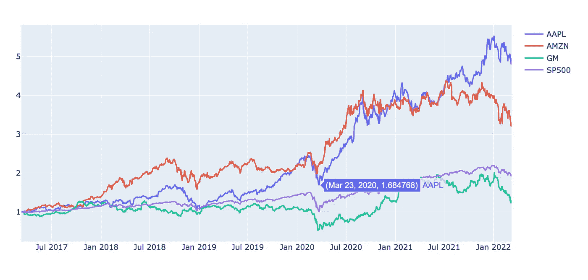

# 资本资产定价模型(CAPM):Python 中的金融分析

> 原文：<https://medium.com/mlearning-ai/the-capital-asset-pricing-model-capm-financial-analysis-in-python-1a7a4f2c7650?source=collection_archive---------0----------------------->

## 在这篇文章中，我解释了如何对股票时间序列进行基本的金融分析。资本资产定价模型也被解释和用来估计资产的预期回报的基础上的历史数据。

Figure produced by the author in Python.

# 1.介绍